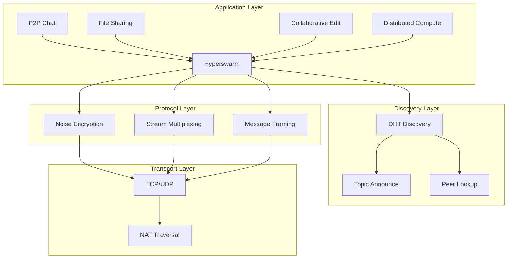

# Deep Dive: P2P Application Patterns with Hyperswarm

## Overview

This deep dive explores practical P2P application patterns built on Hyperswarm including chat systems, file sharing, collaborative editing with CRDTs, and distributed compute frameworks.

## Architecture Patterns



## Pattern 1: P2P Chat System

### Server-Client Architecture

```javascript
const Hyperswarm = require('hyperswarm')
const crypto = require('crypto')

class P2PChatServer {
  constructor(roomName, opts = {}) {
    this.roomName = roomName
    this.topic = this.createTopic(roomName)
    this.swarm = new Hyperswarm({
      keyPair: opts.keyPair || null,
      maxPeers: opts.maxPeers || 100
    })
    this.clients = new Map()
    this.messages = []
    this.maxHistory = opts.maxHistory || 100
    
    this.setupHandlers()
  }
  
  createTopic(roomName) {
    // Deterministic topic from room name
    return crypto.createHash('sha256')
      .update(`chat-room:${roomName}`)
      .digest()
  }
  
  setupHandlers() {
    this.swarm.on('connection', (conn, peerInfo) => {
      const clientId = peerInfo.publicKey.toString('hex')
      console.log(`Client connected: ${clientId.slice(0, 8)}`)
      
      // Store client connection
      this.clients.set(clientId, {
        conn,
        peerInfo,
        joinedAt: Date.now()
      })
      
      // Send chat history
      this.sendHistory(conn)
      
      // Broadcast join message
      this.broadcast({
        type: 'join',
        clientId,
        timestamp: Date.now(),
        message: `${clientId.slice(0, 8)} joined`
      }, clientId) // Exclude sender
      
      // Setup message handler
      conn.on('data', (data) => {
        this.handleMessage(clientId, data)
      })
      
      // Handle disconnect
      conn.on('close', () => {
        this.handleDisconnect(clientId)
      })
    })
  }
  
  handleMessage(clientId, data) {
    try {
      const message = JSON.parse(data.toString())
      
      // Store in history
      this.messages.push({
        ...message,
        clientId,
        timestamp: Date.now()
      })
      
      // Trim history
      if (this.messages.length > this.maxHistory) {
        this.messages.shift()
      }
      
      // Broadcast to all clients
      this.broadcast({
        type: 'message',
        clientId,
        timestamp: Date.now(),
        content: message.content
      })
    } catch (err) {
      console.error('Invalid message:', err)
    }
  }
  
  sendHistory(conn) {
    for (const msg of this.messages) {
      conn.write(JSON.stringify(msg))
    }
  }
  
  broadcast(message, excludeId = null) {
    const data = Buffer.from(JSON.stringify(message))
    
    for (const [clientId, client] of this.clients) {
      if (clientId !== excludeId) {
        client.conn.write(data)
      }
    }
  }
  
  handleDisconnect(clientId) {
    this.clients.delete(clientId)
    
    this.broadcast({
      type: 'leave',
      clientId,
      timestamp: Date.now(),
      message: `${clientId.slice(0, 8)} left`
    })
  }
  
  async start() {
    this.swarm.join(this.topic, { server: true, client: false })
    await this.swarm.flush()
    console.log(`Chat server started for room: ${this.roomName}`)
  }
  
  async stop() {
    await this.swarm.destroy()
  }
}
```

### Chat Client

```javascript
class P2PChatClient {
  constructor(roomName, username) {
    this.roomName = roomName
    this.username = username
    this.topic = crypto.createHash('sha256')
      .update(`chat-room:${roomName}`)
      .digest()
    
    this.swarm = new Hyperswarm()
    this.serverConn = null
    this.peers = new Map()
    
    this.setupHandlers()
  }
  
  setupHandlers() {
    this.swarm.on('connection', (conn, peerInfo) => {
      // First connection is typically the server
      if (!this.serverConn) {
        this.serverConn = conn
        this.setupServerConnection()
      } else {
        // Additional connections are peers
        const peerId = peerInfo.publicKey.toString('hex')
        this.peers.set(peerId, conn)
        this.setupPeerConnection(conn, peerId)
      }
    })
  }
  
  setupServerConnection() {
    this.serverConn.on('data', (data) => {
      try {
        const message = JSON.parse(data.toString())
        this.renderMessage(message)
      } catch (err) {
        console.error('Invalid message from server:', err)
      }
    })
    
    this.serverConn.on('close', () => {
      console.log('Disconnected from server')
      this.serverConn = null
      // Attempt reconnection
      this.reconnect()
    })
    
    // Send join message
    this.send({
      type: 'join',
      username: this.username
    })
  }
  
  setupPeerConnection(conn, peerId) {
    conn.on('data', (data) => {
      // Handle direct peer messages
      const message = JSON.parse(data.toString())
      if (message.type === 'direct') {
        this.renderDirectMessage(peerId, message)
      }
    })
  }
  
  send(message) {
    if (this.serverConn) {
      this.serverConn.write(JSON.stringify(message))
    }
  }
  
  sendMessage(content) {
    this.send({
      type: 'message',
      content,
      username: this.username
    })
  }
  
  renderMessage(message) {
    switch (message.type) {
      case 'message':
        console.log(`[${message.username || message.clientId.slice(0, 8)}]: ${message.content}`)
        break
      case 'join':
        console.log(`*** ${message.message}`)
        break
      case 'leave':
        console.log(`*** ${message.message}`)
        break
    }
  }
  
  async start() {
    this.swarm.join(this.topic, { server: false, client: true })
    await this.swarm.flush()
    console.log(`Connected to chat room: ${this.roomName}`)
  }
  
  async reconnect() {
    console.log('Reconnecting...')
    await new Promise(resolve => setTimeout(resolve, 5000))
    this.swarm.join(this.topic, { server: false, client: true })
  }
}

// Usage
async function main() {
  const chat = new P2PChatClient('general', 'Alice')
  await chat.start()
  
  // Send messages
  chat.sendMessage('Hello, world!')
  
  // Keep process alive
  process.stdin.on('data', (data) => {
    chat.sendMessage(data.toString().trim())
  })
}

main()
```

## Pattern 2: P2P File Sharing

### File Transfer Protocol

```javascript
const Hyperswarm = require('hyperswarm')
const fs = require('fs')
const crypto = require('crypto')
const { pipeline } = require('stream/promises')

class P2PFileShare {
  constructor(opts = {}) {
    this.swarm = new Hyperswarm({
      keyPair: opts.keyPair || null
    })
    this.topic = crypto.createHash('sha256')
      .update('file-share-v1')
      .digest()
    
    this.sharedFiles = new Map()
    this.pendingDownloads = new Map()
    this.maxConnections = opts.maxConnections || 20
    
    this.setupHandlers()
  }
  
  setupHandlers() {
    this.swarm.on('connection', (conn, peerInfo) => {
      const peerId = peerInfo.publicKey.toString('hex')
      console.log(`Connected to peer: ${peerId.slice(0, 8)}`)
      
      // Setup protocol handler
      this.setupProtocol(conn, peerInfo)
    })
  }
  
  setupProtocol(conn, peerInfo) {
    let state = 'waiting'
    let currentFile = null
    let receivedBytes = 0
    let expectedBytes = 0
    let chunks = []
    
    conn.on('data', async (data) => {
      try {
        const header = data.slice(0, 4).toString()
        
        if (state === 'waiting') {
          // Parse message header
          const message = JSON.parse(data.slice(4).toString())
          
          switch (message.type) {
            case 'LIST':
              // Send file list
              const fileList = Array.from(this.sharedFiles.entries())
                .map(([hash, file]) => ({
                  hash,
                  name: file.name,
                  size: file.size
                }))
              this.sendMessage(conn, {
                type: 'FILE_LIST',
                files: fileList
              })
              break
              
            case 'REQUEST':
              // Handle file request
              await this.handleFileRequest(conn, message.hash)
              break
              
            case 'FILE_START':
              // Receiving file
              state = 'receiving'
              currentFile = message
              receivedBytes = 0
              expectedBytes = message.size
              chunks = []
              console.log(`Receiving file: ${message.name} (${message.size} bytes)`)
              break
              
            case 'FILE_DATA':
              // Receiving file chunk
              if (state === 'receiving') {
                chunks.push(data.slice(4))
                receivedBytes += data.length - 4
                
                // Progress update
                const progress = (receivedBytes / expectedBytes * 100).toFixed(2)
                console.log(`Download progress: ${progress}%`)
                
                if (receivedBytes >= expectedBytes) {
                  // File complete
                  await this.saveFile(currentFile.name, Buffer.concat(chunks))
                  state = 'waiting'
                  console.log(`File saved: ${currentFile.name}`)
                }
              }
              break
          }
        }
      } catch (err) {
        console.error('Protocol error:', err)
        state = 'waiting'
      }
    })
    
    conn.on('close', () => {
      console.log(`Disconnected from peer: ${peerInfo.publicKey.toString('hex').slice(0, 8)}`)
    })
  }
  
  sendMessage(conn, message) {
    const data = Buffer.concat([
      Buffer.from('MSG ').padEnd(4),
      Buffer.from(JSON.stringify(message))
    ])
    conn.write(data)
  }
  
  async handleFileRequest(conn, fileHash) {
    const file = this.sharedFiles.get(fileHash)
    if (!file) {
      this.sendMessage(conn, {
        type: 'ERROR',
        message: 'File not found'
      })
      return
    }
    
    // Send file header
    this.sendMessage(conn, {
      type: 'FILE_START',
      hash: fileHash,
      name: file.name,
      size: file.size
    })
    
    // Stream file content
    const stream = fs.createReadStream(file.path)
    
    for await (const chunk of stream) {
      const data = Buffer.concat([
        Buffer.from('DATA'),
        chunk
      ])
      conn.write(data)
    }
    
    console.log(`Sent file: ${file.name}`)
  }
  
  async saveFile(name, content) {
    const downloadDir = './downloads'
    if (!fs.existsSync(downloadDir)) {
      fs.mkdirSync(downloadDir, { recursive: true })
    }
    
    const filePath = `${downloadDir}/${name}`
    await fs.promises.writeFile(filePath, content)
  }
  
  // Share a file
  shareFile(filePath) {
    const stat = fs.statSync(filePath)
    const content = fs.readFileSync(filePath)
    const hash = crypto.createHash('sha256').update(content).digest('hex')
    
    this.sharedFiles.set(hash, {
      path: filePath,
      name: filePath.split('/').pop(),
      size: stat.size,
      hash
    })
    
    console.log(`Shared file: ${filePath} (hash: ${hash.slice(0, 8)})`)
  }
  
  // Request file list from network
  async discoverFiles() {
    return new Promise((resolve) => {
      const allFiles = []
      let connections = 0
      
      this.swarm.on('connection', (conn) => {
        connections++
        
        // Request file list
        this.sendMessage(conn, { type: 'LIST' })
        
        // Handle response
        conn.once('data', (data) => {
          const message = JSON.parse(data.slice(4).toString())
          if (message.type === 'FILE_LIST') {
            allFiles.push(...message.files)
          }
          
          connections--
          if (connections === 0) {
            resolve(allFiles)
          }
        })
      })
      
      // Timeout after 5 seconds
      setTimeout(() => resolve(allFiles), 5000)
    })
  }
  
  async start() {
    this.swarm.join(this.topic, { server: true, client: true })
    await this.swarm.flush()
    console.log('File sharing node started')
  }
}

// Usage
async function main() {
  const sharer = new P2PFileShare()
  
  // Share files
  sharer.shareFile('./documents/readme.pdf')
  sharer.shareFile('./documents/spec.doc')
  
  await sharer.start()
  
  // Discover files on network
  const files = await sharer.discoverFiles()
  console.log('Available files:', files)
}

main()
```

## Pattern 3: Collaborative Editing with CRDTs

```javascript
const Hyperswarm = require('hyperswarm')
const crypto = require('crypto')
const Y = require('yjs') // CRDT library

class CollaborativeEditor {
  constructor(docId, userId) {
    this.docId = docId
    this.userId = userId
    this.topic = crypto.createHash('sha256')
      .update(`collab-doc:${docId}`)
      .digest()
    
    this.swarm = new Hyperswarm()
    this.doc = new Y.Doc()
    this.ytext = this.doc.getText('content')
    this.peers = new Map()
    
    this.setupCRDT()
    this.setupNetworking()
  }
  
  setupCRDT() {
    // Track local changes
    this.ytext.observe((event, transaction) => {
      if (transaction.local) {
        // Local change - broadcast to peers
        const update = Y.encodeStateAsUpdate(this.doc)
        this.broadcastUpdate(update)
      }
    })
    
    // Handle remote updates
    this.doc.on('update', (update, origin) => {
      if (origin !== 'network') {
        // Update from network, no need to rebroadcast
        return
      }
      this.broadcastUpdate(update)
    })
  }
  
  setupNetworking() {
    this.swarm.on('connection', (conn, peerInfo) => {
      const peerId = peerInfo.publicKey.toString('hex')
      console.log(`Peer connected: ${peerId.slice(0, 8)}`)
      
      this.peers.set(peerId, conn)
      
      // Send current document state
      const state = Y.encodeStateAsUpdate(this.doc)
      this.sendMessage(conn, { type: 'SYNC', update: state })
      
      // Handle incoming messages
      conn.on('data', (data) => {
        this.handleMessage(peerId, data)
      })
      
      // Handle disconnect
      conn.on('close', () => {
        this.peers.delete(peerId)
        console.log(`Peer disconnected: ${peerId.slice(0, 8)}`)
      })
    })
  }
  
  handleMessage(peerId, data) {
    try {
      const message = JSON.parse(data.toString())
      
      switch (message.type) {
        case 'SYNC':
          // Apply document update
          const update = Buffer.from(message.update.data)
          Y.applyUpdate(this.doc, update, 'network')
          break
          
        case 'UPDATE':
          // Apply incremental update
          const incUpdate = Buffer.from(message.update.data)
          Y.applyUpdate(this.doc, incUpdate, 'network')
          break
      }
    } catch (err) {
      console.error('Message error:', err)
    }
  }
  
  sendMessage(conn, message) {
    // Encode update for transmission
    if (message.update instanceof Uint8Array) {
      message.update = {
        type: 'Uint8Array',
        data: Buffer.from(message.update).toString('base64')
      }
    }
    conn.write(Buffer.from(JSON.stringify(message)))
  }
  
  broadcastUpdate(update) {
    const message = {
      type: 'UPDATE',
      update: {
        type: 'Uint8Array',
        data: Buffer.from(update).toString('base64')
      }
    }
    
    for (const conn of this.peers.values()) {
      conn.write(Buffer.from(JSON.stringify(message)))
    }
  }
  
  // Document operations
  insert(index, text) {
    this.ytext.insert(index, text)
  }
  
  delete(index, length) {
    this.ytext.delete(index, length)
  }
  
  getContent() {
    return this.ytext.toString()
  }
  
  async start() {
    this.swarm.join(this.topic, { server: true, client: true })
    await this.swarm.flush()
    console.log(`Joined collaborative document: ${this.docId}`)
  }
}

// Usage
async function main() {
  const editor = new CollaborativeEditor('doc-123', 'user-alice')
  await editor.start()
  
  // Insert text
  editor.insert(0, 'Hello, collaborative world!')
  
  console.log('Document content:', editor.getContent())
}

main()
```

## Pattern 4: Distributed Compute

```javascript
const Hyperswarm = require('hyperswarm')
const crypto = require('crypto')
const { EventEmitter } = require('events')

class DistributedCompute extends EventEmitter {
  constructor(nodeId, opts = {}) {
    super()
    this.nodeId = nodeId
    this.topic = crypto.createHash('sha256')
      .update('distributed-compute-v1')
      .digest()
    
    this.swarm = new Hyperswarm({
      keyPair: opts.keyPair || null
    })
    
    this.workers = new Map()
    this.pendingTasks = new Map()
    this.taskId = 0
    this.isCoordinator = opts.isCoordinator || false
    
    this.setupHandlers()
  }
  
  setupHandlers() {
    this.swarm.on('connection', (conn, peerInfo) => {
      const workerId = peerInfo.publicKey.toString('hex')
      
      if (this.isCoordinator) {
        this.workers.set(workerId, {
          conn,
          status: 'idle',
          currentTask: null
        })
        this.setupCoordinatorHandler(conn, workerId)
      } else {
        this.setupWorkerHandler(conn)
      }
    })
  }
  
  setupCoordinatorHandler(conn, workerId) {
    conn.on('data', (data) => {
      const message = JSON.parse(data.toString())
      
      switch (message.type) {
        case 'TASK_COMPLETE':
          this.handleTaskComplete(workerId, message)
          break
          
        case 'TASK_FAILED':
          this.handleTaskFailed(workerId, message)
          break
          
        case 'HEARTBEAT':
          this.workers.get(workerId).lastSeen = Date.now()
          break
      }
    })
    
    conn.on('close', () => {
      this.workers.delete(workerId)
      this.emit('worker-left', workerId)
    })
  }
  
  setupWorkerHandler(conn) {
    // Worker ready
    conn.write(JSON.stringify({ type: 'READY' }))
    
    conn.on('data', async (data) => {
      const message = JSON.parse(data.toString())
      
      if (message.type === 'TASK') {
        // Execute task
        try {
          const result = await this.executeTask(message.task)
          conn.write(JSON.stringify({
            type: 'TASK_COMPLETE',
            taskId: message.taskId,
            result
          }))
        } catch (err) {
          conn.write(JSON.stringify({
            type: 'TASK_FAILED',
            taskId: message.taskId,
            error: err.message
          }))
        }
      }
    })
  }
  
  async executeTask(task) {
    // Execute computation
    switch (task.type) {
      case 'MAP':
        return task.data.map(item => task.fn(item))
      case 'REDUCE':
        return task.data.reduce((acc, item) => task.fn(acc, item), task.initial)
      case 'FILTER':
        return task.data.filter(item => task.fn(item))
      case 'CUSTOM':
        return eval(`(${task.fn})`)(task.data)
      default:
        throw new Error(`Unknown task type: ${task.type}`)
    }
  }
  
  handleTaskComplete(workerId, message) {
    const task = this.pendingTasks.get(message.taskId)
    if (task) {
      task.results.push(message.result)
      task.completed++
      
      // Update worker status
      const worker = this.workers.get(workerId)
      worker.status = 'idle'
      worker.currentTask = null
      
      // Check if all results received
      if (task.completed >= task.expected) {
        this.emit('task-done', message.taskId, task.results)
        this.pendingTasks.delete(message.taskId)
      }
    }
  }
  
  handleTaskFailed(workerId, message) {
    const task = this.pendingTasks.get(message.taskId)
    if (task) {
      task.failures++
      
      // Update worker status
      const worker = this.workers.get(workerId)
      worker.status = 'idle'
      worker.currentTask = null
      
      // Retry task on different worker
      if (task.failures < task.maxRetries) {
        this.retryTask(message.taskId)
      }
    }
  }
  
  // Submit task to worker pool
  submitTask(taskFn, data, options = {}) {
    const taskId = ++this.taskId
    
    const task = {
      taskId,
      type: options.type || 'CUSTOM',
      fn: taskFn.toString(),
      data,
      results: [],
      completed: 0,
      failures: 0,
      expected: Math.min(data.length, this.workers.size),
      maxRetries: options.maxRetries || 3
    }
    
    this.pendingTasks.set(taskId, task)
    
    // Distribute to workers
    this.distributeTask(task)
    
    return new Promise((resolve) => {
      this.once('task-done', (id, results) => {
        if (id === taskId) {
          resolve(results)
        }
      })
    })
  }
  
  distributeTask(task) {
    const chunks = this.chunkArray(task.data, this.workers.size)
    
    for (const [workerId, chunk] of chunks.entries()) {
      const worker = Array.from(this.workers.values())[workerId]
      if (worker && worker.status === 'idle') {
        worker.status = 'busy'
        worker.currentTask = task.taskId
        
        worker.conn.write(JSON.stringify({
          type: 'TASK',
          taskId: task.taskId,
          task: {
            type: task.type,
            fn: task.fn,
            data: chunk
          }
        }))
      }
    }
  }
  
  retryTask(taskId) {
    const task = this.pendingTasks.get(taskId)
    if (task) {
      this.distributeTask(task)
    }
  }
  
  chunkArray(arr, numChunks) {
    const chunkSize = Math.ceil(arr.length / numChunks)
    const chunks = []
    
    for (let i = 0; i < arr.length; i += chunkSize) {
      chunks.push(arr.slice(i, i + chunkSize))
    }
    
    return chunks
  }
  
  async start() {
    this.swarm.join(this.topic, {
      server: this.isCoordinator,
      client: true
    })
    await this.swarm.flush()
    console.log(`${this.isCoordinator ? 'Coordinator' : 'Worker'} node started`)
  }
}

// Usage - MapReduce Example
async function main() {
  // Coordinator
  const coordinator = new DistributedCompute('coordinator', {
    isCoordinator: true
  })
  await coordinator.start()
  
  // Wait for workers to connect
  await new Promise(resolve => setTimeout(resolve, 5000))
  
  // Submit MapReduce job
  const numbers = [1, 2, 3, 4, 5, 6, 7, 8, 9, 10]
  
  // Map: square each number
  const results = await coordinator.submitTask(
    (item) => item * item,
    numbers,
    { type: 'MAP' }
  )
  
  console.log('Map results:', results)
  
  // Reduce: sum all
  const sum = await coordinator.submitTask(
    (acc, item) => acc + item,
    results,
    { type: 'REDUCE', initial: 0 }
  )
  
  console.log('Sum:', sum) // Should be 385
}

main()
```

## Conclusion

P2P patterns with Hyperswarm enable:

1. **Chat Systems**: Serverless group communication
2. **File Sharing**: Direct P2P transfers
3. **Collaborative Editing**: CRDT-based sync
4. **Distributed Compute**: MapReduce over P2P
