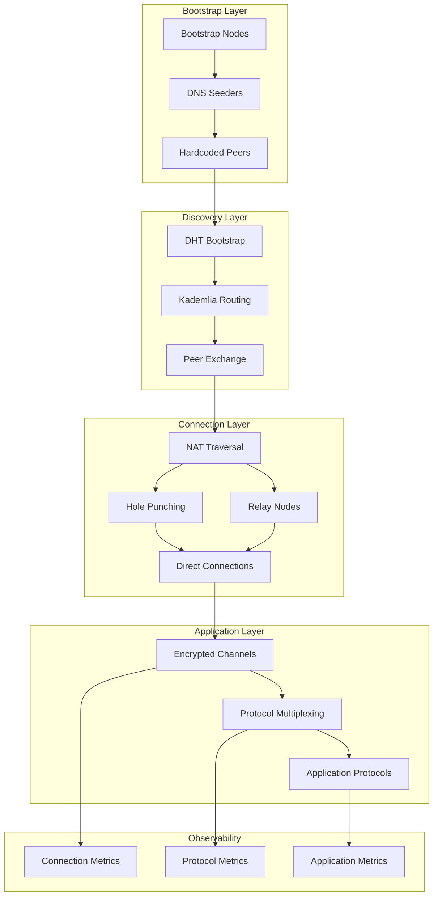

# Production-Grade P2P Applications

## Overview

This guide covers production deployment patterns for P2P applications including security hardening, NAT traversal strategies, bootstrap infrastructure, monitoring, and operational considerations.

## Architecture Overview



## Security Considerations

### 1. Peer Identity & Authentication

```rust
// Production peer identity management
use libp2p::identity::{Keypair, ed25519, PeerId};
use std::path::Path;

/// Persistent peer identity
pub struct PeerIdentity {
    keypair: Keypair,
    peer_id: PeerId,
}

impl PeerIdentity {
    /// Generate new identity
    pub fn generate() -> Self {
        let keypair = Keypair::generate_ed25519();
        let peer_id = PeerId::from(keypair.public());
        Self { keypair, peer_id }
    }
    
    /// Load from file (production)
    pub fn load_or_create(path: &Path) -> Result<Self, anyhow::Error> {
        if path.exists() {
            // Load existing keypair
            let key_bytes = std::fs::read(path)?;
            let secret = ed25519::SecretKey::try_from_bytes(&key_bytes)?;
            let keypair = Keypair::Ed25519(secret.into());
            let peer_id = PeerId::from(keypair.public());
            Ok(Self { keypair, peer_id })
        } else {
            // Generate and save new identity
            let identity = Self::generate();
            if let Keypair::Ed25519(ref pair) = identity.keypair {
                std::fs::write(path, pair.secret().as_bytes())?;
            }
            Ok(identity)
        }
    }
    
    /// Verify peer identity (prevent impersonation)
    pub fn verify_peer(expected_peer_id: PeerId, public_key: &[u8]) -> bool {
        let actual_peer_id = PeerId::from_public_key(&public_key.into());
        expected_peer_id == actual_peer_id
    }
}

/// Peer allowlist/blacklist
pub struct PeerFilter {
    allowlist: HashSet<PeerId>,
    blocklist: HashSet<PeerId>,
    use_allowlist: bool,
}

impl PeerFilter {
    pub fn should_accept(&self, peer_id: &PeerId) -> bool {
        // Check blocklist first
        if self.blocklist.contains(peer_id) {
            return false;
        }
        
        // Check allowlist if enabled
        if self.use_allowlist {
            return self.allowlist.contains(peer_id);
        }
        
        true
    }
    
    pub fn block(&mut self, peer_id: PeerId, reason: &str) {
        self.blocklist.insert(peer_id);
        tracing::warn!("Blocked peer: {} - {}", peer_id, reason);
    }
}
```

### 2. Connection Rate Limiting

```rust
// Connection rate limiting
use std::collections::HashMap;
use std::time::{Duration, Instant};
use tokio::sync::RwLock;

pub struct ConnectionLimiter {
    max_connections_per_peer: usize,
    max_connections_total: usize,
    connection_history: RwLock<HashMap<PeerId, Vec<Instant>>>,
    window: Duration,
}

impl ConnectionLimiter {
    pub fn new(max_per_peer: usize, max_total: usize) -> Self {
        Self {
            max_connections_per_peer: max_per_peer,
            max_connections_total: max_total,
            connection_history: RwLock::new(HashMap::new()),
            window: Duration::from_secs(60),
        }
    }
    
    pub async fn allow_connection(&self, peer_id: &PeerId) -> bool {
        let mut history = self.connection_history.write().await;
        let now = Instant::now();
        
        // Clean old entries
        let window_start = now - self.window;
        if let Some(entries) = history.get_mut(peer_id) {
            entries.retain(|&t| t > window_start);
        }
        
        // Check per-peer limit
        let peer_connections = history.get(peer_id).map(|v| v.len()).unwrap_or(0);
        if peer_connections >= self.max_connections_per_peer {
            tracing::warn!("Rate limit exceeded for peer: {}", peer_id);
            return false;
        }
        
        // Check total limit
        let total: usize = history.values().map(|v| v.len()).sum();
        if total >= self.max_connections_total {
            tracing::warn!("Total connection limit reached");
            return false;
        }
        
        // Record connection
        history.entry(*peer_id).or_insert_with(Vec::new).push(now);
        
        true
    }
}
```

### 3. Message Validation

```rust
// Message validation and sanitization
use serde::{Deserialize, Serialize};

const MAX_MESSAGE_SIZE: usize = 1024 * 1024; // 1MB
const MAX_FIELD_LENGTH: usize = 10000;

#[derive(Debug, thiserror::Error)]
pub enum ValidationError {
    #[error("Message too large: {size} bytes")]
    MessageTooLarge { size: usize },
    #[error("Field too long: {field}")]
    FieldTooLong { field: String },
    #[error("Invalid characters in field: {field}")]
    InvalidCharacters { field: String },
    #[error("Missing required field: {field}")]
    MissingField { field: String },
    #[error("Invalid timestamp")]
    InvalidTimestamp,
}

pub trait Validatable {
    fn validate(&self) -> Result<(), ValidationError>;
}

#[derive(Debug, Serialize, Deserialize)]
pub struct ChatMessage {
    pub username: String,
    pub content: String,
    pub timestamp: u64,
}

impl Validatable for ChatMessage {
    fn validate(&self) -> Result<(), ValidationError> {
        // Check required fields
        if self.username.is_empty() {
            return Err(ValidationError::MissingField {
                field: "username".to_string(),
            });
        }
        
        if self.content.is_empty() {
            return Err(ValidationError::MissingField {
                field: "content".to_string(),
            });
        }
        
        // Check field lengths
        if self.username.len() > MAX_FIELD_LENGTH {
            return Err(ValidationError::FieldTooLong {
                field: "username".to_string(),
            });
        }
        
        if self.content.len() > MAX_FIELD_LENGTH {
            return Err(ValidationError::FieldTooLong {
                field: "content".to_string(),
            });
        }
        
        // Validate characters (prevent injection)
        if !self.username.chars().all(|c| c.is_alphanumeric() || c == '_') {
            return Err(ValidationError::InvalidCharacters {
                field: "username".to_string(),
            });
        }
        
        // Validate timestamp (not too old, not in future)
        let now = std::time::SystemTime::now()
            .duration_since(std::time::UNIX_EPOCH)
            .unwrap()
            .as_secs();
        
        if self.timestamp > now + 60 || self.timestamp < now - 86400 {
            return Err(ValidationError::InvalidTimestamp);
        }
        
        Ok(())
    }
}

/// Validate and deserialize message
pub fn validate_message<T: Validatable + serde::de::DeserializeOwned>(
    data: &[u8],
) -> Result<T, anyhow::Error> {
    // Check size before deserialization
    if data.len() > MAX_MESSAGE_SIZE {
        return Err(ValidationError::MessageTooLarge {
            size: data.len(),
        }.into());
    }
    
    // Deserialize
    let message: T = serde_json::from_slice(data)?;
    
    // Validate content
    message.validate()?;
    
    Ok(message)
}
```

## NAT Traversal Strategies

### Hole Punching Configuration

```rust
// NAT traversal configuration
use libp2p::{
    dns,
    yamux,
    noise,
    quic,
};

pub struct NATConfig {
    pub enable_hole_punching: bool,
    pub enable_relay: bool,
    pub relay_nodes: Vec<Multiaddr>,
    pub port_mapping: bool,
}

impl Default for NATConfig {
    fn default() -> Self {
        Self {
            enable_hole_punching: true,
            enable_relay: true,
            relay_nodes: Vec::new(),
            port_mapping: true, // UPnP/NAT-PMP
        }
    }
}

/// Setup transport with NAT traversal
pub fn build_nat_traversal_transport(
    keypair: Keypair,
    nat_config: &NATConfig,
) -> Result<Boxed<(PeerId, StreamMuxerBox)>, anyhow::Error> {
    let noise_config = noise::Config::new(&keypair)?;
    let yamux_config = yamux::Config::default();
    
    // TCP with port mapping
    let tcp_transport = tcp::tokio::Transport::new(
        tcp::Config::default().port_reuse(true)
    );
    
    // Try UPnP/NAT-PMP port mapping
    if nat_config.port_mapping {
        // Use igd or similar crate for port mapping
        // Map external port to local port
    }
    
    let tcp_transport = tcp_transport
        .upgrade(libp2p::core::upgrade::Version::V1)
        .authenticate(noise_config.clone())
        .multiplex(yamux_config.clone())
        .boxed();
    
    // QUIC for better NAT traversal
    let quic_config = quic::Config::new(&keypair);
    let quic_transport = quic::tokio::Transport::new(quic_config).boxed();
    
    // Combine transports
    let transport = tcp_transport.or_transport(quic_transport);
    
    Ok(transport.boxed())
}
```

### Relay Configuration

```rust
// Relay node configuration
use libp2p::relay;

pub fn setup_relay_client(
    swarm: &mut Swarm<NetworkBehaviour>,
    relay_addr: Multiaddr,
) -> Result<(), anyhow::Error> {
    // Reserve relay circuit
    swarm.behaviour_mut().relay_client.reserve(
        relay_addr,
        vec![], // Additional relay options
    )?;
    
    Ok(())
}

pub fn setup_relay_server(
    swarm: &mut Swarm<NetworkBehaviour>,
    max_reservations: usize,
) -> Result<(), anyhow::Error> {
    // Configure as relay server
    swarm.behaviour_mut().relay_server.config = relay::Config {
        max_reservations,
        max_reservations_per_peer: 10,
        reservation_rate_limiters: default_rate_limits(),
        ..Default::default()
    };
    
    Ok(())
}
```

## Bootstrap Infrastructure

### Bootstrap Node Setup

```rust
// Production bootstrap nodes
pub const PRODUCTION_BOOTSTRAP_NODES: &[&str] = &[
    "/dns/bootstrap1.p2p-network.io/tcp/443/wss/p2p/QmBootstrap1",
    "/dns/bootstrap2.p2p-network.io/tcp/443/wss/p2p/QmBootstrap2",
    "/dns/bootstrap3.p2p-network.io/tcp/443/wss/p2p/QmBootstrap3",
];

/// DNS seeder for bootstrap
pub async fn query_dns_seeders() -> Result<Vec<Multiaddr>, anyhow::Error> {
    let seeders = vec![
        "bootstrap.p2p-network.io",
        "bootstrap-backup.p2p-network.io",
    ];
    
    let mut addresses = Vec::new();
    
    for seeder in seeders {
        // Query DNS for TXT records with peer addresses
        let resolver = tokio::net::lookup_host((seeder, 443)).await?;
        for addr in resolver {
            addresses.push(addr.to_multiaddr()?);
        }
    }
    
    Ok(addresses)
}

/// Bootstrap manager
pub struct BootstrapManager {
    bootstrap_nodes: Vec<Multiaddr>,
    retry_count: HashMap<Multiaddr, usize>,
    max_retries: usize,
}

impl BootstrapManager {
    pub fn new(bootstrap_nodes: Vec<Multiaddr>) -> Self {
        Self {
            bootstrap_nodes,
            retry_count: HashMap::new(),
            max_retries: 3,
        }
    }
    
    pub async fn bootstrap(&mut self, swarm: &mut Swarm<NetworkBehaviour>) {
        for node in &self.bootstrap_nodes {
            let retries = self.retry_count.entry(node.clone()).or_insert(0);
            
            if *retries >= self.max_retries {
                continue;
            }
            
            match swarm.dial(node.clone()) {
                Ok(_) => {
                    tracing::info!("Dialing bootstrap node: {}", node);
                }
                Err(e) => {
                    *retries += 1;
                    tracing::warn!("Failed to dial bootstrap node: {}", e);
                }
            }
        }
    }
}
```

## Observability

### Metrics Collection

```rust
// Prometheus metrics for P2P network
use prometheus::{
    IntCounter, IntGauge, Histogram, Registry,
};

pub struct P2PMetrics {
    pub connections_total: IntCounter,
    pub connections_active: IntGauge,
    pub messages_sent: IntCounter,
    pub messages_received: IntCounter,
    pub message_size: Histogram,
    pub peer_discoveries: IntCounter,
    pub nat_traversal_attempts: IntCounter,
    pub nat_traversal_success: IntCounter,
}

impl P2PMetrics {
    pub fn new(registry: &Registry) -> Result<Self, prometheus::Error> {
        let connections_total = IntCounter::new(
            "p2p_connections_total",
            "Total P2P connections established",
        )?;
        
        let connections_active = IntGauge::new(
            "p2p_connections_active",
            "Currently active P2P connections",
        )?;
        
        let messages_sent = IntCounter::new(
            "p2p_messages_sent_total",
            "Total P2P messages sent",
        )?;
        
        let messages_received = IntCounter::new(
            "p2p_messages_received_total",
            "Total P2P messages received",
        )?;
        
        let message_size = Histogram::with_opts(
            prometheus::HistogramOpts::new(
                "p2p_message_size_bytes",
                "P2P message size distribution",
            ).buckets(vec![100.0, 1000.0, 10000.0, 100000.0, 1000000.0]),
        )?;
        
        let peer_discoveries = IntCounter::new(
            "p2p_peer_discoveries_total",
            "Total peer discoveries",
        )?;
        
        let nat_traversal_attempts = IntCounter::new(
            "p2p_nat_traversal_attempts_total",
            "NAT traversal attempts",
        )?;
        
        let nat_traversal_success = IntCounter::new(
            "p2p_nat_traversal_success_total",
            "Successful NAT traversals",
        )?;
        
        registry.register(Box::new(connections_total.clone()))?;
        registry.register(Box::new(connections_active.clone()))?;
        registry.register(Box::new(messages_sent.clone()))?;
        registry.register(Box::new(messages_received.clone()))?;
        registry.register(Box::new(message_size.clone()))?;
        registry.register(Box::new(peer_discoveries.clone()))?;
        registry.register(Box::new(nat_traversal_attempts.clone()))?;
        registry.register(Box::new(nat_traversal_success.clone()))?;
        
        Ok(Self {
            connections_total,
            connections_active,
            messages_sent,
            messages_received,
            message_size,
            peer_discoveries,
            nat_traversal_attempts,
            nat_traversal_success,
        })
    }
}
```

### Health Checks

```rust
// P2P health check endpoint
use axum::{Router, routing::get, Json};
use serde::Serialize;

#[derive(Serialize)]
pub struct HealthStatus {
    pub status: String,
    pub peer_count: usize,
    pub connected_peers: Vec<String>,
    pub topics_joined: Vec<String>,
    pub uptime_seconds: u64,
}

pub async fn health_handler(
    State(state): State<AppState>,
) -> Json<HealthStatus> {
    let swarm = state.swarm.lock().await;
    
    let peer_count = swarm.behaviour().kademlia.kbuckets().count();
    let connected_peers: Vec<String> = swarm.connected_peers()
        .map(|p| p.to_string())
        .collect();
    
    Json(HealthStatus {
        status: "healthy".to_string(),
        peer_count,
        connected_peers,
        topics_joined: vec![],
        uptime_seconds: state.start_time.elapsed().as_secs(),
    })
}
```

## Production Checklist

```
Security:
□ Persistent peer identity (Ed25519)
□ Peer allowlist/blocklist
□ Connection rate limiting
□ Message validation and sanitization
□ Encrypted connections (Noise/TLS)
□ Input size limits

NAT Traversal:
□ Hole punching enabled
□ Relay fallback configured
□ Port mapping (UPnP/NAT-PMP)
□ Multiple transport protocols (TCP, QUIC)

Bootstrap:
□ Multiple bootstrap nodes
□ DNS seeders for discovery
□ Retry logic with backoff
□ Hardcoded fallback peers

Observability:
□ Prometheus metrics exposed
□ Health check endpoints
□ Connection logging
□ Error tracking

Operations:
□ Graceful shutdown
□ Connection draining
□ State persistence
□ Log rotation
```

## Conclusion

Production P2P applications require:

1. **Security**: Identity management, rate limiting, validation
2. **NAT Traversal**: Hole punching, relays, port mapping
3. **Bootstrap**: Multiple discovery mechanisms
4. **Observability**: Metrics, health checks, logging
5. **Operations**: Graceful shutdown, persistence
