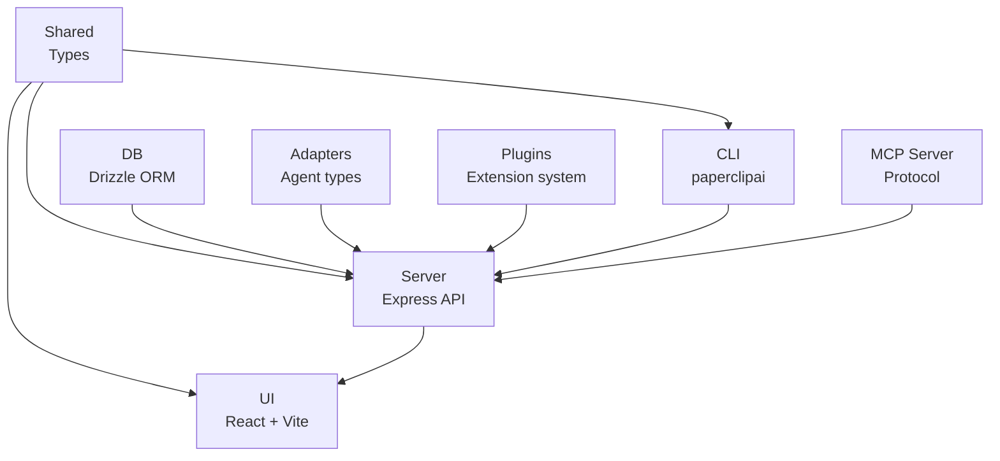
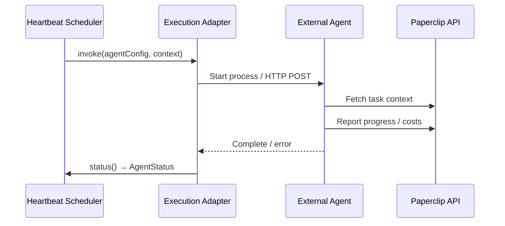
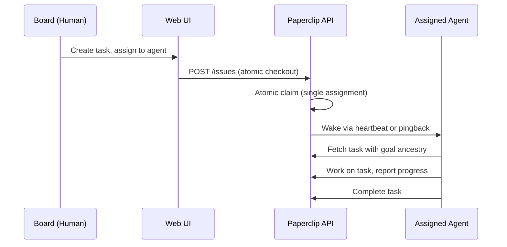
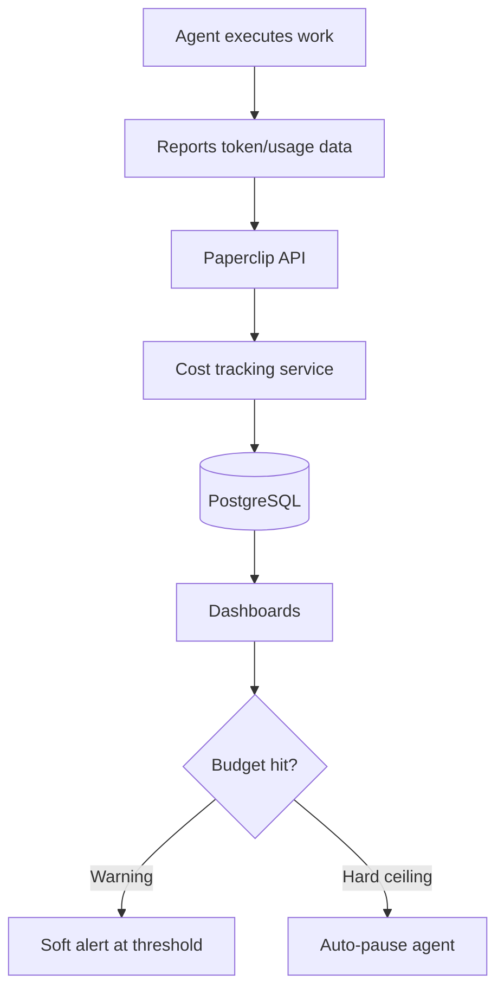

# Paperclip -- Architecture

## Project Structure

Paperclip is a monorepo organized as a pnpm workspace with multiple sub-projects:

```
src.paperclip/
├── paperclip/                  # Main application (server + UI)
│   ├── server/                 # Express API server
│   ├── ui/                     # React frontend (Vite)
│   ├── cli/                    # CLI entry point (paperclipai)
│   ├── packages/               # Internal packages (pnpm workspaces)
│   │   ├── adapters/           # Agent adapter types
│   │   ├── adapter-utils/      # Shared adapter utilities
│   │   ├── db/                 # Database schema (Drizzle)
│   │   ├── mcp-server/         # MCP protocol server
│   │   ├── plugins/            # Plugin system
│   │   └── shared/             # Shared types and utilities
│   ├── docker/                 # Docker configurations
│   ├── scripts/                # Build, release, utility scripts
│   ├── tests/                  # Test suites (Vitest, Playwright)
│   ├── evals/                  # Evaluation suites (promptfoo)
│   ├── skills/                 # Agent skill definitions
│   ├── doc/                    # Internal project documentation
│   └── docs/                   # Mintlify docs (external)
├── clipmart/                   # Company templates marketplace
├── pr-reviewer/                # PR triage dashboard
├── companies-tool/             # Agent Companies CLI
└── paperclip-website/          # Marketing site (Astro)
```

## Sub-Project Dependency Graph



## Main Application: paperclip

The core application consists of two primary components plus supporting packages.

### Server (Express REST API)

The server is a TypeScript Express application that provides:

- **REST API** -- unified endpoints for the UI and agents
- **Agent adapter dispatch** -- invokes agents via process, HTTP, or local coding adapters
- **Heartbeat scheduler** -- wakes agents on schedules and triggers
- **Database layer** -- Drizzle ORM over PostgreSQL
- **Authentication** -- Better Auth with multiple deployment modes
- **Storage** -- local disk or cloud storage for attachments
- **Secrets management** -- encrypted storage with master key
- **Plugin host** -- loads and manages plugin extensions
- **Real-time updates** -- server-sent events for live UI

Source: `paperclip/server/src/`

Key modules:

| Module | Purpose |
|--------|---------|
| `app.ts` | Express application setup |
| `config.ts` | Configuration management |
| `routes/` | REST API route handlers |
| `services/` | Business logic services |
| `auth/` | Authentication and authorization |
| `middleware/` | Express middleware |
| `storage/` | File storage providers |
| `secrets/` | Secret encryption/decryption |
| `realtime/` | SSE and real-time channels |
| `adapters/` | Agent adapter implementations |
| `lib/` | Shared utilities |
| `types/` | TypeScript type definitions |

### UI (React + Vite)

The UI is a React application served by the server in production, or via Vite dev middleware in development:

- **Org Chart** -- tree view with live agent status indicators
- **Task Board** -- Kanban and list views with filtering
- **Dashboard** -- metrics, costs, burn rate overview
- **Agent Detail** -- per-agent tasks, activity, costs, configuration
- **Project/Initiative Views** -- goal progress tracking
- **Cost Dashboard** -- spend visualization at every level
- **Instance Settings** -- configuration, secrets, storage management
- **Worktree branding** -- colored banners for parallel development

Source: `paperclip/ui/src/`

Key modules:

| Module | Purpose |
|--------|---------|
| `App.tsx` | Root component, routing |
| `pages/` | Page-level components |
| `components/` | Reusable UI components |
| `hooks/` | React hooks for data fetching |
| `context/` | React context providers |
| `api/` | API client utilities |
| `plugins/` | UI plugin integration |

### Internal Packages

| Package | Purpose |
|---------|---------|
| `@paperclipai/adapters` | Agent adapter type definitions and implementations |
| `@paperclipai/adapter-utils` | Shared adapter utilities (invocation, status, cancel) |
| `@paperclipai/db` | Drizzle ORM schema, migrations, database client |
| `@paperclipai/mcp-server` | Model Context Protocol server for tool integration |
| `@paperclipai/plugins` | Plugin system -- adapters, lifecycle hooks, UI components |
| `@paperclipai/shared` | Shared TypeScript types and constants |

## Database Layer

Paperclip uses PostgreSQL via Drizzle ORM with three deployment modes:

| Mode | Database | Use Case |
|------|----------|----------|
| Embedded PostgreSQL | Auto-started PGlite | Local dev, one-command install |
| Local Docker PostgreSQL | Docker container on localhost:5432 | Development with full PG |
| Hosted (Supabase) | Supabase PostgreSQL | Production deployment |

Schema is defined in `packages/db/src/schema/` and managed via Drizzle migrations.

Key schema concepts:

- All entities are company-scoped for multi-tenant isolation
- `company_secrets` and `company_secret_versions` for encrypted secrets
- Tasks follow a hierarchy: Initiative -> Projects -> Milestones -> Issues -> Sub-issues
- Atomic checkout ensures single assignment per task

## Authentication and Deployment Modes

| Mode | Description |
|------|-------------|
| `local_trusted` | Loopback-only, no auth required, fastest first run |
| `authenticated/private` | Requires auth, private network access (Tailscale, LAN) |
| `authenticated/public` | Requires auth, public-facing deployment |

Deployment modes control:

- Whether authentication is required
- Which network interfaces the server binds to
- Whether company deletion is enabled
- Telemetry collection defaults

## Communication Patterns

### 1. Agent Heartbeat



### 2. Task Assignment



### 3. Cost Tracking



## Build System

```
pnpm workspaces (monorepo)
  ↓
tsx (TypeScript execution, no separate compile step in dev)
  ↓
Vitest (unit tests)
  ↓
Playwright (end-to-end browser tests)
```

Each internal package builds independently. The root `pnpm dev` command starts both the server and UI in watch mode.

### Key npm Scripts

| Command | Purpose |
|---------|---------|
| `pnpm dev` | Full dev (API + UI, watch mode) |
| `pnpm dev:once` | Full dev without file watching |
| `pnpm dev:server` | Server only |
| `pnpm dev:ui` | UI only |
| `pnpm build` | Build all packages |
| `pnpm typecheck` | TypeScript type checking |
| `pnpm test` | Vitest unit tests |
| `pnpm test:e2e` | Playwright browser suite |
| `pnpm db:generate` | Generate Drizzle migration |
| `pnpm db:migrate` | Apply database migrations |
| `pnpm paperclipai` | CLI entry point |

## Sub-Projects

| Project | Stack | Purpose |
|---------|-------|---------|
| [clipmart](./06-subprojects.md) | Next.js | Company templates marketplace |
| [pr-reviewer](./06-subprojects.md) | Cloudflare Workers (Hono) | PR triage dashboard |
| [companies-tool](./06-subprojects.md) | Next.js / CLI | Import/export agent companies |
| [paperclip-website](./06-subprojects.md) | Astro | Marketing site |
