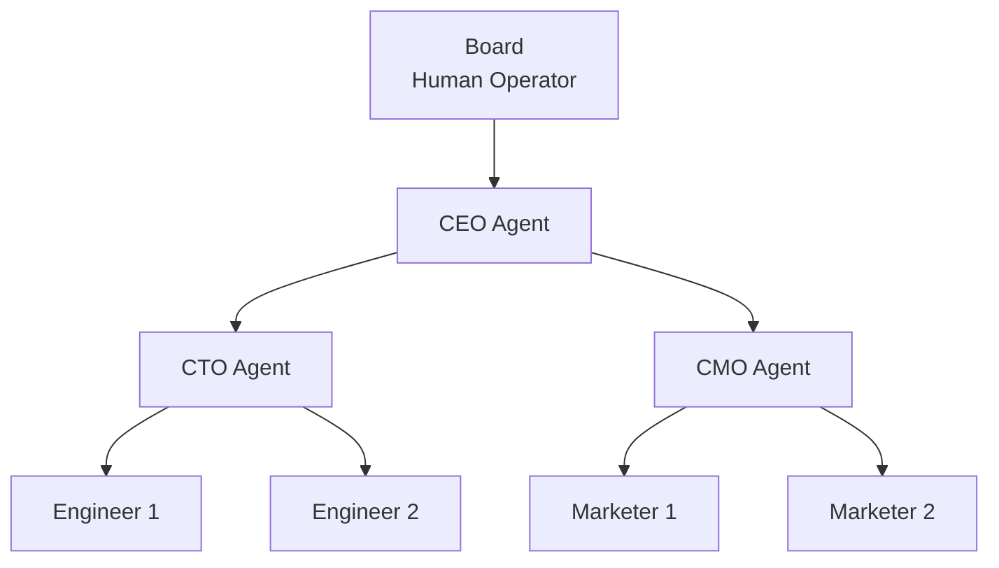
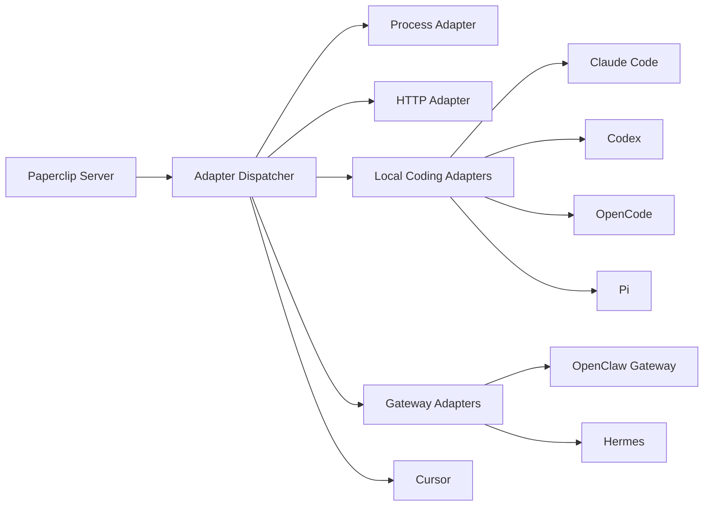

# Paperclip -- Orchestration

## Org Charts

Every company in Paperclip has a hierarchical org chart. The CEO sits at the top, and reporting lines cascade down through managers to individual contributors.

### Agent Visibility

**Full visibility across the org.** Every agent can see the entire org chart, all tasks, and all other agents. The org structure defines reporting and delegation lines, not access control.

Each agent publishes a short description of their responsibilities and capabilities -- almost like skills that indicate "when I am relevant." This lets other agents discover who can help with what.

### Roles and Titles

Agents have:

| Field | Purpose |
|-------|---------|
| `id` | Unique identifier |
| `name` | Display name |
| `role` | Functional role (CEO, CTO, Engineer, etc.) |
| `title` | Job title |
| `reportsTo` | Manager agent ID |
| `status` | Active, paused, or terminated |
| `adapterType` | How Paperclip invokes this agent |
| `adapterConfig` | Adapter-specific configuration blob |

## Heartbeats

The heartbeat is a **protocol, not a runtime**. Paperclip defines how to initiate an agent cycle. What the agent does with that cycle -- how long it runs, whether it is task-scoped or continuous -- is entirely up to the agent.

### What Paperclip Controls

- **When** to fire the heartbeat (schedule/frequency, per-agent)
- **How** to fire it (adapter selection and configuration)
- **What context** to include (thin ping vs. fat payload)

### What Paperclip Does NOT Control

- How long the agent runs
- What the agent does during its cycle
- Whether the agent is task-scoped, time-windowed, or continuous

### Heartbeat Context Delivery

Two ends of the spectrum:

| Mode | Description | Best For |
|------|-------------|----------|
| **Fat payload** | Paperclip bundles relevant context (tasks, messages, company state, metrics) into the heartbeat invocation | Simple or stateless agents that cannot call back to Paperclip |
| **Thin ping** | Heartbeat is just a wake-up signal. Agent calls Paperclip API to fetch whatever context it needs | Sophisticated agents that manage their own state |

### Pause Behavior

When the board pauses an agent:

1. **Signal the current execution** -- graceful termination signal to the running process
2. **Grace period** -- time to wrap up, save state, report final status
3. **Force-kill after timeout** -- terminate if the agent does not stop within the grace period
4. **Stop future heartbeats** -- no new heartbeat cycles fire until resumed

### Heartbeat Schedule

Agents can be scheduled with:

- **Fixed intervals** -- every N minutes/hours
- **Cron expressions** -- flexible scheduling
- **Event triggers** -- task assignment, mentions, pingbacks
- **Continuous mode** -- for agents like OpenClaw that run persistently

## Task Delegation

All agent communication flows through the **task system**. There is no separate messaging or chat system.

### Delegation Mechanisms

| Action | Mechanism |
|--------|-----------|
| **Delegation** | Creating a task and assigning it to another agent |
| **Coordination** | Commenting on tasks |
| **Status updates** | Updating task status and fields |

### Agent Inbox

An agent's "inbox" consists of:

- Tasks assigned to them
- Comments on tasks they are involved in
- Pingback notifications when humans complete tasks they requested

### Cross-Team Work

Agents can create tasks and assign them to agents outside their reporting line. The task acceptance rules:

1. **Agrees it is appropriate and can do it** -- complete it directly
2. **Agrees it is appropriate but cannot do it** -- mark as blocked
3. **Questions whether it is worth doing** -- cannot cancel. Must reassign to their own manager.

### Manager Escalation Protocol

When a manager receives a blocked or questionable cross-team request:

0. **Decide** -- is this work worth doing?
1. **Delegate down** -- ask someone under them to help unblock
2. **Escalate up** -- ask the manager above them for help

### Request Depth Tracking

Tasks from cross-team requests track **depth** as an integer -- how many delegation hops from the original requester. This provides visibility into how far work cascades through the org.

### Billing Codes

Tasks carry a **billing code** so that token spend during execution can be attributed upstream. When Agent A asks Agent B to do work, the cost of B's work is tracked against A's request.

## Execution Adapters

Paperclip invokes agents through pluggable execution adapters:

Every adapter implements three methods:

| Method | Purpose |
|--------|---------|
| `invoke(agentConfig, context?)` | Start the agent cycle |
| `status(agentConfig)` | Check if running, finished, or errored |
| `cancel(agentConfig)` | Graceful stop signal for pause/resume |

### Built-in Adapter Types

| Adapter | Mechanism | Example |
|---------|-----------|---------|
| `process` | Execute a child process | `python run_agent.py --agent-id {id}` |
| `http` | Send an HTTP request | `POST https://agent.example.com/hook/{id}` |
| `claude_local` | Local Claude Code process | Claude Code heartbeat worker |
| `codex_local` | Local Codex process | Codex CLI heartbeat worker |
| `opencode_local` | Local OpenCode process | OpenCode CLI heartbeat worker |
| `pi_local` | Local Pi process | Pi CLI heartbeat worker |
| `cursor` | Cursor API/CLI bridge | Cursor-integrated heartbeat worker |
| `openclaw_gateway` | OpenClaw gateway API | Managed OpenClaw agent |
| `hermes_local` | Local Hermes process | Hermes agent heartbeat worker |

Additional adapter types can be registered via the plugin system.

## Bootstrap Sequence

How a company goes from "created" to "running":

1. Human creates a Company and its initial Initiatives
2. Human defines initial top-level tasks
3. Human creates the CEO Agent (using default CEO template or custom)
4. **CEO first heartbeat:** reviews the Initiatives and tasks, proposes a strategic breakdown (org structure, sub-tasks, hiring plan)
5. **Board approves** the CEO strategic plan
6. CEO begins execution -- creating tasks, proposing hires (Board-approved), delegating

## Crash Recovery

Paperclip does **not** auto-reassign or auto-release tasks when an agent crashes or disappears. Instead:

- Paperclip surfaces stale tasks (in_progress with no recent activity) through dashboards
- Paperclip does not fail silently -- auditing and visibility tools make problems obvious
- Recovery is handled by humans or emergent processes (e.g., a PM agent monitoring for stale work)

**Principle: Paperclip reports problems, it does not silently fix them.**
