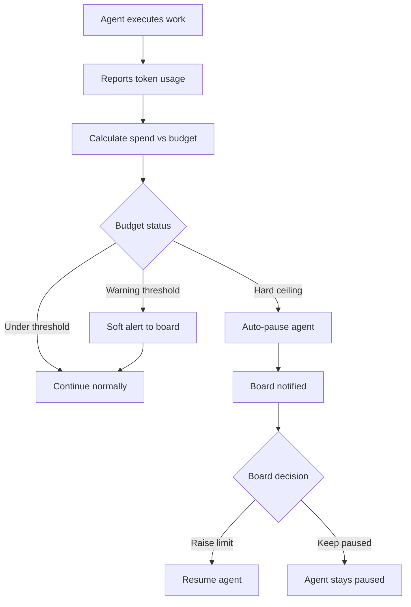

# Paperclip -- Goals, Budgets, and Governance

## Goal Alignment

Every task in Paperclip traces back to a company goal. This hierarchical structure ensures agents always understand the "why" behind their work, not just the "what."

### Task Hierarchy

```
Initiative (Company Goal)
  └── Project
        └── Milestone
              └── Issue (Task)
                    └── Sub-issue
```

- **Initiative** represents a company-level goal or objective
- **Projects** break initiatives into deliverable bodies of work
- **Milestones** mark significant checkpoints within projects
- **Issues** are individual units of work (tasks)
- **Sub-issues** decompose complex issues further

### Goal-Aware Execution

Tasks carry full **goal ancestry** so agents consistently see context about why their work matters. When an agent picks up a task, it receives:

- The task description and requirements
- The parent milestone and project context
- The overarching initiative (company goal)
- Related tasks and their status

This prevents the common problem of agents executing tasks without understanding the broader strategic context.

## Budget Controls

Token and LLM cost budgeting is a core part of Paperclip. External revenue and expense tracking is a future plugin.

### Cost Tracking Levels

Costs are tracked at every level:

| Level | Question Answered |
|-------|-------------------|
| **Per Agent** | How much is this employee costing? |
| **Per Task** | How much did this unit of work cost? |
| **Per Project** | How much is this deliverable costing? |
| **Per Company** | What is the total burn rate? |

Costs are denominated in both **tokens and dollars**.

### Three-Tier Budget Enforcement



| Tier | Behavior |
|------|----------|
| **Visibility** | Dashboards showing spend at every level (agent, task, project, company) |
| **Soft alerts** | Configurable thresholds (e.g., warn at 80% of budget). Board is notified but agents continue |
| **Hard ceiling** | Auto-pause the agent when budget is hit. Board is notified. Board can override or raise the limit |

Budgets can be set to **unlimited** (no ceiling).

### Budget Delegation

The Board sets Company-level budgets. The CEO can set budgets for agents below them, and every manager agent can do the same for their reports. The permission structure supports cascading budget delegation. The Board can manually override any budget at any level.

## Board Governance

Every Company has a **Board** that governs high-impact decisions. The Board is the human oversight layer.

### V1: Single Human Board

In V1, the Board is a single human operator.

#### Board Approval Gates

Certain actions require explicit Board approval:

| Gate | Description |
|------|-------------|
| **New Agent hires** | Creating new agents requires Board approval |
| **CEO strategic breakdown** | CEO proposes strategy, Board approves before execution begins |

#### Board Powers (Always Available)

The Board has **unrestricted access** to the entire system at all times:

| Power | Description |
|-------|-------------|
| **Set and modify Company budgets** | Top-level token/LLM cost budgets |
| **Pause/resume any Agent** | Stop an agent heartbeat immediately |
| **Pause/resume any work item** | Pause a task, project, subtask tree, or milestone. Paused items are not picked up by agents |
| **Full project management access** | Create, edit, comment on, modify, delete, reassign any task through the UI |
| **Override any Agent decision** | Reassign tasks, change priorities, modify descriptions |
| **Manually change any budget** | At any level, at any time |

The Board is not just an approval gate -- it is a live control surface. The human can intervene at any level at any time.

### Governance with Rollback

- Approval gates are enforced by the system, not just conventions
- Configuration changes are revisioned
- Bad changes can be rolled back safely

## Atomic Execution

Task checkout and budget enforcement are **atomic**:

1. Agent attempts to set a task to `in_progress` (claiming it)
2. The API/database enforces this atomically -- if another agent already claimed it, the request fails with an error identifying which agent has it
3. If the task is already assigned to the requesting agent from a previous session, they can resume

No optimistic locking or CRDTs needed. The single-assignment model with atomic checkout prevents conflicts at the design level.

## Future Governance Models

Not in V1, but planned for future versions:

- **Hiring budgets** -- auto-approve hires within a dollar-per-month limit
- **Multi-member boards** -- multiple human operators with voting
- **Delegated authority** -- CEO can hire within limits without Board approval
- **Revenue/expense tracking** -- external financial tracking via plugins
