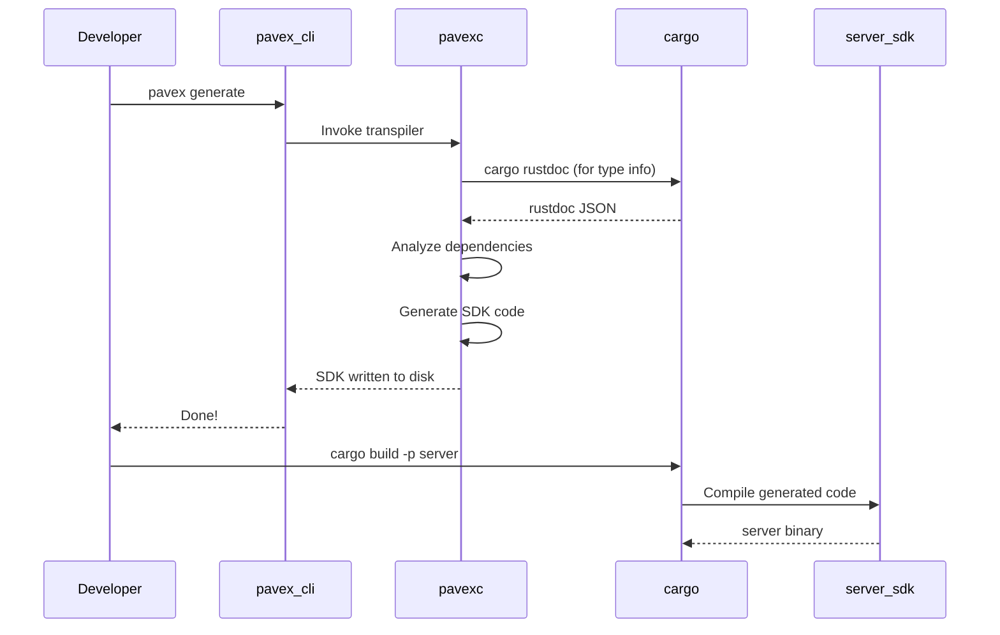

# Framework Integration Deep Dive

## Overview

This deep dive explores how Pavex integrates with Rust projects. We'll examine the `pavex_cli` wrapper, the structure of generated SDK code, the relationship with `cargo-px`, and testing strategies for Pavex applications.

---

## 1. Integration Architecture

### 1.1 High-Level Flow

```
┌─────────────────────────────────────────────────────────┐
│              Pavex Project Structure                     │
│                                                          │
│  my_project/                                             │
│  ├── Cargo.toml          # Workspace definition         │
│  ├── blueprint.ron       # OR: blueprint.rs             │
│  ├── app/                # Your application code        │
│  │   ├── src/                                           │
│  │   │   ├── lib.rs      # Handlers, constructors       │
│  │   │   ├── blueprint.rs                               │
│  │   │   └── bin/                                       │
│  │   │       └── bp.rs   # Blueprint binary             │
│  │   └── Cargo.toml                                     │
│  ├── server_sdk/         # GENERATED by pavex           │
│  │   ├── src/                                           │
│  │   │   ├── lib.rs      # ApplicationState             │
│  │   │   ├── server.rs   # Server entry point           │
│  │   │   └── router.rs   # Request routing              │
│  │   └── Cargo.toml                                     │
│  └── server/             # Server binary                │
│      ├── src/                                           │
│      │   └── bin/                                       │
│      │       └── server.rs                              │
│      └── Cargo.toml                                     │
└─────────────────────────────────────────────────────────┘
```

### 1.2 Build Process



---

## 2. The pavex_cli Wrapper

### 2.1 Purpose

`pavex_cli` is a thin wrapper around `pavexc` that handles:

1. **Activation** - License validation
2. **Installation** - Downloading/installing `pavexc`
3. **Version matching** - Ensuring CLI and library versions match
4. **Environment setup** - Setting up paths and configuration

### 2.2 CLI Structure

```rust
// libs/pavex_cli/src/command.rs
use clap::{Parser, Subcommand};

#[derive(Parser)]
pub struct Cli {
    #[command(subcommand)]
    pub command: Command,

    /// Logging configuration
    #[arg(long, env = "PAVEX_LOG")]
    pub log: bool,

    /// Log filter (e.g., "pavex=trace")
    #[arg(long, env = "PAVEX_LOG_FILTER")]
    pub log_filter: Option<String>,

    /// Color output mode
    #[arg(long, default_value = "auto")]
    pub color: Color,

    /// Performance profiling
    #[arg(long)]
    pub perf_profile: bool,

    /// Debug mode
    #[arg(long)]
    pub debug: bool,
}

#[derive(Subcommand)]
pub enum Command {
    /// Generate the server SDK from a blueprint
    Generate {
        /// Path to the blueprint file
        #[arg()]
        blueprint: PathBuf,

        /// Path to write diagnostics
        #[arg(long)]
        diagnostics: Option<PathBuf>,

        /// Output directory for generated code
        #[arg(short, long)]
        output: PathBuf,

        /// Check mode (don't write, just verify)
        #[arg(long)]
        check: bool,
    },

    /// Create a new Pavex project
    New {
        /// Project path
        #[arg()]
        path: PathBuf,

        /// Template to use
        #[arg(long, default_value = "starter")]
        template: TemplateName,
    },

    /// Pavex self-management
    Self_ {
        #[command(subcommand)]
        command: SelfCommands,
    },
}

#[derive(Subcommand)]
pub enum SelfCommands {
    /// Update pavex_cli
    Update,
    /// Uninstall Pavex
    Uninstall { #[arg(short, long)] y: bool },
    /// Activate Pavex license
    Activate { key: Option<Secret<String>> },
    /// Initial setup
    Setup {
        #[arg(long)]
        wizard_key: Option<Secret<String>>,
        #[arg(long)]
        skip_activation: bool,
    },
}
```

### 2.3 Generate Command Flow

```rust
// libs/pavex_cli/src/main.rs
fn generate(
    mut client: Client,
    locator: &PavexLocator,
    blueprint: PathBuf,
    diagnostics: Option<PathBuf>,
    output: PathBuf,
    check: bool,
) -> Result<ExitCode, Error> {
    // Match pavexc version with pavex library version
    let pavexc_cli_path = if let Some(override_path) = env::pavexc_override() {
        override_path
    } else {
        // Get pavexc from version or install
        let package_graph = compute_package_graph()?;
        get_or_install_from_graph(locator, &package_graph)?
    };

    client = client.pavexc_cli_path(pavexc_cli_path);

    // Execute pavex generate
    let mut cmd = client
        .generate(BlueprintArgument::Path(blueprint), output)
        .check(check);

    if let Some(diag_path) = diagnostics {
        cmd = cmd.diagnostics_path(diag_path);
    }

    match cmd.execute() {
        Ok(()) => Ok(ExitCode::SUCCESS),
        Err(GenerateError::NonZeroExitCode(e)) => Ok(ExitCode::from(e.code as u8)),
        Err(e) => Err(e),
    }
}
```

### 2.4 Version Matching

```rust
// libs/pavex_cli/src/pavexc/mod.rs
pub fn get_or_install_from_graph(
    locator: &PavexLocator,
    package_graph: &PackageGraph,
) -> Result<PathBuf, Error> {
    // Find pavex dependency in workspace
    let pavex_dep = package_graph
        .dependencies()
        .filter(|(pkg, _)| pkg.name() == "pavex")
        .next()
        .ok_or_else(|| anyhow!("pavex not found in workspace"))?;

    let version = pavex_dep.0.version();

    // Get or install pavexc with matching version
    get_or_install_from_version(locator, version)
}
```

---

## 3. Generated SDK Structure

### 3.1 SDK Output

When you run `pavex generate`, it creates:

```
server_sdk/
├── src/
│   ├── lib.rs              # Crate root, exports
│   ├── application_state.rs # Singleton storage
│   ├── request_scoped.rs   # Request-scoped state
│   ├── router.rs           # Route matching
│   ├── server.rs           # HTTP server setup
│   └── routes/
│       ├── mod.rs          # Route handlers
│       └── path_patterns.rs # Generated route modules
├── Cargo.toml              # SDK dependencies
└── tests/
    └── integration/        # Generated integration tests
```

### 3.2 Generated Code Examples

**application_state.rs:**

```rust
// Generated based on Singleton constructors
use pavex::response::Response;
use std::sync::Arc;

pub struct ApplicationState {
    // One field per singleton constructor
    // Naming convention: s0, s1, s2, ...
    pub s0: crate::HttpClient,
    pub s1: crate::Logger,
    pub s2: crate::DatabasePool,
}

pub fn build_application_state() -> Result<ApplicationState, anyhow::Error> {
    // Build order respects dependencies
    let s2 = crate::database_pool()?;
    let s0 = crate::http_client();
    let s1 = crate::logger();

    Ok(ApplicationState { s0, s1, s2 })
}
```

**router.rs:**

```rust
// Generated router with dispatch logic
use pavex::routing::Router;
use pavex::request::RequestHead;
use pavex::response::Response;

pub fn build_router() -> Router<u32> {
    let mut router = Router::new();

    // Register routes from blueprint
    router.insert("/ping", 0u32);
    router.insert("/users/{user_id}", 1u32);
    router.insert("/users/{user_id}/posts/{post_id}", 2u32);

    router
}

pub fn route_request(
    request: &RequestHead,
    server_state: Arc<ServerState>,
) -> Response {
    // Match route
    let route_match = server_state.router.at(request.uri().path());

    let route_id = match route_match {
        Ok(m) => m.value,
        Err(e) => return not_found_response(),
    };

    // Dispatch to handler
    match route_id {
        0u32 => route_handler_ping(server_state, request),
        1u32 => route_handler_user(server_state, request),
        2u32 => route_handler_post(server_state, request),
        _ => unreachable!(),
    }
}
```

**routes/mod.rs:**

```rust
// Generated handler wrappers
use pavex::request::RequestHead;
use pavex::response::Response;
use std::sync::Arc;

pub fn route_handler_ping(
    app_state: Arc<ApplicationState>,
    request: &RequestHead,
) -> Response {
    // Extract dependencies from state
    let logger = &app_state.s1;

    // Call user's handler
    crate::handlers::ping()
}

pub fn route_handler_user(
    app_state: Arc<ApplicationState>,
    request: &RequestHead,
) -> Response {
    // Extract path parameters
    let user_id: Uuid = extract_path_param(request, "user_id")
        .unwrap_or_else(|e| return error_response(e));

    // Call user's handler with extracted params
    crate::handlers::get_user(user_id)
}
```

### 3.3 Server Binary

```rust
// server/src/bin/server.rs
use server_sdk::server;
use pavex::hyper::server::Builder;

#[tokio::main]
async fn main() -> Result<(), anyhow::Error> {
    // Load configuration
    let config = load_config();

    // Build application state (singletons)
    let app_state = server_sdk::build_application_state(config)?;

    // Create HTTP server
    let addr = format!("{}:{}", config.host, config.port);
    let listener = tokio::net::TcpListener::bind(&addr).await?;

    // Run server
    server::run(listener, app_state).await?;

    Ok(())
}
```

---

## 4. cargo-px Integration

### 4.1 Why cargo-px?

**Problem:** Cargo doesn't allow `cargo` commands from `build.rs` due to coarse locking.

```rust
// build.rs - THIS DOESN'T WORK
fn main() {
    // Can't run cargo from build.rs!
    let output = Command::new("cargo")
        .arg("rustdoc")
        // ... error: running cargo from cargo is not supported
        .output()
        .unwrap();
}
```

**Solution:** `cargo-px` is a separate cargo subcommand that:
1. Runs outside cargo's lock
2. Can invoke `cargo rustdoc`
3. Generates code before compilation

### 4.2 cargo-px Workflow

```
cargo px run
      │
      ▼
┌─────────────────┐
│ cargo-px        │
│ (separate binary)│
└────────┬────────┘
         │
         ▼
┌─────────────────┐
│ pavex generate  │
│ (invokes pavexc)│
└────────┬────────┘
         │
         ▼
┌─────────────────┐
│ Generated SDK   │
│ (server_sdk/)   │
└────────┬────────┘
         │
         ▼
┌─────────────────┐
│ cargo build     │
│ (normal build)  │
└─────────────────┘
```

### 4.3 Configuration

```toml
# Cargo.toml
[package]
name = "my_app"
version = "0.1.0"

[dependencies]
pavex = "0.1"

[workspace]
members = ["app", "server_sdk", "server"]
```

```yaml
# .cargo/config.toml
[alias]
px = "px"  # cargo-px subcommand
```

---

## 5. Testing Strategies

### 5.1 Unit Testing Handlers

```rust
// app/src/handlers.rs
pub fn get_user(user_id: Uuid) -> Result<User, ApiError> {
    // Handler logic
}

// app/src/handlers/test.rs
#[cfg(test)]
mod tests {
    use super::*;

    #[test]
    fn test_get_user_not_found() {
        let user_id = Uuid::nil();
        let result = get_user(user_id);
        assert!(matches!(result, Err(ApiError::NotFound)));
    }
}
```

### 5.2 Integration Testing

```rust
// server/tests/integration/main.rs
mod helpers;

#[tokio::test]
async fn test_ping_endpoint() {
    // Start test server
    let server = helpers::spawn_test_server().await;

    // Make request
    let response = server
        .get("/ping")
        .send()
        .await
        .expect("Request failed");

    // Assert response
    assert_eq!(response.status(), 200);
}

#[tokio::test]
async fn test_user_crud() {
    let server = helpers::spawn_test_server().await;

    // Create user
    let create_response = server
        .post("/users")
        .json(&CreateUser { name: "Test".into() })
        .send()
        .await
        .unwrap();

    assert_eq!(create_response.status(), 201);
    let user: User = create_response.json().await.unwrap();

    // Get user
    let get_response = server
        .get(&format!("/users/{}", user.id))
        .send()
        .await
        .unwrap();

    assert_eq!(get_response.status(), 200);
}
```

### 5.3 Test Helpers

```rust
// server/tests/integration/helpers.rs
use server_sdk::{build_application_state, server};
use pavex::testing::TestServer;

pub async fn spawn_test_server() -> TestServer {
    // Create test configuration
    let config = test_config();

    // Build application state
    let app_state = build_application_state(config)
        .await
        .expect("Failed to build app state");

    // Create test server
    TestServer::new(app_state).await
}

fn test_config() -> AppConfig {
    AppConfig {
        host: "127.0.0.1".into(),
        port: 0,  // Auto-assign port
        // ...
    }
}
```

---

## 6. Error Handling

### 6.1 Error Observers

```rust
// app/src/errors.rs
use pavex::response::Response;
use pavex::http::StatusCode;

/// Observe all errors (logging, metrics)
pub fn error_observer(error: &ApiError) {
    tracing::error!("API error: {:?}", error);
    metrics::increment_counter!("api_errors", "type" => error.kind());
}

/// Convert errors to HTTP responses
pub fn error_handler(error: ApiError) -> Response {
    match error {
        ApiError::NotFound => {
            Response::builder()
                .status(StatusCode::NOT_FOUND)
                .body("Not found".into())
                .build()
        }
        ApiError::BadRequest(e) => {
            Response::builder()
                .status(StatusCode::BAD_REQUEST)
                .body(e.to_string().into())
                .build()
        }
        ApiError::Internal(e) => {
            tracing::error!("Internal error: {:?}", e);
            Response::builder()
                .status(StatusCode::INTERNAL_SERVER_ERROR)
                .body("Internal error".into())
                .build()
        }
    }
}
```

### 6.2 Registration

```rust
// app/src/blueprint.rs
use pavex::blueprint::Blueprint;
use pavex::f;

pub fn blueprint() -> Blueprint {
    let mut bp = Blueprint::new();

    // Register error observer (sees all errors)
    bp.error_observer(f!(crate::errors::error_observer));

    // Register error handler (converts to Response)
    bp.error_handler(f!(crate::errors::error_handler));

    bp
}
```

---

## 7. Middleware Integration

### 7.1 Pre-processing Middleware

```rust
// app/src/middleware/auth.rs
use pavex::request::RequestHead;
use pavex::response::Response;

/// Authentication middleware - runs BEFORE handler
pub fn authenticate(request: &RequestHead) -> Result<Option<UserId>, Response> {
    let auth_header = request
        .headers()
        .get("Authorization")
        .ok_or_else(|| unauthorized_response())?;

    let user_id = verify_token(auth_header)
        .map_err(|_| unauthorized_response())?;

    Ok(Some(user_id))
}
```

### 7.2 Post-processing Middleware

```rust
// app/src/middleware/logging.rs
use pavex::response::Response;

/// Logging middleware - runs AFTER handler
pub fn log_response(
    response: Response,
    request: &RequestHead,
    start_time: Instant,
) -> Response {
    let duration = start_time.elapsed();
    tracing::info!(
        "{} {} -> {} in {:?}",
        request.method(),
        request.uri().path(),
        response.status(),
        duration
    );

    response
}
```

### 7.3 Wrapping Middleware

```rust
// app/src/middleware/timing.rs
use pavex::response::Response;
use pavex::request::RequestHead;
use std::time::Instant;

/// Timing middleware - wraps handler execution
pub fn time_request<F>(request: &RequestHead, handler: F) -> Response
where
    F: FnOnce(&RequestHead) -> Response,
{
    let start = Instant::now();
    let response = handler(request);
    let duration = start.elapsed();

    Response::builder()
        .header("X-Response-Time", format!("{:?}", duration))
        .body(response.into_body())
        .build()
}
```

---

## 8. Configuration Management

### 8.1 ConfigProfile Derive

```rust
// app/src/configuration.rs
use pavex::ConfigProfile;
use serde::Deserialize;

#[derive(Deserialize, ConfigProfile)]
pub struct AppConfig {
    #[pavex(env = "SERVER_HOST", default = "0.0.0.0")]
    pub host: String,

    #[pavex(env = "SERVER_PORT", default = "8080")]
    pub port: u16,

    #[pavex(env = "DATABASE_URL")]
    pub database_url: String,

    #[serde(default)]
    pub telemetry: TelemetryConfig,
}

#[derive(Deserialize, ConfigProfile)]
pub struct TelemetryConfig {
    #[pavex(env = "OTEL_EXPORTER_URL", default = "http://localhost:4317")]
    pub exporter_url: String,
}
```

### 8.2 Config Constructor

```rust
// app/src/configuration.rs
use pavex::singleton;
use figment::{Figment, providers::{Env, Format, Toml}};

#[singleton]
pub fn load_configuration() -> AppConfig {
    Figment::new()
        .merge(Toml::file("config.toml"))
        .merge(Env::prefixed("APP_"))
        .extract()
        .expect("Failed to load configuration")
}
```

---

## Key Takeaways

1. **pavex_cli wraps pavexc** - Handles activation, installation, version matching
2. **Generated SDK is Rust code** - ApplicationState, router, handler wrappers
3. **cargo-px bypasses cargo locking** - Enables code generation during build
4. **Test handlers directly** - No need for HTTP for unit tests
5. **Integration tests use TestServer** - In-memory testing
6. **Error observers see all errors** - Good for logging/metrics
7. **Three middleware types** - Pre, post, and wrapping

---

## Related Files

- **pavex_cli main**: `/home/darkvoid/Boxxed/@formulas/src.rust/src.BuildTooling/pavex/libs/pavex_cli/src/main.rs`
- **Starter example**: `/home/darkvoid/Boxxed/@formulas/src.rust/src.BuildTooling/pavex/examples/starter/app/src/`
- **Blueprint example**: `/home/darkvoid/Boxxed/@formulas/src.rust/src.BuildTooling/pavex/examples/starter/app/src/blueprint.rs`

---

*Next: [rust-revision.md](rust-revision.md)*
