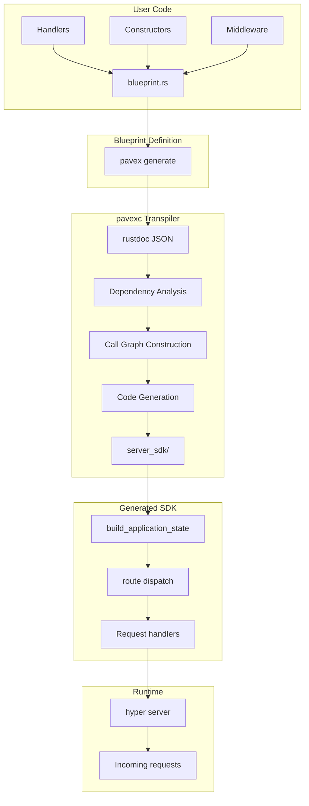

# Pavex: Complete Exploration

## Overview

**Pavex** is a new web framework for Rust that uses **build-time code generation** to achieve both great ergonomics and high performance. Unlike traditional frameworks (axum, actix-web) that rely on runtime abstractions, Pavex transpiles your API blueprint into optimized, handwritten-quality source code.

### Why This Exploration Exists

This is a **complete textbook** that takes you from zero build system knowledge to understanding how Pavex generates code at compile time, manages dependencies, performs incremental builds, and integrates with Rust projects. It also covers how to replicate these patterns for `ewe_platform` and deploy build services on Lambda using Valtron.

### Key Characteristics

| Aspect | Pavex |
|--------|-------|
| **Core Innovation** | Build-time transpilation via rustdoc JSON |
| **Dependencies** | guppy, syn, petgraph, rusqlite (caching) |
| **Lines of Code** | ~50,000 (core compiler) |
| **Purpose** | Web framework with compile-time DI and routing |
| **Architecture** | Blueprint -> pavexc (transpiler) -> Generated SDK |
| **Runtime** | tokio, hyper (standard Rust async) |
| **Rust Equivalent** | Native Rust - no translation needed |

---

## Complete Table of Contents

This exploration consists of multiple deep-dive documents. Read them in order for complete understanding:

### Part 1: Foundations
1. **[Zero to Build Engineer](00-zero-to-build-engineer.md)** - Start here if new to build systems
   - What are build systems?
   - Compilation fundamentals
   - Code generation at build time
   - rustdoc JSON as reflection
   - Incremental compilation basics

### Part 2: Core Implementation
2. **[Macro Codegen Deep Dive](01-macro-codegen-deep-dive.md)**
   - Procedural macros in Rust
   - syn and quote for AST manipulation
   - Build-time code generation patterns
   - The `f!` macro for IDE hints
   - Attribute macros for lifecycle annotations

3. **[Dependency Resolution Deep Dive](02-dependency-resolution-deep-dive.md)**
   - How pavexc resolves dependencies
   - guppy and cargo_metadata integration
   - Feature flag resolution
   - Workspace member discovery
   - Package graph construction

4. **[Incremental Builds Deep Dive](03-incremental-builds-deep-dive.md)**
   - Caching strategies for rustdoc JSON
   - SQLite-based cache database
   - Fingerprinting and checksums
   - Cache invalidation logic
   - Project access log tracking

5. **[Framework Integration Deep Dive](04-framework-integration-deep-dive.md)**
   - How pavex integrates with Rust projects
   - The pavex_cli wrapper
   - cargo-px integration
   - Generated SDK structure
   - Testing strategies

### Part 3: Production
6. **[Rust Revision](rust-revision.md)**
   - Note: Pavex is already Rust
   - Key design patterns used
   - Type system considerations
   - Error handling with miette

7. **[Production-Grade](production-grade.md)**
   - CI/CD integration
   - Performance optimizations
   - Scaling the build process
   - Monitoring and diagnostics
   - Multi-project management

8. **[Valtron Integration](05-valtron-integration.md)**
   - Lambda deployment for build services
   - NO async/tokio in build tools
   - TaskIterator for build steps
   - Single-threaded executor for Lambda
   - Request/response types for HTTP API

---

## Quick Reference: Pavex Architecture

### High-Level Flow



### Component Summary

| Component | Lines | Purpose | Deep Dive |
|-----------|-------|---------|-----------|
| pavex (framework) | ~5,000 | Runtime types, Blueprint DSL | [Framework Integration](04-framework-integration-deep-dive.md) |
| pavexc (compiler) | ~30,000 | Transpilation logic | [Dependency Resolution](02-dependency-resolution-deep-dive.md) |
| pavex_macros | ~1,000 | Procedural macros | [Macro Codegen](01-macro-codegen-deep-dive.md) |
| pavex_cli | ~3,000 | CLI wrapper, activation | [Production-Grade](production-grade.md) |
| Caching | ~5,000 | SQLite rustdoc cache | [Incremental Builds](03-incremental-builds-deep-dive.md) |

---

## File Structure

```
pavex/
├── libs/
│   ├── pavex/                          # Core framework crate
│   │   ├── src/
│   │   │   ├── blueprint/              # Blueprint DSL types
│   │   │   ├── request/                # Request types
│   │   │   ├── response/               # Response types
│   │   │   ├── kit/                    # Prebuilt kits (ApiKit)
│   │   │   └── lib.rs
│   │   └── Cargo.toml
│   │
│   ├── pavexc/                         # The transpiler (core compiler)
│   │   ├── src/
│   │   │   ├── compiler/
│   │   │   │   ├── analyses/           # Dependency analysis
│   │   │   │   │   ├── call_graph/     # Call graph construction
│   │   │   │   │   ├── components/     # Component resolution
│   │   │   │   │   └── user_components/
│   │   │   │   ├── codegen/            # Rust code generation
│   │   │   │   ├── component/          # Component types
│   │   │   │   └── computation/        # Computation handling
│   │   │   ├── rustdoc/
│   │   │   │   ├── compute/            # rustdoc JSON computation
│   │   │   │   │   ├── cache.rs        # SQLite caching
│   │   │   │   │   └── checksum.rs     # BLAKE3 fingerprinting
│   │   │   │   └── queries.rs          # rustdoc queries
│   │   │   ├── diagnostic/             # Error diagnostics (miette)
│   │   │   └── lib.rs
│   │   └── Cargo.toml
│   │
│   ├── pavex_macros/                   # Procedural macros
│   │   ├── src/
│   │   │   ├── constructor.rs          # #[constructor] macro
│   │   │   ├── path_params.rs          # #[PathParams] macro
│   │   │   └── lib.rs
│   │   └── Cargo.toml
│   │
│   ├── pavex_cli/                      # CLI wrapper
│   │   ├── src/
│   │   │   ├── activation/             # License activation
│   │   │   ├── pavexc/                 # pavexc installation
│   │   │   └── main.rs
│   │   └── Cargo.toml
│   │
│   ├── pavex_cli_client/               # HTTP client for pavexc RPC
│   ├── pavex_cli_deps/                 # Shared dependency logic
│   ├── pavex_cli_diagnostic/           # Diagnostic utilities
│   ├── pavex_cli_shell/                # Shell utilities
│   ├── pavex_cli_flock/                # File locking
│   │
│   ├── pavex_bp_schema/                # Blueprint serialization schema
│   ├── pavex_reflection/               # Type reflection utilities
│   └── persist_if_changed/             # File persistence helper
│
├── doc_examples/                       # Documentation examples
│   └── guide/
│       ├── routing/
│       ├── dependency_injection/
│       ├── middleware/
│       ├── errors/
│       └── ...
│
├── examples/
│   ├── starter/                        # Hello World example
│   └── realworld/                      # RealWorld app example
│
├── ci_utils/                           # CI configuration generator
│
├── ARCHITECTURE.md                     # Official architecture doc
├── README.md
└── Cargo.toml (workspace)
```

---

## How Pavex Works: The Three Stages

### Stage 1: Define Components

```rust
// src/lib.rs - Your handlers and constructors
use pavex::response::Response;
use pavex::request::RequestHead;

pub fn get() -> StatusCode {
    StatusCode::OK
}

pub struct HttpClient(reqwest::Client);

#[pavex::constructor(Lifecycle::Singleton)]
pub fn http_client() -> HttpClient {
    HttpClient(reqwest::Client::new())
}
```

### Stage 2: Build the Blueprint

```rust
// src/blueprint.rs
use pavex::blueprint::Blueprint;
use pavex::f;

pub fn blueprint() -> Blueprint {
    let mut bp = Blueprint::new();

    // Register constructors with lifecycle
    bp.constructor(f!(crate::http_client), Lifecycle::Singleton);

    // Register routes
    bp.route(GET, "/ping", f!(crate::get));

    bp
}
```

### Stage 3: Generate SDK

```bash
pavex generate blueprint.ron --output ./server_sdk
```

This generates:
- `ApplicationState` struct with all singletons
- `build_application_state()` function
- Router with dispatch logic
- Type-safe handler wrappers

---

## Key Insights

### 1. rustdoc JSON as Reflection

Pavex uses `rustdoc`'s JSON output as a form of compile-time reflection:

```bash
cargo +nightly rustdoc -p my_crate --lib -- -Zunstable-options --output-format json
```

This produces structured metadata about:
- All public types and their fields
- Function signatures (inputs, outputs)
- Trait implementations
- Module structure

**Why rustdoc?** Rust has no built-in reflection. `rustdoc` JSON is the closest thing available.

### 2. Dependency Graph -> Call Graph

```
Dependency Graph (types only):
  handler(path::PathBuf, Logger, Client)
       ↑              ↑         ↑
  extract_path   logger()   http_client()
       ↑                      ↑
  RequestHead              Config

Call Graph (with lifecycle):
  handler(path::PathBuf, Logger, Client)
       ↑              ↑         ↑
  extract_path   logger()   state.client
                              ↑
                         (from ApplicationState)
```

### 3. Lifecycle Management

| Lifecycle | When Constructed | Storage |
|-----------|-----------------|---------|
| Singleton | At server startup | `ApplicationState` |
| RequestScoped | Per incoming request | Request-local state |
| Transient | Every time needed | Stack allocation |

### 4. SQLite Caching Strategy

```sql
CREATE TABLE rustdoc_3d_party_crates_cache (
    crate_name TEXT,
    crate_version TEXT,
    crate_hash TEXT,           -- BLAKE3 for path deps
    cargo_fingerprint TEXT,    -- Toolchain version
    rustdoc_options TEXT,      -- Flags used
    active_named_features TEXT,-- Feature flags
    items BLOB,                -- Serialized rustdoc JSON
    PRIMARY KEY (...)
);
```

Cache key includes:
- Crate name + version + source
- BLAKE3 hash (for path dependencies)
- Cargo fingerprint (toolchain version)
- rustdoc options
- Active feature flags

### 5. Borrow Checker at Build Time

Pavex implements a **borrow checker for dependency injection**:

```rust
// This fails at build time, not runtime:
bp.constructor(f!(takes_owned(String)), Lifecycle::Singleton);
bp.constructor(f!(takes_ref(&String)), Lifecycle::Transient);

// Error: Can't borrow from singleton to create transient
// (singleton outlives transient, borrow would dangle)
```

---

## Comparison: Pavex vs Other Approaches

| Aspect | Pavex | axum/actix | Bazel/Buck |
|--------|-------|------------|------------|
| **Code Generation** | Build-time (pavexc) | Runtime macros | Build rules |
| **DI Resolution** | Compile-time | Runtime | N/A |
| **Error Messages** | Custom diagnostics | Rust compiler | Build errors |
| **Incremental** | SQLite cache | cargo cache | Content-addressed |
| **Reflection** | rustdoc JSON | None | None |
| **Learning Curve** | Steep | Moderate | Very steep |

---

## Replicating for ewe_platform

### What to Copy

1. **rustdoc-based reflection** - Extract type metadata without macros
2. **SQLite caching** - Cache expensive computations across projects
3. **Dependency graph analysis** - petgraph for component resolution
4. **Code generation** - quote!/prettyplease for formatted output
5. **Diagnostics** - miette for user-friendly errors

### What to Adapt

1. **Build service on Lambda** - Use Valtron instead of tokio
2. **Incremental builds** - Fingerprint inputs for cache invalidation
3. **Feature resolution** - Handle workspace feature unification

---

## Your Path Forward

### To Understand Build Systems

1. **Start with [00-zero-to-build-engineer.md](00-zero-to-build-engineer.md)** - Build system fundamentals
2. **Read [01-macro-codegen-deep-dive.md](01-macro-codegen-deep-dive.md)** - Procedural macros
3. **Study [02-dependency-resolution-deep-dive.md](02-dependency-resolution-deep-dive.md)** - Dependency graphs
4. **Deep dive [03-incremental-builds-deep-dive.md](03-incremental-builds-deep-dive.md)** - Caching strategies

### To Deploy Build Services

1. **Read [04-framework-integration-deep-dive.md](04-framework-integration-deep-dive.md)** - Pavex integration
2. **Study [05-valtron-integration.md](05-valtron-integration.md)** - Lambda deployment
3. **Review [production-grade.md](production-grade.md)** - Production considerations

---

## Document History

| Date | Change |
|------|--------|
| 2026-03-27 | Initial pavex exploration created |
| 2026-03-27 | Deep dives 00-05 outlined |
| 2026-03-27 | Rust revision (native Rust noted) |

---

*This exploration is a living document. Revisit sections as concepts become clearer through implementation.*
