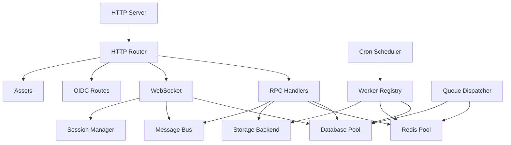

# Penpot Backend Architecture - Deep Dive

## Overview

The Penpot backend is a Clojure application built with the Integrant component lifecycle system. It provides a REST/RPC API, WebSocket real-time collaboration, and background job processing.

## Core Architecture

### Integrant System

The backend uses Integrant for dependency injection and component lifecycle management:

```clojure
(def system-config
  {::db/pool
   {::db/uri        (cf/get :database-uri)
    ::db/username   (cf/get :database-username)
    ::db/password   (cf/get :database-password)
    ::db/min-size   (cf/get :database-min-pool-size 0)
    ::db/max-size   (cf/get :database-max-pool-size 60)
    ::mtx/metrics   (ig/ref ::mtx/metrics)}

   ::http/server
   {::http/port                    (cf/get :http-server-port)
    ::http/router                  (ig/ref ::http/router)
    ::http/io-threads              (cf/get :http-server-io-threads)
    ::mtx/metrics                  (ig/ref ::mtx/metrics)}

   ::rds/client
   {::rds/uri (cf/get :redis-uri)
    ::wrk/netty-executor (ig/ref ::wrk/netty-executor)}

   ::mbus/msgbus
   {::wrk/executor (ig/ref ::wrk/netty-executor)
    ::rds/client   (ig/ref ::rds/client)
    ::mtx/metrics  (ig/ref ::mtx/metrics)}})
```

### Component Dependencies



## HTTP Layer

### Yetti Server

The HTTP server uses Yetti (Netty-based):

```clojure
::http/server
{:port                    3448
 :host                    "0.0.0.0"
 :router                  (ig/ref ::http/router)
 :io-threads              4
 :max-worker-threads      200
 :max-body-size           (* 50 1024 1024)  ; 50MB
 :max-multipart-body-size (* 100 1024 1024)}
```

### Router Configuration

```clojure
:app.http/router
{::session/manager    (ig/ref ::session/manager)
 ::db/pool            (ig/ref ::db/pool)
 ::rpc/routes         (ig/ref ::rpc/routes)
 ::rpc.doc/routes     (ig/ref ::rpc.doc/routes)
 ::oidc/routes        (ig/ref ::oidc/routes)
 ::mgmt/routes        (ig/ref ::mgmt/routes)
 ::http.debug/routes  (ig/ref ::http.debug/routes)
 ::http.assets/routes (ig/ref ::http.assets/routes)
 ::http.ws/routes     (ig/ref ::http.ws/routes)
 ::http.awsns/routes  (ig/ref ::http.awsns/routes)}
```

## RPC System

### RPC Handler

```clojure
(defn rpc-handler
  [methods {:keys [params path-params method] :as request}]
  (let [handler-name (:type path-params)
        profile-id   (or (::session/profile-id request)
                         (::actoken/profile-id request))

        data         (-> params
                         (assoc ::handler-name handler-name)
                         (assoc ::profile-id profile-id)
                         (assoc ::session/id (::session/id request)))]

    (handler-fn data)))
```

### RPC Middleware

| Middleware | Purpose |
|------------|---------|
| `wrap-authentication` | Requires valid session/profile |
| `wrap-permissions` | Checks resource permissions |
| `wrap-metrics` | Records timing metrics |
| `wrap-climit` | Concurrency limiting |
| `wrap-rlimit` | Rate limiting |
| `wrap-cond` | Conditional requests (ETag) |
| `wrap-audit` | Audit logging |

### RPC Commands Structure

```
backend/src/app/rpc/commands/
├── access_token.clj    # API token management
├── audit.clj           # Audit log queries
├── auth.clj            # Authentication (login, register, recovery)
├── binfile.clj         # Binary file format handling
├── comments.clj        # Comment operations
├── files.clj           # File CRUD, duplicate, move
├── files_create.clj    # File creation logic
├── files_share.clj     # Share/publish files
├── files_snapshot.clj  # File snapshots
├── files_thumbnails.clj# Thumbnail generation
├── files_update.clj    # File update with sync
├── fonts.clj           # Font management
├── ldap.clj            # LDAP authentication
├── management.clj      # Admin APIs
├── media.clj           # Media/file uploads
├── profile.clj         # User profile operations
├── projects.clj        # Project CRUD
├── search.clj          # Search functionality
├── teams.clj           # Team management
├── teams_invitations.clj # Team invites
├── verify_token.clj    # Token verification
├── viewer.clj          # Viewer mode APIs
└── webhooks.clj        # Webhook management
```

### File Update Flow (Complex RPC)

```clojure
(defmethod rpc/commands :update-file
  [{:keys [::rpc/profile-id ::data] :as ctx}]
  (rpc/execute
   (rpc/check-permissions profile-id :write data)

   ;; 1. Get current file state
   (db/get-file-by-id (:file-id data))

   ;; 2. Validate changes
   (validate-file-changes changes)

   ;; 3. Acquire lock (Redis)
   (redis/lock (str "file:" (:file-id data)))

   ;; 4. Apply changes with optimistic concurrency
   (files-update/apply-changes file changes
     {:cond/key (:if-match ctx)})

   ;; 5. Broadcast to connected clients
   (msgbus/publish! :file/updated
     {:file-id (:file-id data)
      :changes changes
      :profile-id profile-id})

   ;; 6. Queue background tasks
   (worker/enqueue! :file-gc {:file-id (:file-id data)})

   ;; 7. Audit log
   (audit/log! :file/updated profile-id data)))
```

## WebSocket System

### WebSocket Routes

```clojure
::http.ws/routes
{::db/pool         (ig/ref ::db/pool)
 ::mtx/metrics     (ig/ref ::mtx/metrics)
 ::mbus/msgbus     (ig/ref ::mbus/msgbus)
 ::session/manager (ig/ref ::session/manager)}
```

### Message Bus (Redis Pub/Sub)

```clojure
::mbus/msgbus
{::wrk/executor (ig/ref ::wrk/netty-executor)
 ::rds/client   (ig/ref ::rds/client)
 ::mtx/metrics  (ig/ref ::mtx/metrics)}
```

**Channels:**
- `:file/{id}/updated` - File change broadcasts
- `:file/{id}/comments` - Comment updates
- `:profile/{id}/notifications` - User notifications

### WebSocket Message Types

```clojure
;; Client → Server
{:op :sync-file
 :file-id uuid
 :version 42
 :changes [{:type :create :shape-id uuid ...}]}

;; Server → Client
{:op :sync-response
 :file-id uuid
 :version 43
 :changes [{:type :create :shape-id uuid ...}]}
```

## Database Layer

### Connection Pool

```clojure
::db/pool
{::db/uri        (cf/get :database-uri)
 ::db/username   (cf/get :database-username)
 ::db/password   (cf/get :database-password)
 ::db/min-size   0
 ::db/max-size   60
 ::db/read-only  false}
```

### Key Tables

| Table | Purpose |
|-------|---------|
| `profiles` | User accounts |
| `files` | Design files |
| `file_versions` | Version history |
| `projects` | Project containers |
| `teams` | Team/organization |
| `comments` | Comments on shapes |
| `media` | Uploaded assets |
| `objects` | Binary large objects |
| `audit_log` | Audit events |

### next.jdbc Usage

```clojure
(defn get-file-by-id [db pool file-id]
  (db/get-one pool
    [:select [:f/*] [:p/name :project-name]]
    [:from [:files :f]]
    [:join [:projects :p] [:= :f/project-id :p/id]]
    [:where [:= :f/id file-id]]))
```

## Storage System

### Storage Backends

```clojure
::sto/storage
{::db/pool      (ig/ref ::db/pool)
 ::sto/backends
 {:s3 (ig/ref :app.storage.s3/backend)
  :fs (ig/ref :app.storage.fs/backend)
  ;; Legacy aliases
  :assets-s3 (ig/ref :app.storage.s3/backend)
  :assets-fs (ig/ref :app.storage.fs/backend)}}
```

### S3 Backend

```clojure
:app.storage.s3/backend
{::sto.s3/region     (cf/get :storage-assets-s3-region)
 ::sto.s3/endpoint   (cf/get :storage-assets-s3-endpoint)
 ::sto.s3/bucket     (cf/get :storage-assets-s3-bucket)
 ::sto.s3/io-threads 4
 ::wrk/netty-io-executor (ig/ref ::wrk/netty-io-executor)}
```

### Filesystem Backend

```clojure
:app.storage.fs/backend
{::sto.fs/directory (cf/get :storage-assets-fs-directory)}
```

## Background Workers

### Worker Registry

```clojure
::wrk/registry
{::wrk/tasks
 {:sendmail           (ig/ref ::email/handler)
  :objects-gc         (ig/ref :app.tasks.objects-gc/handler)
  :file-gc            (ig/ref :app.tasks.file-gc/handler)
  :storage-gc-deleted (ig/ref ::sto.gc-deleted/handler)
  :storage-gc-touched (ig/ref ::sto.gc-touched/handler)
  :session-gc         (ig/ref ::session.tasks/gc)
  :audit-log-archive  (ig/ref :app.loggers.audit.archive-task/handler)
  :process-webhook-event (ig/ref ::webhooks/process-event-handler)
  :run-webhook        (ig/ref ::webhooks/run-webhook-handler)}}
```

### Cron Schedule

```clojure
::wrk/cron
{::wrk/entries
 [{:cron #penpot/cron "0 0 0 * * ?"  ; daily
   :task :session-gc}

  {:cron #penpot/cron "0 0 0 * * ?"  ; daily
   :task :objects-gc}

  {:cron #penpot/cron "0 0 0 * * ?"  ; daily
   :task :storage-gc-deleted}

  {:cron #penpot/cron "0 30 */3,23 * * ?"
   :task :telemetry}

  {:cron #penpot/cron "0 */5 * * * ?"  ; every 5m
   :task :audit-log-archive}]}
```

### Queue Dispatcher

```clojure
::wrk/dispatcher
{::rds/client  (ig/ref ::rds/client)
 ::mtx/metrics (ig/ref ::mtx/metrics)
 ::db/pool     (ig/ref ::db/pool)
 ::wrk/tenant  (cf/get :tenant)}
```

**Queues:**
- `:default` - Standard background jobs
- `:webhooks` - Webhook delivery (separate concurrency)

## Authentication

### OIDC Providers

```clojure
::oidc/routes
{::http.client/client (ig/ref ::http.client/client)
 ::db/pool            (ig/ref ::db/pool)
 ::session/manager    (ig/ref ::session/manager)
 ::oidc/providers
 {:google  (ig/ref ::oidc.providers/google)
  :github  (ig/ref ::oidc.providers/github)
  :gitlab  (ig/ref ::oidc.providers/gitlab)
  :oidc    (ig/ref ::oidc.providers/generic)}}
```

### LDAP Provider

```clojure
::ldap/provider
{:host           (cf/get :ldap-host)
 :port           (cf/get :ldap-port)
 :ssl            (cf/get :ldap-ssl)
 :tls            (cf/get :ldap-starttls)
 :query          (cf/get :ldap-user-query)
 :base-dn        (cf/get :ldap-base-dn)
 :bind-dn        (cf/get :ldap-bind-dn)
 :bind-password  (cf/get :ldap-bind-password)
 :enabled        (contains? cf/flags :login-with-ldap)}
```

### Session Management

```clojure
::session/manager
{::db/pool (ig/ref ::db/pool)}

::session.tasks/gc
{::db/pool (ig/ref ::db/pool)}  ; Daily GC
```

## Metrics (Prometheus)

### Defined Metrics

```clojure
:rpc-mutation-timing
{::mdef/name "penpot_rpc_mutation_timing"
 ::mdef/labels ["name"]
 ::mdef/type :histogram}

:websocket-active-connections
{::mdef/name "penpot_websocket_active_connections"
 ::mdef/type :gauge}

:rpc-climit-queue
{::mdef/name "penpot_rpc_climit_queue"
 ::mdef/labels ["name"]
 ::mdef/type :gauge}
```

## Configuration

### Environment Variables

| Variable | Default | Description |
|----------|---------|-------------|
| `HTTP_PORT` | 3448 | Backend HTTP port |
| `NREPL_PORT` | 6064 | nREPL server port |
| `DATABASE_URI` | - | PostgreSQL connection |
| `REDIS_URI` | - | Redis connection |
| `SECRET_KEY` | - | Signing key |
| `TENANT` | default | Multi-tenant ID |

### Feature Flags

| Flag | Description |
|------|-------------|
| `:login-with-ldap` | Enable LDAP auth |
| `:login-with-oidc` | Enable OIDC auth |
| `:rpc-climit` | Enable concurrency limiting |
| `:backend-worker` | Enable worker mode |
| `:audit-log-archive` | Enable audit archiving |
| `:audit-log-gc` | Enable audit GC |

## REPL Development

### Start nREPL

```bash
# With :nrepl-server flag
clojure -M:run -m app.main
# nREPL on port 6064
```

### Common REPL Commands

```clojure
(require '[app.main :as main])

;; Restart system
(main/restart)

;; Run tests
(main/run-tests)

;; Run specific test
(main/run-tests 'backend-test.rpc/files-test)
```
