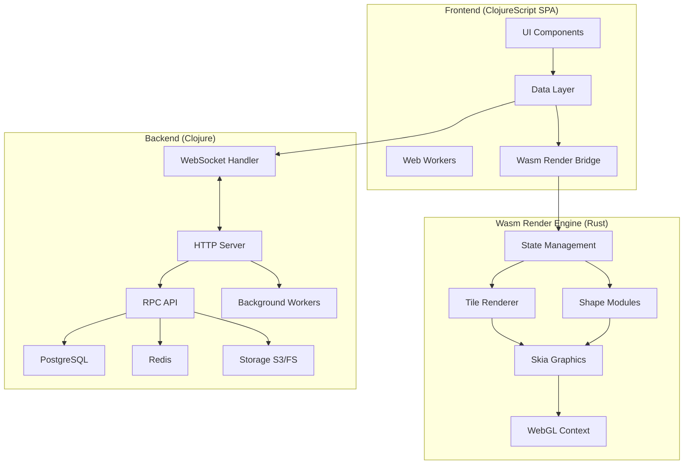
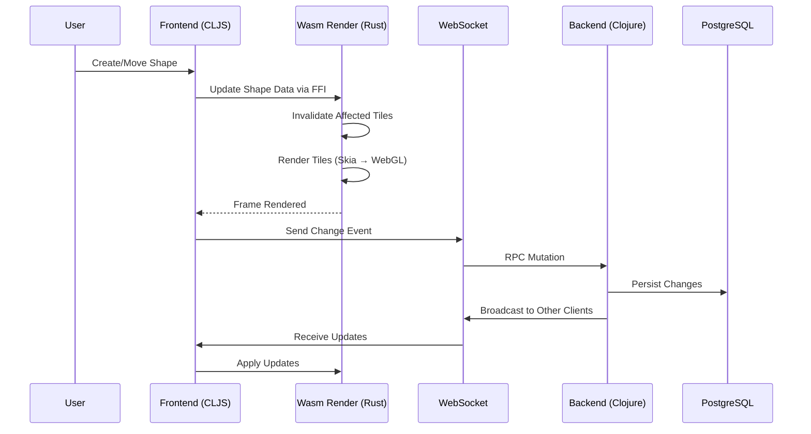

# Project Exploration: Penpot

## Deep Dive Documents

For detailed architecture and implementation details, see:

- **[Wasm Render Engine Deep Dive](./wasm-render-deep-dive.md)** - Complete guide to the Rust/Wasm rendering system
- **[Backend Deep Dive](./backend-deep-dive.md)** - Backend architecture, RPC system, and worker patterns
- **[Frontend Deep Dive](./frontend-deep-dive.md)** - ClojureScript SPA, FRP stack, and component architecture

---

## Overview

Penpot is the first open-source design tool for design and code collaboration. It enables designers to create stunning designs, interactive prototypes, and design systems at scale, while developers get ready-to-use code with a smooth workflow. The platform is available both as a SaaS offering and self-hosted deployment.

Key differentiators:
- **Open Source**: MPL 2.0 licensed, deployment agnostic
- **Design Tokens**: Native support for design tokens as a single source of truth
- **CSS Grid Layout**: Full CSS Grid support for responsive designs
- **Wasm-based Rendering**: High-performance canvas rendering using Rust compiled to WebAssembly
- **Real-time Collaboration**: Multi-user editing with WebSocket-based synchronization

## Repository

- **Location:** `/home/darkvoid/Boxxed/@formulas/src.AppOSS/src.penpot/penpot`
- **Remote:** git@github.com:penpot/penpot
- **Primary Language:** Clojure (backend), ClojureScript (frontend), Rust (Wasm renderer)
- **License:** MPL 2.0

## Directory Structure

```
penpot/
├── backend/              # Clojure backend API server
│   ├── src/app/
│   │   ├── auth/         # Authentication (LDAP, OIDC)
│   │   ├── binfile/      # Binary file format handlers (v1, v2, v3)
│   │   ├── db/           # Database layer (PostgreSQL, SQLite)
│   │   ├── email/        # Email handling
│   │   ├── features/     # Feature modules (fdata, snapshots, migrations)
│   │   ├── http/         # HTTP handlers and middleware
│   │   ├── loggers/      # Audit and mattermost logging
│   │   ├── migrations/   # Database migrations
│   │   ├── rpc/          # RPC API endpoints
│   │   ├── srepl/        # Secure REPL for administration
│   │   ├── storage/      # Storage backends (S3, filesystem)
│   │   ├── tasks/        # Background task handlers
│   │   └── worker/       # Background job processing
│   ├── deps.edn          # Clojure dependencies
│   └── package.json      # Node dependencies
│
├── frontend/             # ClojureScript SPA
│   ├── src/app/
│   │   ├── main/         # Main application UI
│   │   │   ├── data/     # Data layer (auth, changes, comments, etc.)
│   │   │   └── ui/       # UI components (dashboard, workspace, viewer)
│   │   ├── plugins/      # Plugin system
│   │   ├── render_wasm/  # Wasm render integration
│   │   ├── util/         # Utilities
│   │   └── worker/       # Web workers
│   ├── shadow-cljs.edn   # Build configuration
│   └── package.json
│
├── render-wasm/          # Rust Wasm render engine (SKIA-based)
│   ├── src/
│   │   ├── emscripten.rs # Emscripten FFI bindings
│   │   ├── main.rs       # Wasm entry point and exported functions
│   │   ├── math.rs       # Math primitives (Bounds, Matrix)
│   │   ├── mem.rs        # Memory management for JS interop
│   │   ├── options.rs    # Render options
│   │   ├── performance.rs# Performance tracking
│   │   ├── render/       # Rendering modules
│   │   │   ├── debug.rs
│   │   │   ├── fills.rs
│   │   │   ├── filters.rs
│   │   │   ├── fonts.rs
│   │   │   ├── gpu_state.rs
│   │   │   ├── grid_layout.rs
│   │   │   ├── images.rs
│   │   │   ├── options.rs
│   │   │   ├── shadows.rs
│   │   │   ├── strokes.rs
│   │   │   ├── surfaces.rs
│   │   │   ├── text.rs
│   │   │   └── ui.rs
│   │   ├── shapes/       # Shape rendering modules
│   │   │   ├── blend.rs
│   │   │   ├── blurs.rs
│   │   │   ├── bools.rs
│   │   │   ├── corners.rs
│   │   │   ├── fills.rs
│   │   │   ├── fonts.rs
│   │   │   ├── frames.rs
│   │   │   ├── groups.rs
│   │   │   ├── layouts.rs
│   │   │   ├── modifiers/
│   │   │   ├── paths/
│   │   │   ├── rects.rs
│   │   │   ├── shadows.rs
│   │   │   ├── shape_to_path.rs
│   │   │   ├── strokes.rs
│   │   │   ├── svgraw.rs
│   │   │   ├── text.rs
│   │   │   ├── text_paths.rs
│   │   │   └── transform.rs
│   │   ├── state.rs      # Global Wasm state management
│   │   ├── tiles.rs      # Tile rendering system
│   │   ├── view.rs       # Viewport/Viewbox management
│   │   ├── wapi.rs       # Wasm API helpers
│   │   ├── wasm/         # Wasm utilities
│   │   └── wasm.rs
│   ├── Cargo.toml        # Rust dependencies
│   ├── build.rs          # Emscripten build script
│   └── docs/             # Technical documentation
│       ├── serialization.md
│   └── tile_rendering.md
│
├── common/               # Shared Clojure/ClojureScript code
│   └── src/app/          # Common types, specs, utilities
│
├── exporter/             # Export functionality (Clojure/ClojureScript)
│
├── library/              # Design library components
│
├── experiments/          # Experimental features
│   └── js/
│   └── play.html
│   └── scripts/
│
├── docker/               # Docker deployment configs
├── docs/                 # Documentation
├── manage.sh             # Development management script
├── deps.edn              # Root Clojure deps (for clojure-lsp)
└── package.json          # Root package.json
```

## Architecture

### High-Level Diagram



### Component Breakdown

> **Note:** Each component below has a corresponding deep dive document with detailed implementation information.

#### Backend

**Deep Dive:** See [backend-deep-dive.md](./backend-deep-dive.md) for complete architecture details.

- **Location:** `backend/`
- **Purpose:** API server, data persistence, business logic, real-time collaboration
- **Key Technologies:** Clojure, Integrant (dependency injection), Yetti (HTTP server), PostgreSQL, Redis
- **Dependencies:** PostgreSQL (data), Redis (pub/sub, caching), S3/FS (file storage)
- **Dependents:** Frontend, Workers

Key modules:
- `app.http` - HTTP server using Yetti (Netty-based)
- `app.http.websocket` - Real-time collaboration via WebSockets
- `app.rpc` - RPC endpoints for mutations and queries
- `app.db` - Database connection pooling (HikariCP)
- `app.msgbus` - Message bus using Redis pub/sub
- `app.worker` - Background job processing with Redis queues

#### Frontend

**Deep Dive:** See [frontend-deep-dive.md](./frontend-deep-dive.md) for complete architecture details.

- **Location:** `frontend/`
- **Purpose:** Design canvas, UI components, user interaction, collaboration
- **Key Technologies:** ClojureScript, shadow-cljs, Rumext (React-like), Potok (FRP)
- **Dependencies:** Backend WebSocket, Wasm Render Module
- **Dependents:** None (client-side)

Key modules:
- `app.main.ui` - Main UI components (workspace, dashboard, viewer)
- `app.main.data` - Data layer with FRP (Functional Reactive Programming)
- `app.render-wasm` - Bridge to Wasm render engine
- `app.worker` - Web workers for background processing

#### Wasm Render Engine

**Deep Dive:** See [wasm-render-deep-dive.md](./wasm-render-deep-dive.md) for complete implementation details.

- **Location:** `render-wasm/`
- **Purpose:** High-performance canvas rendering using Skia graphics library
- **Key Technologies:** Rust, Emscripten, Skia, WebGL
- **Compilation Target:** `wasm32-unknown-emscripten`
- **Dependencies:** Skia (graphics), glam (math), bezier-rs (curves)

Key modules:
- `main.rs` - Wasm exports (C FFI for JS interop)
- `state.rs` - Global Wasm state with shape hierarchy
- `tiles.rs` - Tile-based progressive rendering
- `render/` - Skia-based rendering (fills, strokes, shadows, text, filters)
- `shapes/` - Shape-specific rendering logic

#### Common
- **Location:** `common/`
- **Purpose:** Shared types, specs, utilities between frontend and backend
- **Key Technologies:** Clojure/ClojureScript

## Entry Points

### Backend Server
- **File:** `backend/src/app/main.clj`
- **Description:** Starts the HTTP/WebSocket server using Integrant
- **Flow:**
  1. Load configuration from `app.config`
  2. Initialize Integrant system with all modules
  3. Start HTTP server (default port 3448)
  4. Initialize database connection pool
  5. Start Redis client and message bus
  6. Initialize background workers
  7. Optionally start nREPL server (port 6064)

### Frontend App
- **File:** `frontend/src/app/main.cljs`
- **Description:** Initializes the SPA, connects to backend via WebSocket
- **Flow:**
  1. Initialize logging
  2. Set up i18n translations
  3. Initialize web workers
  4. Initialize Wasm render engine (if enabled)
  5. Create root UI component
  6. Emit initialize event (loads profile, establishes WebSocket)
  7. Render application

### Wasm Render Engine
- **File:** `render-wasm/src/main.rs`
- **Description:** Canvas rendering via WebGL/Skia
- **Initialization:**
  1. Called from JS via `init(width, height)`
  2. Creates Skia surfaces with WebGL context
  3. Initializes tile system and shape pools
- **Main Loop:** `process_animation_frame(timestamp)` called per frame

## Data Flow



## External Dependencies

### Backend (Clojure)
| Dependency | Purpose |
|------------|---------|
| integrant | Component lifecycle management |
| yetti | HTTP server (Netty-based) |
| next.jdbc | Database access |
| HikariCP | Connection pooling |
| reitit | Routing |
| buddy | Authentication/authorization |
| lettuce | Redis client |
| prometheus | Metrics |

### Frontend (ClojureScript)
| Dependency | Purpose |
|------------|---------|
| shadow-cljs | Build tool |
| rumext | UI framework (React-like) |
| potok | FRP library |
| beikon | Reactive streams |

### Wasm Render (Rust)
| Dependency | Purpose |
|------------|---------|
| skia-safe | 2D graphics rendering |
| glam | Math library (vectors, matrices) |
| bezier-rs | Bezier curve operations |
| gl | OpenGL bindings |
| uuid | UUID generation |

### Infrastructure
| Service | Purpose |
|---------|---------|
| PostgreSQL | Primary data store |
| Redis | Pub/sub, caching, job queues |
| S3 / Filesystem | Asset storage (images, exports) |

## Configuration

### Environment Variables
- `HTTP_PORT` - Backend HTTP port (default: 3448)
- `NREPL_PORT` - nREPL server port (default: 3447)
- `DEV_PORT` - Development server port (default: 8888)
- `DATABASE_URI` - PostgreSQL connection string
- `REDIS_URI` - Redis connection string
- `SECRET_KEY` - Encryption/signing key

### Feature Flags
- `enable-feature-render-wasm` - Enable Wasm-based rendering
- `enable-render-wasm-dpr` - Use device pixel ratio in Wasm renderer
- `:login-with-ldap` - Enable LDAP authentication
- `:rpc-climit` - Enable RPC concurrency limiting
- `:backend-worker` - Enable background worker mode
- `:audit-log-archive` / `:audit-log-gc` - Audit log features

### Build Configuration
- `shadow-cljs.edn` - Frontend build with module code-splitting
- `Cargo.toml` - Wasm build with Skia integration
- `deps.edn` - Clojure dependency management

## Testing

### Backend Tests
- Framework: Kaocha
- Run: `cd backend && clojure -M:test`
- Location: `backend/test/`

### Frontend Tests
- Framework: Custom test runner with shadow-cljs
- Run: `cd frontend && npm run test`
- Location: `frontend/test/`

### Wasm Tests
- Unit tests: `cd render-wasm && ./test`
- Visual regression tests: See `render-wasm/docs/visual_regression_tests.md`

### Playwright E2E Tests
- Location: `frontend/playwright/`
- Config: `frontend/playwright.config.js`

## Key Insights

### Wasm Architecture
1. **Tile-Based Rendering**: Canvas is divided into 512x512 tiles, rendered progressively
2. **Cache Strategy**: Rendered tiles cached as Skia images, invalidated only on change
3. **FFI Design**: Uses Emscripten's C ABI - shapes serialized as byte arrays
4. **Shape Pool**: Pre-allocated shape capacity to avoid GC pressure
5. **Skia Integration**: Uses custom Skia binaries via rust-skia crate

### Serialization Protocol
- Shape types: `u8` enum (0=Frame, 1=Group, 2=Bool, 3=Rect, 4=Path, 5=Text, 6=Circle, 7=SvgRaw, 8=Image)
- Transforms: 6 `f32` values (2D affine matrix)
- Paths: 28-byte segments (command, flags, c1, c2, x, y)
- Fills: 160 bytes (solid, gradient, image)
- UUIDs: 16 bytes (u32 quartet)

### Backend Architecture
1. **Integrant Pattern**: All components are Integrant keys with explicit dependencies
2. **Message Bus**: Redis-based pub/sub for cross-backend communication
3. **Worker System**: Redis queues with cron-scheduled tasks
4. **RPC Layer**: All API calls go through typed RPC with rate limiting

### Frontend Architecture
1. **FRP Stack**: Potok for state machines, Beikon for reactive streams
2. **Module Splitting**: shadow-cljs code-splits into shared, main, workspace, dashboard, etc.
3. **Wasm Bridge**: render-wasm namespace provides FFI wrapper for Rust functions

## Open Questions

1. **Binfile Format**: What is the exact structure of v1/v2/v3 binary file formats?
2. **Shape Bool Operations**: How are boolean operations on paths computed in Wasm?
3. **WebSocket Protocol**: What is the exact message format for real-time sync?
4. **Migration Path**: How are database migrations versioned and applied?
5. **Plugin System**: How does the plugin sandboxing work?
6. **Font Handling**: How are custom fonts loaded and cached in Wasm?
7. **Export Pipeline**: How does the exporter generate SVG/PNG/PDF from shapes?
