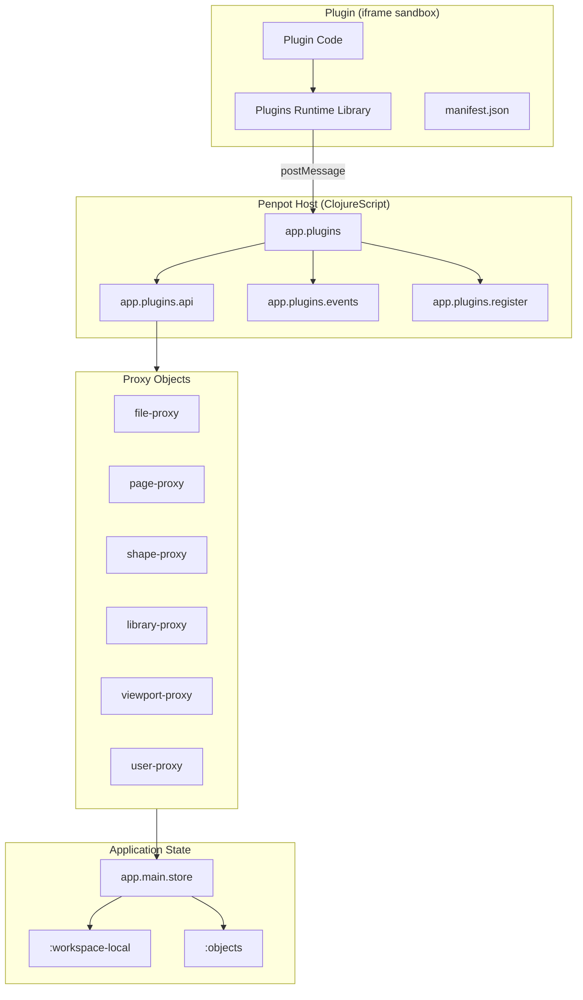

# Penpot Wasm Plugin System - Deep Dive

## Overview

Penpot's plugin system enables third-party extensions to interact with the design canvas, shapes, libraries, and file data through a JavaScript/TypeScript API. Plugins run in sandboxed iframes and communicate with the main application via a message-passing protocol.

**Key Characteristics:**
- **Runtime Package**: `@penpot/plugins-runtime` (v1.3.2)
- **Sandbox Model**: Iframe-based isolation with origin validation
- **Communication**: PostMessage-based protocol between plugin iframe and Penpot host
- **API Surface**: ClojureScript-backed proxy objects exposing file, shape, library, and viewport operations
- **Permission System**: Manifest-declared permissions with automatic read permission inference

## Architecture

### High-Level Diagram



### Message Protocol

**Plugin → Host:**
```javascript
// From @penpot/plugins-runtime
parent.postMessage({
  type: "penpot:request",
  id: "uuid",
  method: "createRectangle",
  args: []
}, targetOrigin);
```

**Host → Plugin:**
```javascript
// From app.plugins
pluginFrame.contentWindow.postMessage({
  type: "penpot:response",
  id: "uuid",
  result: {...}
}, pluginOrigin);
```

## Plugin Runtime Initialization

### Entry Point

```clojure
;; frontend/src/app/plugins.cljs
(ns app.plugins
  (:require
   ["@penpot/plugins-runtime" :as runtime]
   [app.plugins.api :as api]))

(defn init-plugins-runtime!
  []
  (runtime/initPluginsRuntime
    (fn [plugin-id]
      (api/create-context plugin-id))))
```

The runtime library (`@penpot/plugins-runtime`) exposes `initPluginsRuntime`, which receives a callback that returns the plugin API context object for each plugin instance.

### Feature-Gated Loading

```clojure
(defn initialize []
  (ptk/reify ::initialize
    ptk/WatchEvent
    (watch [_ _ stream]
      (->> stream
           (rx/filter (ptk/type? ::features/initialize))
           (rx/observe-on :async)
           (rx/filter #(features/active-feature? @st/state "plugins/runtime"))
           (rx/take 1)
           (rx/tap init-plugins-runtime!)
           (rx/ignore)))))
```

The plugin runtime only initializes when the `plugins/runtime` feature flag is active.

## Plugin API Context

### Context Creation

```clojure
;; frontend/src/app/plugins/api.cljs
(defn create-context
  [plugin-id]
  (obj/reify {:name "PenpotContext"}
    ;; Private properties
    :$plugin {:enumerable false :get (fn [] plugin-id)}

    ;; Public properties
    :root
    {:this true
     :get #(.getRoot ^js %)}

    :currentFile
    {:this true
     :get #(.getFile ^js %)}

    :currentPage
    {:this true
     :get #(.getPage ^js %)}

    :theme
    {:this true
     :get #(.getTheme ^js %)}

    :localStorage
    {:this true
     :get (fn [_] (local-storage/local-storage-proxy plugin-id))}

    :selection
    {:this true
     :get #(.getSelectedShapes ^js %)
     :set
     (fn [_ shapes]
       (let [ids (into (d/ordered-set) (map #(obj/get % "$id")) shapes)]
         (st/emit! (dws/select-shapes ids))))}

    :viewport
    {:this true
     :get #(.getViewport ^js %)}

    :currentUser
    {:this true
     :get #(.getCurrentUser ^js %)}

    :activeUsers
    {:this true
     :get #(.getActiveUsers ^js %)}

    :fonts
    {:get (fn [] (fonts/fonts-subcontext plugin-id))}

    :library
    {:get (fn [] (library/library-subcontext plugin-id))}

    :history
    {:get (fn [] (history/history-subcontext plugin-id))}

    ;; Methods
    :addListener
    (fn [type callback props]
      (events/add-listener type plugin-id callback props))

    :removeListener
    (fn [listener-id]
      (events/remove-listener listener-id))

    ;; ... 40+ additional methods
    ))
```

### API Surface Breakdown

| Category | Properties/Methods |
|----------|-------------------|
| **Navigation** | `root`, `currentFile`, `currentPage`, `openPage()`, `openViewer()` |
| **Selection** | `selection` (get/set), `getSelectedShapes()` |
| **Viewport** | `viewport`, `getViewport()` |
| **Users** | `currentUser`, `activeUsers`, `getCurrentUser()`, `getActiveUsers()` |
| **Storage** | `localStorage`, `getPluginData()`, `setPluginData()`, `getSharedPluginData()`, `setSharedPluginData()` |
| **Library** | `library` (colors, typographies, components) |
| **History** | `history` (undo/redo) |
| **Events** | `addListener()`, `removeListener()` |
| **Shapes** | `createRectangle()`, `createEllipse()`, `createPath()`, `createText()`, `createBoard()`, `createShapeFromSvg()`, `createBoolean()` |
| **Operations** | `group()`, `ungroup()`, `flatten()`, `alignHorizontal()`, `alignVertical()`, `distributeHorizontal()`, `distributeVertical()` |
| **Export** | `generateMarkup()`, `generateStyle()`, `generateFontFaces()` |
| **Media** | `uploadMediaUrl()`, `uploadMediaData()` |
| **Colors** | `shapesColors()`, `replaceColor()` |

## Proxy Object Pattern

The plugin system uses proxy objects extensively to provide controlled access to internal state. All proxies use `app.util.object/reify` for JavaScript interop.

### Shape Proxy

```clojure
;; frontend/src/app/plugins/shape.cljs
(defn shape-proxy
  [plugin-id file-id page-id id]
  (obj/reify {:name "ShapeProxy"}
    :$plugin {:enumerable false :get (fn [] plugin-id)}
    :$file   {:enumerable false :get (fn [] file-id)}
    :$page   {:enumerable false :get (fn [] page-id)}
    :$id     {:enumerable false :get (fn [] id)}

    ;; Identity
    :id
    {:get #(dm/str id)}

    :type
    {:get #(-> % u/proxy->shape :type dm/keyword->str)}

    :name
    {:this true
     :get #(-> % u/proxy->shape :name)
     :set
     (fn [_ value]
       (cond
         (not (r/check-permission plugin-id "content:write"))
         (u/display-not-valid :name "Plugin doesn't have 'content:write' permission")
         :else
         (st/emit! (dw/change-shape-name id value))))}

    ;; Hierarchy
    :parent
    {:this true
     :get #(when-let [parent-id (-> % u/proxy->shape :parent-id)]
             (shape-proxy plugin-id file-id page-id parent-id))}

    :children
    {:this true
     :get
     (fn [self]
       (let [shape (u/proxy->shape self)]
         (->> (:children shape)
              (format/format-array #(shape-proxy plugin-id file-id page-id %)))))}

    ;; Style
    :fill
    {:this true
     :get #(-> % u/proxy->shape :fill format/format-fill)
     :set
     (fn [_ value]
       ;; Permission check + emit change
       )}

    :stroke
    {:this true
     :get #(-> % u/proxy->shape :strokes first format/format-stroke)
     :set
     (fn [_ value] )}

    :shadows
    {:this true
     :get #(->> % u/proxy->shape :shadows (format/format-array identity))
     :set (fn [_ value] )}

    :blurs
    {:this true :get ... :set ...}

    ;; Layout
    :layout
    {:this true
     :get #(layout-proxy plugin-id file-id page-id id)}

    ;; Transforms
    :resize
    (fn [width height & [offset]]
      ;; Permission check + emit resize event
      )

    :rotate
    (fn [angle]
      ;; Permission check + emit rotate event
      )

    :flip
    (fn [direction]
      ;; direction: "horizontal" | "vertical"
      )

    ;; Layer ordering
    :bringToFront
    (fn []
      (st/emit! (dw/move-to-front id)))

    :sendToBack
    (fn []
      (st/emit! (dw/move-to-back id)))

    ;; Lifecycle
    :remove
    (fn []
      (st/emit! (dw/delete-shapes #{id})))

    :duplicate
    (fn []
      (let [new-id (uuid/next)]
        (st/emit! (dw/duplicate-shapes file-id page-id id new-id))
        (shape-proxy plugin-id file-id page-id new-id)))

    ;; Plugin data
    :getPluginData
    (fn [key]
      (dm/get-in (u/proxy->shape self) [:plugin-data (keyword "plugin" (str plugin-id)) key]))

    :setPluginData
    (fn [key value]
      (st/emit! (dp/set-plugin-data file-id :shape id (keyword "plugin" (str plugin-id)) key value)))

    ;; Interactions
    :interactions
    {:this true
     :get #(->> % u/proxy->shape :interactions (format/format-array #(interaction-proxy ...)))}

    ;; Library
    :libraryComponent
    {:this true
     :get #(when-let [component-id (-> % u/proxy->shape :component-id)]
             (library/lib-component-proxy plugin-id file-id component-id))}
    ))
```

### File Proxy

```clojure
;; frontend/src/app/plugins/file.cljs
(defn file-proxy
  [plugin-id id]
  (obj/reify {:name "FileProxy"}
    :$plugin {:enumerable false :get (fn [] plugin-id)}
    :$id     {:enumerable false :get (fn [] id)}

    :id
    {:get #(format/format-id id)}

    :name
    {:get #(-> (u/locate-file id) :name)}

    :pages
    {:this true
     :get #(.getPages ^js %)}

    :getPages
    (fn []
      (let [file (u/locate-file id)]
        (apply array (map #(page/page-proxy plugin-id id %) (dm/get-in file [:data :pages])))))

    :createPage
    (fn []
      (let [page-id (uuid/next)]
        (st/emit! (dw/create-page {:page-id page-id :file-id id}))
        (page/page-proxy plugin-id id page-id)))

    ;; Plugin data
    :getPluginData
    (fn [key]
      (dm/get-in (u/locate-file id) [:data :plugin-data (keyword "plugin" (str plugin-id)) key]))

    :setPluginData
    (fn [key value]
      (st/emit! (dp/set-plugin-data id :file (keyword "plugin" (str plugin-id)) key value)))

    ;; Shared plugin data (cross-plugin namespace)
    :getSharedPluginData
    (fn [namespace key]
      (dm/get-in (u/locate-file id) [:data :plugin-data (keyword "shared" namespace) key]))

    :setSharedPluginData
    (fn [namespace key value]
      (st/emit! (dp/set-plugin-data id :file (keyword "shared" namespace) key value)))

    ;; Export
    :export
    (fn [format type]
      ;; format: "penpot" | "zip"
      ;; type: :all | :selected
      (js/Promise.
       (fn [resolve reject]
         ;; Uses web worker for export
         (mw/ask-many! {:cmd :export-files ...})
         ...)))

    ;; Version history
    :saveVersion
    (fn [label]
      (js/Promise.
       (fn [resolve reject]
         (st/emit! (dwv/create-version-from-plugins id label resolve reject))
         ...)))

    :findVersions
    (fn [criteria]
      ;; criteria: {:createdBy user-proxy}
      (js/Promise.
       (fn [resolve reject]
         (->> (rp/cmd! :get-file-snapshots {:file-id id})
              (rx/subs! #(resolve (map ...(file-version-proxy ...)))))))))
```

### Page Proxy

```clojure
;; frontend/src/app/plugins/page.cljs
(defn page-proxy
  [plugin-id file-id id]
  (obj/reify {:name "PageProxy"}
    :$plugin {:enumerable false :get (fn [] plugin-id)}
    :$file   {:enumerable false :get (fn [] file-id)}
    :$id     {:enumerable false :get (fn [] id)}

    :id
    {:get #(dm/str id)}

    :name
    {:this true
     :get #(-> % u/proxy->page :name)
     :set
     (fn [_ value]
       (st/emit! (dw/rename-page id value)))}

    :getRoot
    (fn []
      (shape/shape-proxy plugin-id file-id id uuid/zero))

    :background
    {:this true
     :get #(or (-> % u/proxy->page :background) cc/canvas)
     :set
     (fn [_ value]
       (st/emit! (dw/change-canvas-color id {:color value})))}

    :findShapes
    (fn [criteria]
      ;; criteria: {:name "..." :type "..."}
      (let [page (u/locate-page file-id id)
            xf (comp
                (filter match-criteria?)
                (map #(shape/shape-proxy plugin-id file-id id (first %))))]
        (apply array (sequence xf (:objects page)))))

    :getShapeById
    (fn [shape-id]
      (let [shape (u/locate-shape file-id id (uuid/parse shape-id))]
        (when (some? shape)
          (shape/shape-proxy plugin-id file-id id shape-id))))

    ;; Flows (prototype links)
    :flows
    {:this true
     :get
     (fn [self]
       (let [flows (d/nilv (-> (u/proxy->page self) :flows) [])]
         (->> (vals flows)
              (format/format-array #(flow-proxy plugin-id file-id id (:id %))))))}

    :createFlow
    (fn [name frame]
      (let [flow-id (uuid/next)]
        (st/emit! (dwi/add-flow flow-id id name (obj/get frame "$id")))
        (flow-proxy plugin-id file-id id flow-id)))

    ;; Ruler guides
    :rulerGuides
    {:this true
     :get
     (fn [self]
       (let [guides (-> (u/proxy->page self) :guides)]
         (->> guides
              (filter #(nil? (:frame-id %)))
              (format/format-array #(rg/ruler-guide-proxy ...)))))}

    :addRulerGuide
    (fn [orientation value board]
      ;; orientation: "vertical" | "horizontal"
      (let [ruler-id (uuid/next)]
        (st/emit! (dwgu/update-guides {:id ruler-id :axis ... :position value}))
        (rg/ruler-guide-proxy plugin-id file-id id ruler-id)))

    ;; Comments
    :addCommentThread
    (fn [content position board]
      (js/Promise.
       (fn [resolve]
         (st/emit! (dc/create-thread-on-workspace {...}
                        #(resolve (pc/comment-thread-proxy ...)))))))

    :findCommentThreads
    (fn [criteria]
      ;; criteria: {:onlyYours true :showResolved false}
      (js/Promise.
       (fn [resolve reject]
         (->> (rp/cmd! :get-comment-threads {:file-id file-id})
              (rx/subs! #(resolve (format/format-array ...)))))))))
```

### Viewport Proxy

```clojure
;; frontend/src/app/plugins/viewport.cljs
(defn viewport-proxy
  [plugin-id]
  (obj/reify {:name "ViewportProxy"}
    :$plugin {:enumerable false :get (fn [] plugin-id)}

    :center
    {:get
     (fn []
       (let [vp (dm/get-in @st/state [:workspace-local :vbox])]
         (.freeze js/Object #js {:x (+ (:x vp) (/ (:width vp) 2))
                                 :y (+ (:y vp) (/ (:height vp) 2))})))
     :set
     (fn [value]
       ;; Delta-based viewport pan
       (let [vb (dm/get-in @st/state [:workspace-local :vbox])
             delta-x (- (obj/get value "x") (+ (:x vb) (/ (:width vb) 2)))
             delta-y (- (obj/get value "y") (+ (:y vb) (/ (:height vb) 2)))]
         (st/emit! (dwv/update-viewport-position {:x #(+ % delta-x)
                                                  :y #(+ % delta-y)}))))}

    :zoom
    {:get
     (fn []
       (dm/get-in @st/state [:workspace-local :zoom]))
     :set
     (fn [value]
       (let [z (dm/get-in @st/state [:workspace-local :zoom])]
         (st/emit! (dwz/set-zoom (/ value z)))))}

    :bounds
    {:get
     (fn []
       (let [vbox (dm/get-in @st/state [:workspace-local :vbox])]
         (.freeze js/Object (format/format-bounds vbox))))}

    :zoomReset
    (fn []
      (st/emit! dwz/reset-zoom))

    :zoomToFitAll
    (fn []
      (st/emit! dwz/zoom-to-fit-all))

    :zoomIntoView
    (fn [shapes]
      (let [ids (->> shapes (map #(obj/get % "$id")))]
        (st/emit! (dwz/fit-to-shapes ids))))))
```

### User Proxy

```clojure
;; frontend/src/app/plugins/user.cljs
(defn current-user-proxy
  [plugin-id session-id]
  (-> (obj/reify {:name "CurrentUserProxy"}
        :$plugin {:enumerable false :get (fn [] plugin-id)})
      (add-session-properties session-id)))

(defn active-user-proxy
  [plugin-id session-id]
  (-> (obj/reify {:name "ActiveUserProxy"}
        :$plugin {:enumerable false :get (fn [] plugin-id)}

        :position
        {:get (fn []
                (-> (u/locate-presence session-id) :point format/format-point))}

        :zoom
        {:get (fn []
                (-> (u/locate-presence session-id) :zoom))})
      (add-session-properties session-id)))

;; Shared properties
(defn- add-session-properties
  [user-proxy session-id]
  (crc/add-properties!
   user-proxy
   {:name "$session" :enumerable false :get (constantly session-id)}
   {:name "id" :get (fn [_] (-> (u/locate-profile session-id) :id str))}
   {:name "name" :get (fn [_] (-> (u/locate-profile session-id) :fullname))}
   {:name "avatarUrl" :get (fn [_] (cfg/resolve-profile-photo-url ...))}
   {:name "color" :get (fn [_] (-> (u/locate-presence session-id) :color))}
   {:name "sessionId" :get (fn [_] (str session-id))}))
```

### Library Proxy

```clojure
;; frontend/src/app/plugins/library.cljs
(defn library-subcontext
  [plugin-id]
  (obj/reify {:name "LibraryContext"}
    :colors
    {:get
     (fn []
       (obj/reify
        :getAll
        (fn []
          (let [file (u/locate-library-file)]
            (->> (:data :colors)
                 (format/format-array #(lib-color-proxy plugin-id (:id %))))))

        :create
        (fn [name color path]
          (cond
            (not (r/check-permission plugin-id "library:write"))
            (u/display-not-valid :create "Plugin doesn't have 'library:write' permission")
            :else
            (let [color-id (uuid/next)]
              (st/emit! (dwc/add-color color-id name color path))
              (lib-color-proxy plugin-id color-id)))))}

    :typographies
    {:get
     (fn []
       (obj/reify
        :getAll (fn [] ...)
        :create (fn [name typography] ...))}

    :components
    {:get
     (fn []
       (obj/reify
        :getAll (fn [] ...)
        :create (fn [name shape] ...)
        :import (fn [file-id component-id] ...)))}))
```

### Color Proxy

```clojure
;; frontend/src/app/plugins/library.cljs
(defn lib-color-proxy
  [plugin-id file-id id]
  (obj/reify {:name "LibraryColorProxy"}
    :$plugin {:enumerable false :get (fn [] plugin-id)}
    :$file   {:enumerable false :get (fn [] file-id)}
    :$id     {:enumerable false :get (fn [] id)}

    :id
    {:get #(format/format-id id)}

    :fileId
    {:get #(format/format-id file-id)}

    :name
    {:this true
     :get #(-> % u/proxy->lib-color :name)
     :set
     (fn [_ value]
       (st/emit! (dwc/update-color id {:name value})))}

    :path
    {:this true
     :get #(-> % u/proxy->lib-color :path)
     :set
     (fn [_ value]
       (st/emit! (dwc/update-color id {:path value})))}

    :color
    {:get #(-> % u/proxy->lib-color :color format/format-color)}

    :opacity
    {:get #(-> % u/proxy->lib-color :opacity)}

    :gradient
    {:get #(-> % u/proxy->lib-color :gradient format/format-gradient)}

    :image
    {:get #(-> % u/proxy->lib-color :image format/format-image)}

    :remove
    (fn []
      (st/emit! (dwc/remove-colors #{id})))

    :clone
    (fn [name]
      (let [new-id (uuid/next)]
        (st/emit! (dwc/clone-color id new-id name))
        (lib-color-proxy plugin-id file-id new-id)))

    :asFill
    (fn []
      (format/format-fill {:type :color :color-id id}))

    :asStroke
    (fn []
      (format/format-stroke {:type :color :color-id id}))))
```

## Event Listener System

### State Watch Pattern

```clojure
;; frontend/src/app/plugins/events.cljs
(defmulti handle-state-change
  "Multimethod for handling different state change events"
  (fn [event-type _old-state _new-state _plugin-id]
    event-type))

(defmethod handle-state-change "finish"
  [_event-type _old-state new-state plugin-id]
  ;; File close detection
  (when (and (contains? new-state :router)
             (not= "workspace" (:section new-state)))
    (notify-plugin plugin-id {:type "filechange" :fileId nil})))

(defmethod handle-state-change "filechange"
  [_event-type _old-state new-state plugin-id]
  ;; File switch
  (let [file-id (:current-file-id new-state)]
    (notify-plugin plugin-id {:type "filechange" :fileId (str file-id)})))

(defmethod handle-state-change "pagechange"
  [_event-type _old-state new-state plugin-id]
  ;; Page navigation
  (let [page-id (:current-page-id new-state)]
    (notify-plugin plugin-id {:type "pagechange" :pageId (str page-id)})))

(defmethod handle-state-change "selectionchange"
  [_event-type old-state new-state plugin-id]
  ;; Shape selection
  (let [old-sel (:selected (:workspace-local old-state))
        new-sel (:selected (:workspace-local new-state))]
    (when (not= old-sel new-sel)
      (notify-plugin plugin-id {:type "selectionchange"}))))

(defmethod handle-state-change "themechange"
  [_event-type old-state new-state plugin-id]
  ;; Theme updates (dark/light/default)
  (let [old-theme (:theme (:profile old-state))
        new-theme (:theme (:profile new-state))]
    (when (not= old-theme new-theme)
      (notify-plugin plugin-id {:type "themechange" :theme new-theme)}))))

(defmethod handle-state-change "shapechange"
  [_event-type _old-state new-state plugin-id]
  ;; Shape modifications (debounced)
  ...)

(defmethod handle-state-change "contentsave"
  [_event-type _old-state new-state plugin-id]
  ;; File save events
  (notify-plugin plugin-id {:type "contentsave"}))
```

### Listener Registration

```clojure
;; frontend/src/app/plugins/events.cljs
(defonce ^:private listeners (atom {}))

(defn add-listener
  [type plugin-id callback props]
  (let [listener-id (keyword (str (uuid/next)))]
    (swap! listeners assoc-in [listener-id]
           {:type type
            :plugin-id plugin-id
            :callback callback
            :props props})
    listener-id))

(defn remove-listener
  [listener-id]
  (swap! listeners dissoc listener-id))

;; State watch setup
(defn setup-event-listeners!
  []
  (add-watch st/state ::plugin-events
    (fn [_ _ old-state new-state]
      (let [events ["finish" "filechange" "pagechange" "selectionchange"
                    "themechange" "shapechange" "contentsave"]]
        (doseq [event-type events]
          (when (state-changed-for-event? event-type old-state new-state)
            (doseq [{:keys [plugin-id callback props]} (vals @listeners)]
              (when (= (:type %) event-type)
                ;; Debounce callbacks (10ms)
                (debounced-callback callback old-state new-state props)))))))))
```

### Event Types

| Event Type | Trigger | Payload |
|------------|---------|---------|
| `finish` | File closed | `{type: "finish"}` |
| `filechange` | File switched | `{type: "filechange", fileId: uuid}` |
| `pagechange` | Page navigation | `{type: "pagechange", pageId: uuid}` |
| `selectionchange` | Shape selection | `{type: "selectionchange"}` |
| `themechange` | Theme update | `{type: "themechange", theme: "dark"|"light"|"default"}` |
| `shapechange` | Shape modification | `{type: "shapechange", shapeId: uuid}` (debounced 10ms) |
| `contentsave` | File saved | `{type: "contentsave"}` |

## Permission System

### Permission Types

```clojure
;; 8 permission types defined
#{
  "content:read"    ; Read file, page, shape data
  "content:write"   ; Modify shapes, pages, files
  "library:read"    ; Read library colors/typographies/components
  "library:write"   ; Create/modify library assets
  "comment:read"    ; Read comment threads
  "comment:write"   ; Create/delete comments
  "file:read"       ; Access file metadata
  "file:write"      ; Modify file properties
}
```

### Manifest Parsing

```clojure
;; frontend/src/app/plugins/register.cljs
(defn parse-manifest
  [plugin-url ^js manifest]
  (let [name (obj/get manifest "name")
        desc (obj/get manifest "description")
        code (obj/get manifest "code")
        icon (obj/get manifest "icon")

        permissions (into #{} (obj/get manifest "permissions" []))

        ;; Automatic read permission inference
        permissions
        (cond-> permissions
          (contains? permissions "content:write")
          (conj "content:read")

          (contains? permissions "library:write")
          (conj "library:read")

          (contains? permissions "comment:write")
          (conj "comment:read"))

        origin (obj/get (js/URL. plugin-url) "origin")

        plugin-id (d/nilv (:plugin-id prev-plugin) (str (uuid/next)))

        manifest
        (d/without-nils
         {:plugin-id plugin-id
          :url plugin-url
          :name name
          :description desc
          :host origin
          :code code
          :icon icon
          :permissions permissions})]

    (when (sm/validate ctp/schema:registry-entry manifest)
      manifest)))
```

### Permission Checking

```clojure
;; frontend/src/app/plugins/register.cljs
(defn check-permission
  [plugin-id permission]
  (or (= plugin-id "TEST")  ; Bypass for testing
      (let [{:keys [permissions]} (dm/get-in @registry [:data plugin-id])]
        (contains? permissions permission))))

;; Usage in proxy setters
:set
(fn [_ value]
  (cond
    (not (r/check-permission plugin-id "content:write"))
    (u/display-not-valid :name "Plugin doesn't have 'content:write' permission")
    :else
    (st/emit! (dw/change-shape-name id value))))
```

## Plugin Registry

### Storage Structure

```clojure
;; frontend/src/app/plugins/register.cljs
(defonce ^:private registry (atom {}))
;; Structure:
;; {:ids [plugin-id-1 plugin-id-2 ...]
;;  :data {plugin-id-1 {:plugin-id "..."
;;                      :url "https://example.com/plugin/"
;;                      :name "My Plugin"
;;                      :description "..."
;;                      :host "https://example.com"
;;                      :code "main.js"
;;                      :icon "icon.svg"
;;                      :permissions #{"content:read" "content:write"}}
;;         plugin-id-2 {...}}}
```

### Installation

```clojure
(defn install-plugin!
  [plugin]
  (letfn [(update-ids [ids]
            (conj
             (->> ids (remove #(= % (:plugin-id plugin))))
             (:plugin-id plugin)))]
    (swap! registry #(-> %
                         (update :ids update-ids)
                         (update :data assoc (:plugin-id plugin) plugin)))
    (save-to-store)))

(defn save-to-store
  []
  (let [registry (update @registry :data d/update-vals d/without-nils)]
    (->> (rp/cmd! :update-profile-props {:props {:plugins registry}})
         (rx/subs! identity))))

(defn load-from-store
  []
  (reset! registry (get-in @st/state [:profile :props :plugins] {})))
```

## Change Commit Pattern

All shape/file modifications follow a consistent pattern using the changes system:

```clojure
;; frontend/src/app/plugins/api.cljs
(defn create-shape
  [plugin-id type]
  (let [page  (dsh/lookup-page @st/state)
        shape (cts/setup-shape {:type type
                                :x 0 :y 0
                                :width 100
                                :height 100})
        changes
        (-> (cb/empty-changes)
            (cb/with-page page)
            (cb/with-objects (:objects page))
            (cb/add-object shape))]

    (st/emit! (ch/commit-changes changes))
    (shape/shape-proxy plugin-id (:id shape))))
```

**Pattern Breakdown:**
1. Lookup current page context
2. Create shape data structure with `cts/setup-shape`
3. Build changes object using changes builder (`cb/`)
4. Commit changes via store event emission
5. Return proxy object for the created shape

## Utility Functions

### Object Location

```clojure
;; frontend/src/app/plugins/utils.cljs
(defn locate-file
  [id]
  (assert (uuid? id) "File not valid uuid")
  (dsh/lookup-file @st/state id))

(defn locate-page
  [file-id id]
  (assert (uuid? id) "Page not valid uuid")
  (-> (dsh/lookup-file-data @st/state file-id)
      (dsh/get-page id)))

(defn locate-objects
  ([]
   (locate-objects (:current-file-id @st/state) (:current-page-id @st/state)))
  ([file-id page-id]
   (:objects (locate-page file-id page-id))))

(defn locate-shape
  [file-id page-id id]
  (assert (uuid? id) "Shape not valid uuid")
  (dm/get-in (locate-page file-id page-id) [:objects id]))
```

### Proxy Resolution

```clojure
;; frontend/src/app/plugins/utils.cljs
(defn proxy->shape
  [proxy]
  (let [file-id (obj/get proxy "$file")
        page-id (obj/get proxy "$page")
        id      (obj/get proxy "$id")]
    (when (and (some? file-id) (some? page-id) (some? id))
      (locate-shape file-id page-id id))))

(defn proxy->page
  [proxy]
  (let [file-id (obj/get proxy "$file")
        id (obj/get proxy "$id")]
    (when (and (some? file-id) (some? id))
      (locate-page file-id id))))
```

## Format Utilities

```clojure
;; frontend/src/app/plugins/format.cljs
(defn format-point
  "Convert internal point to JS object"
  [{:keys [x y]}]
  (.freeze js/Object #js {:x x :y y}))

(defn format-bounds
  "Convert bbox to bounds object"
  [{:keys [x y width height]}]
  (.freeze js/Object #js {:x x :y y :width width :height height}))

(defn format-color
  "Convert internal color to plugin color format"
  [{:keys [r g b a]}]
  #js {:r r :g g :b b :a a})

(defn format-fill
  "Convert fill to plugin format"
  [fill]
  (case (:type fill)
    :color #js {:type "solid" :color (format-color (:color fill))}
    :gradient #js {:type "gradient" ...}
    :image #js {:type "image" :imageId (:image-id fill)}))
```

## Manifest Configuration

### Required Fields

```json
{
  "name": "My Plugin",
  "description": "Plugin description",
  "code": "main.js",
  "icon": "icon.svg",
  "permissions": [
    "content:read",
    "content:write",
    "library:read"
  ]
}
```

### Development Workflow

1. **Local Development:**
   - Host plugin files with live-server
   - Load plugin via URL in Penpot
   - CORS must be configured for cross-origin requests

2. **Message Testing:**
   - Use browser DevTools to inspect postMessage traffic
   - Plugin iframe origin must match manifest declaration

3. **Debugging:**
   - Console errors logged with `[PENPOT PLUGIN]` prefix
   - Permission violations logged but not thrown

## Code Examples

### Creating a Rectangle with Fill

```javascript
// Plugin code
const rect = penpot.createRectangle();
rect.name = "My Rectangle";
rect.x = 100;
rect.y = 100;
rect.width = 200;
rect.height = 150;
rect.fill = {
  type: "solid",
  color: { r: 1, g: 0, b: 0, a: 1 }
};

// Listen for changes
const listener = penpot.addListener("shapechange", (event) => {
  console.log("Shape changed:", event.shapeId);
});
```

### Library Color Creation

```javascript
// Create a color in the library
const color = penpot.library.colors.create(
  "Primary Blue",
  { r: 0, g: 0.5, b: 1, a: 1 },
  ["Brand", "Primary"]
);

// Apply as fill to selected shapes
const selection = penpot.selection;
for (const shape of selection) {
  shape.fill = color.asFill();
}
```

### Page Navigation

```javascript
// Get current page
const page = penpot.currentPage;
console.log("Current page:", page.name);

// Find all rectangles
const rects = page.findShapes({ type: "rect" });

// Create flow (prototype link)
const board = page.findShapes({ type: "frame" })[0];
const flow = page.createFlow("User Flow", board);
flow.name = "Updated Flow Name";
```

### Version History

```javascript
// Save a version
const version = await penpot.currentFile.saveVersion("Before redesign");
console.log("Version saved:", version.label, version.createdAt);

// Find versions by user
const versions = await penpot.currentFile.findVersions({
  createdBy: penpot.currentUser
});

// Restore a version
await version.restore();
```

### Export File

```javascript
// Export as Penpot format
const blob = await penpot.currentFile.export("penpot", "all");
console.log("Exported:", blob.byteLength, "bytes");

// Export selected shapes as SVG
const svg = penpot.generateMarkup(penpot.selection, { type: "svg" });
```

## Performance Considerations

### Debouncing

- Shape change events are debounced at 10ms to prevent excessive notifications
- Use batched operations for multiple shape modifications

### Proxy Caching

- Proxy objects maintain internal `$_data` cache
- Avoid repeated property lookups in hot paths

### Permission Checks

- Permission checks are O(1) hash lookups in registry
- No performance impact on read operations

## Security Model

1. **Iframe Sandbox**: Plugins run in isolated iframe contexts
2. **Origin Validation**: Messages validated against registered plugin origin
3. **Permission Gating**: All write operations check permissions
4. **Data Encapsulation**: Internal state accessed only through proxy objects
5. **TEST Mode Bypass**: Plugin ID "TEST" bypasses permissions for testing

## Open Questions

1. **Plugin Communication**: How do multiple plugins share data via `shared` namespace?
2. **SVG Parsing**: What SVG subset is supported in `createShapeFromSvg`?
3. **Image Upload Limits**: Are there size constraints on `uploadMediaData`?
4. **Rate Limiting**: Is there throttling on rapid shape modifications?
5. **Plugin Lifecycle**: How are plugin unload/cleanup events handled?
