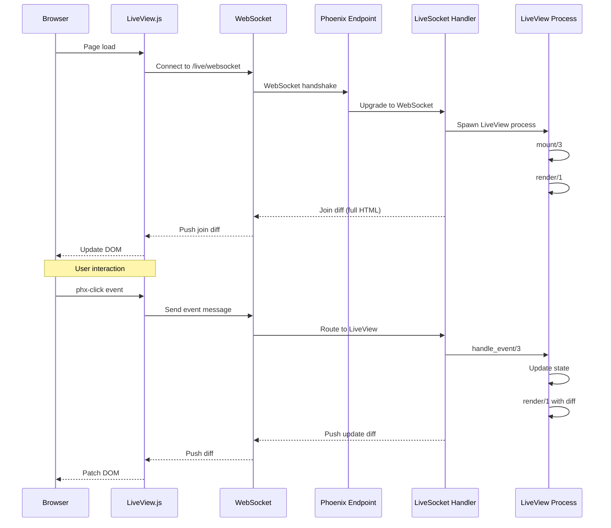

# Deep Dive: WebSocket Protocol and Diffing

## Overview

This deep dive examines Phoenix LiveView's WebSocket protocol - how connections are established, messages are formatted, HTML diffs are computed and transmitted, and reconnection is handled.

## Architecture



## WebSocket Connection

### Connection Establishment

```javascript
// assets/js/phoenix/live_view.js

export class LiveSocket {
  constructor(url, phxSocket, opts = {}) {
    this.url = url
    this.socket = new phxSocket(url, opts)
    this.channels = new Map()
    this.reconnectAttempts = 0
    this.maxReconnectAttempts = opts.reconnectAttempts || 10
    this.reconnectDelayMs = opts.reconnectDelayMs || 3000
  }
  
  /**
   * Connect to Phoenix endpoint
   */
  connect() {
    return new Promise((resolve, reject) => {
      this.socket.connect()
      
      this.socket.onOpen(() => {
        console.log('LiveView connected')
        this.reconnectAttempts = 0
        resolve()
      })
      
      this.socket.onError((error) => {
        console.error('LiveView connection error', error)
        this.attemptReconnect()
      })
      
      this.socket.onClose((event) => {
        console.log('LiveView closed', event)
        this.attemptReconnect()
      })
    })
  }
  
  /**
   * Join LiveView channel
   */
  joinChannel(topic, session, params) {
    const channel = this.socket.channel(topic, {
      session: session,
      params: params
    })
    
    channel.join()
      .receive('ok', (resp) => {
        console.log('Joined LiveView', resp)
        this.handleJoin(resp)
      })
      .receive('error', (error) => {
        console.error('Join error', error)
        this.handleJoinError(error)
      })
      .receive('timeout', () => {
        console.error('Join timeout')
        this.reconnect()
      })
    
    this.channels.set(topic, channel)
    return channel
  }
  
  /**
   * Attempt reconnection with exponential backoff
   */
  attemptReconnect() {
    if (this.reconnectAttempts >= this.maxReconnectAttempts) {
      console.error('Max reconnect attempts reached')
      this.onMaxReconnectReached()
      return
    }
    
    const delay = this.reconnectDelayMs * Math.pow(2, this.reconnectAttempts)
    
    console.log(`Reconnecting in ${delay}ms...`)
    setTimeout(() => {
      this.reconnectAttempts++
      this.connect()
    }, delay)
  }
}
```

### Message Protocol

```javascript
// Message format for Phoenix WebSocket

/**
 * Phoenix WebSocket Message
 * 
 * Format: [ref, topic, event, payload]
 */
const Message = {
  /**
   * Join message
   */
  join(topic, session, params) {
    return [
      null,                    // ref (null for join)
      topic,                   // e.g., "lv:phx-F3Z9Z8Z9Z8Z9Z8Z9"
      "phx_join",              // event
      {                        // payload
        url: window.location.href,
        params: params,
        session: session,
        static: params.static  // Static fingerprint for optimization
      }
    ]
  },
  
  /**
   * Event message (phx-click, phx-change, etc.)
   */
  event(ref, topic, event, data) {
    return [
      ref,                     // Message reference for replies
      topic,                   // Channel topic
      event,                   // e.g., "event", "form:change"
      {
        type: event,
        event: data.event,     // phx-click value
        value: data.value,     // Form value or phx-value
        cid: data.cid          // Component ID (for live components)
      }
    ]
  },
  
  /**
   * Form submission
   */
  formSubmit(ref, topic, formId, formData) {
    return [
      ref,
      topic,
      "event",
      {
        type: "form:submit",
        event: "submit",
        value: formData,
        id: formId
      }
    ]
  },
  
  /**
   * File upload
   */
  upload(ref, topic, inputRef, files) {
    return [
      ref,
      topic,
      "event",
      {
        type: "upload",
        ref: inputRef,
        files: files,
        cid: null
      }
    ]
  }
}
```

## HTML Diff Algorithm

### Diff Computation

```elixir
# lib/phoenix_live_view/diff.ex

defmodule Phoenix.LiveView.Diff do
  @moduledoc """
  HTML diff algorithm for efficient updates
  """
  
  @doc """
  Compute diff between rendered templates
  """
  def compute_diff(old_rendered, new_rendered, changed) do
    cond do
      # Initial render - send full HTML
      is_nil(old_rendered) ->
        %{d: new_rendered.html}
      
      # Full re-render needed
      changed == :full ->
        %{d: new_rendered.html}
      
      # Partial update - compute diff
      true ->
        compute_component_diff(old_rendered, new_rendered, changed)
    end
  end
  
  defp compute_component_diff(old, new, changed) do
    # Extract components that changed
    changed_components = extract_changed_components(new, changed)
    
    # Extract static parts
    static_parts = extract_static_parts(new)
    
    %{
      c: changed_components,  # Changed components
      p: static_parts,        # Static parts for reuse
      r: removed_components(old, new)  # Removed components
    }
  end
  
  @doc """
  Extract components that have changed
  """
  defp extract_changed_components(rendered, changed) do
    rendered.components
    |> Enum.filter(fn {id, _component} ->
      Map.has_key?(changed, component_key(id))
    end)
    |> Enum.into(%{})
  end
  
  @doc """
  Generate fingerprint for static content
  """
  def fingerprint(html) do
    :crypto.hash(:sha256, html)
    |> Base.encode16(case: :lower)
    |> binary_part(0, 8)  # 8-char fingerprint
  end
end
```

### Diff Transmission

```javascript
// Diff application on client side

export class DOMPatch {
  constructor(liveView, html, diff) {
    this.liveView = liveView
    this.root = liveView.container
    this.html = html
    this.diff = diff
  }
  
  /**
   * Apply diff to DOM
   */
  patch() {
    if (this.diff.d) {
      // Full HTML replacement
      this.patchFullDiff(this.diff.d)
    } else {
      // Component updates
      if (this.diff.c) {
        this.patchComponents(this.diff.c)
      }
      
      // Part updates
      if (this.diff.p) {
        this.patchParts(this.diff.p)
      }
      
      // Removed components
      if (this.diff.r) {
        this.removeComponents(this.diff.r)
      }
    }
    
    // Apply attributes
    if (this.diff.a) {
      this.patchAttributes(this.diff.a)
    }
  }
  
  /**
   * Patch full HTML
   */
  patchFullDiff(html) {
    const template = document.createElement('template')
    template.innerHTML = html.trim()
    const newContent = template.content.firstChild
    
    // Use morphdom for efficient DOM patching
    morphdom(this.root, newContent, {
      childrenOnly: true,
      onBeforeElUpdated: (fromEl, toEl) => {
        // Preserve focus
        if (fromEl === document.activeElement) {
          return false
        }
        
        // Preserve input selection
        if (fromEl.tagName === 'INPUT' && fromEl.selectionStart !== null) {
          this.preserveSelection(fromEl, toEl)
          return false
        }
        
        return true
      }
    })
  }
  
  /**
   * Patch specific components
   */
  patchComponents(components) {
    for (const [id, html] of Object.entries(components)) {
      const element = this.root.querySelector(`[data-phx-id="${id}"]`)
      if (element) {
        morphdom(element, `<div>${html}</div>`, {
          childrenOnly: true
        })
      }
    }
  }
  
  /**
   * Preserve input selection during patch
   */
  preserveSelection(oldEl, newEl) {
    const start = oldEl.selectionStart
    const end = oldEl.selectionEnd
    
    // After morph, restore selection
    requestAnimationFrame(() => {
      newEl.setSelectionRange(start, end)
    })
  }
}
```

## Reconnection Handling

### State Recovery

```javascript
// Reconnection with state recovery

export class LiveSocket {
  /**
   * Handle reconnection
   */
  reconnect() {
    console.log('Reconnecting...')
    
    // Store current state
    const pendingEvents = this.pendingEvents
    this.pendingEvents = []
    
    // Reconnect socket
    this.connect().then(() => {
      // Re-join channels
      for (const [topic, oldChannel] of this.channels) {
        this.rejoinChannel(topic, oldChannel)
      }
      
      // Replay pending events
      for (const event of pendingEvents) {
        this.replayEvent(event)
      }
    })
  }
  
  /**
   * Re-join channel after reconnect
   */
  rejoinChannel(topic, oldChannel) {
    const session = this.getSession(topic)
    
    const newChannel = this.socket.channel(topic, {
      session: session,
      reconnecting: true,
      redirect: window.location.href
    })
    
    newChannel.join()
      .receive('ok', (resp) => {
        console.log('Rejoined channel', topic)
        this.channels.set(topic, newChannel)
        
        // Update container with new state
        if (resp.rendered) {
          this.applyDiff(resp.rendered)
        }
      })
      .receive('redirect', ({to, flash}) => {
        // Full redirect needed
        window.location = to
      })
  }
  
  /**
   * Queue event during disconnect
   */
  queueEvent(event) {
    this.pendingEvents.push(event)
    
    // Show loading state
    this.showLoading()
  }
  
  /**
   * Replay event after reconnect
   */
  replayEvent(event) {
    console.log('Replaying event', event)
    this.pushEvent(event.type, event.data)
  }
  
  /**
   * Show loading indicator during reconnect
   */
  showLoading() {
    const loadingEl = document.querySelector('[data-phx-loading]')
    if (loadingEl) {
      loadingEl.style.display = 'block'
    }
  }
  
  hideLoading() {
    const loadingEl = document.querySelector('[data-phx-loading]')
    if (loadingEl) {
      loadingEl.style.display = 'none'
    }
  }
}
```

### Optimistic Updates

```javascript
// Optimistic UI updates

export class LiveView {
  /**
   * Push event with optimistic update
   */
  pushEvent(eventType, event, data, onReply) {
    const ref = this.makeRef()
    
    // Apply optimistic update
    if (data.optimistic) {
      this.applyOptimisticUpdate(data.optimistic)
    }
    
    // Show loading state
    this.showLoading(data.loading)
    
    // Send to server
    this.channel.push('event', {
      type: eventType,
      event: event,
      value: data.value,
      ref: ref
    }, this.timeout).receive('ok', (resp) => {
      // Remove optimistic update
      this.removeOptimisticUpdate(data.optimistic)
      
      // Apply server response
      if (resp.rendered) {
        this.applyDiff(resp.rendered)
      }
      
      if (onReply) {
        onReply(resp)
      }
    })
    
    return ref
  }
  
  /**
   * Apply optimistic update to DOM
   */
  applyOptimisticUpdate(update) {
    if (update.add) {
      for (const [selector, html] of Object.entries(update.add)) {
        const parent = this.container.querySelector(selector)
        if (parent) {
          parent.insertAdjacentHTML('beforeend', html)
        }
      }
    }
    
    if (update.replace) {
      for (const [selector, html] of Object.entries(update.replace)) {
        const el = this.container.querySelector(selector)
        if (el) {
          el.outerHTML = html
        }
      }
    }
  }
  
  /**
   * Remove optimistic update after server response
   */
  removeOptimisticUpdate(update) {
    if (update.add) {
      for (const selector of Object.keys(update.add)) {
        const el = this.container.querySelector(`${selector}:last-child`)
        if (el && el.hasAttribute('data-phx-optimistic')) {
          el.remove()
        }
      }
    }
  }
}
```

## Conclusion

LiveView's WebSocket protocol provides:

1. **Efficient Diffing**: Only changed HTML transmitted
2. **Automatic Reconnection**: Exponential backoff reconnection
3. **State Recovery**: Session-based state restoration
4. **Optimistic Updates**: Responsive UI during latency
5. **Message Queueing**: Events queued during disconnect
