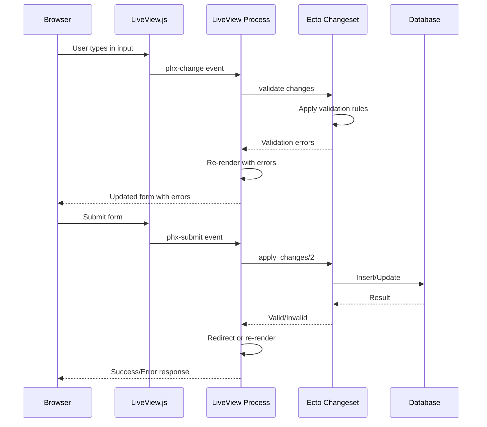

# Deep Dive: Forms and Validation

## Overview

This deep dive examines Phoenix LiveView's form handling system - how forms are created, validated in real-time, submitted, and how file uploads work with progress tracking.

## Architecture



## Form Basics

### Form Creation

```elixir
# lib/my_app_web/live/user_form_live.ex

defmodule MyAppWeb.UserFormLive do
  use Phoenix.LiveView
  alias MyApp.Accounts
  alias MyApp.Accounts.User
  
  def mount(_params, _session, socket) do
    # Create changeset for form
    changeset = Accounts.change_user(%User{})
    
    # Create form
    form = to_form(changeset, as: "user")
    
    {:ok, assign(socket, form: form, submitted: false)}
  end
  
  def render(assigns) do
    ~H"""
    <div class="user-form">
      <h1>Create Account</h1>
      
      <form
        id="user-form"
        phx-change="validate"
        phx-submit="save"
        phx-feedback-for={@form[:email].id}
      >
        <.input
          field={@form[:email]}
          type="email"
          label="Email"
          placeholder="you@example.com"
          phx-debounce="blur"
        />
        
        <.input
          field={@form[:password]}
          type="password"
          label="Password"
          placeholder="********"
          phx-debounce="blur"
        />
        
        <.input
          field={@form[:password_confirmation]}
          type="password"
          label="Confirm Password"
          placeholder="********"
        />
        
        <.input
          field={@form[:name]}
          type="text"
          label="Name"
          placeholder="Your Name"
        />
        
        <div class="actions">
          <button type="submit" phx-disable-with="Creating...">
            Create Account
          </button>
        </div>
        
        <%= if @submitted && @form.errors != [] do %>
          <div class="error-summary">
            <p>Please fix the errors below.</p>
          </div>
        <% end %>
      </form>
    </div>
    """
  end
  
  # Handle real-time validation
  def handle_event("validate", %{"user" => params}, socket) do
    changeset =
      %User{}
      |> Accounts.change_user(params)
      |> Map.put(:action, :validate)
    
    {:noreply, assign(socket, form: to_form(changeset, as: "user"))}
  end
  
  # Handle form submission
  def handle_event("save", %{"user" => params}, socket) do
    case Accounts.create_user(params) do
      {:ok, user} ->
        {:noreply,
         socket
         |> put_flash(:info, "Account created!")
         |> redirect(to: ~p"/users/#{user}")}
      
      {:error, %Ecto.Changeset{} = changeset} ->
        {:noreply, assign(socket, form: to_form(changeset), submitted: true)}
    end
  end
end
```

### Input Component

```elixir
# lib/my_app_web/components/form_components.ex

defmodule MyAppWeb.FormComponents do
  use Phoenix.Component
  
  alias Phoenix.HTML.Form
  
  @doc """
  Generic input component with validation display
  """
  attr :field, Phoenix.HTML.FormField, required: true
  attr :type, :string, default: "text"
  attr :label, :string, required: true
  attr :placeholder, :string, default: ""
  attr :rest, :global, include: ~w(autocomplete disabled required)
  
  def input(assigns) do
    ~H"""
    <div class="form-group">
      <label for={@field.id}>{@label}</label>
      <input
        type={@type}
        id={@field.id}
        name={@field.name}
        value={Phoenix.HTML.Form.input_value(@form, @field)}
        placeholder={@placeholder}
        class={if @field.errors != [], do: "error", else: ""}
        {@rest}
      />
      
      <%= for error <- @field.errors do %>
        <span class="error-message">{translate_error(error)}</span>
      <% end %>
      
      <%= if Phoenix.HTML.Form.input_validations(@form, @field)[:required] do %>
        <span class="required">*</span>
      <% end %>
    </div>
    """
  end
  
  @doc """
  Select/dropdown component
  """
  attr :field, Phoenix.HTML.FormField, required: true
  attr :label, :string, required: true
  attr :options, :list, required: true
  attr :prompt, :string, default: "Select an option"
  attr :rest, :global
  
  def select(assigns) do
    ~H"""
    <div class="form-group">
      <label for={@field.id}>{@label}</label>
      <select
        id={@field.id}
        name={@field.name}
        class={if @field.errors != [], do: "error", else: ""}
        {@rest}
      >
        <option value="">{@prompt}</option>
        <%= for {label, value} <- @options do %>
          <option
            value={value}
            selected={value == Phoenix.HTML.Form.input_value(@form, @field)}
          >
            {label}
          </option>
        <% end %>
      </select>
      
      <%= for error <- @field.errors do %>
        <span class="error-message">{translate_error(error)}</span>
      <% end %>
    </div>
    """
  end
  
  @doc """
  Checkbox component
  """
  attr :field, Phoenix.HTML.FormField, required: true
  attr :label, :string, required: true
  attr :rest, :global
  
  def checkbox(assigns) do
    ~H"""
    <div class="form-group checkbox">
      <label>
        <input
          type="checkbox"
          id={@field.id}
          name={@field.name}
          checked={Phoenix.HTML.Form.input_value(@form, @field)}
          {@rest}
        />
        {@label}
      </label>
      
      <%= for error <- @field.errors do %>
        <span class="error-message">{translate_error(error)}</span>
      <% end %>
    </div>
    """
  end
  
  defp translate_error({msg, opts}) do
    Enum.reduce(opts, msg, fn {key, value}, acc ->
      String.replace(acc, "%{#{key}}", fn _ -> to_string(value) end)
    end)
  end
end
```

## Real-Time Validation

### Debounced Validation

```elixir
# lib/my_app_web/live/realtime_validation_live.ex

defmodule MyAppWeb.RealtimeValidationLive do
  use Phoenix.LiveView
  
  def render(assigns) do
    ~H"""
    <div class="validation-demo">
      <form phx-change="validate" phx-submit="save">
        <!-- Debounce on input -->
        <input
          name="username"
          placeholder="Username (debounced 300ms)"
          phx-debounce="300"
          value={@form[:username].value}
        />
        
        <!-- Debounce on blur -->
        <input
          name="email"
          type="email"
          placeholder="Email (blur)"
          phx-debounce="blur"
          value={@form[:email].value}
        />
        
        <!-- Immediate validation -->
        <input
          name="password"
          type="password"
          placeholder="Password (immediate)"
          phx-change="validate_password"
          value={@form[:password].value}
        />
        
        <button type="submit">Submit</button>
      </form>
      
      <!-- Password strength indicator -->
      <div class="password-strength strength-{@password_strength}">
        Password Strength: {@password_strength}/5
      </div>
    </div>
    """
  end
  
  def mount(_params, _session, socket) do
    form = to_form(%{}, as: "user")
    {:ok, assign(socket, form: form, password_strength: 0)}
  end
  
  def handle_event("validate", %{"user" => params}, socket) do
    # Validate username availability
    username_errors =
      case params["username"] do
        nil -> []
        "" -> ["is required"]
        username when byte_size(username) < 3 ->
          ["must be at least 3 characters"]
        username ->
          if MyApp.Accounts.username_taken?(username) do
            ["is already taken"]
          else
            []
          end
      end
    
    # Validate email format
    email_errors =
      case params["email"] do
        nil -> []
        "" -> ["is required"]
        email when not Regex.match?(~r/^[^\s]+@[^\s]+$/, email) ->
          ["must be a valid email"]
        _ -> []
      end
    
    errors = [
      username: username_errors,
      email: email_errors
    ]
    
    form = to_form(params, errors: errors, as: "user")
    {:noreply, assign(socket, form: form)}
  end
  
  def handle_event("validate_password", %{"user" => params}, socket) do
    password = params["password"] || ""
    
    # Calculate password strength
    strength = calculate_password_strength(password)
    
    {:noreply, assign(socket, password_strength: strength)}
  end
  
  defp calculate_password_strength(password) do
    score = 0
    if byte_size(password) >= 8, do: score = score + 1
    if byte_size(password) >= 12, do: score = score + 1
    if Regex.match?(~r/[A-Z]/, password), do: score = score + 1
    if Regex.match?(~r/[a-z]/, password), do: score = score + 1
    if Regex.match?(~r/[0-9]/, password), do: score = score + 1
    if Regex.match?(~r/[^A-Za-z0-9]/, password), do: score = score + 1
    min(score, 5)
  end
end
```

## File Uploads

### Upload Configuration

```elixir
# lib/my_app_web/live/upload_live.ex

defmodule MyAppWeb.UploadLive do
  use Phoenix.LiveView
  
  def mount(_params, _session, socket) do
    # Configure upload
    allow_upload(
      socket,
      :avatar,
      accept: ~w(.jpg .jpeg .png),
      max_entries: 1,
      max_file_size: 5_000_000,  # 5MB
      progress: &handle_progress/3
    )
    
    {:ok, socket}
  end
  
  def render(assigns) do
    ~H"""
    <div class="upload-form">
      <form phx-submit="save">
        <!-- Upload dropzone -->
        <div
          class="upload-dropzone"
          phx-drop-target={@uploads.avatar.ref}
        >
          <p>Drop image here or click to upload</p>
          
          <!-- Progress bar -->
          <%= for entry <- @uploads.avatar.entries do %>
            <div class="upload-entry">
              <span>{entry.client_name}</span>
              <progress
                value={entry.progress}
                max="100"
              />
              <%= for err <- upload_errors(@uploads.avatar, entry) do %>
                <span class="error">{error_to_string(err)}</span>
              <% end %>
            </div>
          <% end %>
          
          <!-- Upload errors -->
          <%= for err <- upload_errors(@uploads.avatar) do %>
            <span class="error">{error_to_string(err)}</span>
          <% end %>
          
          <!-- Hidden file input -->
          <.live_file_input upload={@uploads.avatar} />
        </div>
        
        <!-- Preview uploaded images -->
        <%= for entry <- @uploads.avatar.entries do %>
          <.live_img_preview entry={entry} />
        <% end %>
        
        <button type="submit">Save</button>
      </form>
    </div>
    """
  end
  
  def handle_event("save", _params, socket) do
    # Consume uploaded files
    uploaded_files =
      consume_uploaded_entries(socket, :avatar, fn %{path: path}, entry ->
        # Move file to permanent location
        dest = Path.join("priv/static/uploads", entry.client_name)
        File.cp!(path, dest)
        
        # Return metadata for database storage
        {:ok, "/uploads/#{entry.client_name}"}
      end)
    
    # Save file paths to database
    # ...
    
    {:noreply, socket}
  end
  
  def handle_progress(:avatar, entry, socket) do
    # Handle progress updates
    # Entry has: progress, client_name, uuid, etc.
    {:noreply, socket}
  end
  
  defp error_to_string(:too_large), do: "File is too large"
  defp error_to_string(:not_accepted), do: "File type not allowed"
  defp error_to_string(:too_many_files), do: "Too many files"
end
```

## Conclusion

LiveView forms provide:

1. **Real-time Validation**: phx-change with debounce
2. **Error Display**: Automatic error rendering
3. **File Uploads**: Progressive uploads with preview
4. **Loading States**: phx-disable-with
5. **Accessibility**: Proper labels, ARIA attributes
