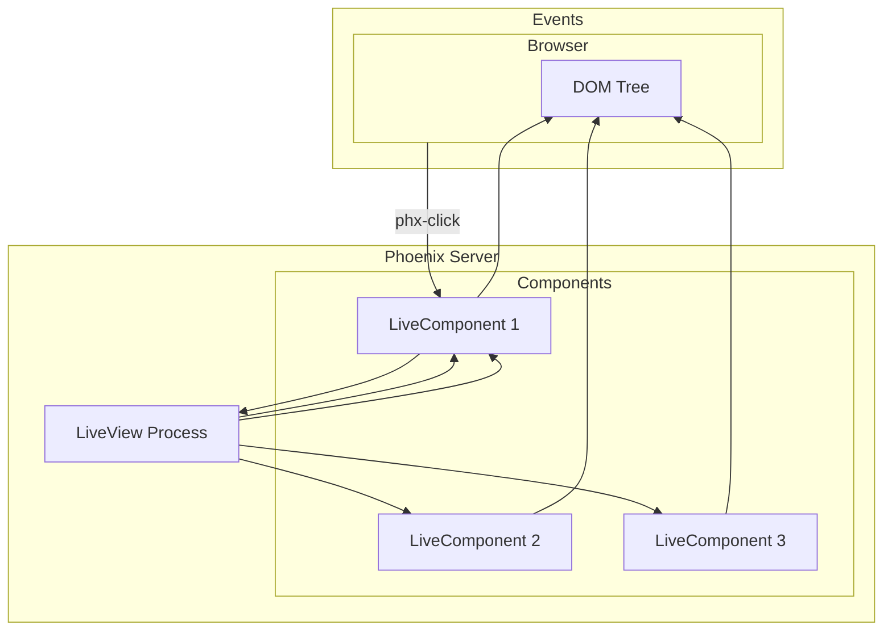

# Deep Dive: Live Components

## Overview

This deep dive examines Phoenix LiveView's live components - reusable, stateful components that run as separate processes, enabling modular architecture and efficient DOM updates.

## Architecture



## LiveComponent Basics

### Creating a LiveComponent

```elixir
# lib/my_app_web/components/user_card_live.ex

defmodule MyAppWeb.UserCardLive do
  use Phoenix.LiveComponent
  
  # Required: ID for component instance
  def update(%{user: user} = assigns, socket) do
    {:ok,
     socket
     |> assign(assigns)
     |> assign_new(:expanded, fn -> false end)
     |> assign_new(:loading, fn -> false end)}
  end
  
  def render(assigns) do
    ~H"""
    <div
      id={@id}
      class="user-card"
      phx-update="stream"
    >
      <div class="user-header" phx-click="toggle" phx-target={@myself}>
        
        <h3>{@user.name}</h3>
        <span class="toggle-icon">{if @expanded, do: "▼", else: "▶"}</span>
      </div>
      
      <%= if @expanded do %>
        <div class="user-details">
          <p><strong>Email:</strong> {@user.email}</p>
          <p><strong>Role:</strong> {@user.role}</p>
          <p><strong>Joined:</strong> {@user.inserted_at}</p>
          
          <div class="actions">
            <button phx-click="edit" phx-target={@myself}>Edit</button>
            <button phx-click="delete" phx-target={@myself} data-confirm="Are you sure?">
              Delete
            </button>
          </div>
        </div>
      <% end %>
      
      <%= if @loading do %>
        <div class="loading-overlay">Loading...</div>
      <% end %>
    </div>
    """
  end
  
  # Handle click events
  def handle_event("toggle", _params, socket) do
    {:noreply, assign(socket, expanded: !socket.assigns.expanded)}
  end
  
  def handle_event("edit", _params, socket) do
    # Send message to parent LiveView
    send(self(), {:edit_user, socket.assigns.user})
    {:noreply, socket}
  end
  
  def handle_event("delete", _params, socket) do
    # Send message to parent LiveView
    send(self(), {:delete_user, socket.assigns.user})
    {:noreply, socket}
  end
  
  # Handle async messages
  def handle_info({:start_loading}, socket) do
    {:noreply, assign(socket, loading: true)}
  end
  
  def handle_info({:stop_loading}, socket) do
    {:noreply, assign(socket, loading: false)}
  end
end
```

### Using LiveComponents

```elixir
# lib/my_app_web/live/users_live.ex

defmodule MyAppWeb.UsersLive do
  use Phoenix.LiveView
  alias MyAppWeb.UserCardLive
  
  def mount(_params, _session, socket) do
    users = MyApp.Accounts.list_users()
    
    {:ok, assign(socket, users: users)}
  end
  
  def render(assigns) do
    ~H"""
    <div class="users-page">
      <h1>Users</h1>
      
      <div class="user-grid">
        <%= for user <- @users do %>
          <.live_component
            module={UserCardLive}
            id={"user-#{user.id}"}
            user={user}
          />
        <% end %>
      </div>
    </div>
    """
  end
  
  # Handle messages from components
  def handle_info({:edit_user, user}, socket) do
    {:noreply, push_patch(socket, to: ~p"/users/#{user.id}/edit")}
  end
  
  def handle_info({:delete_user, user}, socket) do
    case MyApp.Accounts.delete_user(user) do
      {:ok, _} ->
        {:noreply, update(socket, :users, &Enum.reject(&1, fn u -> u.id == user.id end))}
      
      {:error, _} ->
        {:noreply, put_flash(socket, :error, "Failed to delete user")}
    end
  end
end
```

## Component Lifecycle

### Lifecycle Hooks

```elixir
# lib/my_app_web/components/dashboard_widget.ex

defmodule MyAppWeb.DashboardWidget do
  use Phoenix.LiveComponent
  
  @impl true
  def mount(socket) do
    # Called when component is first mounted
    # Only called once per component instance
    
    if connected?(socket) do
      # Only run on client connection, not during dead render
      :timer.send_interval(30000, self(), :refresh_data)
    end
    
    {:ok, assign_new(socket, :data, fn -> nil end)}
  end
  
  @impl true
  def update(assigns, socket) do
    # Called every time parent re-renders
    
    # Optimization: Skip update if assigns haven't changed
    if socket.assigns.widget_id == assigns.widget_id do
      {:ok, socket}
    else
      {:ok, assign(socket, assigns)}
    end
  end
  
  @impl true
  def render(assigns) do
    ~H"""
    <div id={@id} class="dashboard-widget">
      <h3>{@title}</h3>
      <div class="widget-content">
        <%= if @data do %>
          <%= @data %>
        <% else %>
          <span>Loading...</span>
        <% end %>
      </div>
    </div>
    """
  end
  
  @impl true
  def load(socket) do
    # Called after mount/update, before render
    # Useful for data loading
    
    data = fetch_widget_data(socket.assigns.widget_id)
    {:ok, assign(socket, data: data)}
  end
  
  @impl true
  def handle_info(:refresh_data, socket) do
    # Handle periodic refresh
    data = fetch_widget_data(socket.assigns.widget_id)
    {:noreply, assign(socket, data: data)}
  end
  
  @impl true
  def terminate(_reason, socket) do
    # Called when component is removed
    # Cleanup timers, subscriptions, etc.
    :ok
  end
  
  defp fetch_widget_data(widget_id) do
    # Fetch data logic
    %{value: 42, updated_at: DateTime.utc_now()}
  end
end
```

## Stream Components

### Efficient List Updates

```elixir
# lib/my_app_web/components/message_list.ex

defmodule MyAppWeb.MessageList do
  use Phoenix.LiveComponent
  
  def mount(socket) do
    # Create stream for efficient list updates
    socket =
      attach_stream(socket, :messages, "msg-")
    
    {:ok, socket}
  end
  
  def update(assigns, socket) do
    # Stream new messages
    socket =
      socket
      |> stream(:messages, assigns.new_messages)
    
    {:ok, socket}
  end
  
  def render(assigns) do
    ~H"""
    <div id="message-list" phx-update="stream">
      <%= for {dom_id, message} <- @streams.messages do %>
        <div id={dom_id} class="message">
          <div class="message-header">
            <strong>{message.user}</strong>
            <span class="time">{message.timestamp}</span>
          </div>
          <p class="message-body">{message.body}</p>
          <button phx-click="delete" phx-value-id={message.id}>Delete</button>
        </div>
      <% end %>
    </div>
    """
  end
  
  def handle_event("delete", %{"id" => id}, socket) do
    # Remove from stream
    {:noreply, stream_delete_by_dom_id(socket, :messages, "msg-#{id}")}
  end
end

# Parent LiveView usage:
defmodule MyAppWeb.ChatRoomLive do
  use Phoenix.LiveView
  
  def mount(_params, _session, socket) do
    messages = MyApp.Chat.list_messages()
    
    {:ok,
     socket
     |> assign(messages: messages)
     |> assign_new_messages: []}
  end
  
  def render(assigns) do
    ~H"""
    <div class="chat-room">
      <.live_component
        module={MessageList}
        id="message-list"
        new_messages={@new_messages}
      />
      
      <form phx-submit="send">
        <input name="body" placeholder="Type a message..." />
        <button>Send</button>
      </form>
    </div>
    """
  end
  
  def handle_event("send", %{"body" => body}, socket) do
    message = %{id: UUID.uuid4(), body: body, user: "Me"}
    
    # Insert at beginning of stream
    {:noreply,
     socket
     |> stream_insert(:messages, message, at: 0)
     |> update(:new_messages, fn _ -> [] end)}
  end
end
```

## Component Composition

### Nested Components

```elixir
# lib/my_app_web/components/nested_example.ex

defmodule MyAppWeb.CardComponent do
  use Phoenix.LiveComponent
  
  def render(assigns) do
    ~H"""
    <div class="card">
      <.header title={@title} actions={@actions} />
      <div class="card-body">
        <%= render_slot(@inner_block) %>
      </div>
      <.footer>{@footer}</.footer>
    </div>
    """
  end
  
  defp header(assigns) do
    ~H"""
    <div class="card-header">
      <h3>{@title}</h3>
      <div class="actions">{@actions}</div>
    </div>
    """
  end
  
  defp footer(assigns) do
    ~H"""
    <div class="card-footer">
      {render_slot(@inner_block)}
    </div>
    """
  end
end

# Usage in template:
# <.live_component module={CardComponent} id="card-1" title="My Card">
#   <p>Card content here</p>
#   
#   <:actions>
#     <button>Edit</button>
#   </:actions>
#   
#   <:footer>
#   Card footer
#   </:footer>
# </.live_component>
```

## Conclusion

Live Components provide:

1. **State Isolation**: Each component has independent state
2. **Reusability**: Share components across LiveViews
3. **Efficient Updates**: Targeted DOM patching
4. **Lifecycle Hooks**: mount, update, load, terminate
5. **Streams**: Efficient list rendering
