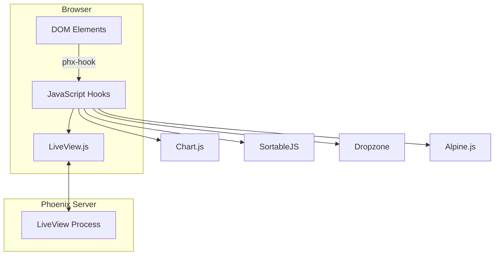

# Deep Dive: JavaScript Hooks

## Overview

This deep dive examines Phoenix LiveView's JavaScript hooks system - how to add client-side interactivity, integrate third-party libraries, and extend LiveView's capabilities with custom JavaScript.

## Architecture



## Hook Basics

### Creating a Hook

```javascript
// assets/js/app.js

import { LiveSocket } from "phoenix_live_view"
import { Socket } from "phoenix"

// Create hook
const ChartHook = {
  // Called when element is inserted into DOM
  mounted() {
    console.log("Chart hook mounted", this.el)
    
    // Get data from server
    const data = this.el.dataset
    
    // Initialize chart
    this.chart = new Chart(this.el, {
      type: data.chartType || 'line',
      data: JSON.parse(data.chartData),
      options: {
        responsive: true,
        animation: {
          duration: data.animationDuration || 1000
        }
      }
    })
    
    // Subscribe to LiveView updates
    this.handleEvent("update-chart", (data) => {
      this.updateChart(data)
    })
  },
  
  // Called when element is updated
  updated() {
    console.log("Chart hook updated")
  },
  
  // Called when element is removed from DOM
  destroyed() {
    console.log("Chart hook destroyed")
    this.chart.destroy()
  },
  
  // Custom methods
  updateChart(data) {
    this.chart.data = data
    this.chart.update()
  }
}

// Create LiveSocket with hooks
let liveSocket = new LiveSocket("/live", Socket, {
  hooks: { ChartHook },
  params: { _csrf_token: csrfToken }
})

liveSocket.connect()
```

### Using Hooks in Templates

```elixir
# lib/my_app_web/live/dashboard_live.ex

defmodule MyAppWeb.DashboardLive do
  use Phoenix.LiveView
  
  def mount(_params, _session, socket) do
    # Prepare chart data
    chart_data = %{
      labels: ["Jan", "Feb", "Mar", "Apr", "May"],
      datasets: [
        %{
          label: "Sales",
          data: [12, 19, 3, 5, 2],
          borderColor: "rgb(75, 192, 192)"
        }
      ]
    }
    
    {:ok,
     socket
     |> assign(chart_data: Jason.encode!(chart_data))
     |> assign(chart_type: "line")}
  end
  
  def render(assigns) do
    ~H"""
    <div class="dashboard">
      <h1>Sales Dashboard</h1>
      
      <!-- Chart with hook -->
      <canvas
        id="sales-chart"
        phx-hook="ChartHook"
        data-chart-data={@chart_data}
        data-chart-type={@chart_type}
        data-animation-duration="500"
      />
      
      <button phx-click="update_chart">Update Chart</button>
    </div>
    """
  end
  
  def handle_event("update_chart", _params, socket) do
    # Send update to hook
    new_data = %{
      labels: ["Jun", "Jul", "Aug"],
      datasets: [
        %{
          label: "Sales",
          data: [8, 12, 15],
          borderColor: "rgb(255, 99, 132)"
        }
      ]
    }
    
    {:noreply, push_event(socket, "update-chart", new_data)}
  end
end
```

## Common Hook Patterns

### Focus Hook

```javascript
// assets/js/hooks/focus.js

export const FocusHook = {
  mounted() {
    // Focus element on mount
    this.el.focus()
    
    // Select all text if input
    if (this.el.tagName === 'INPUT') {
      this.el.select()
    }
  }
}

// Usage:
// <input phx-hook="FocusHook" />
```

### Debounce Hook

```javascript
// assets/js/hooks/debounce.js

export const DebounceHook = {
  mounted() {
    this.debounceMs = parseInt(this.el.dataset.debounce) || 300
    this.timeout = null
    
    this.el.addEventListener('input', (e) => {
      clearTimeout(this.timeout)
      
      this.timeout = setTimeout(() => {
        this.pushEventTo(
          this.el.getAttribute('phx-target'),
          this.el.getAttribute('phx-change'),
          { [this.el.name]: e.target.value }
        )
      }, this.debounceMs)
    })
  },
  
  destroyed() {
    clearTimeout(this.timeout)
  }
}

// Usage:
// <input 
//   name="search"
//   phx-hook="DebounceHook"
//   data-debounce="500"
//   phx-change="search"
// />
```

### Sortable List Hook

```javascript
// assets/js/hooks/sortable.js

import Sortable from 'sortablejs'

export const SortableHook = {
  mounted() {
    this.sortable = Sortable.create(this.el, {
      animation: 150,
      ghostClass: 'sortable-ghost',
      onEnd: (evt) => {
        // Send new order to server
        const items = this.sortable.toArray()
        this.pushEvent('reorder', {
          items: items,
          old_index: evt.oldIndex,
          new_index: evt.newIndex
        })
      }
    })
  },
  
  destroyed() {
    this.sortable.destroy()
  }
}

// Usage:
// <div phx-hook="SortableHook" id="sortable-list">
//   <%= for item <- @items do %>
//     <div data-id={item.id}>{item.name}</div>
//   <% end %>
// </div>

// In LiveView:
// def handle_event("reorder", %{"items" => items}, socket) do
//   # Update order in database
//   MyApp.Repo.update_order(items)
//   {:noreply, socket}
// end
```

### File Upload Hook

```javascript
// assets/js/hooks/upload.js

export const UploadHook = {
  mounted() {
    this.input = this.el.querySelector('input[type="file"]')
    this.preview = this.el.querySelector('.preview')
    
    this.input.addEventListener('change', (e) => {
      const file = e.target.files[0]
      if (!file) return
      
      // Show preview
      const reader = new FileReader()
      reader.onload = (e) => {
        this.preview.src = e.target.result
        this.preview.style.display = 'block'
      }
      reader.readAsDataURL(file)
      
      // Upload file
      this.upload(this.input.getAttribute('name'), file, 
        (progress) => {
          this.el.querySelector('progress').value = progress
        },
        (error) => {
          console.error('Upload error', error)
        }
      )
    })
  }
}

// Usage:
// <div phx-hook="UploadHook">
//   <input type="file" name="avatar" accept="image/*" />
//   
//   <progress value="0" max="100"></progress>
// </div>
```

## Third-Party Integration

### Alpine.js Integration

```javascript
// assets/js/hooks/alpine.js

import Alpine from 'alpinejs'

// Initialize Alpine
window.Alpine = Alpine
Alpine.start()

// LiveView hook for Alpine
export const AlpineHook = {
  mounted() {
    // Alpine automatically initializes on element
    // Use x-data, x-bind, x-on directives
  }
}

// Usage with Alpine:
// <div 
//   phx-hook="AlpineHook"
//   x-data="{ count: 0 }"
// >
//   <span x-text="count"></span>
//   <button @click="count++">Increment</button>
//   <button phx-click="reset" @click="count = 0">Reset</button>
// </div>
```

### Dropzone Integration

```javascript
// assets/js/hooks/dropzone.js

import Dropzone from 'dropzone'

export const DropzoneHook = {
  mounted() {
    this.dropzone = new Dropzone(this.el, {
      url: '/upload',  // Not used - we handle uploads
      autoProcessQueue: false,
      previewsContainer: this.el.querySelector('.previews'),
      init: function() {
        this.on('addedfile', (file) => {
          // Handle file addition
        })
        
        this.on('success', (file, response) => {
          // Handle upload success
        })
      }
    })
  },
  
  destroyed() {
    this.dropzone.destroy()
  }
}
```

### Conclusion

JavaScript hooks provide:

1. **Client-Side Interactivity**: Focus, drag-drop, animations
2. **Third-Party Integration**: Chart.js, SortableJS, Dropzone
3. **Event Communication**: pushEvent, handleEvent
4. **Lifecycle Hooks**: mounted, updated, destroyed
5. **File Uploads**: Preview and progress tracking
