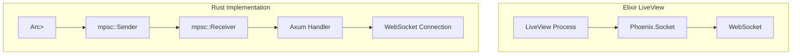

# Rust Revision: Building LiveView-like Systems in Rust

## Overview

This document demonstrates how to replicate Phoenix LiveView's real-time, server-driven UI patterns in Rust. We'll use `tokio` for async runtime, `axum` for web framework, `tokio-tungstenite` for WebSockets, and template engines like `askama` or `maud`. Unlike Elixir's BEAM processes, Rust uses ownership and message passing for state management.

## Architecture Comparison



## Core Architecture

### Project Setup

```toml
# Cargo.toml
[package]
name = "liveview-rust"
version = "0.1.0"
edition = "2021"

[dependencies]
# Async runtime
tokio = { version = "1.35", features = ["full"] }
tokio-util = { version = "0.7", features = ["codec"] }

# Web framework
axum = { version = "0.7", features = ["ws", "macros"] }
tower = "0.4"
tower-http = { version = "0.5", features = ["fs", "trace"] }

# WebSocket
tokio-tungstenite = "0.21"
futures = "0.3"

# Serialization
serde = { version = "1.0", features = ["derive"] }
serde_json = "1.0"

# Templates
askama = "0.12"
# Or for compile-time HTML: maud = "0.26"

# State management
dashmap = "5.5"
uuid = { version = "1.6", features = ["v4"] }

# Observability
tracing = "0.1"
tracing-subscriber = { version = "0.3", features = ["env-filter"] }

# Optional: Redis for distributed PubSub
redis = { version = "0.24", features = ["tokio-comp", "cluster"] }
```

### Message Protocol

```rust
// src/protocol.rs

use serde::{Deserialize, Serialize};
use uuid::Uuid;

/// WebSocket message format matching Phoenix protocol
#[derive(Debug, Clone, Serialize, Deserialize)]
#[serde(untagged)]
pub enum WsMessage {
    /// [ref, topic, event, payload]
    Tuple(Option<String>, String, String, serde_json::Value),
    Plain(String),
}

/// Internal message types
#[derive(Debug, Clone)]
pub enum Message {
    /// Join a topic/channel
    Join {
        topic: String,
        session: String,
        params: JoinParams,
    },
    /// Event from client (phx-click, phx-change)
    Event {
        topic: String,
        event: String,
        payload: EventPayload,
    },
    /// Broadcast to topic subscribers
    Broadcast {
        topic: String,
        message: serde_json::Value,
    },
    /// Render update
    Render {
        topic: String,
        diff: RenderDiff,
    },
    /// Presence update
    Presence {
        topic: String,
        joins: Vec<PresenceInfo>,
        leaves: Vec<PresenceInfo>,
    },
}

#[derive(Debug, Clone, Serialize, Deserialize)]
pub struct JoinParams {
    pub url: String,
    pub session: Option<String>,
    pub static_fingerprint: Option<String>,
}

#[derive(Debug, Clone, Serialize, Deserialize)]
pub struct EventPayload {
    #[serde(rename = "type")]
    pub event_type: String,
    pub event: String,
    pub value: serde_json::Value,
    pub cid: Option<u64>, // Component ID
}

/// HTML diff structure
#[derive(Debug, Clone, Serialize, Deserialize)]
pub struct RenderDiff {
    /// Full HTML (initial render)
    #[serde(skip_serializing_if = "Option::is_none")]
    pub d: Option<String>,
    /// Changed components
    #[serde(skip_serializing_if = "Option::is_none")]
    pub c: Option<std::collections::HashMap<String, String>>,
    /// Static parts
    #[serde(skip_serializing_if = "Option::is_none")]
    pub p: Option<std::collections::HashMap<String, String>>,
    /// Removed components
    #[serde(skip_serializing_if = "Option::is_none")]
    pub r: Option<Vec<String>>,
    /// Attribute updates
    #[serde(skip_serializing_if = "Option::is_none")]
    pub a: Option<std::collections::HashMap<String, String>>,
}

#[derive(Debug, Clone, Serialize, Deserialize)]
pub struct PresenceInfo {
    pub id: String,
    pub name: String,
    pub meta: serde_json::Value,
}
```

## State Management

### Application State

```rust
// src/state.rs

use dashmap::DashMap;
use std::sync::Arc;
use tokio::sync::{broadcast, RwLock};
use crate::protocol::{Message, PresenceInfo};

/// Unique identifier for a LiveView instance
pub type LiveViewId = String;

/// Topic for PubSub
pub type Topic = String;

/// Channel for broadcasting to topic subscribers
pub type TopicChannel = broadcast::Sender<Message>;

/// Shared application state
#[derive(Clone)]
pub struct AppState {
    /// Map of topic -> broadcast channel for PubSub
    pub topics: Arc<DashMap<Topic, TopicChannel>>,
    
    /// Map of LiveView ID -> LiveView state
    pub liveviews: Arc<DashMap<LiveViewId, LiveViewState>>,
    
    /// Presence tracking: topic -> user_id -> PresenceInfo
    pub presence: Arc<DashMap<Topic, DashMap<String, PresenceInfo>>>,
    
    /// Session storage
    pub sessions: Arc<DashMap<String, SessionData>>,
}

/// State for a single LiveView instance
#[derive(Debug, Clone)]
pub struct LiveViewState {
    pub id: LiveViewId,
    pub topic: Topic,
    pub socket_ref: Arc<RwLock<Option<SocketRef>>>,
    pub assigns: serde_json::Value,
    pub rendered_html: String,
    pub connected: bool,
}

/// Reference to WebSocket connection
#[derive(Debug, Clone)]
pub struct SocketRef {
    pub tx: tokio::sync::mpsc::UnboundedSender<WsMessage>,
}

/// Session data
#[derive(Debug, Clone, Serialize, Deserialize)]
pub struct SessionData {
    pub user_id: Option<String>,
    pub csrf_token: String,
    pub flash: Option<String>,
    pub data: serde_json::Value,
}

impl AppState {
    pub fn new() -> Self {
        Self {
            topics: Arc::new(DashMap::new()),
            liveviews: Arc::new(DashMap::new()),
            presence: Arc::new(DashMap::new()),
            sessions: Arc::new(DashMap::new()),
        }
    }
    
    /// Subscribe to a topic (PubSub)
    pub fn subscribe(&self, topic: &str) -> broadcast::Receiver<Message> {
        let (tx, rx) = broadcast::channel(1000);
        
        self.topics
            .entry(topic.to_string())
            .or_insert(tx)
            .subscribe()
    }
    
    /// Broadcast to topic subscribers
    pub fn broadcast(&self, topic: &str, message: Message) {
        if let Some(tx) = self.topics.get(topic) {
            let _ = tx.send(message);
        }
    }
    
    /// Track presence in a topic
    pub fn track_presence(&self, topic: &str, user_id: &str, info: PresenceInfo) {
        let topic_presence = self
            .presence
            .entry(topic.to_string())
            .or_insert_with(DashMap::new);
        
        topic_presence.insert(user_id.to_string(), info);
        
        // Broadcast join
        self.broadcast(topic, Message::Presence {
            topic: topic.to_string(),
            joins: vec![info.clone()],
            leaves: vec![],
        });
    }
    
    /// Untrack presence
    pub fn untrack_presence(&self, topic: &str, user_id: &str) -> Option<PresenceInfo> {
        if let Some(topic_presence) = self.presence.get(topic) {
            if let Some((_, info)) = topic_presence.remove(user_id) {
                self.broadcast(topic, Message::Presence {
                    topic: topic.to_string(),
                    joins: vec![],
                    leaves: vec![info.clone()],
                });
                return Some(info);
            }
        }
        None
    }
}
```

## WebSocket Handler

### Connection Handler

```rust
// src/ws_handler.rs

use axum::{
    extract::{
        ws::{Message as WsMsg, WebSocket, WebSocketUpgrade},
        State,
    },
    response::IntoResponse,
};
use futures::{sink::SinkExt, stream::SplitSink, StreamExt};
use tokio::sync::mpsc;
use tracing::{info, error};

use crate::{
    protocol::{Message, WsMessage, JoinParams},
    state::{AppState, LiveViewState, SocketRef},
    render::render_liveview,
};

/// Handle WebSocket upgrade
pub async fn ws_handler(
    ws: WebSocketUpgrade,
    State(state): State<Arc<AppState>>,
) -> impl IntoResponse {
    ws.on_upgrade(|socket| handle_socket(socket, state))
}

/// Handle upgraded WebSocket connection
async fn handle_socket(socket: WebSocket, state: Arc<AppState>) {
    let (tx, mut rx) = mpsc::unbounded_channel::<WsMessage>();
    let (mut ws_tx, mut ws_rx) = socket.split();
    
    // Generate LiveView ID
    let liveview_id = uuid::Uuid::new_v4().to_string();
    
    // Store socket reference
    let socket_ref = SocketRef { tx: tx.clone() };
    
    // Spawn task to send messages to client
    let send_task = tokio::spawn(async move {
        while let Some(msg) = rx.recv().await {
            let text = match msg {
                WsMessage::Tuple(ref_id, topic, event, payload) => {
                    serde_json::to_string(&(ref_id, topic, event, payload)).ok()?
                }
                WsMessage::Plain(text) => text,
            };
            
            if ws_tx.send(WsMsg::Text(text)).await.is_err() {
                break;
            }
        }
    });
    
    // Handle incoming messages
    let receive_task = tokio::spawn(async move {
        let mut joined_topics: Vec<String> = Vec::new();
        
        while let Some(Ok(msg)) = ws_rx.next().await {
            match msg {
                WsMsg::Text(text) => {
                    match handle_text_message(&text, &state, &liveview_id, &tx, &mut joined_topics).await {
                        Ok(_) => {}
                        Err(e) => {
                            error!("Error handling message: {}", e);
                        }
                    }
                }
                WsMsg::Close(_) => {
                    // Cleanup: leave topics, untrack presence
                    for topic in &joined_topics {
                        state.untrack_presence(topic, &liveview_id);
                    }
                    break;
                }
                _ => {}
            }
        }
    });
    
    // Wait for either task to complete
    tokio::select! {
        _ = send_task => {},
        _ = receive_task => {},
    }
}

async fn handle_text_message(
    text: &str,
    state: &Arc<AppState>,
    liveview_id: &str,
    tx: &mpsc::UnboundedSender<WsMessage>,
    joined_topics: &mut Vec<String>,
) -> Result<(), Box<dyn std::error::Error + Send + Sync>> {
    // Parse message
    let msg: WsMessage = serde_json::from_str(text)?;
    
    match msg {
        WsMessage::Tuple(_ref, topic, event, payload) => {
            match event.as_str() {
                "phx_join" => {
                    // Handle join
                    let params: JoinParams = serde_json::from_value(payload)?;
                    
                    // Subscribe to topic
                    let mut rx = state.subscribe(&topic);
                    joined_topics.push(topic.clone());
                    
                    // Create LiveViewState
                    let liveview_state = LiveViewState {
                        id: liveview_id.to_string(),
                        topic: topic.clone(),
                        socket_ref: Arc::new(RwLock::new(Some(SocketRef { tx: tx.clone() }))),
                        assigns: serde_json::json!({}),
                        rendered_html: String::new(),
                        connected: true,
                    };
                    
                    state.liveviews.insert(liveview_id.to_string(), liveview_state);
                    
                    // Initial render
                    let html = render_liveview(&topic, &serde_json::json!({}));
                    
                    // Send join response
                    tx.send(WsMessage::Tuple(
                        None,
                        topic.clone(),
                        "phx_reply".to_string(),
                        serde_json::json!({
                            "rendered": { "d": html }
                        }),
                    ))?;
                    
                    // Forward topic broadcasts to this connection
                    let tx_clone = tx.clone();
                    let topic_clone = topic.clone();
                    tokio::spawn(async move {
                        while let Ok(msg) = rx.recv().await {
                            match msg {
                                Message::Render { diff } => {
                                    let _ = tx_clone.send(WsMessage::Tuple(
                                        None,
                                        topic_clone.clone(),
                                        "diff".to_string(),
                                        serde_json::to_value(diff)?,
                                    ));
                                }
                                Message::Broadcast { message } => {
                                    let _ = tx_clone.send(WsMessage::Tuple(
                                        None,
                                        topic_clone.clone(),
                                        "event".to_string(),
                                        message,
                                    ));
                                }
                                _ => {}
                            }
                        }
                    });
                }
                "event" => {
                    // Handle phx-click, phx-change events
                    let event_payload: crate::protocol::EventPayload = serde_json::from_value(payload)?;
                    
                    // Route to appropriate handler based on topic
                    handle_event(state, &topic, &event_payload).await?;
                }
                _ => {}
            }
        }
        _ => {}
    }
    
    Ok(())
}

async fn handle_event(
    state: &Arc<AppState>,
    topic: &str,
    payload: &crate::protocol::EventPayload,
) -> Result<(), Box<dyn std::error::Error + Send + Sync>> {
    // Route events based on topic/event type
    // This is where you'd call your LiveView-like handlers
    
    match payload.event_type.as_str() {
        "form:change" => {
            // Handle form validation
            // state.broadcast(topic, Message::Render { ... })
        }
        "form:submit" => {
            // Handle form submission
        }
        "click" => {
            // Handle button click
        }
        _ => {}
    }
    
    Ok(())
}
```

## Template System

### Askama Templates

```rust
// src/templates.rs

use askama::Template;
use serde_json::Value;

#[derive(Template)]
#[template(path = "liveview.html")]
pub struct LiveViewTemplate {
    pub csrf_token: String,
    pub content: String,
    pub flash: Option<String>,
}

// src/render.rs

use crate::state::AppState;
use serde_json::Value;

/// Render a LiveView-like component
pub fn render_liveview(topic: &str, assigns: &Value) -> String {
    match topic {
        "lv:chat" => render_chat(assigns),
        "lv:dashboard" => render_dashboard(assigns),
        "lv:form" => render_form(assigns),
        _ => render_default(assigns),
    }
}

fn render_chat(assigns: &Value) -> String {
    let messages = assigns
        .get("messages")
        .and_then(|m| m.as_array())
        .map(|arr| {
            arr.iter()
                .map(|msg| {
                    let user = msg.get("user").and_then(|v| v.as_str()).unwrap_or("Unknown");
                    let body = msg.get("body").and_then(|v| v.as_str()).unwrap_or("");
                    format!(
                        r#"<div class="message"><strong>{}</strong><p>{}</p></div>"#,
                        user, body
                    )
                })
                .collect::<Vec<_>>()
                .join("\n")
        })
        .unwrap_or_default();
    
    format!(
        r#"
        <div class="chat-room" id="chat" phx-update="stream">
            <h1>Chat Room</h1>
            <div class="messages">
                {}
            </div>
            <form phx-submit="send_message">
                <input name="body" placeholder="Type a message..." />
                <button type="submit">Send</button>
            </form>
        </div>
        "#,
        messages
    )
}

fn render_dashboard(assigns: &Value) -> String {
    let user_count = assigns
        .get("user_count")
        .and_then(|v| v.as_u64())
        .unwrap_or(0);
    
    format!(
        r#"
        <div class="dashboard">
            <h1>Dashboard</h1>
            <div class="stat-card">
                <h3>Users</h3>
                <p class="stat-value">{}</p>
            </div>
            <button phx-click="refresh">Refresh</button>
        </div>
        "#,
        user_count
    )
}

fn render_form(assigns: &Value) -> String {
    let errors = assigns
        .get("errors")
        .and_then(|v| v.as_object())
        .map(|e| {
            e.iter()
                .flat_map(|(field, msgs)| {
                    msgs.as_array().map(|arr| {
                        arr.iter()
                            .map(|m| format!("<span class='error'>{}: {}</span>", field, m))
                            .collect::<Vec<_>>()
                            .join("\n")
                    })
                })
                .collect::<Vec<_>>()
                .join("\n")
        })
        .unwrap_or_default();
    
    format!(
        r#"
        <div class="form-container">
            <h1>Create Account</h1>
            {}
            <form phx-change="validate" phx-submit="save">
                <div class="form-group">
                    <label>Email</label>
                    <input name="email" type="email" phx-debounce="blur" />
                </div>
                <div class="form-group">
                    <label>Password</label>
                    <input name="password" type="password" />
                </div>
                <button type="submit" phx-disable-with="Creating...">Create</button>
            </form>
        </div>
        "#,
        errors
    )
}

fn render_default(_assigns: &Value) -> String {
    r#"<div><p>Default LiveView content</p></div>"#.to_string()
}

/// Compute diff between old and new HTML
pub fn compute_diff(old_html: &str, new_html: &str) -> crate::protocol::RenderDiff {
    // Simple string comparison - in production, use a proper HTML diff
    if old_html == new_html {
        crate::protocol::RenderDiff {
            d: None,
            c: None,
            p: None,
            r: None,
            a: None,
        }
    } else {
        // Full diff for simplicity
        crate::protocol::RenderDiff {
            d: Some(new_html.to_string()),
            c: None,
            p: None,
            r: None,
            a: None,
        }
    }
}
```

### Maud (Compile-time HTML)

```rust
// src/maud_templates.rs

use maud::{html, Markup, PreEscaped};
use serde_json::Value;

/// Render chat component using maud
pub fn render_chat_maud(messages: &[Value]) -> Markup {
    html! {
        div.chat-room id="chat" phx-update="stream" {
            h1 { "Chat Room" }
            div.messages {
                @for msg in messages {
                    div.message {
                        strong { (msg["user"].as_str().unwrap_or("Unknown")) }
                        p { (msg["body"].as_str().unwrap_or("")) }
                    }
                }
            }
            form phx-submit="send_message" {
                input name="body" placeholder="Type a message..." type="text" /
                button type="submit" { "Send" }
            }
        }
    }
}

/// Render dashboard with stats
pub fn render_dashboard_maud(user_count: u64, revenue: f64) -> Markup {
    html! {
        div.dashboard {
            h1 { "Dashboard" }
            div.stat-grid {
                div.stat-card {
                    h3 { "Users" }
                    p.stat-value { (user_count) }
                }
                div.stat-card {
                    h3 { "Revenue" }
                    p.stat-value { "$" (format!("{:.2}", revenue)) }
                }
            }
            button phx-click="refresh" { "Refresh" }
        }
    }
}

/// Render form with validation errors
pub fn render_form_maud(errors: &[(String, String)]) -> Markup {
    html! {
        div.form-container {
            h1 { "Create Account" }
            
            @if !errors.is_empty() {
                div.error-summary {
                    @for (field, msg) in errors {
                        span.error { (field) ": " (msg) }
                    }
                }
            }
            
            form phx-change="validate" phx-submit="save" {
                div.form-group {
                    label for="email" { "Email" }
                    input#email name="email" type="email" phx-debounce="blur" /
                }
                div.form-group {
                    label for="password" { "Password" }
                    input#password name="password" type="password" /
                }
                button type="submit" phx-disable-with="Creating..." { "Create Account" }
            }
        }
    }
}
```

## PubSub Implementation

### Local PubSub with tokio::broadcast

```rust
// src/pubsub.rs

use tokio::sync::broadcast;
use std::collections::HashMap;
use std::sync::Arc;
use dashmap::DashMap;

use crate::protocol::Message;

/// Local PubSub implementation
#[derive(Clone)]
pub struct PubSub {
    /// topic -> sender for broadcast channel
    topics: Arc<DashMap<String, broadcast::Sender<Message>>>,
}

impl PubSub {
    pub fn new() -> Self {
        Self {
            topics: Arc::new(DashMap::new()),
        }
    }
    
    /// Subscribe to a topic
    pub fn subscribe(&self, topic: &str) -> broadcast::Receiver<Message> {
        let (tx, rx) = broadcast::channel(1000);
        
        self.topics
            .entry(topic.to_string())
            .or_insert(tx)
            .subscribe()
    }
    
    /// Broadcast message to topic
    pub fn broadcast(&self, topic: &str, message: Message) {
        if let Some(tx) = self.topics.get(topic) {
            // Ignore send errors (no subscribers)
            let _ = tx.send(message);
        }
    }
    
    /// Broadcast to remote nodes (for distributed PubSub)
    pub fn broadcast_remote(&self, topic: &str, message: Message) {
        // Would integrate with Redis or other distributed system
        self.broadcast(topic, message);
    }
}

/// Distributed PubSub with Redis
#[cfg(feature = "redis")]
pub mod distributed {
    use redis::{Client, PubSubCommands, AsyncCommands};
    use tokio::sync::broadcast;
    use super::Message;
    
    pub struct RedisPubSub {
        client: Client,
        local_tx: broadcast::Sender<Message>,
    }
    
    impl RedisPubSub {
        pub async fn new(redis_url: &str, local_tx: broadcast::Sender<Message>) -> redis::RedisResult<Self> {
            let client = Client::open(redis_url)?;
            Ok(Self { client, local_tx })
        }
        
        pub async fn subscribe(&self, topic: &str) -> redis::RedisResult<()> {
            let mut pubsub = self.client.get_async_pubsub().await?;
            pubsub.subscribe(topic).await?;
            
            let local_tx = self.local_tx.clone();
            let topic = topic.to_string();
            
            tokio::spawn(async move {
                loop {
                    match pubsub.on_message().next().await {
                        Some(msg) => {
                            let payload: String = msg.get_payload().unwrap();
                            let message: Message = serde_json::from_str(&payload).unwrap();
                            let _ = local_tx.send(message);
                        }
                        None => break,
                    }
                }
            });
            
            Ok(())
        }
        
        pub async fn broadcast(&self, topic: &str, message: Message) -> redis::RedisResult<()> {
            let mut conn = self.client.get_async_connection().await?;
            let payload = serde_json::to_string(&message)?;
            conn.publish::<_, _, ()>(topic, payload).await?;
            Ok(())
        }
    }
}
```

## Presence System

```rust
// src/presence.rs

use dashmap::DashMap;
use std::sync::Arc;
use crate::protocol::PresenceInfo;
use crate::state::AppState;

/// Presence tracking similar to Phoenix.Presence
pub struct Presence {
    state: Arc<AppState>,
}

impl Presence {
    pub fn new(state: Arc<AppState>) -> Self {
        Self { state }
    }
    
    /// Track a user in a topic
    pub fn track(&self, topic: &str, user_id: &str, meta: serde_json::Value) {
        let info = PresenceInfo {
            id: user_id.to_string(),
            name: user_id.to_string(),
            meta,
        };
        
        self.state.track_presence(topic, user_id, info);
    }
    
    /// Untrack a user
    pub fn untrack(&self, topic: &str, user_id: &str) {
        self.state.untrack_presence(topic, user_id);
    }
    
    /// Get all users in a topic
    pub fn list(&self, topic: &str) -> Vec<PresenceInfo> {
        self.state
            .presence
            .get(topic)
            .map(|topic_presence| {
                topic_presence
                    .iter()
                    .map(|entry| entry.value().clone())
                    .collect()
            })
            .unwrap_or_default()
    }
    
    /// Get presence diff (joins/leaves)
    pub fn fetch_diff(
        &self,
        topic: &str,
        new_state: HashMap<String, PresenceInfo>,
    ) -> (Vec<PresenceInfo>, Vec<PresenceInfo>) {
        let current = self.list(topic);
        let current_ids: std::collections::HashSet<_> =
            current.iter().map(|p| &p.id).collect();
        let new_ids: std::collections::HashSet<_> =
            new_state.keys().collect();
        
        let joins: Vec<PresenceInfo> = new_state
            .into_iter()
            .filter(|(id, _)| !current_ids.contains(id))
            .map(|(_, info)| info)
            .collect();
        
        let leaves: Vec<PresenceInfo> = current
            .into_iter()
            .filter(|p| !new_ids.contains(&p.id))
            .collect();
        
        (joins, leaves)
    }
}
```

## Form Handling

```rust
// src/forms.rs

use serde::{Deserialize, Serialize};
use std::collections::HashMap;

/// Form state with validation
#[derive(Debug, Clone)]
pub struct Form<T> {
    pub data: T,
    pub errors: HashMap<String, Vec<String>>,
    pub submitted: bool,
}

impl<T: Default> Default for Form<T> {
    fn default() -> Self {
        Self {
            data: T::default(),
            errors: HashMap::new(),
            submitted: false,
        }
    }
}

impl<T> Form<T> {
    pub fn new(data: T) -> Self {
        Self {
            data,
            errors: HashMap::new(),
            submitted: false,
        }
    }
    
    pub fn with_errors(mut self, errors: HashMap<String, Vec<String>>) -> Self {
        self.errors = errors;
        self
    }
    
    pub fn is_valid(&self) -> bool {
        self.errors.is_empty()
    }
}

/// Validation result
pub type ValidationResult<T> = Result<T, HashMap<String, Vec<String>>>;

/// Example: User registration form
#[derive(Debug, Clone, Serialize, Deserialize)]
pub struct UserForm {
    pub email: String,
    pub password: String,
    pub password_confirmation: String,
}

impl UserForm {
    pub fn validate(&self) -> ValidationResult<()> {
        let mut errors = HashMap::new();
        
        // Email validation
        if self.email.is_empty() {
            errors
                .entry("email".to_string())
                .or_insert_with(Vec::new)
                .push("is required".to_string());
        } else if !self.email.contains('@') {
            errors
                .entry("email".to_string())
                .or_insert_with(Vec::new)
                .push("must be a valid email".to_string());
        }
        
        // Password validation
        if self.password.is_empty() {
            errors
                .entry("password".to_string())
                .or_insert_with(Vec::new)
                .push("is required".to_string());
        } else if self.password.len() < 8 {
            errors
                .entry("password".to_string())
                .or_insert_with(Vec::new)
                .push("must be at least 8 characters".to_string());
        }
        
        // Password confirmation
        if self.password != self.password_confirmation {
            errors
                .entry("password_confirmation".to_string())
                .or_insert_with(Vec::new)
                .push("must match password".to_string());
        }
        
        if errors.is_empty() {
            Ok(())
        } else {
            Err(errors)
        }
    }
}

/// Debounced form input handler
pub struct DebounceHandler {
    debounce_ms: u64,
}

impl DebounceHandler {
    pub fn new(debounce_ms: u64) -> Self {
        Self { debounce_ms }
    }
    
    pub async fn debounce<F, T>(&self, f: F) -> T
    where
        F: std::future::Future<Output = T>,
    {
        tokio::time::sleep(std::time::Duration::from_millis(self.debounce_ms)).await;
        f.await
    }
}
```

## Example Application

```rust
// src/main.rs

mod protocol;
mod state;
mod ws_handler;
mod render;
mod pubsub;
mod presence;
mod forms;

use axum::{
    routing::get,
    Router,
    extract::State,
    response::Html,
};
use std::sync::Arc;
use tower_http::services::ServeDir;
use tracing_subscriber::{layer::SubscriberExt, util::SubscriberInitExt};

use crate::state::AppState;

#[tokio::main]
async fn main() {
    // Initialize tracing
    tracing_subscriber::registry()
        .with(tracing_subscriber::EnvFilter::new(
            std::env::var("RUST_LOG").unwrap_or_else(|_| "liveview_rust=debug,tower_http=debug".into()),
        ))
        .with(tracing_subscriber::fmt::layer())
        .init();
    
    // Create shared state
    let state = Arc::new(AppState::new());
    
    // Build router
    let app = Router::new()
        .route("/", get(root_handler))
        .route("/ws", get(ws_handler::ws_handler))
        .route("/live/:topic", get(liveview_handler))
        .nest_service("/static", ServeDir::new("static"))
        .with_state(state);
    
    // Start server
    let addr = std::net::SocketAddr::from(([127, 0, 0, 1], 3000));
    tracing::info!("Listening on {}", addr);
    
    let listener = tokio::net::TcpListener::bind(addr).await.unwrap();
    axum::serve(listener, app).await.unwrap();
}

async fn root_handler() -> Html<&'static str> {
    Html(
        r#"
        <!DOCTYPE html>
        <html>
        <head>
            <title>LiveView Rust Demo</title>
            <script>
                // Minimal LiveView.js equivalent
                class LiveSocket {
                    constructor(url) {
                        this.url = url;
                        this.socket = null;
                    }
                    
                    connect() {
                        this.socket = new WebSocket(this.url);
                        this.socket.onmessage = (event) => {
                            console.log('Received:', event.data);
                            const msg = JSON.parse(event.data);
                            this.handleMessage(msg);
                        };
                    }
                    
                    handleMessage([ref, topic, event, payload]) {
                        if (event === 'phx_reply') {
                            // Initial render
                            if (payload.rendered?.d) {
                                document.getElementById('app').innerHTML = payload.rendered.d;
                            }
                        } else if (event === 'diff') {
                            // Update DOM
                            if (payload.d) {
                                document.getElementById('app').innerHTML = payload.d;
                            }
                        }
                    }
                    
                    pushEvent(type, event, data) {
                        const msg = [null, 'lv:chat', 'event', {
                            type, event, value: data
                        }];
                        this.socket.send(JSON.stringify(msg));
                    }
                }
                
                // Connect on page load
                const liveSocket = new LiveSocket(`ws://${location.host}/ws`);
                liveSocket.connect();
            </script>
        </head>
        <body>
            <div id="app">Loading...</div>
        </body>
        </html>
        "#,
    )
}

async fn liveview_handler(topic: String) -> Html<String> {
    // This would render the initial HTML for the LiveView
    // In production, this would use the template system
    Html(format!(
        r#"
        <!DOCTYPE html>
        <html>
        <head>
            <title>LiveView: {}</title>
        </head>
        <body>
            <div id="app">
                <p>LiveView content for topic: {}</p>
            </div>
        </body>
        </html>
        "#,
        topic, topic
    ))
}
```

## Key Differences from Phoenix LiveView

| Feature | Phoenix LiveView | Rust Implementation |
|---------|-----------------|---------------------|
| **Concurrency** | BEAM processes (lightweight, preemptive) | Tokio tasks (cooperative, async/await) |
| **State** | Process mailbox, GenServer | `Arc<RwLock<T>>`, `DashMap` |
| **PubSub** | Built-in Phoenix.PubSub | `tokio::sync::broadcast`, Redis |
| **Templating** | HEEx (compiled to BEAM bytecode) | Askama (compile-time), Maud (macros) |
| **Diff Algorithm** | Built-in HTML diff | Custom implementation needed |
| **Hot Reload** | Built-in | cargo-watch + browser extension |
| **Presence** | Phoenix.Presence | Custom with `DashMap` + broadcast |
| **Scaling** | Clustering via libcluster | Horizontal scaling + Redis PubSub |

## Production Considerations

1. **Memory Management**: Rust's ownership model prevents data races but requires careful design for shared state. Use `Arc<DashMap>` for concurrent access.

2. **Error Handling**: Use `Result` and `?` operator throughout. Consider using `anyhow` for application errors and `thiserror` for library errors.

3. **Connection Pooling**: Use `deadpool` or `bb8` for database connection pooling.

4. **Distributed PubSub**: For multi-node deployments, integrate Redis PubSub as shown above.

5. **Graceful Shutdown**: Handle SIGTERM and close WebSocket connections cleanly.

6. **Monitoring**: Integrate Prometheus metrics using `prometheus` crate.

## Next Steps

To build a production-ready LiveView-like system in Rust:

1. **Implement HTML Diff**: Use a library like `htmldiff` or implement a DOM-based diff algorithm
2. **Add Form Upload Support**: Handle multipart uploads with progress tracking
3. **Build JavaScript Hooks**: Create a Rust-based hook system for client-side interactivity
4. **Implement Live Components**: Support component-level state isolation
5. **Add Cluster Support**: Use Redis or NATS for distributed PubSub

The Rust implementation provides similar real-time capabilities but requires more manual implementation of the high-level abstractions that Phoenix LiveView provides out of the box.
