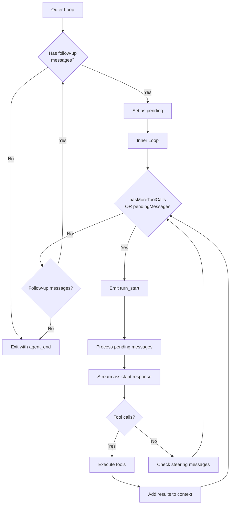

# Agent Loop - Deep Dive

## Overview

The agent loop is the core execution engine in Pi. It manages the iterative process of:
1. Sending context to the LLM
2. Streaming assistant responses
3. Executing tool calls
4. Handling steering and follow-up messages
5. Repeating until completion

The implementation is in `packages/agent/src/agent-loop.ts` and uses a **nested loop structure** to handle complex interaction patterns.

## Entry Points

### `agentLoop()` - Start with New Prompt

```typescript
function agentLoop(
  prompts: AgentMessage[],
  context: AgentContext,
  config: AgentLoopConfig,
  signal?: AbortSignal,
  streamFn?: StreamFn,
): EventStream<AgentEvent, AgentMessage[]>
```

- Adds prompts to context
- Emits `agent_start`, `turn_start`, and message events
- Calls `runLoop()` with combined context

### `agentLoopContinue()` - Continue Without New Message

```typescript
function agentLoopContinue(
  context: AgentContext,
  config: AgentLoopConfig,
  signal?: AbortSignal,
  streamFn?: StreamFn,
): EventStream<AgentEvent, AgentMessage[]>
```

- Used for retries after errors
- Validates that context is not empty and last message is not `assistant`
- **Important:** Last message must convert to `user` or `toolResult` via `convertToLlm`

## Nested Loop Structure



### Outer Loop - Follow-Up Message Handling

```typescript
while (true) {
  let hasMoreToolCalls = true;

  // Inner loop: process tool calls and steering messages
  while (hasMoreToolCalls || pendingMessages.length > 0) {
    // ...
  }

  // Agent would stop here. Check for follow-up messages.
  const followUpMessages = (await config.getFollowUpMessages?.()) || [];
  if (followUpMessages.length > 0) {
    pendingMessages = followUpMessages;
    continue;  // Restart inner loop with new messages
  }

  break;  // Exit outer loop
}
```

**Purpose:** Continues the loop when new follow-up messages arrive after the agent would normally stop.

### Inner Loop - Tool Execution and Steering

```typescript
while (hasMoreToolCalls || pendingMessages.length > 0) {
  // 1. Emit turn_start (except on first turn)
  // 2. Process pending steering messages
  // 3. Stream assistant response
  // 4. Execute tool calls if present
  // 5. Check for more steering messages
}
```

**Purpose:** Processes a single turn of LLM response + tool execution, with steering injection.

## Message Flow

```mermaid
sequenceDiagram
    participant Loop
    participant LLM
    participant Tools
    participant Events

    Loop->>Events: agent_start
    Loop->>Events: turn_start

    loop Each turn
      Loop->>Loop: Process steering messages
      Loop->>LLM: Stream assistant response
      LLM-->>Events: message_update (text_delta, thinking_delta)
      LLM-->>Loop: AssistantMessage

      alt Has tool calls
        Loop->>Tools: Execute each tool
        Tools-->>Events: tool_execution_start
        Tools-->>Events: tool_execution_update
        Tools-->>Events: tool_execution_end
        Loop->>Loop: Add tool results to context
      end

      Loop->>Events: turn_end
    end

    Loop->>Events: agent_end
```

## Streaming Assistant Response

### Context Transformation Pipeline

```typescript
async function streamAssistantResponse(...) {
  // Step 1: Apply context transform (AgentMessage[] → AgentMessage[])
  let messages = context.messages;
  if (config.transformContext) {
    messages = await config.transformContext(messages, signal);
  }

  // Step 2: Convert to LLM messages (AgentMessage[] → Message[])
  const llmMessages = await config.convertToLlm(messages);

  // Step 3: Build LLM context
  const llmContext: Context = {
    systemPrompt: context.systemPrompt,
    messages: llmMessages,
    tools: context.tools,
  };

  // Step 4: Resolve API key (important for expiring OAuth tokens)
  const resolvedApiKey =
    (config.getApiKey ? await config.getApiKey(config.model.provider) : undefined)
    || config.apiKey;

  // Step 5: Stream response
  const response = await streamFunction(config.model, llmContext, {
    ...config,
    apiKey: resolvedApiKey,
    signal,
  });
}
```

### Event Emission During Streaming

```typescript
for await (const event of response) {
  switch (event.type) {
    case "start":
      partialMessage = event.partial;
      context.messages.push(partialMessage);
      await emit({ type: "message_start", message: { ...partialMessage } });
      break;

    case "text_delta":
    case "thinking_delta":
    case "toolcall_delta":
      partialMessage = event.partial;
      context.messages[context.messages.length - 1] = partialMessage;
      await emit({
        type: "message_update",
        assistantMessageEvent: event,
        message: { ...partialMessage },
      });
      break;

    case "done":
    case "error":
      const finalMessage = await response.result();
      context.messages[context.messages.length - 1] = finalMessage;
      await emit({ type: "message_end", message: finalMessage });
      return finalMessage;
  }
}
```

## Tool Execution Pipeline

### Preparation → Execution → Finalization

```typescript
async function prepareToolCall(...): Promise<PreparedToolCall | ImmediateToolCallOutcome> {
  // 1. Find tool by name
  const tool = currentContext.tools?.find((t) => t.name === toolCall.name);
  if (!tool) {
    return { kind: "immediate", result: errorResult("Tool not found"), isError: true };
  }

  // 2. Validate arguments against TypeBox schema
  const validatedArgs = validateToolArguments(tool, toolCall);

  // 3. Call beforeToolCall hook
  if (config.beforeToolCall) {
    const beforeResult = await config.beforeToolCall({...}, signal);
    if (beforeResult?.block) {
      return { kind: "immediate", result: errorResult("Blocked"), isError: true };
    }
  }

  return { kind: "prepared", toolCall, tool, args: validatedArgs };
}
```

```typescript
async function executePreparedToolCall(prepared, signal, emit) {
  const updateEvents: Promise<void>[] = [];

  try {
    const result = await prepared.tool.execute(
      prepared.toolCall.id,
      prepared.args,
      signal,
      (partialResult) => {
        updateEvents.push(
          emit({
            type: "tool_execution_update",
            toolCallId: prepared.toolCall.id,
            partialResult,
          })
        );
      },
    );
    await Promise.all(updateEvents);
    return { result, isError: false };
  } catch (error) {
    await Promise.all(updateEvents);
    return { result: errorResult(error.message), isError: true };
  }
}
```

```typescript
async function finalizeExecutedToolCall(...) {
  let result = executed.result;
  let isError = executed.isError;

  // Call afterToolCall hook (can modify result)
  if (config.afterToolCall) {
    const afterResult = await config.afterToolCall({...}, signal);
    if (afterResult) {
      result = {
        content: afterResult.content ?? result.content,
        details: afterResult.details ?? result.details,
      };
      isError = afterResult.isError ?? isError;
    }
  }

  return await emitToolCallOutcome(prepared.toolCall, result, isError, emit);
}
```

### Sequential vs Parallel Execution

```typescript
// Sequential: one tool at a time
async function executeToolCallsSequential(...) {
  const results: ToolResultMessage[] = [];
  for (const toolCall of toolCalls) {
    // Full prepare → execute → finalize for each tool
    results.push(await executeSingleToolCall(...));
  }
  return results;
}

// Parallel: all tools concurrently
async function executeToolCallsParallel(...) {
  const results: ToolResultMessage[] = [];
  const runnableCalls: PreparedToolCall[] = [];

  // Phase 1: Prepare all tools (sequential for validation/hooks)
  for (const toolCall of toolCalls) {
    const preparation = await prepareToolCall(...);
    if (preparation.kind === "immediate") {
      // Error case - emit immediately
      results.push(await emitToolCallOutcome(...));
    } else {
      runnableCalls.push(preparation);
    }
  }

  // Phase 2: Execute all valid tools in parallel
  const runningCalls = runnableCalls.map((prepared) => ({
    prepared,
    execution: executePreparedToolCall(prepared, signal, emit),
  }));

  // Phase 3: Finalize each (sequential for afterToolCall hook)
  for (const running of runningCalls) {
    const executed = await running.execution;
    results.push(await finalizeExecutedToolCall(...));
  }

  return results;
}
```

## Steering Messages

Steering messages are injected **before** the next LLM call:

```typescript
// At start of inner loop
if (pendingMessages.length > 0) {
  for (const message of pendingMessages) {
    await emit({ type: "message_start", message });
    await emit({ type: "message_end", message });
    currentContext.messages.push(message);
    newMessages.push(message);
  }
  pendingMessages = [];
}

// Stream assistant response (steering influences this)
const message = await streamAssistantResponse(currentContext, config, ...);
```

**Use case:** User interrupts mid-execution to redirect the agent.

```typescript
// During streaming
await session.steer("Stop analyzing, just fix the bug");
// Message is queued and injected before next LLM call
```

## Follow-Up Messages

Follow-up messages are delivered **after** all tool calls and steering messages are processed:

```typescript
// After inner loop exits
const followUpMessages = (await config.getFollowUpMessages?.()) || [];
if (followUpMessages.length > 0) {
  pendingMessages = followUpMessages;
  continue;  // Restart inner loop
}
```

**Use case:** Chained instructions that should only run after the agent completes its current task.

```typescript
await session.followUp("After you're done, also run the tests");
// Delivered when agent has no more tool calls or steering messages
```

## Error Handling

### Stop Reasons

```typescript
if (message.stopReason === "error" || message.stopReason === "aborted") {
  await emit({ type: "turn_end", message, toolResults: [] });
  await emit({ type: "agent_end", messages: newMessages });
  return;
}
```

### Tool Execution Errors

```typescript
try {
  const result = await prepared.tool.execute(...);
  return { result, isError: false };
} catch (error) {
  return {
    result: createErrorToolResult(error instanceof Error ? error.message : String(error)),
    isError: true,
  };
}
```

Errors during tool execution are captured and added to context as tool results, allowing the LLM to see the error and potentially recover.

### Context Overflow Recovery

```typescript
// In runAgentLoop (caller)
try {
  await runLoop(...);
} catch (err) {
  if (isContextOverflowError(err)) {
    // Auto-compaction and retry
    await compactAndRetry(...);
  } else if (signal.aborted) {
    // User cancellation
    emit({ type: "agent_end", messages: [abortedMessage] });
  } else {
    // Other errors
    emit({ type: "agent_end", messages: [errorMessage] });
  }
}
```

## Event Types

| Event | When Emitted | Payload |
|-------|--------------|---------|
| `agent_start` | Beginning of loop | - |
| `agent_end` | Loop completion | `messages: AgentMessage[]` |
| `turn_start` | Each turn beginning | - |
| `turn_end` | Each turn completion | `message`, `toolResults` |
| `message_start` | New message begins | `message` |
| `message_update` | Content streaming | `assistantMessageEvent`, `message` |
| `message_end` | Message complete | `message` |
| `tool_execution_start` | Tool about to run | `toolCallId`, `toolName`, `args` |
| `tool_execution_update` | Tool streaming output | `toolCallId`, `toolName`, `partialResult` |
| `tool_execution_end` | Tool finished | `toolCallId`, `toolName`, `result`, `isError` |

## Abort/Cancellation

```typescript
// Checked at multiple points
if (signal.aborted) {
  return;  // Exit loop early
}

// In streamAssistantResponse
const response = await streamFunction(config.model, llmContext, {
  ...config,
  signal,  // Passed to LLM provider
});

// In tool execution
const result = await prepared.tool.execute(..., signal, ...);
```

The abort signal is propagated to:
- LLM streaming (cancels HTTP request)
- Tool execution (tools receive signal)

## Key Design Decisions

### 1. AgentMessage Throughout

The loop works with `AgentMessage[]` internally, only converting to LLM `Message[]` at the boundary:

```typescript
// Internal: AgentMessage[]
let messages = context.messages;

// Transform (optional): AgentMessage[] → AgentMessage[]
messages = await config.transformContext(messages, signal);

// Convert: AgentMessage[] → Message[]
const llmMessages = await config.convertToLlm(messages);
```

This allows flexible context manipulation without LLM-specific concerns.

### 2. Nested Loop for Message Queueing

The nested structure cleanly separates:
- **Inner loop:** Tool calls and steering (single-turn concerns)
- **Outer loop:** Follow-up messages (multi-turn continuation)

### 3. Preparation → Execution Separation

Tool execution is split into three phases:
1. **Preparation:** Validation, beforeToolCall hook
2. **Execution:** Actual tool logic with streaming
3. **Finalization:** afterToolCall hook, event emission

This allows:
- Parallel execution to prepare all tools first, then execute concurrently
- Error handling at each phase independently
- Hook system for extensions

### 4. Dynamic API Key Resolution

```typescript
const resolvedApiKey =
  (config.getApiKey ? await config.getApiKey(config.model.provider) : undefined)
  || config.apiKey;
```

Important for OAuth tokens that may expire between turns - the `getApiKey` callback can refresh tokens on-demand.
