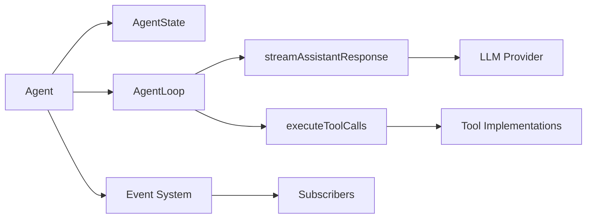

# Agent System - Deep Dive

## Overview

The agent system in Pi is built around the `Agent` class from `@mariozechner/pi-agent-core`. It manages the LLM interaction loop, tool execution, and message streaming.

## Core Architecture



## Agent Class (`packages/agent/src/agent.ts`)

### State Management

```typescript
interface AgentState {
  systemPrompt: string;
  model: Model<any>;
  thinkingLevel: ThinkingLevel;  // off, minimal, low, medium, high, xhigh
  tools: AgentTool<any>[];
  messages: AgentMessage[];
  isStreaming: boolean;
  streamMessage: AgentMessage | null;
  pendingToolCalls: Set<string>;
  error?: string;
}
```

### Key Methods

| Method | Purpose |
|--------|---------|
| `prompt()` | Send a prompt, wait for completion |
| `continue()` | Continue from current context (retries) |
| `steer()` | Queue steering message (delivered after current tool calls) |
| `followUp()` | Queue follow-up message (delivered when agent finishes) |
| `abort()` | Abort current operation |
| `waitForIdle()` | Wait for agent to finish processing |

### Message Queueing

The agent supports two types of queued messages during streaming:

1. **Steering messages** - Delivered after the current assistant turn finishes executing tool calls, before the next LLM call
2. **Follow-up messages** - Delivered only when the agent has no more tool calls or steering messages

```typescript
// During streaming
await session.steer("Stop and do this instead");
await session.followUp("After you're done, also check X");

// Configuration
steeringMode: "one-at-a-time" | "all"
followUpMode: "one-at-a-time" | "all"
```

## Agent Loop (`packages/agent/src/agent-loop.ts`)

The agent loop is a nested loop structure:

```typescript
// Outer loop: continues for follow-up messages
while (true) {
  let hasMoreToolCalls = true;

  // Inner loop: process tool calls and steering messages
  while (hasMoreToolCalls || pendingMessages.length > 0) {
    // 1. Process pending steering messages
    // 2. Stream assistant response
    // 3. Execute tool calls
    // 4. Check for more steering messages
  }

  // Check for follow-up messages
  const followUpMessages = await config.getFollowUpMessages();
  if (followUpMessages.length > 0) {
    pendingMessages = followUpMessages;
    continue;
  }

  break;
}
```

### Loop Flow

```mermaid
sequenceDiagram
    participant Loop
    participant LLM
    participant Tools
    participant Events

    Loop->>Events: emit turn_start
    Loop->>Loop: Process steering messages
    Loop->>LLM: Stream assistant response
    LLM-->>Events: emit message_update (text_delta)
    LLM-->>Loop: AssistantMessage
    Loop->>Loop: Check for tool calls
    alt Has tool calls
        Loop->>Tools: Execute each tool
        Tools-->>Events: emit tool_execution_*
        Loop->>Loop: Add tool results to context
    end
    Loop->>Events: emit turn_end
    Loop->>Loop: Check steering messages
    Loop->>Loop: Check follow-up messages
```

## Event System

The agent emits events throughout its lifecycle:

### Event Types

| Event Type | Description |
|------------|-------------|
| `agent_start` | Agent began processing |
| `agent_end` | Agent finished (includes all new messages) |
| `turn_start` | New LLM response turn beginning |
| `turn_end` | Turn completed (includes tool results) |
| `message_start` | New message beginning |
| `message_update` | Message content updating (text_delta, thinking_delta) |
| `message_end` | Message complete |
| `tool_execution_start` | Tool about to execute |
| `tool_execution_update` | Tool streaming output |
| `tool_execution_end` | Tool finished |

### Subscription

```typescript
agent.subscribe((event) => {
  switch (event.type) {
    case "message_update":
      if (event.assistantMessageEvent.type === "text_delta") {
        process.stdout.write(event.assistantMessageEvent.delta);
      }
      break;
    case "tool_execution_start":
      console.log(`Tool: ${event.toolName}`);
      break;
  }
});
```

## Thinking Levels

Pi supports multiple thinking/reasoning levels for models that support it:

```typescript
type ThinkingLevel = "off" | "minimal" | "low" | "medium" | "high" | "xhigh";

// Budget configuration (token-based providers)
interface ThinkingBudgets {
  minimal: number;
  low: number;
  medium: number;
  high: number;
  xhigh: number;
}
```

### Model Capability Clamping

```typescript
// Clamp thinking level to model capabilities
if (!model || !model.reasoning) {
  thinkingLevel = "off";
} else if (thinkingLevel === "xhigh" && !supportsXhigh(model)) {
  thinkingLevel = "high";
}
```

## Tool Execution

### Parallel vs Sequential

```typescript
type ToolExecutionMode = "parallel" | "sequential";

// Configuration
agent.setToolExecution("parallel");  // Default
agent.setToolExecution("sequential");
```

### Tool Call Flow

```typescript
async function executeToolCalls(
  context: AgentContext,
  message: AssistantMessage,
  config: AgentLoopConfig,
  signal: AbortSignal,
  emit: AgentEventSink,
): Promise<ToolResultMessage[]> {
  const toolCalls = message.content.filter(c => c.type === "toolCall");
  const results: ToolResultMessage[] = [];

  for (const call of toolCalls) {
    // 1. Validate arguments
    // 2. Call beforeToolCall hook
    // 3. Execute tool
    // 4. Call afterToolCall hook
    // 5. Emit tool_execution_end
  }

  return results;
}
```

### Before/After Tool Hooks

```typescript
interface AgentOptions {
  beforeToolCall?: (
    context: BeforeToolCallContext,
    signal?: AbortSignal,
  ) => Promise<BeforeToolCallResult | undefined>;

  afterToolCall?: (
    context: AfterToolCallContext,
    signal?: AbortSignal,
  ) => Promise<AfterToolCallResult | undefined>;
}
```

## Context Transformation

The agent supports context transformation before each LLM call:

```typescript
interface AgentOptions {
  /** Convert AgentMessage[] to LLM Message[] */
  convertToLlm?: (messages: AgentMessage[]) => Message[] | Promise<Message[]>;

  /** Transform context before convertToLlm (pruning, external context injection) */
  transformContext?: (
    messages: AgentMessage[],
    signal?: AbortSignal,
  ) => Promise<AgentMessage[]>;
}
```

## API Key Resolution

Dynamic API key resolution for expiring tokens:

```typescript
interface AgentOptions {
  getApiKey?: (provider: string) => Promise<string | undefined> | string | undefined;
}

// Usage in streamAssistantResponse
const resolvedApiKey =
  (config.getApiKey ? await config.getApiKey(config.model.provider) : undefined) ||
  config.apiKey;
```

## Transport Modes

Providers that support multiple transports can be configured:

```typescript
type Transport = "sse" | "websocket" | "auto";

agent.setTransport("websocket");
```

## Retry Configuration

```typescript
interface AgentOptions {
  /** Maximum delay for server-requested retries */
  maxRetryDelayMs?: number;  // Default: 60000 (60 seconds)
}
```

## Session ID Support

For providers that support session-based caching:

```typescript
interface AgentOptions {
  sessionId?: string;  // Forwarded to LLM providers
}
```

## Steering and Follow-Up Modes

```typescript
// Configuration via settings.json
{
  "steeringMode": "one-at-a-time",  // or "all"
  "followUpMode": "one-at-a-time"   // or "all"
}
```

- `"one-at-a-time"`: Waits for agent response between messages
- `"all"`: Delivers all queued messages at once

## Error Handling

```typescript
try {
  await runAgentLoop(...);
} catch (err: any) {
  const errorMsg: AgentMessage = {
    role: "assistant",
    content: [{ type: "text", text: "" }],
    stopReason: signal.aborted ? "aborted" : "error",
    errorMessage: err?.message || String(err),
  };

  this.appendMessage(errorMsg);
  this.emit({ type: "agent_end", messages: [errorMsg] });
}
```
