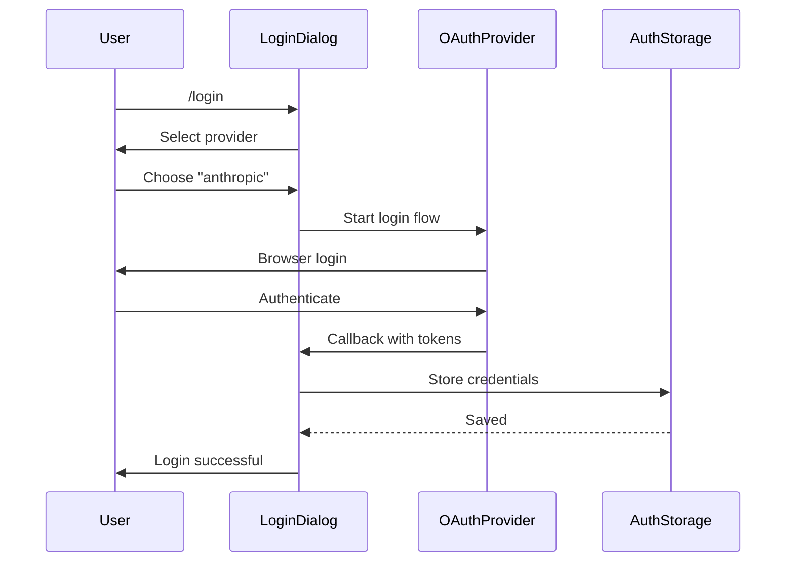

# Authentication - Deep Dive

## Overview

Pi supports two authentication methods for LLM providers:
1. **API Keys** - Traditional static keys (environment variables or stored in auth.json)
2. **OAuth** - Subscription-based authentication (Claude Pro, ChatGPT Plus, Copilot, etc.)

## Credential Storage

### Auth Storage Backend (`packages/coding-agent/src/core/auth-storage.ts`)

```typescript
interface AuthStorageBackend {
  withLock<T>(fn: (current: string | undefined) => LockResult<T>): T;
  withLockAsync<T>(fn: (current: string | undefined) => Promise<LockResult<T>>): Promise<T>;
}
```

### Implementation Types

```typescript
// File-based (default)
class FileAuthStorageBackend implements AuthStorageBackend {
  constructor(authPath: string = join(getAgentDir(), "auth.json"));

  // Uses proper-lockfile for concurrent access safety
  private acquireLockSyncWithRetry(path: string): () => void;
}

// In-memory (testing)
class InMemoryAuthStorageBackend implements AuthStorageBackend {
  private value: string | undefined;
}
```

### AuthStorage Class

```typescript
class AuthStorage {
  // Creation
  static create(authPath?: string): AuthStorage;
  static fromStorage(backend: AuthStorageBackend): AuthStorage;
  static inMemory(data: AuthStorageData = {}): AuthStorage;

  // Credential management
  get(provider: string): AuthCredential | undefined;
  set(provider: string, credential: AuthCredential): void;
  remove(provider: string): void;
  list(): string[];
  has(provider: string): boolean;
  hasAuth(provider: string): boolean;  // Fast check, no token refresh

  // OAuth
  login(providerId: OAuthProviderId, callbacks: OAuthLoginCallbacks): Promise<void>;
  logout(provider: string): void;

  // API key resolution (priority-ordered)
  getApiKey(providerId: string): Promise<string | undefined>;
}
```

## Credential Types

```typescript
type AuthCredential = ApiKeyCredential | OAuthCredential;

interface ApiKeyCredential {
  type: "api_key";
  key: string;  // Can be "${ENV_VAR}" or "shell:command"
}

interface OAuthCredential {
  type: "oauth";
  accessToken: string;
  refreshToken?: string;
  expires: number;  // Unix timestamp
  scope?: string;
}
```

## API Key Resolution Priority

```typescript
// AuthStorage.getApiKey() priority:
// 1. Runtime override (CLI --api-key, not persisted)
// 2. API key from auth.json
// 3. OAuth token from auth.json (auto-refreshed with locking)
// 4. Environment variable (ANTHROPIC_API_KEY, etc.)
// 5. Fallback resolver (custom provider keys from models.json)
```

### Environment Variables

```bash
# Provider-specific API keys
export ANTHROPIC_API_KEY=sk-ant-...
export OPENAI_API_KEY=sk-...
export GEMINI_API_KEY=...
export MISTRAL_API_KEY=...
export GROQ_API_KEY=...
export XAI_API_KEY=...
export OPENROUTER_API_KEY=...

# AWS credentials for Bedrock
export AWS_ACCESS_KEY_ID=...
export AWS_SECRET_ACCESS_KEY=...
export AWS_REGION=us-east-1

# Azure OpenAI
export AZURE_OPENAI_API_KEY=...
export AZURE_OPENAI_ENDPOINT=...

# Custom provider keys (via models.json fallback resolver)
```

### Config Value Resolution

```typescript
// packages/coding-agent/src/core/resolve-config-value.ts
function resolveConfigValue(value: string): string | undefined {
  // ${ENV_VAR} - environment variable
  if (value.startsWith("${") && value.endsWith("}")) {
    return process.env[value.slice(2, -1)];
  }

  // shell:command - shell command output
  if (value.startsWith("shell:")) {
    const result = execSync(value.slice(6), { encoding: "utf-8" });
    return result.trim();
  }

  // Plain value
  return value;
}
```

## OAuth Authentication

### Built-in OAuth Providers

| Provider ID | Display Name | Subscription |
|-------------|--------------|--------------|
| `anthropic` | Anthropic Console | Claude Pro/Max |
| `openai` | OpenAI | ChatGPT Plus/Pro |
| `github-copilot` | GitHub Copilot | Copilot Pro |
| `google-gemini-cli` | Google Gemini CLI | Gemini Advanced |
| `google-antigravity` | Google Antigravity | Google One AI Premium |

### OAuth Login Flow

```typescript
// packages/ai/src/utils/oauth/types.ts
interface OAuthLoginCallbacks {
  // Open browser for authorization
  openUrl: (url: string) => void;

  // Generate PKCE challenge (code verifier)
  generatePkceChallenge: () => {
    codeVerifier: string;
    codeChallenge: string;
    codeChallengeMethod: "S256";
  };

  // Wait for redirect with authorization code
  waitForRedirect: (expectedPathRegex: RegExp) => Promise<URL>;

  // Start local server for callback (optional)
  startLocalServer?: (port: number) => Promise<{
    port: number;
    waitForCallback: () => Promise<URL>;
    stop: () => void;
  }>;
}
```

### PKCE Implementation

```typescript
// packages/ai/src/utils/oauth/pkce.ts
import { randomBytes, createHash } from "crypto";

export function generatePkceChallenge(): {
  codeVerifier: string;
  codeChallenge: string;
  codeChallengeMethod: "S256";
} {
  // Generate random code verifier
  const codeVerifier = randomBytes(32).toString("base64url");

  // SHA256 hash for code challenge
  const codeChallenge = createHash("sha256")
    .update(codeVerifier)
    .digest("base64url");

  return {
    codeVerifier,
    codeChallenge,
    codeChallengeMethod: "S256",
  };
}
```

### Token Storage Format

```json
{
  "anthropic": {
    "type": "oauth",
    "accessToken": "eyJhbGc...",
    "refreshToken": "eyJhbGc...",
    "expires": 1710864000000,
    "scope": "org:read"
  },
  "openai": {
    "type": "oauth",
    "accessToken": "gAAA...",
    "expires": 1710864000000
  }
}
```

### Token Refresh with Locking

```typescript
// Prevents race conditions when multiple pi instances refresh simultaneously
private async refreshOAuthTokenWithLock(providerId: OAuthProviderId) {
  return this.storage.withLockAsync(async (current) => {
    // Re-read to get latest state
    const currentData = this.parseStorageData(current);
    this.data = currentData;

    const cred = currentData[providerId];
    if (cred?.type !== "oauth") {
      return { result: null };
    }

    // Check if actually expired (another instance may have refreshed)
    if (Date.now() < cred.expires) {
      return { result: { apiKey: provider.getApiKey(cred), newCredentials: cred } };
    }

    // Refresh token
    const refreshed = await getOAuthApiKey(providerId, oauthCreds);
    if (!refreshed) {
      return { result: null };
    }

    // Update storage atomically
    const merged: AuthStorageData = {
      ...currentData,
      [providerId]: { type: "oauth", ...refreshed.newCredentials },
    };
    this.data = merged;

    return { result: refreshed, next: JSON.stringify(merged, null, 2) };
  });
}
```

## Login Dialog (Interactive Mode)

### `/login` Command

```typescript
// packages/coding-agent/src/modes/interactive/components/login-dialog.ts
class LoginDialogComponent implements Component {
  // Displays OAuth provider selector
  // Handles browser launch for authorization
  // Shows success/failure status
}
```

### Login Flow



## Logout

```bash
# Interactive mode
/logout
/logout anthropic

# SDK
authStorage.logout("anthropic");
```

## Auth Storage File

### Location

```
~/.pi/agent/auth.json  # Default
```

### Override

```bash
export PI_CODING_AGENT_DIR=/custom/path
# auth.json will be at /custom/path/auth.json
```

### File Permissions

```typescript
// Created with 0600 permissions (owner read/write only)
chmodSync(this.authPath, 0o600);
```

### Migration

```typescript
// packages/coding-agent/src/migrations.ts
// Handles migrating auth providers from old formats
// Preserves credentials during format changes
```

## Custom Provider OAuth

Extensions can register OAuth providers:

```typescript
export default function(pi: ExtensionAPI) {
  pi.registerProvider("my-provider", {
    baseUrl: "https://api.example.com",
    oauth: {
      displayName: "My Provider",
      authorizationUrl: "https://auth.example.com/oauth/authorize",
      tokenUrl: "https://auth.example.com/oauth/token",
      clientId: "my-client-id",
      clientSecret: "${MY_CLIENT_SECRET}",
      scopes: ["read", "write"],
      login: async (callbacks) => {
        // Custom OAuth flow
        const pkce = callbacks.generatePkceChallenge();
        const authUrl = `${this.authorizationUrl}?${params}`;
        callbacks.openUrl(authUrl);

        const redirectUrl = await callbacks.waitForRedirect(/callback/);
        const code = redirectUrl.searchParams.get("code");

        const tokenResponse = await fetch(this.tokenUrl, {
          method: "POST",
          body: new URLSearchParams({
            grant_type: "authorization_code",
            code,
            redirect_uri: "http://localhost:8080/callback",
            client_id: this.clientId,
            client_secret: this.clientSecret,
            code_verifier: pkce.codeVerifier,
          }),
        });

        const tokens = await tokenResponse.json();
        return {
          accessToken: tokens.access_token,
          refreshToken: tokens.refresh_token,
          expires: Date.now() + tokens.expires_in * 1000,
        };
      },
      getApiKey: (credentials) => credentials.accessToken,
    },
  });
}
```

## Auth Error Handling

### Error Messages

```typescript
// Model resolution with auth check
if (!key) {
  const isOAuth = model && modelRegistry.isUsingOAuth(model);
  if (isOAuth) {
    throw new Error(
      `Authentication failed for "${provider}". ` +
      `Credentials may have expired or network is unavailable. ` +
      `Run '/login ${provider}' to re-authenticate.`
    );
  }
  throw new Error(
    `No API key found for "${provider}". ` +
    `Set an API key environment variable or run '/login ${provider}'.`
  );
}
```

### Token Expiration

```typescript
// Check expiration before use
if (cred?.type === "oauth") {
  if (Date.now() >= cred.expires) {
    // Attempt refresh with locking
    const result = await refreshOAuthTokenWithLock(providerId);
    if (!result) {
      // Refresh failed - may need re-login
      return undefined;
    }
  }
}
```

## Security Considerations

### File Permissions

- `auth.json` created with 0600 permissions
- Parent directory created with 0700 permissions
- Only owner can read/write credentials

### Lock File Protection

```typescript
// Uses proper-lockfile to prevent concurrent access
lockfile.lock(this.authPath, {
  retries: {
    retries: 10,
    factor: 2,
    minTimeout: 100,
    maxTimeout: 10000,
    randomize: true,
  },
  stale: 30000,  // Consider lock stale after 30s
});
```

### Credential Isolation

- API keys stored separately per provider
- OAuth tokens include expiration for automatic refresh
- No credential sharing between providers

### Environment Variable Fallback

- Environment variables checked after auth.json
- Allows override without modifying stored credentials
- Useful for CI/CD and temporary credentials

## Auth Debugging

### List Authenticated Providers

```bash
# Via SDK
const providers = authStorage.list();
console.log("Authenticated providers:", providers);

# Check if specific provider has auth
const hasAnthropic = authStorage.hasAuth("anthropic");
```

### Check OAuth Status

```typescript
const cred = authStorage.get("anthropic");
if (cred?.type === "oauth") {
  const expires = new Date(cred.expires);
  const isExpired = Date.now() >= cred.expires;
  console.log(`Expires: ${expires}, Expired: ${isExpired}`);
}
```

### Auth Errors

```typescript
// Collect auth-related errors
const errors = authStorage.drainErrors();
for (const error of errors) {
  console.error("Auth error:", error.message);
}
```
