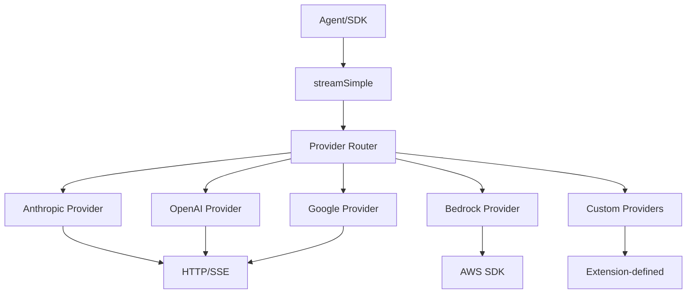
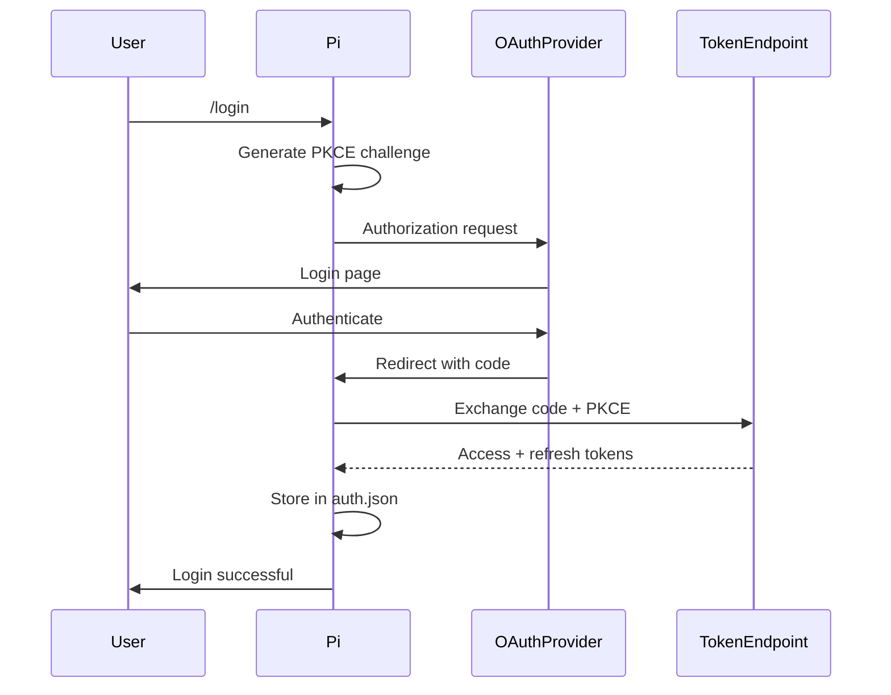

# Connectivity - Deep Dive

## Overview

Pi's connectivity layer handles communication with LLM providers. The `@mariozechner/pi-ai` package provides a unified interface (`streamSimple`) across multiple providers and APIs.

## Architecture



## Provider Interface

### API Registration

```typescript
// packages/ai/src/index.ts
interface ApiProvider {
  api: Api;  // "anthropic", "openai", "google", etc.
  stream: (
    model: Model<Api>,
    context: Context,
    options?: StreamOptions,
  ) => EventStream<AssistantMessageEvent, AssistantMessage>;
  streamSimple?: (
    model: Model<Api>,
    context: Context,
    options?: SimpleStreamOptions,
  ) => AssistantMessageEventStream;
}

// Register custom provider
registerApiProvider(provider, source);
```

### Stream Options

```typescript
interface SimpleStreamOptions {
  apiKey?: string;
  reasoning?: ThinkingLevel;
  sessionId?: string;
  transport?: "sse" | "websocket" | "auto";
  thinkingBudgets?: ThinkingBudgets;
  maxRetryDelayMs?: number;
  onPayload?: (payload: unknown, model: Model) => Promise<unknown>;
  signal?: AbortSignal;
}
```

## Built-in Providers

### Provider List

| Provider | API Type | Models | Auth |
|----------|----------|--------|------|
| `anthropic` | Anthropic | Claude 3.x, 4.x | API key / OAuth |
| `openai` | OpenAI Responses | GPT-4.x, o1, o3 | API key / OAuth |
| `azure-openai` | Azure OpenAI | All Azure models | API key |
| `google` | Google AI | Gemini | API key |
| `vertex` | Google Vertex | Gemini, Claude | Service account |
| `bedrock` | AWS Bedrock | Claude, Llama, etc. | AWS credentials |
| `mistral` | Mistral AI | Mistral models | API key |
| `groq` | Groq | Fast inference | API key |
| `cerebras` | Cerebras | Llama, etc. | API key |
| `xai` | xAI | Grok | API key |
| `openrouter` | OpenRouter | Multi-provider | API key |
| `vercel` | Vercel AI Gateway | Configurable | API key |

### Provider Implementation Pattern

```typescript
// packages/ai/src/providers/anthropic.ts
export function anthropicProvider(): ApiProvider {
  return {
    api: "anthropic",
    stream: anthropicStream,
    streamSimple: anthropicStreamSimple,
  };
}

// Registration on module load
registerApiProvider(anthropicProvider());
```

## Model Registry (`packages/coding-agent/src/core/model-registry.ts`)

### Custom Models (models.json)

```json
{
  "providers": {
    "my-provider": {
      "baseUrl": "https://api.example.com",
      "apiKey": "${MY_API_KEY}",
      "api": "openai",
      "models": [
        {
          "id": "custom-model-1",
          "name": "Custom Model 1",
          "reasoning": true,
          "input": ["text", "image"],
          "cost": { "input": 0.001, "output": 0.003 },
          "contextWindow": 128000,
          "maxTokens": 16384
        }
      ]
    }
  }
}
```

### Provider Overrides

```json
{
  "providers": {
    "anthropic": {
      "baseUrl": "https://proxy.example.com",
      "headers": {
        "X-Custom-Header": "value"
      },
      "modelOverrides": {
        "claude-opus-4-5": {
          "cost": { "input": 0.005, "output": 0.015 }
        }
      }
    }
  }
}
```

### Model Registry API

```typescript
class ModelRegistry {
  constructor(authStorage: AuthStorage, modelsJsonPath?: string);

  // Model access
  getAll(): Model<Api>[];
  getAvailable(): Model<Api>[];  // Only models with auth
  find(provider: string, modelId: string): Model<Api> | undefined;

  // API key resolution
  getApiKey(model: Model<Api>): Promise<string | undefined>;
  getApiKeyForProvider(provider: string): Promise<string | undefined>;

  // Dynamic provider registration (extensions)
  registerProvider(name: string, config: ProviderConfigInput): void;
  unregisterProvider(name: string): void;
  refresh(): void;
}
```

## OAuth Support

### OAuth Providers

```typescript
// packages/ai/src/utils/oauth/index.ts
interface OAuthProviderInterface {
  id: OAuthProviderId;
  displayName: string;
  login: (callbacks: OAuthLoginCallbacks) => Promise<OAuthCredentials>;
  getApiKey: (credentials: OAuthCredentials) => string;
  refresh?: (credentials: OAuthCredentials) => Promise<OAuthCredentials>;
  modifyModels?: (models: Model[], credentials: OAuthCredentials) => Model[];
}

// Built-in OAuth providers
- anthropic (Claude Pro/Max)
- openai (ChatGPT Plus/Pro - Codex)
- github-copilot (Copilot Pro)
- google-gemini-cli (Gemini Advanced)
- google-antigravity (Google Antigravity)
```

### OAuth Flow



### Token Refresh

```typescript
// packages/coding-agent/src/core/auth-storage.ts
async refreshOAuthTokenWithLock(providerId: OAuthProviderId) {
  return this.storage.withLockAsync(async (current) => {
    // Read current credentials
    const cred = currentData[providerId];
    if (cred?.type !== "oauth") return { result: null };

    // Check if expired
    if (Date.now() < cred.expires) {
      return { result: { apiKey: provider.getApiKey(cred), newCredentials: cred } };
    }

    // Refresh with locking to prevent race conditions
    const refreshed = await getOAuthApiKey(providerId, oauthCreds);

    // Update storage
    return { result: refreshed, next: JSON.stringify(merged, null, 2) };
  });
}
```

## HTTP Transport

### SSE (Server-Sent Events)

```typescript
// packages/ai/src/utils/event-stream.ts
async function* sseStream(
  response: Response,
  parseEvent: (data: string) => AssistantMessageEvent,
): AsyncGenerator<AssistantMessageEvent> {
  const decoder = new TextDecoder();
  const stream = response.body!.getReader();
  let buffer = "";

  while (true) {
    const { value, done } = await stream.read();
    if (done) break;

    buffer += decoder.decode(value, { stream: true });
    const lines = buffer.split("\n");
    buffer = lines.pop()!;

    for (const line of lines) {
      if (line.startsWith("data: ")) {
        yield parseEvent(line.slice(6));
      }
    }
  }
}
```

### WebSocket Transport

```typescript
interface WebSocketOptions {
  url: string;
  protocols?: string[];
  messageHandler: (data: unknown) => AssistantMessageEvent;
}
```

### Transport Selection

```typescript
// Provider can support multiple transports
const model = {
  ...baseModel,
  transports: ["sse", "websocket"],
};

// User preference
{
  "transport": "auto"  // Provider default
}
```

## API Compatibility Layers

### OpenAI Compatibility

Many providers use OpenAI-compatible APIs. Pi supports both Responses and Completions APIs:

```typescript
interface OpenAICompletionsCompat {
  supportsStore?: boolean;
  supportsDeveloperRole?: boolean;
  supportsReasoningEffort?: boolean;
  reasoningEffortMap?: { [level: string]: string };
  supportsUsageInStreaming?: boolean;
  maxTokensField?: "max_completion_tokens" | "max_tokens";
  requiresToolResultName?: boolean;
  requiresAssistantAfterToolResult?: boolean;
  requiresThinkingAsText?: boolean;
  thinkingFormat?: "openai" | "openrouter" | "zai" | "qwen";
  openRouterRouting?: { only?: string[]; order?: string[] };
  vercelGatewayRouting?: { only?: string[]; order?: string[] };
  supportsStrictMode?: boolean;
}
```

### Thinking/Reasoning Format

Different providers format thinking blocks differently:

```typescript
// OpenAI format
{ type: "reasoning", reasoning: "..." }

// OpenRouter format
{ type: "text", text: "<thought>...</thought>" }

// Qwen format
{ type: "text", text: "<think>...</think>..." }
```

## Custom Provider Registration (Extensions)

Extensions can register custom providers:

```typescript
// Extension example
export default function(pi: ExtensionAPI) {
  pi.registerProvider("my-provider", {
    baseUrl: "https://api.example.com",
    apiKey: "${MY_KEY}",
    api: "openai",
    streamSimple: (model, context, options) => {
      // Custom streaming implementation
      return customStream(model, context, options);
    },
    models: [
      {
        id: "my-model",
        name: "My Model",
        reasoning: true,
        input: ["text"],
        cost: { input: 0.001, output: 0.003 },
        contextWindow: 128000,
        maxTokens: 16384,
      },
    ],
  });
}
```

## Provider-Specific Features

### Anthropic

- Prompt caching (1h with `PI_CACHE_RETENTION=long`)
- Multi-turn caching
- Thinking blocks (Claude 3.7+)

### OpenAI

- Responses API (native tool support)
- Codex session caching (24h)
- Reasoning models (o1, o3)

### Google

- Gemini thinking signature
- Interleaved thinking output
- Native image support

### Bedrock

- AWS credential resolution chain
- Model IDs vary by region
- Converse API support

## Error Handling and Retries

### Retry Logic

```typescript
interface RetrySettings {
  enabled: boolean;
  maxRetries: number;
  maxDelayMs: number;
}

// Server-requested retry (Retry-After header)
if (retryAfter && retryAfter <= maxRetryDelayMs) {
  await sleep(retryAfter);
  // Retry request
}
```

### Error Categories

| Error | Handling |
|-------|----------|
| `429 Too Many Requests` | Retry with backoff |
| `5xx Server Error` | Retry with backoff |
| `401 Unauthorized` | Prompt re-login |
| `403 Forbidden` | Check API key/permissions |
| `network error` | Retry with backoff |

## Connection Pooling

For high-throughput scenarios, connections can be pooled:

```typescript
// Configuration
{
  "connectionPooling": {
    "enabled": true,
    "maxConnections": 10,
    "idleTimeout": 30000,
  }
}
```

## Rate Limiting

Providers may impose rate limits. Pi handles these via:
- `Retry-After` header respect
- Exponential backoff
- User notification on persistent limits

## Network Configuration

### Proxy Support

```bash
# Standard environment variables
export HTTP_PROXY=http://proxy.example.com:8080
export HTTPS_PROXY=http://proxy.example.com:8080
export NO_PROXY=localhost,127.0.0.1
```

### Timeout Configuration

```typescript
interface TimeoutSettings {
  connectionTimeout: number;  // Default: 30000
  readTimeout: number;        // Default: 600000
}
```
