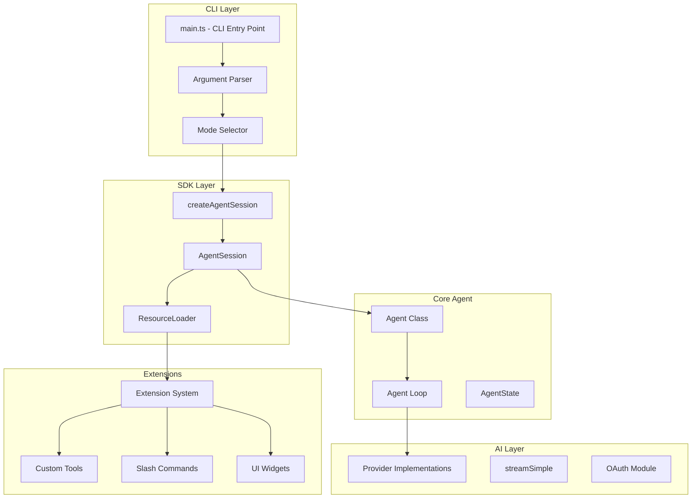

# Pi Coding Agent - Exploration Report

## Project Overview

**Pi** is a minimal terminal coding agent designed for extensibility. Unlike other coding agents that bake in features like sub-agents, plan mode, and MCP, Pi provides a flexible extension system that allows users to build these capabilities themselves.

**Key Philosophy:**
- Adapt Pi to your workflows, not the other way around
- No forced features - build what you need via extensions, skills, and prompt templates
- Four run modes: interactive, print, JSON, RPC, and SDK for embedding
- Ships with four default tools: `read`, `write`, `edit`, `bash`

## Package Structure

```
pi-mono/
├── packages/
│   ├── coding-agent/     # Main CLI and interactive mode
│   ├── agent/            # Core agent framework (pi-agent-core)
│   ├── ai/               # LLM toolkit and provider implementations
│   ├── tui/              # Terminal UI components
│   ├── web-ui/           # Web-based UI (alternative to TUI)
│   ├── mom/              # Slack bot integration (memory/observability via Slack)
│   └── pods/             # Local model deployment
├── .pi/                  # Runtime config directory
│   ├── extensions/       # User extensions
│   ├── prompts/          # Prompt templates
│   └── prompts/is.md     # Built-in prompts
└── .github/              # CI/CD workflows
```

## Architecture Overview



## Key Components

### 1. Entry Points

- **`packages/coding-agent/src/main.ts`** - CLI entry point with argument parsing
- **`packages/coding-agent/src/core/sdk.ts`** - SDK factory `createAgentSession()`
- **`packages/agent/src/agent.ts`** - Core Agent class
- **`packages/agent/src/agent-loop.ts`** - Agent loop implementation

### 2. Run Modes

| Mode | Description |
|------|-------------|
| Interactive | Full TUI with editor, chat history, commands |
| Print (`-p`) | Single-shot response, exit |
| JSON (`--mode json`) | All events as JSON lines |
| RPC (`--mode rpc`) | JSON-RPC over stdin/stdout |
| SDK | Embed in Node.js applications |

### 3. Session Management

Sessions are stored as JSONL files with tree structure:
- Each entry has `id` and `parentId` for branching
- Stored in `~/.pi/agent/sessions/<cwd>/`
- Supports `/tree` navigation, `/fork` branching
- Auto-compaction on context overflow

See deep dives for more details on specific subsystems.

## Deep Dives

- [Agent System](./agent-system-deep-dive.md) - Agent architecture, loop, state management
- [Agent Loop](./agent-loop-deep-dive.md) - Nested loop structure, tool execution pipeline, steering vs follow-up messages
- [Memory System](./memory-system-deep-dive.md) - Session storage, compaction, branching
- [Connectivity](./connectivity-deep-dive.md) - Provider implementations, API integrations
- [Authentication](./authentication-deep-dive.md) - OAuth flows, credential storage
- [Coding Agents](./coding-agents-deep-dive.md) - Tools, skills, extensions
- [Harness Architecture](./harness-architecture-deep-dive.md) - CLI, SDK, TUI
- [Extension System](./extension-system-deep-dive.md) - Extension loading, virtual modules, event hooks, tool/command registration, UI context
- [Slack Integration (Mom)](./slack-integration-deep-dive.md) - Slack bot architecture, Socket Mode, per-channel state, events system, Docker sandbox

## Dependencies

### Core Packages
- `@mariozechner/pi-agent-core` - Agent framework
- `@mariozechner/pi-ai` - LLM providers and streaming
- `@mariozechner/pi-tui` - Terminal UI components
- `@sinclair/typebox` - Schema validation

### Key Providers (Built-in)
- Anthropic (Claude)
- OpenAI (GPT, Codex)
- Google (Gemini, Vertex)
- Amazon Bedrock
- Mistral, Groq, xAI, and more

### Extension System
- Uses `@mariozechner/jiti` for TypeScript loading
- Virtual modules for Bun binary compatibility
- Event bus for extension communication

## Configuration Files

| File | Purpose |
|------|---------|
| `~/.pi/agent/settings.json` | Global settings |
| `.pi/settings.json` | Project settings |
| `~/.pi/agent/models.json` | Custom models |
| `~/.pi/agent/auth.json` | Credentials |
| `~/.pi/agent/keybindings.json` | Keyboard shortcuts |
| `AGENTS.md` / `CLAUDE.md` | Context files |
| `.pi/SYSTEM.md` | Custom system prompt |

## Environment Variables

- `PI_CODING_AGENT_DIR` - Override config directory
- `PI_PACKAGE_DIR` - Override package directory
- `PI_SKIP_VERSION_CHECK` - Skip update check
- `PI_CACHE_RETENTION` - Extended cache retention
- `ANTHROPIC_API_KEY`, `OPENAI_API_KEY`, etc. - Provider keys
