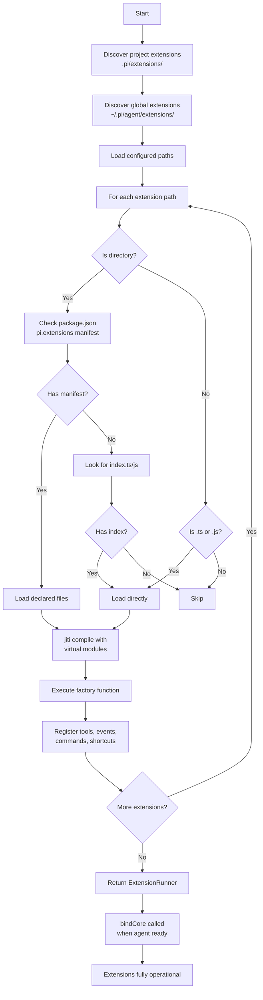

# Extension System - Deep Dive

## Overview

Pi's extension system allows deep customization of agent behavior through TypeScript modules. Extensions can:

- Subscribe to agent lifecycle events (agent_start, tool_call, message_end, etc.)
- Register LLM-callable tools
- Register slash commands, keyboard shortcuts, and CLI flags
- Intercept and modify user input before processing
- Inject messages before agent starts
- Modify system prompts dynamically
- Render custom message types in the UI
- Discover and register skills, prompts, and themes

**Key Philosophy:** Extensions are loaded at startup and can be reloaded via `/reload`. The system uses a virtual module pattern for Bun binary compatibility.

## Extension Loading Pipeline

### Entry Points

Extensions are loaded from three locations (in order):

1. **Project-local:** `cwd/.pi/extensions/`
2. **Global:** `agentDir/extensions/` (usually `~/.pi/agent/extensions/`)
3. **Configured paths:** From settings.json `extensions` array

### Discovery Rules

```typescript
// packages/coding-agent/src/core/extensions/loader.ts

function discoverExtensionsInDir(dir: string): string[] {
  // 1. Direct files: *.ts or *.js
  if (entry.isFile() && isExtensionFile(entry.name)) {
    discovered.push(entryPath);
  }

  // 2. Subdirectory with index.ts or index.js
  if (entry.isDirectory()) {
    if (fs.existsSync(path.join(dir, "index.ts"))) {
      discovered.push(indexTs);
    }
  }

  // 3. Subdirectory with package.json + "pi.extensions" manifest
  const manifest = readPiManifest(packageJsonPath);
  if (manifest?.extensions?.length) {
    for (const extPath of manifest.extensions) {
      entries.push(path.resolve(dir, extPath));
    }
  }
}
```

### Virtual Module Pattern

For compiled Bun binary compatibility, extensions import from virtual modules:

```typescript
// packages/coding-agent/src/core/extensions/loader.ts
const VIRTUAL_MODULES: Record<string, unknown> = {
  "@sinclair/typebox": _bundledTypebox,
  "@mariozechner/pi-agent-core": _bundledPiAgentCore,
  "@mariozechner/pi-tui": _bundledPiTui,
  "@mariozechner/pi-ai": _bundledPiAi,
  "@mariozechner/pi-ai/oauth": _bundledPiAiOauth,
  "@mariozechner/pi-coding-agent": _bundledPiCodingAgent,
};

const jiti = createJiti(import.meta.url, {
  moduleCache: false,
  ...(isBunBinary
    ? { virtualModules: VIRTUAL_MODULES, tryNative: false }
    : { alias: getAliases() }
  ),
});
```

**Why this matters:** When Pi is compiled to a Bun binary, node_modules don't exist on disk. Virtual modules make bundled packages available to extensions at runtime.

### Extension Factory Pattern

Extensions export a factory function that receives an API object:

```typescript
// Extension type definition
type ExtensionFactory = (api: ExtensionAPI) => Promise<void> | void;

// Example extension
export default async (api: ExtensionAPI) => {
  api.on("agent_start", async (event, ctx) => {
    ctx.ui.notify("Agent is starting...");
  });

  api.registerTool({
    name: "myTool",
    description: "Does something useful",
    inputSchema: ...,
    execute: async (args, signal, updates) => {
      return { content: "result" };
    }
  });
};
```

## Extension Runtime Architecture

### Two-Phase Initialization

Extensions go through two phases:

**Phase 1: Loading (jiti compilation)**
- `createExtensionRuntime()` creates stub runtime with throwing actions
- `createExtensionAPI()` wraps extension with registration methods
- Factory function executes, calling `api.registerTool()`, `api.on()`, etc.
- Actions like `sendMessage()` throw if called during load

**Phase 2: Binding (runtime ready)**
- `ExtensionRunner.bindCore()` replaces stubs with real implementations
- Pending provider registrations are flushed
- Extensions can now call action methods

```typescript
// packages/coding-agent/src/core/extensions/runner.ts
bindCore(actions: ExtensionActions, contextActions: ExtensionContextActions): void {
  // Replace stubs with real implementations
  this.runtime.sendMessage = actions.sendMessage;
  this.runtime.sendUserMessage = actions.sendUserMessage;
  this.runtime.appendEntry = actions.appendEntry;
  this.runtime.setSessionName = actions.setSessionName;
  this.runtime.setActiveTools = actions.setActiveTools;
  this.runtime.refreshTools = actions.refreshTools;
  // ... etc

  // Flush queued provider registrations
  for (const { name, config } of this.runtime.pendingProviderRegistrations) {
    this.modelRegistry.registerProvider(name, config);
  }
}
```

### Runtime State

The runtime object is shared across all extensions:

```typescript
interface ExtensionRuntime {
  // Action methods (replaced by bindCore)
  sendMessage: (message, options) => void;
  sendUserMessage: (content, options) => void;
  appendEntry: (customType, data) => void;
  setSessionName: (name: string) => void;
  setActiveTools: (toolNames: string[]) => void;
  refreshTools: () => void;
  setModel: (model) => Promise<void>;
  setThinkingLevel: (level: ThinkingLevel) => void;

  // Provider registration (flushed on bindCore)
  registerProvider: (name, config) => void;
  unregisterProvider: (name) => void;

  // Mutable state
  flagValues: Map<string, boolean | string>;
  pendingProviderRegistrations: Array<{ name, config }>;
}
```

## Extension API Reference

### Event Subscription

```typescript
api.on(eventName, handler): void
```

Subscribes to agent lifecycle events. Handlers receive `(event, ctx)` and can return results.

| Event | Payload | Return Type | Purpose |
|-------|---------|-------------|---------|
| `before_agent_start` | `{ prompt, images, systemPrompt }` | `{ message?, systemPrompt? }` | Inject messages or modify system prompt before LLM call |
| `agent_start` | - | - | Agent loop beginning |
| `agent_end` | `{ messages }` | - | Agent loop completion |
| `turn_start` | - | - | Each turn beginning |
| `turn_end` | `{ message, toolResults }` | - | Each turn completion |
| `message_start` | `{ message }` | - | New message begins |
| `message_update` | `{ assistantMessageEvent, message }` | - | Content streaming |
| `message_end` | `{ message }` | - | Message complete |
| `tool_call` | `{ toolName, toolCallId, input }` | `{ block? }` | Intercept tool execution (can block) |
| `tool_result` | `{ toolName, toolCallId, input, content, details, isError }` | `{ content?, details?, isError? }` | Modify tool result |
| `tool_execution_start` | `{ toolCallId, toolName, args }` | - | Tool about to run |
| `tool_execution_update` | `{ toolCallId, toolName, partialResult }` | - | Tool streaming output |
| `tool_execution_end` | `{ toolCallId, toolName, result, isError }` | - | Tool finished |
| `context` | `{ messages }` | `{ messages }` | Transform context before LLM call |
| `input` | `{ text, images, source }` | `{ action: "continue" | "transform" | "handled", text?, images? }` | Intercept/modify user input |
| `before_provider_request` | `{ payload }` | `{ payload }` | Modify provider request |
| `resources_discover` | `{ cwd, reason }` | `{ skillPaths?, promptPaths?, themePaths? }` | Discover extension resources |
| `session_before_switch` | - | `{ cancel? }` | Before session switch |
| `session_before_fork` | - | `{ cancel? }` | Before session fork |
| `session_before_compact` | - | `{ cancel? }` | Before compaction |
| `session_before_tree` | - | `{ cancel? }` | Before tree navigation |
| `session_shutdown` | - | - | Graceful shutdown |
| `user_bash` | `{ command, args, cwd }` | `{ block?, command?, args?, cwd? }` | Intercept user bash commands |

### Event Result Aggregation

Different events aggregate results differently:

**Chain events** (`tool_result`, `context`, `input`): Each handler sees the previous result.

```typescript
// Tool result aggregation - first non-undefined result wins for each field
async emitToolResult(event: ToolResultEvent) {
  const currentEvent = { ...event };
  for (const ext of extensions) {
    for (const handler of ext.handlers.get("tool_result")) {
      const result = await handler(currentEvent, ctx);
      if (result?.content !== undefined) currentEvent.content = result.content;
      if (result?.details !== undefined) currentEvent.details = result.details;
      if (result?.isError !== undefined) currentEvent.isError = result.isError;
    }
  }
  return currentEvent;
}
```

**Short-circuit events** (`tool_call`, `user_bash`): First `block: true` result wins.

```typescript
// Tool call - first block wins
async emitToolCall(event: ToolCallEvent) {
  for (const ext of extensions) {
    for (const handler of ext.handlers.get("tool_call")) {
      const result = await handler(event, ctx);
      if (result?.block) return result;
    }
  }
  return undefined;
}
```

**Session before events**: First `cancel: true` result wins.

### Tool Registration

```typescript
api.registerTool(tool: ToolDefinition): void
```

```typescript
interface ToolDefinition {
  name: string;
  description: string;
  inputSchema: TSchema;  // TypeBox schema
  execute: (
    args: Static<TSchema>,
    signal: AbortSignal,
    updates: AgentToolUpdateCallback
  ) => Promise<AgentToolResult>;
}
```

Tools are immediately available via `runtime.refreshTools()`.

### Command Registration

```typescript
api.registerCommand(name: string, options: {
  description: string;
  handler: (ctx: ExtensionCommandContext) => Promise<void>;
  autocomplete?: (query: string) => Promise<AutocompleteItem[]>;
}): void
```

Commands appear in slash command menu. Conflicts with built-in commands are detected and skipped.

### Shortcut Registration

```typescript
api.registerShortcut(key: KeyId, options: {
  description?: string;
  handler: (ctx: ExtensionContext) => Promise<void> | void;
}): void
```

**Reserved keys** cannot be overridden:

```typescript
const RESERVED_ACTIONS_FOR_EXTENSION_CONFLICTS = [
  "interrupt", "clear", "exit", "suspend",
  "cycleThinkingLevel", "cycleModelForward", "cycleModelBackward",
  "selectModel", "expandTools", "toggleThinking",
  "externalEditor", "followUp", "submit",
  "selectConfirm", "selectCancel", "copy",
  "deleteToLineEnd",
];
```

### Flag Registration

```typescript
api.registerFlag(name: string, options: {
  description?: string;
  type: "boolean" | "string";
  default?: boolean | string;
}): void

api.getFlag(name: string): boolean | string | undefined
```

Flags are CLI arguments like `--my-flag` or `--my-option=value`.

### Message Renderer Registration

```typescript
api.registerMessageRenderer<T>(customType: string, renderer: MessageRenderer<T>): void
```

Custom message types (e.g., `BashExecutionMessage`, `CompactionSummaryMessage`) need renderers for TUI display.

## Extension Context

Context objects provide access to agent state and actions:

```typescript
interface ExtensionContext {
  ui: ExtensionUIContext;
  hasUI: boolean;
  cwd: string;
  sessionManager: SessionManager;
  modelRegistry: ModelRegistry;
  model: Model<any> | undefined;  // Resolved at call time
  isIdle: () => boolean;
  abort: () => void;
  hasPendingMessages: () => boolean;
  shutdown: () => void;
  getContextUsage: () => ContextUsage | undefined;
  compact: (options?: CompactOptions) => void;
  getSystemPrompt: () => string;
}
```

```typescript
interface ExtensionCommandContext extends ExtensionContext {
  waitForIdle: () => Promise<void>;
  newSession: (options?) => Promise<{ cancelled: boolean }>;
  fork: (entryId: string) => Promise<{ cancelled: boolean }>;
  navigateTree: (targetId: string, options?) => Promise<{ cancelled: boolean }>;
  switchSession: (sessionPath: string) => Promise<{ cancelled: boolean }>;
  reload: () => Promise<void>;
}
```

## UI Context

Extensions interact with users via UI primitives:

```typescript
interface ExtensionUIContext {
  // Dialogs
  select<T>(options: SelectOptions<T>): Promise<T | undefined>;
  confirm(message: string, options?: ConfirmOptions): Promise<boolean>;
  input(options: InputOptions): Promise<string | undefined>;

  // Notifications
  notify(message: string, type?: "info" | "warning" | "error"): void;

  // Status
  setStatus(component: Component): void;
  setWorkingMessage(message: string): void;

  // Custom widgets
  setWidget<T>(component: Component<T>): Promise<T | undefined>;

  // Footer/Header
  setFooter(provider: ReadonlyFooterDataProvider): void;
  setHeader(component: Component | null): void;
  setTitle(title: string): void;

  // Terminal input
  onTerminalInput(handler: (input: string) => void): () => void;

  // Editor integration
  pasteToEditor(text: string): void;
  setEditorText(text: string): void;
  getEditorText(): string;
  editor(options: EditorOptions): Promise<string | undefined>;
  setEditorComponent<T>(component: EditorComponent<T>): Promise<T | undefined>;

  // Theme
  theme: Theme;
  getAllThemes(): Theme[];
  getTheme(name: string): Theme | undefined;
  setTheme(theme: string | Theme): { success: boolean; error?: string };

  // State
  getToolsExpanded(): boolean;
  setToolsExpanded(expanded: boolean): void;
}
```

## Integration with Agent Loop

### Tool Hook Installation

Tool interception is installed once on the Agent instance:

```typescript
// packages/coding-agent/src/core/agent-session.ts
private _installAgentToolHooks(): void {
  this.agent.setBeforeToolCall(async ({ toolCall, args }) => {
    const runner = this._extensionRunner;
    if (!runner?.hasHandlers("tool_call")) return undefined;

    return await runner.emitToolCall({
      type: "tool_call",
      toolName: toolCall.name,
      toolCallId: toolCall.id,
      input: args,
    });
  });

  this.agent.setAfterToolCall(async ({ toolCall, args, result, isError }) => {
    const runner = this._extensionRunner;
    if (!runner?.hasHandlers("tool_result")) return undefined;

    return await runner.emitToolResult({
      type: "tool_result",
      toolName: toolCall.name,
      toolCallId: toolCall.id,
      input: args,
      content: result.content,
      details: result.details,
      isError,
    });
  });
}
```

### Event Emission

Agent events are translated to extension events:

```typescript
private async _emitExtensionEvent(event: AgentEvent): Promise<void> {
  const runner = this._extensionRunner;
  if (!runner) return;

  switch (event.type) {
    case "agent_start":
      await runner.emit({ type: "agent_start" });
      break;
    case "agent_end":
      await runner.emit({ type: "agent_end" });
      break;
    case "turn_start":
      await runner.emit({ type: "turn_start" });
      break;
    case "turn_end":
      await runner.emit({
        type: "turn_end",
        message: event.message,
        toolResults: event.toolResults
      });
      break;
    case "message_start":
      await runner.emit({ type: "message_start", message: event.message });
      break;
    case "message_update":
      await runner.emit({
        type: "message_update",
        message: event.message,
        assistantMessageEvent: event.assistantMessageEvent
      });
      break;
    case "message_end":
      await runner.emit({ type: "message_end", message: event.message });
      break;
    case "tool_execution_start":
      await runner.emit({
        type: "tool_execution_start",
        toolCallId: event.toolCallId,
        toolName: event.toolName,
        args: event.args,
      });
      break;
    case "tool_execution_end":
      await runner.emit({
        type: "tool_execution_end",
        toolCallId: event.toolCallId,
        toolName: event.toolName,
        result: event.result,
        isError: event.isError,
      });
      break;
  }
}
```

## Key Design Decisions

### 1. Lazy Runtime Binding

Action methods throw during extension loading. This prevents extensions from calling `sendMessage()` before the agent is ready. The `bindCore()` call replaces stubs with real implementations.

### 2. Extension Runner as Singleton

All extensions share one `ExtensionRunner` instance. This enables:
- Consistent event ordering
- Shared runtime state (flag values, provider registrations)
- Centralized error handling via `emitError()`

### 3. Context Values Resolved at Call Time

```typescript
createContext(): ExtensionContext {
  const getModel = this.getModel;
  return {
    get model() {
      return getModel();  // Called at use time, not creation time
    },
    // ...
  };
}
```

This allows extensions to hold context references that stay up-to-date as agent state changes.

### 4. First-Result-Wins for Tool Registration

When multiple extensions register tools with the same name, first wins:

```typescript
getAllRegisteredTools(): RegisteredTool[] {
  const toolsByName = new Map<string, RegisteredTool>();
  for (const ext of this.extensions) {
    for (const tool of ext.tools.values()) {
      if (!toolsByName.has(tool.definition.name)) {
        toolsByName.set(tool.definition.name, tool);
      }
    }
  }
  return Array.from(toolsByName.values());
}
```

### 5. Conflict Detection for Commands and Shortcuts

```typescript
getShortcuts(effectiveKeybindings): Map<KeyId, ExtensionShortcut> {
  const builtinKeybindings = buildBuiltinKeybindings(effectiveKeybindings);

  for (const ext of this.extensions) {
    for (const [key, shortcut] of ext.shortcuts) {
      const builtInKeybinding = builtinKeybindings[normalizedKey];

      // Reserved actions cannot be overridden
      if (builtInKeybinding?.restrictOverride === true) {
        addDiagnostic(`Conflicts with built-in shortcut`, ext.path);
        continue;
      }

      // Extension vs extension conflicts
      if (extensionShortcuts.has(normalizedKey)) {
        addDiagnostic(`Conflicts with another extension`, ext.path);
      }
    }
  }
}
```

## Error Handling

Extension errors are captured and emitted to error listeners:

```typescript
emitError(error: ExtensionError): void {
  for (const listener of this.errorListeners) {
    listener({
      extensionPath: ext.path,
      event: eventType,
      error: message,
      stack,
    });
  }
}
```

Errors during event handling don't stop the chain - other extensions continue to receive events.

## Extension Discovery Flow


