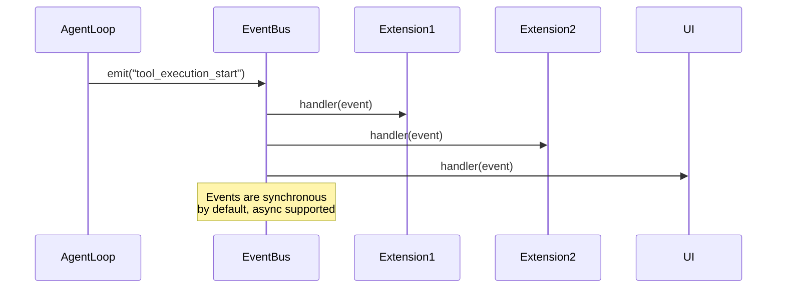

# Harness Architecture - Deep Dive

## Overview

Pi's harness architecture is a TypeScript/Node.js CLI application built on Bun. It provides an interactive coding agent with tool execution, session management, and extensibility through extensions.

## Entry Points

### CLI Entry (`packages/coding-agent/src/cli/index.ts`)

```typescript
#!/usr/bin/env bun

// Two modes:
// 1. Interactive mode (default) - TUI with ink
// 2. Single-prompt mode - Non-interactive, stdout output

// Mode detection
if (args._.length === 0 && !args.prompt) {
  // Interactive mode
  render(<InteractiveMode />);
} else {
  // Single-prompt mode
  const result = await runSinglePrompt(args);
  console.log(result.output);
}
```

### Interactive Mode (`packages/coding-agent/src/modes/interactive/index.ts`)

```typescript
interface InteractiveModeOptions {
  cwd: string;
  resourceLoader: ResourceLoader;
  settingsManager: SettingsManager;
}

// Main loop structure
async function runInteractiveMode(options: InteractiveModeOptions) {
  // 1. Initialize session
  const sessionManager = SessionManager.continueRecent(cwd);

  // 2. Create agent session
  const { session } = await createAgentSession({
    resourceLoader: options.resourceLoader,
    sessionManager,
  });

  // 3. Render TUI
  render(
    <App session={session} settingsManager={settingsManager} />
  );
}
```

## Package Architecture

```mermaid
graph TB
    CLI[CLI Entry] --> InteractiveMode
    CLI --> SinglePrompt
    InteractiveMode --> App[App Component]
    App --> Session[Session Object]
    Session --> Agent[Agent Core]
    Session --> SessionManager[SessionManager]

    subgraph @mariozechner/pi-coding-agent
    Session
    SessionManager
    end

    subgraph @mariozechner/pi-agent-core
    Agent
    AgentLoop
    end

    subgraph @mariozechner/pi-ai
    Providers
    streamSimple
    end

    Agent --> Providers
```

## Core Packages

| Package | Purpose | Key Exports |
|---------|---------|-------------|
| `@mariozechner/pi-coding-agent` | High-level session API | `createAgentSession`, `SessionManager`, `AuthStorage`, `ModelRegistry`, tools |
| `@mariozechner/pi-agent-core` | Agent loop, state management | `Agent`, `AgentLoop`, `streamAssistantResponse`, event types |
| `@mariozechner/pi-ai` | LLM provider abstraction | `streamSimple`, provider registration, OAuth utilities |
| `@mariozechner/pi-shared` | Shared utilities | TypeBox schemas, message types, logging |

## Session Creation Flow

```typescript
// packages/coding-agent/src/core/sdk.ts
async function createAgentSession(
  options: CreateAgentSessionOptions = {},
): Promise<CreateAgentSessionResult> {
  // 1. Initialize storage backends
  const authStorage = AuthStorage.create();
  const modelRegistry = new ModelRegistry(authStorage);

  // 2. Load resources (extensions, skills, prompts)
  const resourceLoader = options.resourceLoader ?? new DefaultResourceLoader();
  await resourceLoader.reload();

  // 3. Resolve model
  let model = options.model
    ?? modelRegistry.find(DEFAULT_PROVIDER, DEFAULT_MODEL_ID);

  // 4. Restore from existing session if available
  if (!model && hasExistingSession) {
    model = restoreModelFromSession();
  }

  // 5. Clamp thinking level to model capabilities
  thinkingLevel = clampThinkingLevel(thinkingLevel, model);

  // 6. Create agent
  const agent = new Agent({
    systemPrompt,
    model,
    thinkingLevel,
    tools: resourceLoader.getExtensions().tools,
  });

  // 7. Create session object
  const session = {
    agent,
    sessionManager,
    prompt: (text, opts) => sessionPrompt(agent, text, opts),
    continue: () => sessionContinue(agent),
    steer: (text) => sessionSteer(agent, text),
    followUp: (text) => sessionFollowUp(agent, text),
    compact: (instructions) => sessionCompact(agent, instructions),
    navigateTree: (id, opts) => sessionNavigate(agent, id, opts),
    subscribe: (fn) => agent.subscribe(fn),
  };

  return { session, authStorage, modelRegistry };
}
```

## Tool Calling Architecture

### Tool Definition Schema

```typescript
// packages/coding-agent/src/core/tools/index.ts
interface AgentTool<T> {
  name: string;
  label?: string;
  description: string;
  parameters: Static<T>;  // TypeBox schema
  execute: (
    toolCallId: string,
    input: T,
    onUpdate: (event: ToolEvent) => void,
    ctx: ToolContext,
    signal: AbortSignal,
  ) => Promise<ToolResult>;
}
```

### Tool Execution Pipeline

```typescript
// packages/agent/src/agent-loop.ts
async function executeToolCalls(...) {
  for (const call of toolCalls) {
    // 1. Validate arguments against TypeBox schema
    const validatedInput = validateToolInput(call, tool);

    // 2. beforeToolCall hook
    const hookResult = await options.beforeToolCall?.({
      toolCallId: call.id,
      toolName: call.name,
      input: validatedInput,
    });

    if (hookResult?.skip) {
      emit({ type: "tool_execution_skip", ... });
      continue;
    }

    // 3. Execute tool with streaming
    const result = await tool.execute(
      call.id,
      validatedInput,
      (event) => emit({ type: "tool_execution_update", ...event }),
      toolContext,
      signal,
    );

    // 4. afterToolCall hook
    await options.afterToolCall?.({
      toolCallId: call.id,
      toolName: call.name,
      result,
    });

    // 5. Build result message
    results.push({
      role: "tool",
      content: [{ type: "toolResult", toolCallId: call.id, ...result }],
    });
  }
}
```

### Parallel vs Sequential Execution

```typescript
async function executeToolCalls(...) {
  const toolCalls = message.content.filter(c => c.type === "toolCall");

  if (config.toolExecutionMode === "parallel") {
    // Execute all tools concurrently
    const results = await Promise.all(
      toolCalls.map(call => executeSingleToolCall(call, ...))
    );
    return results.flat();
  } else {
    // Execute one at a time
    const results = [];
    for (const call of toolCalls) {
      results.push(await executeSingleToolCall(call, ...));
    }
    return results;
  }
}
```

## Extension System

### Extension Loading (`packages/coding-agent/src/core/extensions/loader.ts`)

```typescript
// Uses jiti for TypeScript loading
const jiti = createJiti(import.meta.url, {
  moduleCache: false,  // Force reload on each load
  virtualModules: {
    "@mariozechner/pi-agent-core": piAgentCore,
    "@mariozechner/pi-ai": piAi,
    "@mariozechner/pi-coding-agent": piCodingAgent,
    // ...
  },
});

// Load extension
const extensionPath = resolveExtensionPath(extensionInfo);
const factory = await jiti.import(extensionPath);

// Initialize with API
const api: ExtensionAPI = {
  on: (event, handler) => eventBus.on(event, handler),
  registerTool: (tool) => registeredTools.push(tool),
  registerCommand: (name, options) => commands.set(name, options),
  registerShortcut: (shortcut, options) => shortcuts.set(shortcut, options),
  registerProvider: (name, config) => modelRegistry.registerProvider(name, config),
  sendMessage: (message) => eventBus.emit("extension_message", message),
  // ...
};

await factory(api);
```

### Virtual Module Pattern

```typescript
// Bundles package exports for binary compatibility
const piAgentCore = {
  exports: {
    Agent: require("@mariozechner/pi-agent-core").Agent,
    AgentLoop: require("@mariozechner/pi-agent-core").AgentLoop,
    // ...
  },
};

// Extensions import from virtual module, not actual package
// This ensures all extensions use the same instance
```

## Event Bus Architecture

### Event Types

```typescript
type AgentEvent =
  | { type: "agent_start" }
  | { type: "agent_end"; messages: AgentMessage[] }
  | { type: "turn_start"; turnId: string }
  | { type: "turn_end"; turnId: string; messages: AgentMessage[] }
  | { type: "message_start"; messageId: string }
  | { type: "message_update"; assistantMessageEvent: AssistantMessageEvent }
  | { type: "message_end"; messageId: string; message: AssistantMessage }
  | { type: "tool_execution_start"; toolCallId: string; toolName: string }
  | { type: "tool_execution_update"; toolCallId: string; event: ToolEvent }
  | { type: "tool_execution_end"; toolCallId: string; result: ToolResult }
  | { type: "compaction_start" }
  | { type: "compaction_end"; result: CompactionResult }
  | { type: "error"; error: Error };
```

### Event Propagation



### Subscription API

```typescript
// Direct subscription
const unsubscribe = agent.subscribe((event) => {
  switch (event.type) {
    case "message_update":
      if (event.assistantMessageEvent.type === "text_delta") {
        process.stdout.write(event.assistantMessageEvent.delta);
      }
      break;
    case "tool_execution_start":
      console.log(`Tool: ${event.toolName}`);
      break;
  }
});

// Via session object
session.subscribe((event) => {
  // Same event types
});
```

## Resource Discovery

### Extension Discovery (`packages/coding-agent/src/core/resource-loader.ts`)

```typescript
async function loadExtensions(): Promise<LoadExtensionsResult> {
  const sources = [
    // Global extensions
    join(getAgentDir(), "extensions"),

    // Project extensions
    join(process.cwd(), ".pi", "extensions"),

    // Parent directory extensions (up to git root)
    ...findParentDirs(".pi/extensions"),

    // Installed packages
    ...getInstalledPackageExtensions(),

    // CLI overrides
    ...options.additionalExtensionPaths,
  ];

  const extensions = [];
  for (const source of sources) {
    if (existsSync(source)) {
      extensions.push(...loadExtensionsFromDir(source));
    }
  }

  return { extensions, tools, commands, shortcuts };
}
```

### Skill Discovery

```typescript
async function loadSkills(): Promise<{ skills: Skill[] }> {
  const sources = [
    join(getAgentDir(), "skills"),        // ~/.pi/agent/skills/
    join(getAgentDir(), "../skills"),     // ~/.agents/skills/
    join(process.cwd(), ".pi", "skills"), // .pi/skills/
    ...findParentDirs(".agents/skills"),  // Parent dirs
  ];

  const skills = [];
  for (const source of sources) {
    if (existsSync(source)) {
      for (const dir of readdirSync(source)) {
        const skillPath = join(source, dir, "SKILL.md");
        if (existsSync(skillPath)) {
          skills.push({
            name: dir,
            filePath: skillPath,
            content: readFileSync(skillPath, "utf-8"),
          });
        }
      }
    }
  }

  return { skills };
}
```

## Settings Management

### Settings Schema

```typescript
// packages/coding-agent/src/core/settings.ts
interface Settings {
  model?: {
    provider?: string;
    modelId?: string;
  };
  thinkingLevel?: ThinkingLevel;
  tools?: {
    enabled?: string[];
    disabled?: string[];
  };
  transport?: "sse" | "websocket" | "auto";
  steeringMode?: "one-at-a-time" | "all";
  followUpMode?: "one-at-a-time" | "all";
  compaction?: {
    enabled?: boolean;
    proactive?: boolean;
    threshold?: number;
  };
}
```

### Settings Loading

```typescript
class SettingsManager {
  private settingsPaths: string[];

  constructor() {
    this.settingsPaths = [
      join(getAgentDir(), "settings.json"),  // Global
      join(process.cwd(), ".pi", "settings.json"),  // Project
    ];
  }

  load(): Settings {
    let merged = {};
    for (const path of this.settingsPaths) {
      if (existsSync(path)) {
        const settings = JSON.parse(readFileSync(path, "utf-8"));
        merged = { ...merged, ...settings };
      }
    }
    return merged;
  }

  save(settings: Settings, scope: "global" | "project") {
    const path = scope === "global"
      ? this.settingsPaths[0]
      : this.settingsPaths[1];
    writeFileSync(path, JSON.stringify(settings, null, 2));
  }
}
```

## CLI Commands

### Built-in Commands

```typescript
// packages/coding-agent/src/modes/interactive/commands.ts
const builtInCommands = {
  "/help": {
    description: "Show available commands",
    handler: showHelp,
  },
  "/login": {
    description: "Authenticate with OAuth provider",
    handler: showLoginDialog,
  },
  "/logout": {
    description: "Logout from OAuth provider",
    handler: logout,
  },
  "/compact": {
    description: "Compact conversation history",
    handler: compact,
  },
  "/tree": {
    description: "Navigate session tree",
    handler: showTreeNavigator,
  },
  "/share": {
    description: "Share session as GitHub gist",
    handler: shareSession,
  },
  "/export": {
    description: "Export session to HTML",
    handler: exportSession,
  },
  "/skill:name": {
    description: "Invoke a skill",
    handler: invokeSkill,
  },
  "/prompt:name": {
    description: "Use a prompt template",
    handler: usePrompt,
  },
};
```

### Command Parsing

```typescript
function parseCommand(input: string): ParsedCommand {
  // Handle /skill:name args syntax
  const skillMatch = input.match(/^\/skill:(\S+)(?:\s+(.*))?$/);
  if (skillMatch) {
    const [, name, args] = skillMatch;
    return {
      type: "skill",
      name,
      args: parseSkillArgs(args),
    };
  }

  // Handle /prompt:name args syntax
  const promptMatch = input.match(/^\/([\w-]+)(?:\s+(.*))?$/);
  if (promptMatch) {
    const [, name, args] = promptMatch;
    return {
      type: "command",
      name,
      args: parseCommandArgs(args),
    };
  }

  return { type: "message", content: input };
}
```

## Abort and Cancellation

```typescript
// packages/agent/src/agent.ts
class Agent {
  private abortController: AbortController | null = null;

  abort() {
    if (this.abortController) {
      this.abortController.abort();
      this.abortController = null;
    }
  }

  async prompt(text: string, options?: PromptOptions) {
    this.abortController = new AbortController();
    const { signal } = this.abortController;

    try {
      await runAgentLoop({
        config: { ... },
        signal,
      });
    } catch (err) {
      if (signal.aborted) {
        // Handle graceful cancellation
        this.emit({ type: "agent_end", messages: [...] });
      } else {
        throw err;
      }
    } finally {
      this.abortController = null;
    }
  }
}
```

## Error Boundaries

```typescript
// packages/agent/src/agent-loop.ts
async function runAgentLoop(config: AgentLoopConfig, signal: AbortSignal) {
  try {
    while (true) {
      // Inner loop for tool calls
      while (hasMoreToolCalls) {
        try {
          await streamAssistantResponse(...);
          await executeToolCalls(...);
        } catch (err) {
          // Tool execution errors -> add to context, continue
          handleToolError(err);
        }
      }
    }
  } catch (err) {
    if (signal.aborted) {
      // User cancellation
      emit({ type: "agent_end", messages: [abortedMessage] });
    } else if (isContextOverflowError(err)) {
      // Auto-compaction and retry
      await compactAndRetry(...);
    } else {
      // Other errors
      emit({ type: "agent_end", messages: [errorMessage] });
    }
  }
}
```

## TUI Architecture (ink)

### App Component

```tsx
// packages/coding-agent/src/modes/interactive/app.tsx
function App({ session, settingsManager }) {
  const [messages, setMessages] = useState([]);
  const [input, setInput] = useState("");
  const [isStreaming, setIsStreaming] = useState(false);

  // Subscribe to agent events
  useEffect(() => {
    return session.subscribe((event) => {
      switch (event.type) {
        case "message_update":
          // Update streaming message
          break;
        case "tool_execution_start":
          // Show tool execution indicator
          break;
      }
    });
  }, []);

  return (
    <Box flexDirection="column">
      <Header model={session.model} thinkingLevel={session.thinkingLevel} />
      <Messages messages={messages} />
      <Input
        value={input}
        onChange={setInput}
        onSubmit={handleSubmit}
        isDisabled={isStreaming}
      />
      <Footer />
    </Box>
  );
}
```

### Component Structure

```
packages/coding-agent/src/modes/interactive/
├── app.tsx              # Main app component
├── components/
│   ├── header.tsx       # Model/thinking level display
│   ├── messages.tsx     # Message list with syntax highlighting
│   ├── input.tsx        # Text input with command completion
│   ├── footer.tsx       # Status bar, keybindings
│   ├── tool-call.tsx    # Tool call visualization
│   ├── thinking.tsx     # Thinking block display
│   ├── tree-view.tsx    # Session tree navigator
│   └── login-dialog.tsx # OAuth login dialog
└── commands/
    ├── help.tsx         # Help screen
    ├── compact.tsx      # Compaction UI
    └── ...
```

## Build and Packaging

### Package.json Structure

```json
{
  "name": "@mariozechner/pi",
  "version": "0.1.0",
  "type": "module",
  "bin": {
    "pi": "./dist/cli.js"
  },
  "scripts": {
    "build": "bun build src/cli/index.ts --outdir dist --target bun",
    "dev": "bun run src/cli/index.ts",
    "test": "bun test"
  },
  "dependencies": {
    "@mariozechner/pi-agent-core": "workspace:*",
    "@mariozechner/pi-ai": "workspace:*",
    "@mariozechner/pi-coding-agent": "workspace:*",
    "@mariozechner/pi-shared": "workspace:*",
    "@sinclair/typebox": "^0.34.0",
    "ink": "^5.0.0",
    "react": "^18.0.0"
  }
}
```

### Monorepo Structure

```
pi-mono/
├── package.json         # Root workspace config
├── packages/
│   ├── agent/           # @mariozechner/pi-agent-core
│   ├── ai/              # @mariozechner/pi-ai
│   ├── coding-agent/    # @mariozechner/pi-coding-agent (CLI)
│   └── shared/          # @mariozechner/pi-shared
└── tests/
    └── integration/     # Integration tests
```

## Performance Optimizations

### Prompt Caching

```typescript
// Anthropic provider with cache control
interface AnthropicMessage {
  content: Array<{
    type: "text" | "image";
    text?: string;
    cache_control?: { type: "ephemeral" };
  }>;
}

// Mark system prompt and early messages for caching
messages[0].content[0].cache_control = { type: "ephemeral" };
```

### Incremental Rendering

```tsx
// ink virtual DOM for efficient TUI updates
function Messages({ messages }) {
  return (
    <Box flexDirection="column">
      {messages.map((msg) => (
        <Message key={msg.id} message={msg} />
      ))}
    </Box>
  );
}

// Only re-renders changed portions
```

### Streaming Response

```typescript
// SSE stream with incremental parsing
async function* sseStream(response: Response) {
  const decoder = new TextDecoder();
  let buffer = "";

  for await (const chunk of response.body!) {
    buffer += decoder.decode(chunk, { stream: true });
    const lines = buffer.split("\n");
    buffer = lines.pop()!;

    for (const line of lines) {
      if (line.startsWith("data: ")) {
        yield parseEvent(line.slice(6));
      }
    }
  }
}
```

## Security Considerations

### Sandbox Mode

```typescript
// Read-only tools only
const readOnlyTools = [readTool, grepTool, findTool, lsTool];

agent = new Agent({
  tools: readOnlyTools,
  beforeToolCall: async ({ toolName }) => {
    if (["write", "edit", "bash"].includes(toolName)) {
      return { skip: true, skipReason: "Sandbox mode" };
    }
  },
});
```

### Command Injection Prevention

```typescript
// Bash tool with proper escaping
async function executeBashCommand(command: string) {
  // Use shell: false and pass args as array
  const [cmd, ...args] = shellParse(command);
  const result = execSync(cmd, args, {
    shell: false,  // No shell interpolation
  });
  return result;
}
```

### Credential Isolation

```typescript
// auth.json with 0600 permissions
fs.writeFileSync(authPath, JSON.stringify(credentials), {
  mode: 0o600,  // Owner read/write only
});

fs.mkdirSync(agentDir, {
  mode: 0o700,  // Owner only
  recursive: true,
});
```
