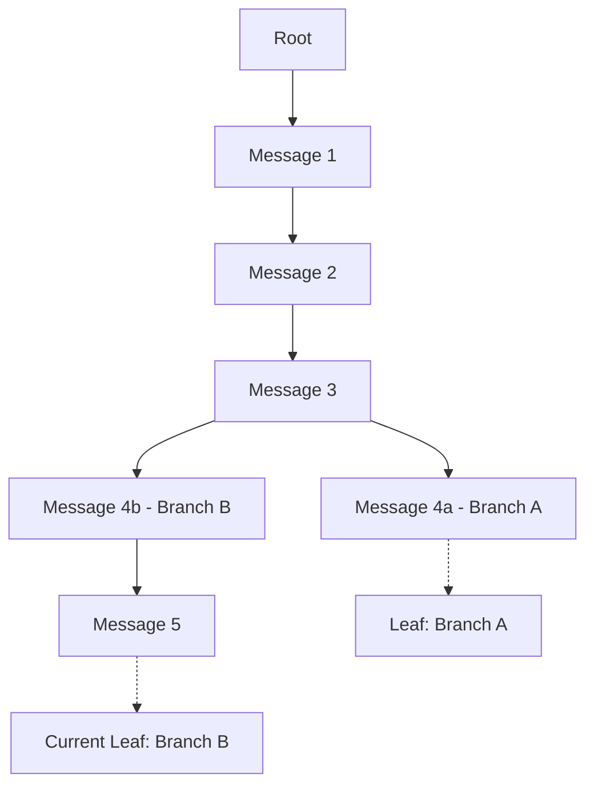
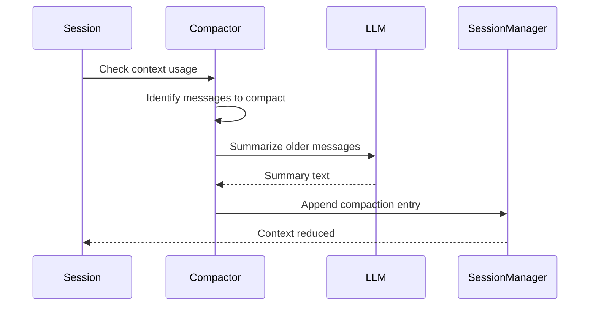

# Memory System - Deep Dive

## Overview

Pi's memory system consists of session storage, session management, and context compaction. Sessions are stored as JSONL files with a tree structure that enables in-place branching.

## Session Storage Format

### File Structure

```jsonl
{"type":"session","version":3,"id":"uuid","timestamp":"ISO8601","cwd":"/path","parentSession":"optional-uuid"}
{"type":"message","id":"uuid","parentId":null,"timestamp":"ISO8601","message":{...}}
{"type":"message","id":"uuid","parentId":"prev-uuid","timestamp":"ISO8601","message":{...}}
{"type":"thinking_level_change","id":"uuid","parentId":"prev-uuid","thinkingLevel":"high"}
{"type":"model_change","id":"uuid","parentId":"prev-uuid","provider":"anthropic","modelId":"claude-opus-4-5"}
{"type":"compaction","id":"uuid","parentId":"prev-uuid","compactedCount":10,"summary":"..."}
{"type":"label_change","id":"uuid","parentId":"prev-uuid","targetId":"message-uuid","label":"checkpoint"}
```

### Entry Types

| Type | Description |
|------|-------------|
| `session` | Header with session metadata |
| `message` | User/assistant/tool messages |
| `thinking_level_change` | Thinking level changes |
| `model_change` | Model switch events |
| `compaction` | Compaction summary entries |
| `branch_summary` | Branch point summaries |
| `label_change` | User-added labels/bookmarks |
| `custom` | Extension-defined entries |

## SessionManager (`packages/coding-agent/src/core/session-manager.ts`)

### Tree Structure



### Core API

```typescript
class SessionManager {
  // Creation
  static create(cwd: string, sessionDir?: string): SessionManager
  static inMemory(): SessionManager
  static open(path: string, sessionDir?: string): SessionManager
  static continueRecent(cwd: string, sessionDir?: string): SessionManager
  static forkFrom(sourcePath: string, cwd: string, sessionDir?: string): SessionManager

  // Tree traversal
  getEntries(): SessionEntry[]         // All entries
  getTree(): SessionEntry[]            // Full tree
  getPath(): SessionEntry[]            // Root to current leaf
  getLeafEntry(): SessionEntry         // Current leaf
  getEntry(id: string): SessionEntry   // Get by ID
  getChildren(id: string): SessionEntry[]  // Direct children

  // Branching
  branch(entryId: string): void                    // Move leaf
  branchWithSummary(id: string, summary: string): void
  createBranchedSession(leafId: string): string    // Extract to new file

  // Labels
  getLabel(id: string): string | undefined
  appendLabelChange(id: string, label: string): void

  // Session info
  getSessionId(): string
  buildSessionContext(): SessionContext
}
```

### Session Context

```typescript
interface SessionContext {
  model?: { provider: string; modelId: string };
  thinkingLevel?: string;
  messages: AgentMessage[];
  totalTokens: number;
  totalCost: number;
}
```

## Session Discovery

### Directory Structure

```
~/.pi/agent/sessions/
├── home/
│   └── user/
│       └── projects/
│           └── my-app/
│               ├── session-uuid-1.jsonl
│               └── session-uuid-2.jsonl
└── var/
    └── www/
        └── session-uuid-3.jsonl
```

### Session Listing

```typescript
// List sessions for current project
const sessions = await SessionManager.list(cwd);

// List all sessions across all projects
const allSessions = await SessionManager.listAll((loaded, total) => {
  console.log(`Loading ${loaded}/${total}...`);
});

// Session info
interface SessionInfo {
  id: string;
  path: string;
  cwd: string;
  timestamp: string;
  firstMessage: string;
  messageCount: number;
  model?: { provider: string; modelId: string };
}
```

## Session Operations

### Creating Sessions

```typescript
// New session with encoded cwd path
const sm = SessionManager.create(process.cwd());

// Continue most recent session
const sm = SessionManager.continueRecent(process.cwd());

// Open specific session file
const sm = SessionManager.open("/path/to/session.jsonl");

// Fork existing session
const sm = SessionManager.forkFrom(sourcePath, process.cwd());
```

### Branching

```typescript
// Navigate to earlier entry (creates new branch)
sm.branch(entryId);

// Branch with summary for context
sm.branchWithSummary(entryId, "Branching to explore alternative approach");

// Create new session file from branch
const newPath = sm.createBranchedSession(leafId);
```

### Labels

```typescript
// Label entry as bookmark
sm.appendLabelChange(entryId, "checkpoint");
sm.appendLabelChange(entryId, "important");
```

## Compaction System

### Overview

Long sessions can exhaust context windows. Compaction summarizes older messages while keeping recent ones intact.

### Triggers

1. **Reactive**: Context overflow recovery (catches error, compacts, retries)
2. **Proactive**: Approaching context limit threshold

### Configuration

```typescript
interface CompactionSettings {
  enabled: boolean;
  proactive: boolean;
  threshold: number;  // Percentage of context window
  minTokensToCompact: number;
}
```

### Compaction Flow



### Manual Compaction

```typescript
// Via CLI
/compact
/compact <custom instructions>

// Via SDK
const result = await session.compact("Focus on API changes");
```

### Compaction Result

```typescript
interface CompactionResult {
  success: boolean;
  compactedCount: number;
  newTokenCount: number;
  summary?: string;
}
```

## Message Persistence

### Append-Only Design

Sessions use append-only JSONL format:
- New entries always appended
- No in-place modifications
- Tree structure via `id`/`parentId` linking
- Branching without file duplication

### Path Resolution

```typescript
// Session path includes encoded cwd
const sessionDir = join(
  baseDir,
  cwd.split(path.sep).join("-"),  // Simple dash encoding
);

// Custom session directory (no cwd encoding)
const sm = SessionManager.create(cwd, "/custom/sessions");
```

## Tree Navigation (`/tree` command)

The interactive mode provides a tree navigator:

```typescript
// Navigation options
interface TreeNavigationOptions {
  summarize?: boolean;       // Add branch summary
  customInstructions?: string;
  replaceInstructions?: boolean;
  label?: string;
}

// Navigate in-place
await session.navigateTree(targetId, options);

// Fork to new session
await session.fork(entryId);
```

### Filter Modes

The tree navigator supports filtering:
- **default**: Show all entries
- **no-tools**: Hide tool call details
- **user-only**: Show only user messages
- **labeled-only**: Show only labeled entries

## Memory Semantics

### Session Restoration

When resuming a session:
1. Load all entries from JSONL file
2. Build tree structure
3. Follow path to current leaf
4. Extract messages along path
5. Restore model and thinking level from entries

### Model Restoration

```typescript
// Try to restore model from session
if (hasExistingSession && existingSession.model) {
  const restoredModel = modelRegistry.find(
    existingSession.model.provider,
    existingSession.model.modelId
  );
  if (restoredModel && await modelRegistry.getApiKey(restoredModel)) {
    model = restoredModel;
  }
}
```

### Thinking Level Restoration

```typescript
// Check if session has thinking level entry
const hasThinkingEntry = sessionManager.getBranch().some(
  (entry) => entry.type === "thinking_level_change"
);

if (hasThinkingEntry) {
  thinkingLevel = existingSession.thinkingLevel as ThinkingLevel;
}
```

## Version History

```typescript
export const CURRENT_SESSION_VERSION = 3;

// v1: Basic message storage
// v2: Added tree structure with parentId
// v3: Added metadata entries (thinking, model changes, labels)
```

## In-Memory Mode

For testing or ephemeral sessions:

```typescript
// No file I/O
const sm = SessionManager.inMemory();

// Custom backend for advanced use cases
class CustomSessionBackend {
  readEntries(): SessionEntry[] { ... }
  appendEntry(entry: SessionEntry): void { ... }
  // ...
}
```

## Export and Sharing

### HTML Export

```bash
# Export to file
/export [output.html]

# Via SDK
import { exportFromFile } from "./core/export-html";
const result = await exportFromFile(inputPath, outputPath);
```

### GitHub Gist Sharing

```bash
/share  # Uploads as private gist
```

## Performance Considerations

### Large Session

For sessions with thousands of entries:
- JSONL format allows streaming reads
- Tree building is O(n)
- Path extraction follows parentId pointers

### Progress Callbacks

```typescript
// List all sessions with progress
const sessions = await SessionManager.listAll((loaded, total) => {
  // Update progress UI
});
```
