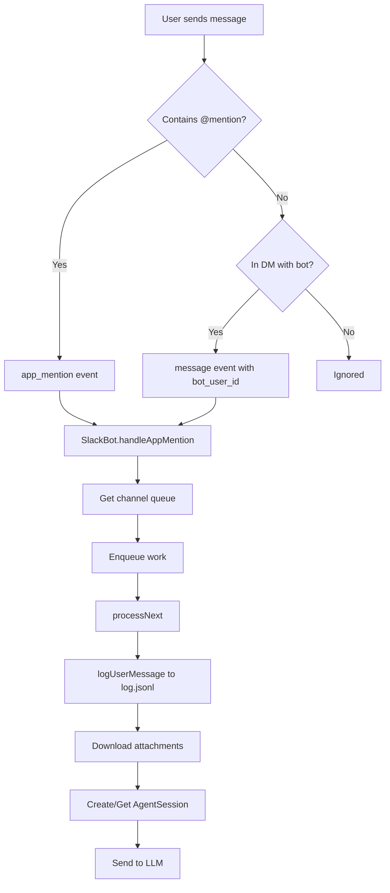
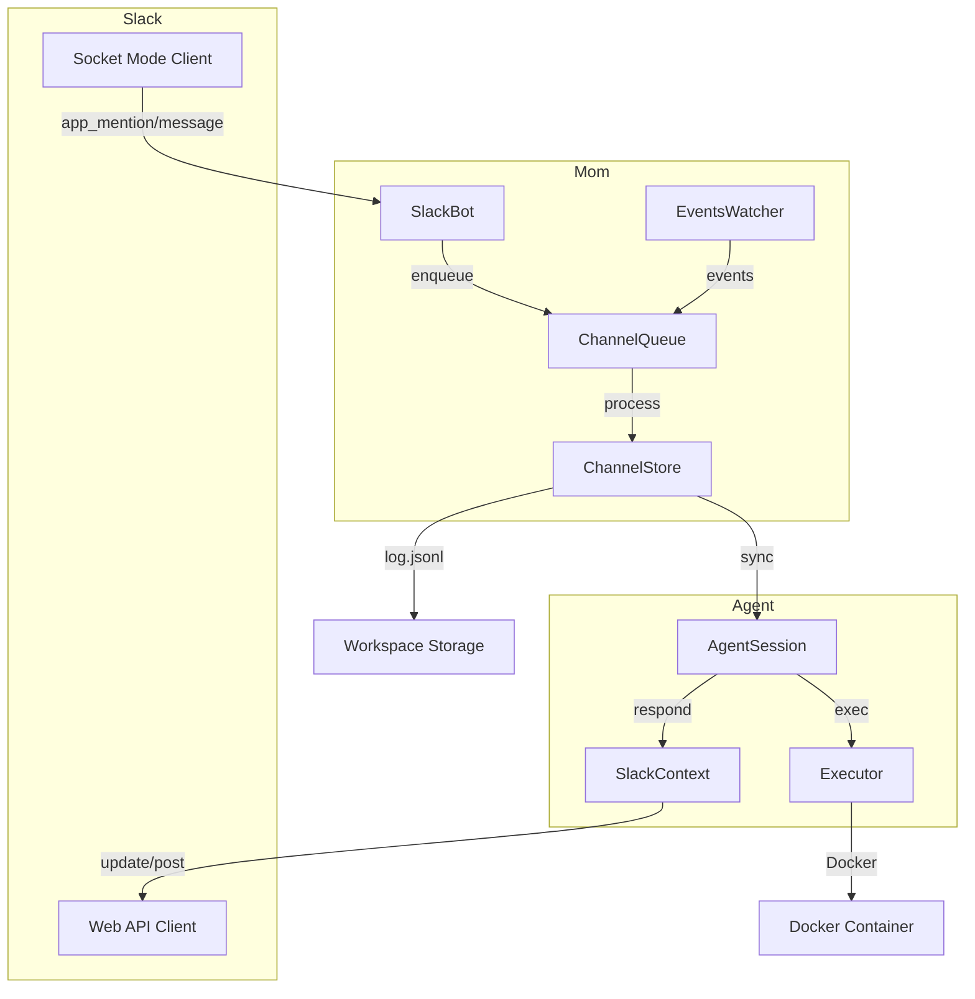

# Mom Slack Integration - Deep Dive

## Overview

**Mom** is a Slack bot that delegates messages to the Pi coding agent. It provides a fully functional AI coding assistant inside Slack, complete with file editing, bash execution, event scheduling, and per-channel state isolation.

**Key Philosophy:** Every Slack channel gets isolated state with dedicated message logs, context files, memory, and skills. The bot runs in Docker sandbox mode by default for security, but can also run on the host.

## Installation & Setup

### Slack App Configuration

Mom requires a custom Slack app with Socket Mode enabled:

**Required Scopes:**
- `app_mentions:read` - Detect @mentions
- `channels:history` - Read channel messages
- `channels:read` - List channels
- `chat:write` - Send messages
- `files:read` - Download attachments
- `files:write` - Upload files
- `im:history` - Read DMs
- `im:read` - List DMs

**Event Subscriptions:**
- `app_mention` - Triggered when bot is @mentioned
- `message` - Triggered for all messages (needs `bot_user` filter to avoid self-loops)

**Socket Mode:** Enabled for real-time event streaming without a public endpoint.

### Configuration Files

```json
// ~/.pi/mom/settings.json
{
  "slackAppToken": "xapp-...",
  "slackBotToken": "xoxb-...",
  "slackTeamId": "T00000000",
  "workspace": "/path/to/workspace",
  "sandbox": {
    "type": "docker",
    "containerName": "mom-sandbox"
  }
}
```

### First Run Initialization

1. **Load settings** from `~/.pi/mom/settings.json`
2. **Connect Slack clients** (`SocketModeClient` + `WebClient`)
3. **Wait for `ready` event** from Socket Mode
4. **Backfill all channels** - fetch missed messages via `conversations.history`
5. **Start events watcher** - fs.watch on `events/` directory
6. **Begin processing** - listen for `app_mention` and `message` events

## Slack Client Architecture

### Dual Client Setup

```typescript
// packages/mom/src/slack.ts

// Socket Mode Client - Real-time events
const socketClient = new SocketModeClient({
  appToken: settings.slackAppToken,
  autoReconnect: true,
});

// Web API Client - HTTP calls (postMessage, files.download, etc.)
const webClient = new WebClient(settings.slackBotToken);
```

**Why two clients?** Socket Mode receives events but cannot make API calls. The WebClient handles all HTTP operations (posting messages, downloading files, fetching history).

### Connection Lifecycle

```typescript
class SlackBot {
  async connect(): Promise<void> {
    // 1. Socket Mode connection
    await this.socketClient.connect();

    // 2. Wait for ready
    await new Promise<void>((resolve) => {
      this.socketClient.on("ready", () => resolve());
    });

    // 3. Backfill missed messages
    await this.backfillAllChannels();

    // 4. Register event handlers
    this.socketClient.on("app_mention", (event) => this.handleAppMention(event));
    this.socketClient.on("message", (event) => this.handleMessage(event));
  }
}
```

## Message Flow

### 1. Incoming Message Detection



### 2. Event Handlers

```typescript
// packages/mom/src/slack.ts

async handleAppMention(event: AppMentionEvent): Promise<void> {
  const channelId = event.channel;
  const queue = this.getChannelQueue(channelId);

  queue.enqueue(async () => {
    // Log user message to log.jsonl
    await this.store.logUserMessage(channelId, {
      user: event.user,
      text: event.text,
      ts: event.ts,
      attachments: await this.store.processAttachments(event.files),
    });

    // Create agent context
    const ctx = createSlackContext(channelId, this.webClient, event.ts);

    // Run agent
    await this.agentRunner.run(channelId, event.text, ctx);
  });
}

async handleMessage(event: MessageEvent): Promise<void> {
  // Skip bot messages (avoid infinite loops)
  if (event.bot_user_id) return;

  // Only process DMs where bot is the conversation partner
  if (!event.channel_type || event.channel_type !== "im") return;

  // Same queue processing as app_mention
  const queue = this.getChannelQueue(event.channel);
  queue.enqueue(async () => { ... });
}
```

### 3. Per-Channel Queue

```typescript
// packages/mom/src/slack.ts

class ChannelQueue {
  private queue: QueuedWork[] = [];
  private processing = false;
  private static MAX_QUEUE_SIZE = 5;

  enqueue(work: QueuedWork): void {
    if (this.queue.length >= ChannelQueue.MAX_QUEUE_SIZE) {
      this.queue.shift(); // Drop oldest
    }
    this.queue.push(work);
    this.processNext();
  }

  private async processNext(): Promise<void> {
    if (this.processing || this.queue.length === 0) return;

    this.processing = true;
    const work = this.queue.shift()!;

    try {
      await work();
    } catch (err) {
      console.error("Queue work failed:", err);
    }

    this.processing = false;
    this.processNext();
  }
}
```

**Why queues?** Slack channels can receive multiple rapid messages. The queue ensures:
- Sequential processing (no race conditions on log.jsonl)
- Backpressure (max 5 pending events)
- Isolation (each channel has its own queue)

## Message Storage Pipeline

### Dual-File Pattern

Each channel maintains two JSONL files:

| File | Purpose | Contains | Compaction |
|------|---------|----------|------------|
| `log.jsonl` | Source of truth | User messages, bot responses (no tool results) | Never |
| `context.jsonl` | LLM context | Full conversation with tool results | Auto when >N messages |

**Why two files?** `log.jsonl` preserves the human-readable history. `context.jsonl` is optimized for LLM consumption and gets compacted to save tokens.

### log.jsonl Structure

```jsonl
{"type":"user","user":"U123","text":"Edit main.ts","ts":"1234567890.123456","attachments":[]}
{"type":"assistant","text":"I'll edit main.ts","ts":"1234567890.123457","toolCalls":[...]}
{"type":"assistant","text":"Done!","ts":"1234567890.123458","toolResults":[...]}
```

**Key fields:**
- `type`: "user" | "assistant" | "system" | "event"
- `user`: Slack user ID (for user messages)
- `text`: Message content
- `ts`: Slack timestamp (unique ID)
- `attachments`: Downloaded file paths
- `toolCalls`/`toolResults`: Omitted from log.jsonl, present in context.jsonl

### Sync to SessionManager

```typescript
// packages/mom/src/context.ts

async syncLogToSessionManager(channelId: string): Promise<void> {
  const logEntries = await this.readLog(channelId);
  const contextEntries = await this.readContext(channelId);

  // Find entries in log but not in context
  const missing = logEntries.filter((log) =>
    !contextEntries.some((ctx) => ctx.ts === log.ts)
  );

  // Add to SessionManager
  for (const entry of missing) {
    sessionManager.addMessage({
      role: entry.type === "user" ? "user" : "assistant",
      content: entry.text,
    });
  }
}
```

## Attachment Processing

### Download Pipeline

```typescript
// packages/mom/src/store.ts

async processAttachments(files: SlackFile[]): Promise<string[]> {
  const relativePaths: string[] = [];

  for (const file of files) {
    // Queue download (doesn't block message processing)
    this.downloadQueue.push(async () => {
      const filename = `${file.ts}_${sanitize(file.name)}`;
      const filepath = path.join(this.channelDir, "attachments", filename);

      // Download with auth
      const response = await fetch(file.url_private, {
        headers: { Authorization: `Bearer ${this.botToken}` }
      });
      const buffer = await response.arrayBuffer();
      fs.writeFileSync(filepath, Buffer.from(buffer));

      console.log(`Downloaded attachment: ${filepath}`);
    });

    relativePaths.push(`attachments/${filename}`);
  }

  return relativePaths;
}
```

**Key design:**
- Attachments download in background (non-blocking)
- Filename includes timestamp to avoid collisions
- Authenticated fetch using bot token
- Paths stored relative to channel directory

### Deduplication

```typescript
// Prevents logging the same message twice
private recentlyLogged = new Map<string, number>();

async logUserMessage(channelId: string, message: UserMessage): Promise<void> {
  const key = `${channelId}:${message.ts}`;

  if (this.recentlyLogged.has(key)) {
    return; // Already logged
  }

  // Write to log.jsonl
  this.writeLog(channelId, message);

  // Cleanup old entries (60s TTL)
  this.recentlyLogged.set(key, Date.now());
  if (this.recentlyLogged.size > 1000) {
    for (const [k, v] of this.recentlyLogged) {
      if (Date.now() - v > 60000) this.recentlyLogged.delete(k);
    }
  }
}
```

## Agent Integration

### SlackContext Adapter

```typescript
// packages/mom/src/main.ts

function createSlackContext(
  channelId: string,
  webClient: WebClient,
  threadTs: string
): SlackContext {
  let accumulatedText = "";
  let workingTimer: NodeJS.Timeout | null = null;

  return {
    async respond(text: string, options?: RespondOptions): Promise<void> {
      accumulatedText += text;

      // Truncate at 35K for main message
      if (accumulatedText.length > 35000) {
        accumulatedText = accumulatedText.slice(0, 35000);
      }

      await webClient.chat.update({
        channel: channelId,
        ts: threadTs,
        text: accumulatedText + (options?.isWorking ? " ..." : ""),
      });
    },

    async respondInThread(text: string): Promise<void> {
      // Truncate at 20K for thread messages
      if (text.length > 20000) {
        text = text.slice(0, 20000);
      }

      await webClient.chat.postMessage({
        channel: channelId,
        thread_ts: threadTs,
        text: text,
      });
    },

    setTyping(enabled: boolean): void {
      // Send typing indicator via Slack API
      if (enabled) {
        webClient.conversations.typing({ channel: channelId });
      }
    },

    setWorking(isWorking: boolean): void {
      if (isWorking) {
        workingTimer = setInterval(() => {
          // Append " ..." to show activity
          webClient.chat.update({
            channel: channelId,
            ts: threadTs,
            text: accumulatedText + " ...",
          });
        }, 3000);
      } else {
        if (workingTimer) clearInterval(workingTimer);
        workingTimer = null;
      }
    },

    async deleteMessage(): Promise<void> {
      await webClient.chat.delete({
        channel: channelId,
        ts: threadTs,
      });
    },
  };
}
```

### Tool Execution Streaming

```typescript
// packages/mom/src/agent.ts

agentSession.on("tool_execution_start", async (agentEvent) => {
  const label = getToolLabel(agentEvent.toolName, agentEvent.args);
  if (label) {
    // Append to main message
    await slackContext.respond(`\n\n*${agentEvent.toolName}*: ${label}`);
  }
});

agentSession.on("tool_execution_end", async (agentEvent) => {
  const label = getToolLabel(agentEvent.toolName, agentEvent.args);
  const duration = agentEvent.duration;
  const argsFormatted = formatArgs(agentEvent.args);
  const resultStr = formatResult(agentEvent.result);

  // Post detailed result to thread
  let threadMessage = `*${agentEvent.isError ? "✗" : "✓"} ${agentEvent.toolName}*`;
  if (label) threadMessage += `: ${label}`;
  threadMessage += ` (${duration}s)\n`;
  if (argsFormatted) threadMessage += `\`\`\`\n${argsFormatted}\n\`\`\`\n`;
  threadMessage += `*Result:*\n\`\`\`\n${resultStr}\n\`\`\``;

  await slackContext.respondInThread(threadMessage);
});
```

**Why split?** Main message stays readable with high-level progress. Thread contains verbose tool details for debugging.

### [SILENT] Pattern

```typescript
// packages/mom/src/agent.ts

agentSession.on("message_end", async ({ message }) => {
  if (message.content.includes("[SILENT]")) {
    // Delete the message and entire thread
    await slackContext.deleteMessage();

    // For periodic checks with nothing to report
    return;
  }
});
```

**Use case:** Periodic events that check status but have nothing new to report. The bot posts, then immediately deletes to avoid spam.

## Events System

### Three Event Types

```typescript
// packages/mom/src/events.ts

// 1. Immediate - fires when file is created
interface ImmediateEvent {
  type: "immediate";
  message: string;
}

// 2. One-shot - fires once at specific time
interface OneShotEvent {
  type: "one-shot";
  schedule: string; // ISO 8601: "2026-03-19T14:30:00"
  timezone: string; // "America/New_York"
  message: string;
}

// 3. Periodic - fires on cron schedule
interface PeriodicEvent {
  type: "periodic";
  schedule: string; // Cron: "0 9 * * *"
  timezone: string;
  message: string;
}
```

### File-Based Scheduling

```
workspace/
└── events/
    ├── daily-check.ts      # Periodic: "0 9 * * *"
    ├── reminder-3pm.txt    # One-shot: "2026-03-19T15:00:00"
    └── ping-now.json       # Immediate
```

**File extensions:** `.json`, `.txt`, `.ts` (all parsed based on content)

### EventsWatcher Implementation

```typescript
// packages/mom/src/events.ts

class EventsWatcher {
  private fsWatcher: FSWatcher | null = null;
  private scheduledJobs = new Map<string, Job>();
  private debounceTimers = new Map<string, NodeJS.Timeout>();

  startWatching(eventsDir: string): void {
    // Watch for file creation/modification
    this.fsWatcher = fs.watch(eventsDir, { persistent: false }, (eventType, filename) => {
      if (eventType === "rename") {
        // File created
        this.debounceTimers.set(filename, setTimeout(() => {
          this.processEventFile(path.join(eventsDir, filename));
          this.debounceTimers.delete(filename);
        }, 100));
      }
    });

    // Load existing events
    for (const filename of fs.readdirSync(eventsDir)) {
      this.processEventFile(path.join(eventsDir, filename));
    }
  }

  private processEventFile(filepath: string): void {
    const event = parseEventFile(filepath);

    switch (event.type) {
      case "immediate":
        // Send to all channels immediately
        this.triggerImmediate(event);
        break;

      case "one-shot":
        // Schedule with croner
        const job = croner(event.schedule, { timezone: event.timezone });
        job.on("tick", () => {
          this.triggerOneShot(event);
          job.stop(); // One-shot fires once
          this.scheduledJobs.delete(filepath);
        });
        this.scheduledJobs.set(filepath, job);
        break;

      case "periodic":
        // Schedule with croner (recurring)
        const periodicJob = croner(event.schedule, { timezone: event.timezone });
        periodicJob.on("tick", () => this.triggerPeriodic(event));
        this.scheduledJobs.set(filepath, periodicJob);
        break;
    }
  }

  triggerImmediate(event: ImmediateEvent): void {
    for (const channelId of this.channelQueues.keys()) {
      const queue = this.getChannelQueue(channelId);
      queue.enqueue(async () => {
        // Create synthetic Slack event
        const syntheticEvent = {
          type: "event",
          name: path.basename(event.file),
          text: event.message,
          ts: Date.now().toString(),
        };
        await this.store.logUserMessage(channelId, syntheticEvent);
        await this.agentRunner.run(channelId, event.message, this.slackContext);
      });
    }
  }
}
```

### Event Filename Format

When an event fires, it creates a synthetic Slack message:

```
[EVENT:filename:type:schedule] message text
```

Example: `[EVENT:daily-check:periodic:0 9 * * *] Good morning! Checking for updates...`

This format:
- Identifies the source event file
- Shows event type and schedule
- Preserves the original message

## Docker Sandbox Execution

### Executor Interface

```typescript
// packages/mom/src/sandbox.ts

interface Executor {
  exec(command: string, options: ExecOptions): Promise<ExecResult>;
  getWorkspacePath(channelId: string): string;
}
```

### DockerExecutor Implementation

```typescript
// packages/mom/src/sandbox.ts

class DockerExecutor implements Executor {
  constructor(private containerName: string) {}

  async exec(command: string, options: ExecOptions): Promise<ExecResult> {
    // Wrap command for Docker exec
    const wrappedCommand = `docker exec ${this.containerName} sh -c '${command}'`;

    const child = spawn(wrappedCommand, [], {
      shell: true,
      stdio: ["pipe", "pipe", "pipe"],
    });

    let stdout = "";
    let stderr = "";

    child.stdout.on("data", (data) => { stdout += data; });
    child.stderr.on("data", (data) => { stderr += data; });

    return new Promise((resolve, reject) => {
      child.on("close", (code) => {
        resolve({ exitCode: code, stdout, stderr });
      });

      child.on("error", reject);

      // Timeout handling
      if (options.timeout) {
        setTimeout(() => {
          // Kill process tree
          spawn("pkill", ["-9", "-P", child.pid!.toString()]);
          child.kill("SIGKILL");
          reject(new Error(`Command timed out after ${options.timeout}ms`));
        }, options.timeout);
      }
    });
  }

  getWorkspacePath(channelId: string): string {
    // Container sees: /workspace/{channelId}/
    return `/workspace/${channelId}`;
  }
}
```

### Path Translation

```typescript
// Host path: /home/user/mom-workspace/abc123/main.ts
// Container path: /workspace/abc123/main.ts

function translatePath(hostPath: string, channelId: string): string {
  const hostDir = `/home/user/mom-workspace`;
  const containerDir = `/workspace`;

  return hostPath.replace(`${hostDir}/${channelId}`, `${containerDir}/${channelId}`);
}
```

**Why Docker?** Security isolation. If the LLM runs `rm -rf /`, it only destroys the container, not the host.

### HostExecutor (Development Mode)

```typescript
class HostExecutor implements Executor {
  async exec(command: string, options: ExecOptions): Promise<ExecResult> {
    const child = spawn(command, [], {
      shell: true,
      stdio: ["pipe", "pipe", "pipe"],
      cwd: options.cwd,
    });

    // Same stdout/stderr handling as DockerExecutor
    ...
  }

  getWorkspacePath(channelId: string): string {
    // Host path directly
    return path.join(this.workspaceDir, channelId);
  }
}
```

**Warning:** Host mode gives the agent full access to the host filesystem and commands. Only use in trusted environments.

## Workspace Layout

```
workspace/
├── {channel-id-1}/
│   ├── log.jsonl              # Human-readable message history
│   ├── context.jsonl          # LLM context (auto-compacted)
│   ├── MEMORY.md              # Long-term memory
│   ├── skills/                # Discovered skills
│   │   └── deploy-skill.ts
│   └── attachments/           # Downloaded files
│       └── 1234567890_image.png
├── {channel-id-2}/
│   └── ...
└── events/
    ├── daily-check.ts
    └── reminder.txt
```

**Per-channel isolation:** Each Slack channel/DM gets its own directory with independent state.

## Security Considerations

### Prompt Injection

**Risk:** Users can paste malicious instructions that look like system prompts.

**Mitigation:** System prompt clearly delimits instructions vs user content. Tools like `bash` and `write` should be audited before execution.

### Credential Exfiltration

**Risk:** LLM might be tricked into sending secrets to external servers.

**Mitigation:** Docker sandbox limits network access. Monitor outbound traffic.

### Supply Chain Attacks

**Risk:** `npm install` or `pip install` could pull malicious packages.

**Mitigation:** Docker isolation. Review package changes before committing.

### Privilege Escalation

**Risk:** If running in host mode, agent could access sensitive files.

**Mitigation:** Use Docker sandbox. Never run mom as root.

## Key Design Decisions

### 1. Socket Mode over HTTP Events

**Why?** No public endpoint required. Events stream directly over WebSocket. Simpler deployment, no webhook verification.

**Tradeoff:** Requires `@slack/socket-mode` package and app token.

### 2. Per-Channel Queues

**Why?** Prevents race conditions on log.jsonl. Ensures sequential processing within a channel while allowing parallel processing across channels.

**Tradeoff:** Max 5 queued events. Older events dropped if queue full.

### 3. Dual-File Storage

**Why?** `log.jsonl` is the audit trail (never modified). `context.jsonl` is optimized for LLM (compacted to save tokens).

**Tradeoff:** Sync logic required to keep files aligned.

### 4. Tool Results in Thread

**Why?** Main message stays readable. Thread provides detailed debugging info without cluttering the channel.

**Tradeoff:** Users must expand thread to see full details.

### 5. [SILENT] Pattern

**Why?** Periodic checks often have nothing to report. Deleting the message avoids spamming the channel.

**Tradeoff:** No record of silent checks (by design).

### 6. Background Attachment Downloads

**Why?** Don't block message processing on network calls. Downloads can fail without affecting the conversation flow.

**Tradeoff:** Attachments may arrive after the message is processed.

## Integration Flow Summary



## Files Reference

| File | Purpose |
|------|---------|
| `src/slack.ts` | Socket Mode client, event handlers, backfill, ChannelQueue |
| `src/main.ts` | Entry point, SlackContext adapter |
| `src/agent.ts` | Agent runner, tool streaming, [SILENT] handling |
| `src/events.ts` | Events watcher (immediate, one-shot, periodic) |
| `src/store.ts` | Channel storage, attachment downloads, deduplication |
| `src/context.ts` | Sync log.jsonl to SessionManager |
| `src/sandbox.ts` | Docker/host executor |
| `src/tools/index.ts` | Tool creation (read, bash, edit, write, attach) |
| `README.md` | User documentation |
