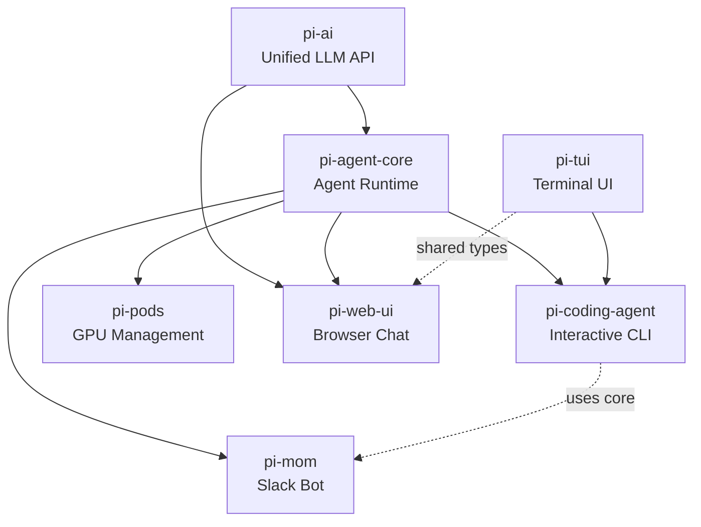
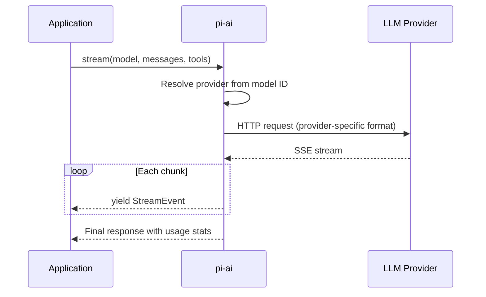
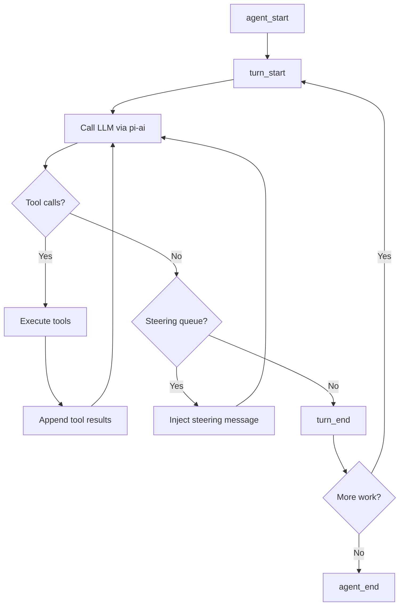
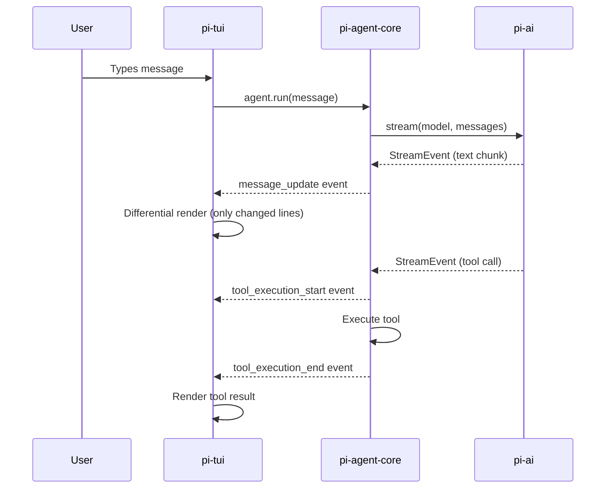
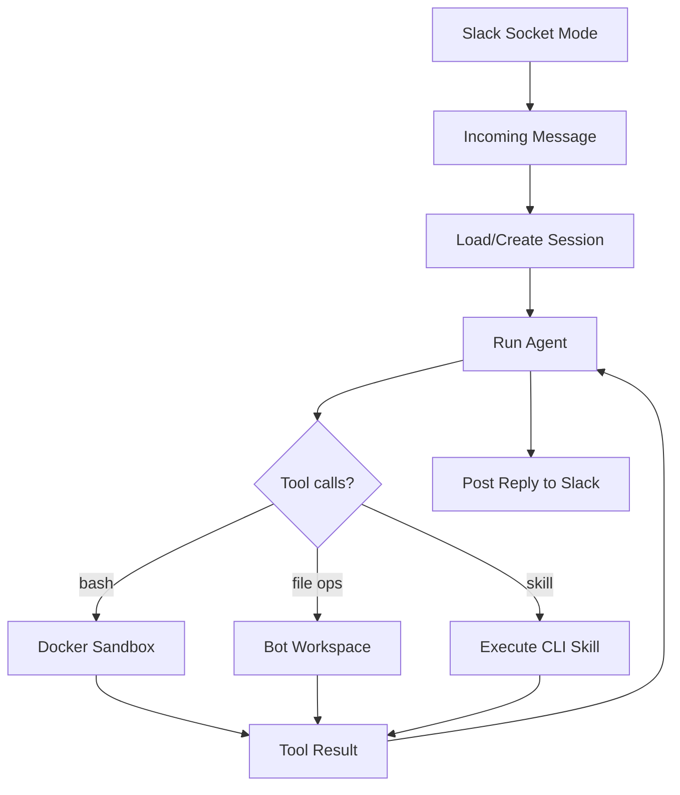

# Pi -- Architecture

## Package Dependency Graph



### Dependency Direction

Dependencies flow **upward** -- applications depend on runtime, runtime depends on foundation. Nothing flows backward.

| Package | Depends On | Depended On By |
|---------|-----------|----------------|
| pi-ai | (none) | agent-core, web-ui, pods |
| pi-agent-core | pi-ai | coding-agent, mom, pods, web-ui |
| pi-tui | (none, standalone) | coding-agent, web-ui (types) |
| pi-coding-agent | pi-ai, pi-agent-core, pi-tui | mom (uses core internals) |
| pi-mom | pi-agent-core, pi-coding-agent | (none) |
| pi-pods | pi-agent-core | (none) |
| pi-web-ui | pi-ai, pi-agent-core | (none) |

## Communication Patterns

### 1. LLM API Calls (pi-ai)



pi-ai normalizes all provider differences. The application sees a single `StreamEvent` type regardless of whether the backend is OpenAI, Anthropic, or Gemini.

### 2. Agent Loop (pi-agent-core)



The agent loop keeps calling the LLM until there are no more tool calls and no more steering messages. Each iteration is a "turn."

### 3. Event-Driven UI (pi-tui ← pi-agent-core)



The TUI subscribes to agent events and renders incrementally. Only changed terminal lines are redrawn (differential rendering via CSI 2026 synchronized output).

### 4. Slack Bot (pi-mom)



Mom manages per-channel sessions with persistent history. All bash commands execute inside a Docker container for security isolation.

## Data Model

### Messages

All packages share a common message format:

```typescript
type Message = UserMessage | AssistantMessage | ToolResultMessage;

interface UserMessage {
  role: 'user';
  content: string | ContentPart[];
}

interface AssistantMessage {
  role: 'assistant';
  content: string | ContentPart[];
  tool_calls?: ToolCall[];
}

interface ToolResultMessage {
  role: 'tool';
  tool_call_id: string;
  content: string;
}
```

Messages flow through the system unchanged. pi-ai formats them for each provider. pi-agent-core manages the conversation array. Applications append user messages and read assistant responses.

### Tool Definitions

```typescript
interface AgentTool<T extends TSchema = TSchema> {
  name: string;
  description: string;
  parameters: T;       // TypeBox schema
  execute: (
    id: string,
    params: Static<T>,
    signal: AbortSignal,
    onUpdate?: (update: string) => void
  ) => Promise<ToolResult>;
}
```

Tools are defined once with a TypeBox schema. The schema serves three purposes:
1. TypeScript type inference (compile-time safety)
2. Runtime input validation (before execution)
3. JSON Schema generation (sent to LLM for function calling)

### Events

```typescript
type AgentEvent =
  | { type: 'agent_start' }
  | { type: 'turn_start'; turn: number }
  | { type: 'message_update'; content: string; delta: string }
  | { type: 'tool_execution_start'; tool: string; id: string; params: unknown }
  | { type: 'tool_execution_end'; tool: string; id: string; result: ToolResult }
  | { type: 'thinking_update'; content: string }
  | { type: 'turn_end'; turn: number }
  | { type: 'agent_end' }
  // ... 12+ more event types
```

Events are the decoupling mechanism. The agent runtime doesn't know about the TUI. The TUI doesn't know about Slack. They communicate through events.

## Build System

```
npm workspaces (monorepo)
  ↓
tsgo (TypeScript compilation per package)
  ↓
Vitest (test runner)
  ↓
Biome (linting + formatting)
```

Each package builds independently. Workspace dependencies are resolved by npm. The build order follows the dependency graph: pi-ai first, then pi-agent-core, then applications.

### Package Exports

Each package uses Node.js subpath exports for tree-shaking:

```json
// pi-ai package.json (simplified)
{
  "exports": {
    ".": "./dist/index.js",
    "./anthropic": "./dist/providers/anthropic.js",
    "./openai": "./dist/providers/openai.js",
    "./openai-responses": "./dist/providers/openai-responses.js",
    "./bedrock-provider": "./dist/providers/bedrock.js"
  }
}
```

Applications import only the providers they need. Unused providers are not bundled.

## Key Directories

```
packages/ai/src/
  ├── index.ts              Public API (getModel, stream, complete)
  ├── types.ts              Core types (Provider, Api, Context, Model)
  ├── providers/            Per-provider implementations
  │   ├── anthropic.ts
  │   ├── openai.ts
  │   ├── openai-responses.ts
  │   ├── google.ts
  │   ├── bedrock.ts
  │   └── ... (15+ more)
  ├── tools/                Tool calling utilities
  └── context/              Context serialization

packages/agent/src/
  ├── agent.ts              Agent class (high-level API)
  ├── agent-loop.ts         Core loop implementation
  ├── events.ts             Event type definitions
  ├── tools.ts              Tool execution and validation
  └── messages.ts           Message transformation

packages/coding-agent/src/
  ├── cli.ts                CLI entry point
  ├── core/
  │   ├── agent-session.ts  Session management
  │   ├── tools/            Built-in tools (read, write, edit, bash)
  │   ├── extensions/       Plugin system
  │   └── compaction/       Context window management
  └── modes/                Run modes (interactive, print, json, rpc)

packages/tui/src/
  ├── tui.ts                Main TUI class
  ├── terminal.ts           Terminal abstraction
  ├── components/           Built-in components
  │   ├── text.ts
  │   ├── input.ts
  │   ├── editor.ts
  │   ├── markdown.ts
  │   ├── select-list.ts
  │   └── image.ts
  └── rendering/            Differential rendering engine
```
