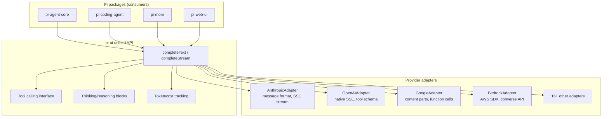
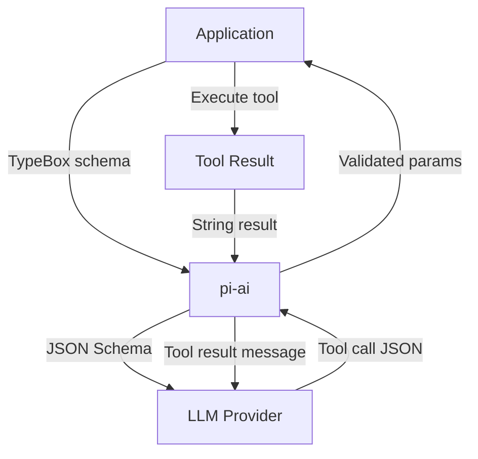

# Pi -- pi-ai Package

## Purpose

`@mariozechner/pi-ai` is the foundation layer. It provides a unified API for calling 20+ LLM providers with streaming, tool calling, thinking/reasoning, token tracking, and cost estimation. Every other Pi package depends on it.

## Why It Exists as a Separate Package

LLM provider APIs differ in message format, streaming protocol, tool calling schema, and authentication. pi-ai absorbs all of that. The rest of Pi writes against one API and gets every provider for free.

## Provider Abstraction Layer



## Supported Providers

| Provider | Module | Auth |
|----------|--------|------|
| Anthropic | `./anthropic` | API key |
| OpenAI (Chat) | `./openai` | API key |
| OpenAI (Responses) | `./openai-responses` | API key |
| Google Gemini | `./google` | API key / OAuth |
| AWS Bedrock | `./bedrock-provider` | AWS credentials |
| Azure OpenAI | `./azure` | API key / Entra ID |
| Mistral | `./mistral` | API key |
| xAI (Grok) | `./xai` | API key |
| Groq | `./groq` | API key |
| DeepSeek | `./deepseek` | API key |
| Together | `./together` | API key |
| Fireworks | `./fireworks` | API key |
| GitHub Copilot | `./copilot` | OAuth |
| OpenRouter | `./openrouter` | API key |
| Cerebras | `./cerebras` | API key |
| NVIDIA NIM | `./nvidia` | API key |
| Sambanova | `./sambanova` | API key |
| Custom/Local | `./openai` (compatible) | Varies |

Each provider is a subpath export -- you only import the ones you use.

## Core API

### Model Discovery

```typescript
import { getModel, getModels, getProviders } from '@mariozechner/pi-ai';

// Get all available providers
const providers = getProviders();
// → ['anthropic', 'openai', 'google', 'bedrock', ...]

// Get all models for a provider
const models = await getModels('anthropic');
// → [{ id: 'claude-sonnet-4-6', name: 'Claude Sonnet 4.6', ... }, ...]

// Get a specific model configuration
const model = getModel('claude-sonnet-4-6');
// → { id, provider, contextWindow, maxOutput, supportsTools, supportsThinking, ... }
```

### Streaming (Full Control)

```typescript
import { stream } from '@mariozechner/pi-ai';

const events = stream({
  model: 'claude-sonnet-4-6',
  messages: [
    { role: 'user', content: 'Explain Pi framework architecture' }
  ],
  tools: [myTool],
  onEvent: (event) => {
    switch (event.type) {
      case 'text_delta':
        process.stdout.write(event.text);
        break;
      case 'tool_call':
        console.log('Tool called:', event.name, event.arguments);
        break;
      case 'thinking_delta':
        // Extended thinking output
        break;
      case 'usage':
        console.log('Tokens:', event.input, event.output);
        break;
    }
  }
});

const response = await events;
```

### Simple Completion

```typescript
import { completeSimple } from '@mariozechner/pi-ai';

const result = await completeSimple({
  model: 'claude-sonnet-4-6',
  prompt: 'What is TypeScript?',
});
// result.text → "TypeScript is..."
// result.usage → { input: 12, output: 150, cost: 0.0012 }
```

### Stream Simple (Reasoning Interface)

```typescript
import { streamSimple } from '@mariozechner/pi-ai';

const stream = streamSimple({
  model: 'claude-sonnet-4-6',
  prompt: 'Plan a migration strategy',
  thinking: true,  // Enable extended thinking
});

for await (const chunk of stream) {
  if (chunk.type === 'thinking') {
    console.log('[thinking]', chunk.text);
  } else {
    process.stdout.write(chunk.text);
  }
}
```

## Tool Calling

pi-ai uses TypeBox schemas for tool definitions. The schema is validated at runtime and converted to JSON Schema for the LLM.

```typescript
import { Type, type Static } from '@sinclair/typebox';

const searchTool = {
  name: 'search',
  description: 'Search the web for information',
  parameters: Type.Object({
    query: Type.String({ description: 'Search query' }),
    maxResults: Type.Optional(Type.Number({ description: 'Max results', default: 5 })),
  }),
};

// Type inference from schema
type SearchParams = Static<typeof searchTool.parameters>;
// → { query: string; maxResults?: number }
```

### How Tool Calls Flow Through Providers



Each provider converts the JSON Schema into its native format:
- **Anthropic**: `tools` array with `input_schema`
- **OpenAI**: `tools` array with `function.parameters`
- **Google**: `functionDeclarations` with `parameters`
- **Bedrock**: Provider-specific wrapping

pi-ai handles the conversion. The application defines tools once.

## Context System

pi-ai supports serializing and deserializing conversation context for:
- Saving/restoring sessions
- Cross-provider handoffs (start with Claude, continue with GPT)
- Context compaction (summarizing old messages to fit context window)

```typescript
import { serializeContext, deserializeContext } from '@mariozechner/pi-ai';

// Save context
const serialized = serializeContext(messages, model);
fs.writeFileSync('session.json', JSON.stringify(serialized));

// Restore context (potentially with a different model)
const messages = deserializeContext(serialized, 'gpt-4o');
```

## OAuth Authentication

Some providers (Anthropic Max, Google, GitHub Copilot) use OAuth. pi-ai handles the full flow:

```typescript
import { loginAnthropic } from '@mariozechner/pi-ai/anthropic';
import { loginGoogle } from '@mariozechner/pi-ai/google';
import { loginCopilot } from '@mariozechner/pi-ai/copilot';

// Opens browser for OAuth, stores token
const token = await loginAnthropic();
```

## Token and Cost Tracking

Every API call returns a detailed `Usage` object that tracks tokens and costs across five dimensions:

```typescript
interface Usage {
  input: number;         // Non-cached input tokens
  output: number;        // Output (completion) tokens
  cacheRead: number;     // Tokens served from prompt cache (cheaper)
  cacheWrite: number;    // Tokens written to prompt cache (first time)
  totalTokens: number;   // Sum of all four categories

  cost: {
    input: number;       // USD cost for input tokens
    output: number;      // USD cost for output tokens
    cacheRead: number;   // USD cost for cache reads
    cacheWrite: number;  // USD cost for cache writes
    total: number;       // Total USD cost for this call
  };
}
```

### Model Pricing Tables

Each model in pi-ai carries a built-in pricing table expressed as **USD per million tokens**. The `Model<TApi>` interface includes:

```typescript
interface Model<TApi extends Api> {
  // ...
  cost: {
    input: number;       // $/M input tokens
    output: number;      // $/M output tokens
    cacheRead: number;   // $/M cache-read tokens
    cacheWrite: number;  // $/M cache-write tokens
  };
  // ...
}
```

Pricing is defined in `models.generated.ts` -- a large generated file that registers every model with its provider, context window, max output, capabilities, and pricing. Examples:

| Model | Input ($/M) | Output ($/M) | Cache Read ($/M) | Cache Write ($/M) |
|-------|-------------|--------------|-------------------|-------------------|
| Claude Sonnet 4.6 | $3.00 | $15.00 | $0.30 | $3.75 |
| Claude Opus 4.7 | $15.00 | $75.00 | $1.50 | $18.75 |
| GPT-5.2 | $2.50 | $12.50 | $0.50 | $3.13 |
| GPT-5.3 | $5.00 | $25.00 | $1.25 | $6.25 |
| Gemini 2.5 Pro | $2.50 | $10.00 | $0.25 | $1.25 |
| Amazon Nova Lite | $0.06 | $0.24 | $0.015 | $0 |

These values match the providers' public pricing and are updated as the file is regenerated.

### Cost Calculation

The `calculateCost()` function in `models.ts` applies the pricing table to actual usage:

```typescript
export function calculateCost<TApi extends Api>(model: Model<TApi>, usage: Usage): Usage["cost"] {
  usage.cost.input = (model.cost.input / 1_000_000) * usage.input;
  usage.cost.output = (model.cost.output / 1_000_000) * usage.output;
  usage.cost.cacheRead = (model.cost.cacheRead / 1_000_000) * usage.cacheRead;
  usage.cost.cacheWrite = (model.cost.cacheWrite / 1_000_000) * usage.cacheWrite;
  usage.cost.total = usage.cost.input + usage.cost.output + usage.cost.cacheRead + usage.cost.cacheWrite;
  return usage.cost;
}
```

The formula is straightforward: `(price_per_million / 1_000_000) * actual_token_count`. Each cost component is calculated independently and summed.

### Per-Provider Usage Extraction

Each provider extracts token counts from its native response format:

- **Anthropic**: Reads `usage.input_tokens`, `usage.output_tokens`, `usage.cache_read_input_tokens`, and `usage.cache_creation_input_tokens` from the Message API response. Both streaming (message_stop event) and non-streaming modes are covered.
- **OpenAI (Chat Completions)**: Reads `usage.prompt_tokens`, `usage.completion_tokens`, and cached token fields from the response. Also handles `prompt_tokens_details.cached_tokens` for Azure OpenAI.
- **OpenAI (Responses API)**: Reads from `response.usage` including `input_tokens`, `output_tokens`, and `output_tokens_details.reasoning_tokens`.
- **Google Gemini**: Reads `usageMetadata.promptTokenCount`, `candidates[0].tokenCount`, and `cachedContentTokenCount`.
- **AWS Bedrock**: Extracts from the Converse API response's `usage` block.
- **Google Vertex**: Reads `usageMetadata.promptTokenCount`, `candidatesMetadata.tokenCount`, and `cachedContentTokenCount`.

Providers initialize `usage` with zeroed counters at the start of each call, then populate them from the response. The cost field is initially `{ input: 0, output: 0, cacheRead: 0, cacheWrite: 0, total: 0 }` and filled by `calculateCost()`.

### Service Tier Pricing Adjustments

Some providers offer service tiers that affect pricing. OpenAI's Responses API and Codex Responses apply a **service tier multiplier**:

```typescript
function getServiceTierCostMultiplier(tier: string | undefined): number {
  switch (tier) {
    case "auto":  return 1.0;   // Default pricing
    case "default": return 1.0;
    case "flex":  return 0.5;   // 50% discount (lower priority)
    case "priority": return 2.0; // 2x cost (higher priority)
    default: return 1;
  }
}

function applyServiceTierPricing(usage: Usage, serviceTier: string | undefined) {
  const multiplier = getServiceTierCostMultiplier(serviceTier);
  if (multiplier === 1) return;
  usage.cost.input *= multiplier;
  usage.cost.output *= multiplier;
  usage.cost.cacheRead *= multiplier;
  usage.cost.cacheWrite *= multiplier;
  usage.cost.total = usage.cost.input + usage.cost.output + usage.cost.cacheRead + usage.cost.cacheWrite;
}
```

The `flex` tier halves costs (lower priority), while `priority` doubles them. This is applied **after** the base cost calculation.

### Faux Provider (Local Models) -- Usage Estimation

The `faux` provider handles local models (llama.cpp, Ollama, etc.) that don't report token counts. It uses an **estimation strategy**:

```typescript
function withUsageEstimate(
  message: AssistantMessage,
  context: Context,
  options: StreamOptions | undefined,
  promptCache: Map<string, string>,
): AssistantMessage {
  const promptText = serializeContext(context);
  const promptTokens = estimateTokens(promptText);
  const outputTokens = estimateTokens(assistantContentToText(message.content));
  // ... cache-aware estimation
}
```

The estimation:
1. Serializes the full context to text
2. Counts tokens using a character-based heuristic (~4 chars per token)
3. For cache-aware sessions: compares current prompt text against the previous prompt, finds the common prefix, and splits tokens into cache-read (prefix) vs cache-write (new content)
4. Output tokens are estimated from the response text length

Cost for faux providers is always `$0` since local models have no API charges, but token counts are still tracked for context window management.

### Session-Level Cost Aggregation

At the `pi-agent-core` level, usage is accumulated across all turns in a session. The `AgentSession` class in `pi-coding-agent` provides `getSessionStats()`:

```typescript
interface SessionStats {
  sessionFile: string | undefined;
  sessionId: string;
  userMessages: number;
  assistantMessages: number;
  toolCalls: number;
  toolResults: number;
  totalMessages: number;
  tokens: {
    input: number;
    output: number;
    cacheRead: number;
    cacheWrite: number;
    total: number;
  };
  cost: number;             // Total USD spent in this session
  contextUsage?: ContextUsage;
}
```

The aggregation walks all `AssistantMessage` entries in the current context and sums each field:

```typescript
let totalInput = 0, totalOutput = 0, totalCacheRead = 0, totalCacheWrite = 0, totalCost = 0;
for (const msg of messages) {
  if (msg.role === "assistant") {
    totalInput += msg.usage.input;
    totalOutput += msg.usage.output;
    totalCacheRead += msg.usage.cacheRead;
    totalCacheWrite += msg.usage.cacheWrite;
    totalCost += msg.usage.cost.total;
  }
}
```

### Post-Compaction Usage Accuracy

After context compaction, pre-compaction messages carry stale usage data that reflects the old (larger) context. The session manager handles this by:

1. Only trusting `usage` from `AssistantMessage` entries that were created **after** the latest compaction boundary
2. For error messages (no usage data), estimating cost from the last successful post-compaction response
3. Using `calculateContextTokens()` to verify the context size matches the reported usage

### Cost in the Agent Event Protocol

Usage flows through the agent event system at multiple points:

- `turn_end` events carry the `Usage` for that specific turn
- `message_update` events carry partial text, not usage
- `agent_end` events carry the final accumulated `Usage` from the last turn

Applications that subscribe to agent events can track cost in real-time by listening to `turn_end` and accumulating the `cost.total` field.

### Cost Comparison Across Models

The model registry (`models.ts`) provides `getModel()`, `getModels()`, and `getProviders()` for programmatic access. A common pattern for comparing costs:

```typescript
const models = getModels('anthropic');
for (const m of models) {
  console.log(`${m.name}: input=$${m.cost.input}/M, output=$${m.cost.output}/M`);
}
```

This lets applications choose models based on budget constraints. The `StreamParams.max_price` field supports filtering by maximum price per million tokens:

```typescript
interface StreamParams {
  max_price?: {
    input?: number;   // Max $/M input tokens
    output?: number;  // Max $/M output tokens
  };
  // ...
}
```

### AWS Cost Allocation Tags

For AWS Bedrock, pi-ai supports `costAllocationTags` -- key-value pairs attached to inference requests that appear in AWS Cost Explorer. This enables per-project, per-team, or per-environment cost tracking at the AWS billing level.

### Design Decisions

1. **Pricing embedded in model config** -- No external API calls needed for cost estimation. Works offline.
2. **Per-million-token pricing** -- Matches how all providers bill. Simple division, no floating-point surprises.
3. **Usage on every message** -- Every `AssistantMessage` carries its own `Usage`, enabling accurate per-turn and per-session aggregation.
4. **Service tier awareness** -- OpenAI's flex/priority tiers multiply costs after base calculation.
5. **Faux provider estimation** -- Local models get token estimates for context management even though cost is always zero.

## Provider Architecture

Each provider implements a common interface:

```typescript
interface ProviderAdapter {
  stream(params: StreamParams): AsyncIterable<StreamEvent>;
  complete(params: CompleteParams): Promise<CompleteResponse>;
  listModels(): Promise<ModelInfo[]>;
}
```

The adapter converts pi-ai's normalized types to/from the provider's native format. All provider-specific logic is encapsulated in the adapter file.

```
packages/ai/src/providers/
  ├── anthropic.ts          Anthropic Messages API
  ├── openai.ts             OpenAI Chat Completions
  ├── openai-responses.ts   OpenAI Responses API
  ├── google.ts             Google Gemini
  ├── bedrock.ts            AWS Bedrock (wraps Anthropic/others)
  ├── azure.ts              Azure OpenAI
  ├── mistral.ts            Mistral
  ├── xai.ts                xAI (Grok)
  ├── groq.ts               Groq
  ├── deepseek.ts           DeepSeek
  ├── together.ts           Together AI
  ├── fireworks.ts          Fireworks
  ├── copilot.ts            GitHub Copilot
  ├── openrouter.ts         OpenRouter
  └── ... (more)
```

## Key Design Decisions

1. **Subpath exports per provider** -- Tree-shaking. An app using only Anthropic doesn't bundle the OpenAI adapter.
2. **TypeBox for tool schemas** -- Single source of truth for types, validation, and JSON Schema.
3. **Streaming-first** -- `stream()` is the primary API. `complete()` is built on top of it.
4. **Provider-agnostic context** -- Serialized context can be used with any provider. You can switch models mid-conversation.
5. **Built-in cost tracking** -- No external dependency for usage estimation.
