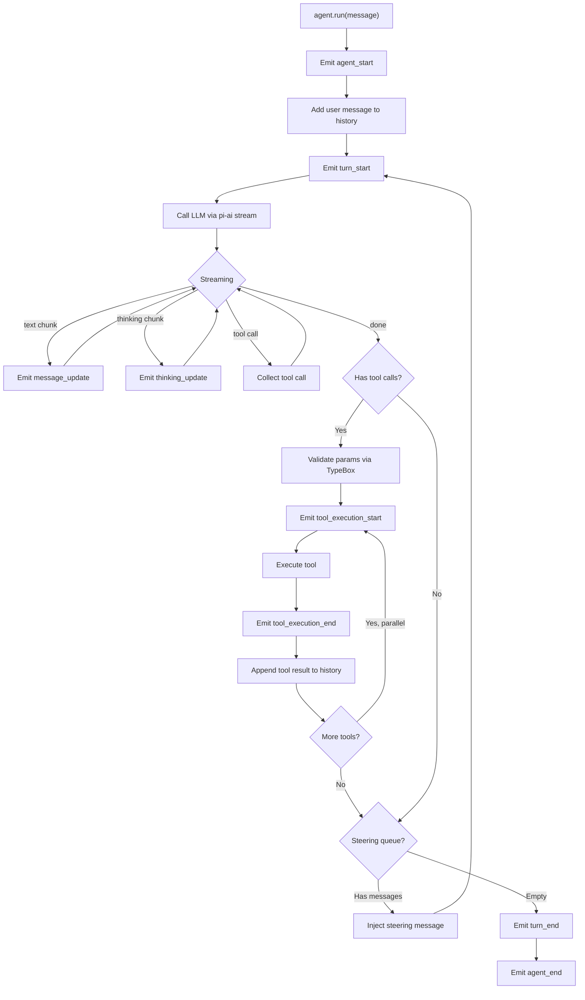
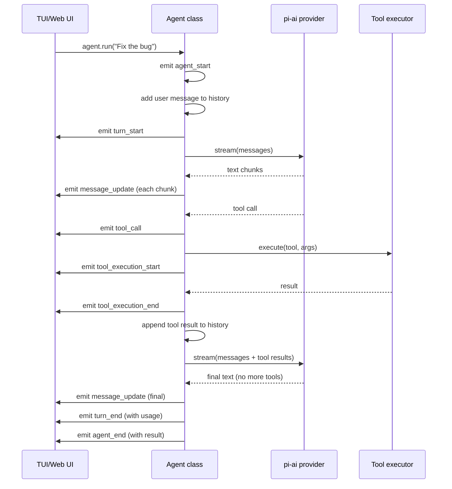

# Pi -- pi-agent-core Package

## Purpose

`@mariozechner/pi-agent-core` adds state management, automatic tool execution, and event streaming on top of pi-ai's raw LLM API. It turns "call an LLM" into "run an agent that can use tools and make decisions."

## The Agent Class

```typescript
import { Agent } from '@mariozechner/pi-agent-core';
import { getModel } from '@mariozechner/pi-ai';

const agent = new Agent({
  model: getModel('claude-sonnet-4-6'),
  tools: [readTool, writeTool, bashTool],
  systemPrompt: 'You are a coding assistant.',
  onEvent: (event) => {
    // React to agent lifecycle events
  },
});

// Run the agent with a user message
const result = await agent.run('Fix the bug in auth.ts');
```

The `Agent` class is the high-level API. It manages the conversation array, calls the LLM, validates tool calls, executes tools, and loops until the LLM stops calling tools.

## Agent Loop Lifecycle



### Key Concepts

**Turns**: Each LLM call + tool execution cycle is one turn. An agent run consists of 1+ turns.

**Steering Queue**: Messages injected between turns to redirect the agent. Used for interrupt handling -- if the user needs to course-correct while the agent is running.

**Follow-up Queue**: Similar to steering but lower priority. Used for appending context after a tool execution.

## Event Flow Architecture



## Event System

The agent emits events at every lifecycle point. This is how UI layers (TUI, web) stay synchronized without coupling.

```typescript
type AgentEvent =
  | { type: 'agent_start' }
  | { type: 'agent_end'; result: AgentResult }
  | { type: 'turn_start'; turn: number }
  | { type: 'turn_end'; turn: number; usage: Usage }
  | { type: 'message_update'; content: string; delta: string }
  | { type: 'message_complete'; message: AssistantMessage }
  | { type: 'thinking_update'; content: string; delta: string }
  | { type: 'thinking_complete'; content: string }
  | { type: 'tool_call_start'; tool: string; id: string }
  | { type: 'tool_call_arguments_delta'; id: string; delta: string }
  | { type: 'tool_call_complete'; tool: string; id: string; params: unknown }
  | { type: 'tool_execution_start'; tool: string; id: string; params: unknown }
  | { type: 'tool_execution_update'; id: string; update: string }
  | { type: 'tool_execution_end'; tool: string; id: string; result: ToolResult }
  | { type: 'error'; error: Error }
  | { type: 'abort' };
```

### Subscribing to Events

```typescript
const agent = new Agent({
  model,
  tools,
  onEvent: (event) => {
    switch (event.type) {
      case 'message_update':
        // Render streaming text to terminal/browser
        renderDelta(event.delta);
        break;
      case 'tool_execution_start':
        // Show spinner: "Running bash..."
        showSpinner(event.tool);
        break;
      case 'tool_execution_end':
        // Show result
        hideSpinner();
        showResult(event.result);
        break;
    }
  },
});
```

## Tool Execution

### Validation

Before executing a tool, the agent validates the LLM's arguments against the TypeBox schema:

```typescript
import { Value } from '@sinclair/typebox/value';

function validateToolCall(tool: AgentTool, params: unknown): ValidationResult {
  const errors = [...Value.Errors(tool.parameters, params)];
  if (errors.length > 0) {
    return { valid: false, errors };
  }
  return { valid: true, params: Value.Cast(tool.parameters, params) };
}
```

If validation fails, the error is sent back to the LLM as a tool result so it can self-correct.

### Sequential vs Parallel Execution

The agent supports two tool execution modes:

```typescript
const agent = new Agent({
  model,
  tools,
  toolExecutionMode: 'parallel', // or 'sequential'
});
```

**Sequential**: Tools execute one at a time. Safer when tools have side effects that depend on each other (e.g., write a file, then read it).

**Parallel**: All tool calls from a single LLM response execute concurrently via `Promise.all`. Faster when tools are independent (e.g., read three different files).

### Abort Signal

Every tool receives an `AbortSignal` for cancellation:

```typescript
const myTool = {
  name: 'long_operation',
  description: 'A tool that takes time',
  parameters: Type.Object({ ... }),
  execute: async (id, params, signal) => {
    // Check signal periodically
    for (const item of items) {
      if (signal.aborted) throw new Error('Aborted');
      await process(item);
    }
    return { content: 'Done' };
  },
};
```

When the user cancels an agent run, all in-flight tools receive the abort signal.

## Low-Level API: agentLoop

For applications that need more control than the `Agent` class provides:

```typescript
import { agentLoop, agentLoopContinue } from '@mariozechner/pi-agent-core';

// Start a loop
const result = agentLoop({
  model,
  messages: [{ role: 'user', content: 'Hello' }],
  tools,
  onEvent: handleEvent,
});

// Get the response
const response = await result;

// Continue with tool results
if (response.toolCalls.length > 0) {
  const toolResults = await executeTools(response.toolCalls);
  const next = agentLoopContinue({
    model,
    messages: [...messages, response.message, ...toolResults],
    tools,
    onEvent: handleEvent,
  });
}
```

The low-level API gives you control over when to continue the loop, what messages to inject, and when to stop.

## Thinking Budgets

For models that support extended thinking (Claude with thinking, GPT with reasoning), the agent can set a token budget:

```typescript
const agent = new Agent({
  model: getModel('claude-sonnet-4-6'),
  tools,
  thinkingBudget: 4096, // Max thinking tokens per turn
});
```

The budget is passed through to pi-ai, which passes it to the provider in the appropriate format.

## Message History

The agent maintains the full conversation history:

```typescript
// Access current history
const messages = agent.messages;

// History grows with each turn:
// [user_msg, assistant_msg, tool_result, assistant_msg, ...]

// For long conversations, use compaction (handled by pi-coding-agent)
```

The `Agent` class manages the array but does not implement compaction. Context window management is the application's responsibility (pi-coding-agent handles this via its compaction module).

## Custom Message Types

Applications can extend the message types via TypeScript declaration merging:

```typescript
// Extend AgentMessage to add custom types
declare module '@mariozechner/pi-agent-core' {
  interface AgentMessage {
    type: 'custom_event';
    data: MyCustomData;
  }
}
```

This is used by pi-coding-agent to add session-specific message types without modifying pi-agent-core.

## Key Files

```
packages/agent/src/
  ├── agent.ts          Agent class -- high-level API with state management
  ├── agent-loop.ts     agentLoop()/agentLoopContinue() -- low-level loop
  ├── events.ts         Event type definitions (20+ types)
  ├── tools.ts          Tool validation, execution, TypeBox integration
  ├── messages.ts       Message transformation utilities
  └── index.ts          Public API exports
```
