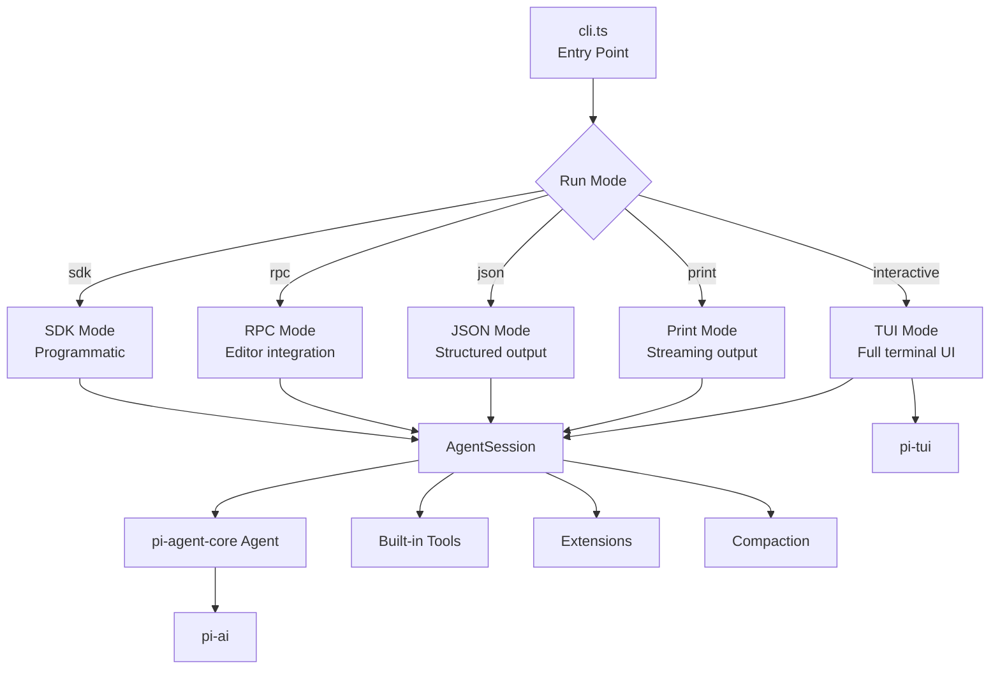
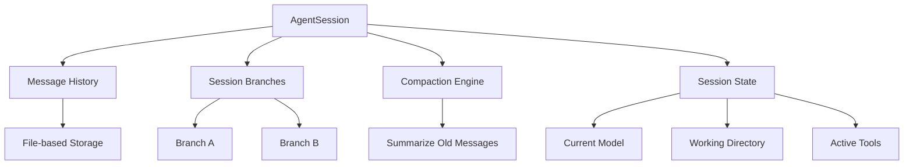
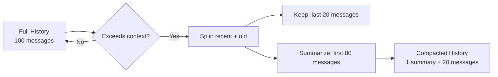

# Pi -- pi-coding-agent Package

## Purpose

`@mariozechner/pi-coding-agent` is the flagship application. It's an interactive terminal coding agent -- you talk to it, it reads your code, edits files, runs commands, and solves problems. Think Claude Code or Cursor's agent, but open source and extensible.

## Architecture



## Run Modes

### Interactive (default)

Full terminal UI with real-time streaming, tool execution previews, markdown rendering, and keyboard shortcuts.

```bash
pi              # Start interactive session
pi -m gpt-4o   # Use specific model
pi -i "fix the bug in auth.ts"  # Start with initial message
```

### Print

Streams the agent's output to stdout. Useful for piping.

```bash
pi --print "explain this code" < auth.ts
```

### JSON

Outputs structured JSON events. For scripting and automation.

```bash
pi --json "list all TODO comments" | jq '.events[] | select(.type == "message")'
```

### RPC

Exposes an RPC interface for editor integrations. The editor sends messages and receives events over JSON-RPC.

### SDK

Programmatic API for embedding the coding agent in other applications:

```typescript
import { createSession } from '@mariozechner/pi-coding-agent';

const session = await createSession({
  model: 'claude-sonnet-4-6',
  cwd: '/path/to/project',
});

const result = await session.run('Fix the failing tests');
```

## Built-in Tools

The coding agent ships with 7 tools:

### read

Reads file contents. Supports line ranges, binary detection, and large file handling.

```typescript
// Tool schema (simplified)
{
  name: 'read',
  parameters: {
    path: Type.String(),
    startLine: Type.Optional(Type.Number()),
    endLine: Type.Optional(Type.Number()),
  }
}
```

### write

Creates or overwrites files. Handles directory creation and encoding.

```typescript
{
  name: 'write',
  parameters: {
    path: Type.String(),
    content: Type.String(),
  }
}
```

### edit

Makes targeted edits to existing files. The agent specifies old text and new text, and the tool performs the replacement.

```typescript
{
  name: 'edit',
  parameters: {
    path: Type.String(),
    oldText: Type.String(),
    newText: Type.String(),
  }
}
```

### bash

Executes shell commands. Output is captured and returned to the agent.

```typescript
{
  name: 'bash',
  parameters: {
    command: Type.String(),
    cwd: Type.Optional(Type.String()),
    timeout: Type.Optional(Type.Number()),
  }
}
```

### find

Searches for files by name pattern.

### grep

Searches file contents for patterns.

### ls

Lists directory contents.

## Session Management

### AgentSession

The `AgentSession` class manages a single conversation:



### Branching

Sessions support branching -- like git branches for conversations. You can explore different approaches and switch between them.

### Compaction

When the conversation exceeds the model's context window, old messages are summarized:

1. Recent messages (last N turns) are kept in full
2. Older messages are summarized by the LLM into a condensed form
3. The summary replaces the original messages
4. The conversation continues with the compacted history

This enables infinite conversation length with bounded context.



## Extension System

See [10-extension-system.md](./10-extension-system.md) for the full details. Brief overview:

### Extensions (TypeScript Plugins)

```typescript
import { Extension } from '@mariozechner/pi-coding-agent';

const myExtension: Extension = {
  name: 'my-extension',
  onAgentStart: (session) => { ... },
  onToolResult: (tool, result) => { ... },
  commands: {
    '/mycommand': async (args) => { ... },
  },
  tools: [myCustomTool],
};
```

Extensions can:
- Hook into the agent lifecycle
- Define custom slash commands
- Register additional tools
- Customize message rendering
- Add keyboard shortcuts

### Skills (CLI Tools)

Skills are external CLI programs that the agent can invoke. They're defined with a `SKILL.md` file describing what the skill does and how to call it.

### Prompt Templates

Customize the system prompt per model or provider. Stored in `.pi/prompts/`.

### Themes

Customize the TUI colors and styling. Stored in `.pi/themes/`.

## Context Files

The coding agent reads context from multiple sources:

```
1. .clauderc         → Project-specific context (rules, conventions)
2. .pi/context       → Additional context files
3. Extension context → Extensions can inject context
4. Session history   → Previous messages in the conversation
```

Context files are prepended to the system prompt, giving the agent project-specific knowledge.

## Key Files

```
packages/coding-agent/src/
  ├── cli.ts                    CLI entry point (argument parsing, mode selection)
  ├── core/
  │   ├── agent-session.ts      Session management (history, branches, state)
  │   ├── tools/
  │   │   ├── read.ts           File reading tool
  │   │   ├── write.ts          File writing tool
  │   │   ├── edit.ts           File editing tool
  │   │   ├── bash.ts           Shell execution tool
  │   │   ├── find.ts           File search tool
  │   │   ├── grep.ts           Content search tool
  │   │   └── ls.ts             Directory listing tool
  │   ├── extensions/
  │   │   └── index.ts          Extension loading and lifecycle
  │   └── compaction/
  │       └── index.ts          Context window compaction
  ├── modes/
  │   ├── interactive.ts        TUI mode
  │   ├── print.ts              Print mode
  │   ├── json.ts               JSON mode
  │   └── rpc.ts                RPC mode
  └── config/
      └── index.ts              Settings, context files, model config
```
