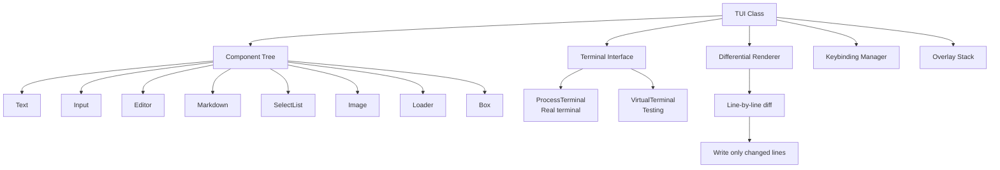
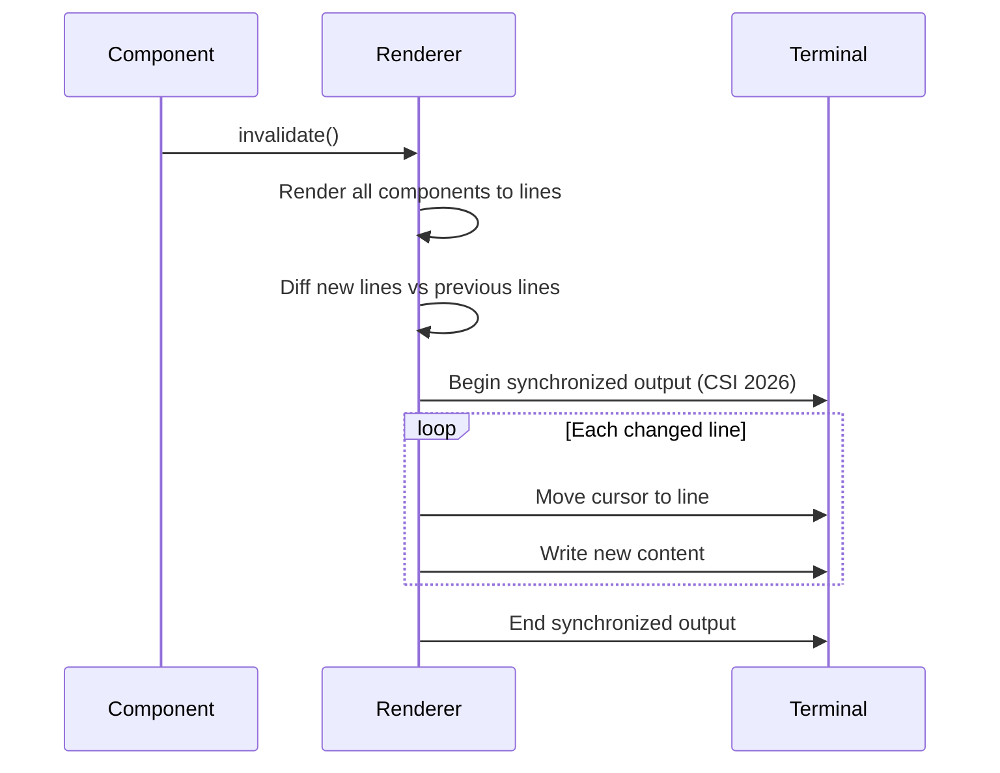

# Pi -- pi-tui Package

## Purpose

`@mariozechner/pi-tui` is a terminal UI framework with differential rendering. It provides components for building interactive terminal interfaces without flickering, with proper Unicode/CJK support, and with terminal image protocols.

## Why a Custom TUI?

Existing terminal UI libraries (Ink, blessed, terminal-kit) either:
- Re-render the entire screen on every update (causes flicker during streaming)
- Don't support modern terminal features (Kitty graphics, synchronized output)
- Don't handle ANSI code preservation correctly

pi-tui renders only the lines that changed, uses CSI 2026 synchronized output to prevent tearing, and preserves ANSI escape codes during line wrapping.

## Core Architecture



## The TUI Class

```typescript
import { TUI } from '@mariozechner/pi-tui';

const tui = new TUI({
  terminal: new ProcessTerminal(),
});

// Add components
const text = new Text({ content: 'Hello, world!' });
tui.add(text);

// Start rendering
tui.start();

// Update content -- only changed lines redraw
text.content = 'Updated content';
tui.invalidate();
```

## Differential Rendering

The key innovation. Instead of clearing the screen and redrawing everything, pi-tui:

1. Each component renders its content to an array of lines
2. The renderer compares the new lines against the previously rendered lines
3. Only lines that changed are written to the terminal
4. Uses CSI 2026 synchronized output to batch all writes atomically



This approach means that during LLM streaming (where text is appended character by character), only the last line of the response gets redrawn on each update.

## Built-in Components

### Text

Renders static or dynamic text with ANSI color support.

```typescript
const text = new Text({
  content: '\x1b[32mGreen text\x1b[0m with normal text',
  wrap: true,        // Word wrap at terminal width
  maxLines: 10,      // Truncate after 10 lines
});
```

### Input

Single-line text input with cursor, selection, and history.

```typescript
const input = new Input({
  placeholder: 'Type a message...',
  onSubmit: (text) => handleInput(text),
  history: previousInputs,
});
```

### Editor

Multi-line text editor with:
- Cursor movement (arrows, home/end, page up/down)
- Text selection
- Copy/paste
- Autocomplete (slash commands, file paths)
- IME support for CJK input methods

```typescript
const editor = new Editor({
  onSubmit: (text) => sendMessage(text),
  autocomplete: {
    triggers: ['/', '@'],
    provider: (trigger, query) => getCompletions(trigger, query),
  },
});
```

### Markdown

Renders Markdown content in the terminal with syntax highlighting for code blocks, bold/italic text, lists, and headings.

```typescript
const md = new Markdown({
  content: '## Hello\n\nThis is **bold** and `inline code`.\n\n```js\nconsole.log("hi")\n```',
});
```

### SelectList

Interactive list with keyboard navigation:

```typescript
const list = new SelectList({
  items: [
    { label: 'Option 1', value: 'a' },
    { label: 'Option 2', value: 'b' },
    { label: 'Option 3', value: 'c' },
  ],
  onSelect: (item) => handleSelection(item),
});
```

### Image

Renders images in the terminal using Kitty or iTerm2 graphics protocols, with fallback to text placeholder.

```typescript
const image = new Image({
  path: '/path/to/image.png',
  width: 40,   // character columns
  height: 20,  // character rows
  lazy: true,  // Load on scroll into view
});
```

### Loader

Animated spinner with message:

```typescript
const loader = new Loader({
  message: 'Thinking...',
  style: 'dots',  // or 'line', 'braille'
});
```

### Box / Container

Layout components for grouping and positioning:

```typescript
const box = new Box({
  border: true,
  padding: 1,
  children: [text, input],
});
```

## Overlays

Overlays render on top of the main content. Used for dialogs, menus, and notifications.

```typescript
tui.showOverlay(new SelectList({
  items: modelOptions,
  onSelect: (model) => {
    switchModel(model);
    tui.hideOverlay();
  },
}));
```

## Keybinding System

```typescript
tui.bind('ctrl+c', () => abort());
tui.bind('ctrl+l', () => clearScreen());
tui.bind('ctrl+k', () => showModelSwitcher());
tui.bind('escape', () => tui.hideOverlay());
```

The keybinding manager detects conflicts and supports chord sequences.

## Terminal Abstraction

```typescript
interface Terminal {
  write(data: string): void;
  onInput(handler: (data: string) => void): void;
  getSize(): { columns: number; rows: number };
  onResize(handler: () => void): void;
  setCursorPosition(row: number, col: number): void;
  hideCursor(): void;
  showCursor(): void;
}
```

Two implementations:
- **ProcessTerminal**: Wraps `process.stdout`/`process.stdin` for real terminal use
- **VirtualTerminal**: In-memory terminal for testing. Captures output as an array of lines.

## Width-Aware Line Wrapping

Terminal text wrapping must account for:
- ANSI escape codes (invisible, zero width)
- CJK characters (double width)
- Emoji (varying width)
- Tab characters (context-dependent width)

pi-tui handles all of these correctly, measuring visual width rather than string length.

## Key Files

```
packages/tui/src/
  ├── tui.ts              Main TUI class (component management, rendering)
  ├── terminal.ts         Terminal interface + ProcessTerminal
  ├── virtual-terminal.ts VirtualTerminal (testing)
  ├── renderer.ts         Differential rendering engine
  ├── keybindings.ts      Keybinding manager
  ├── overlays.ts         Overlay stack
  ├── components/
  │   ├── text.ts         Text component
  │   ├── input.ts        Single-line input
  │   ├── editor.ts       Multi-line editor with autocomplete
  │   ├── markdown.ts     Markdown renderer
  │   ├── select-list.ts  Interactive selection list
  │   ├── image.ts        Terminal image rendering
  │   ├── loader.ts       Animated spinner
  │   ├── box.ts          Box layout
  │   └── container.ts    Container layout
  └── utils/
      ├── ansi.ts         ANSI escape code handling
      ├── width.ts        Character width calculation
      └── wrap.ts         Width-aware line wrapping
```
