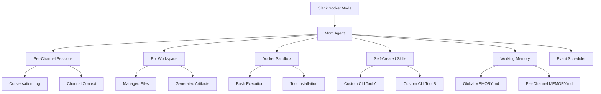
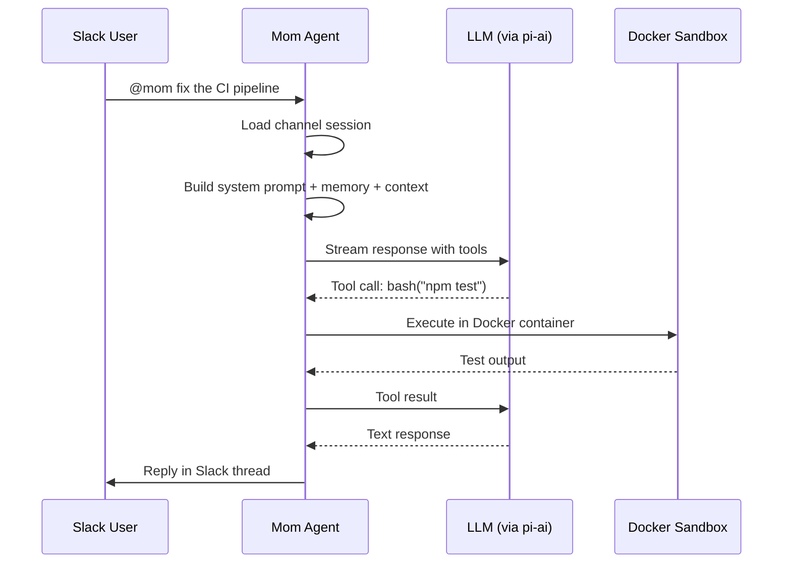

# Pi -- pi-mom Package

## Purpose

`@mariozechner/pi-mom` is a Slack bot that runs as an autonomous coding agent. It responds to messages in Slack channels, maintains a persistent workspace, creates and manages its own tools (skills), and executes commands in a Docker sandbox for security isolation.

## Architecture



## How It Works

### 1. Slack Connection

Mom connects to Slack via Socket Mode (WebSocket), avoiding the need for a public webhook URL. It listens for messages in channels it's been invited to.

### 2. Per-Channel Sessions

Each Slack channel gets its own conversation session with:
- **log.jsonl** -- Full conversation history
- **context.jsonl** -- Compressed context for the LLM
- **MEMORY.md** -- Channel-specific working memory

### 3. Message Handling



### 4. Docker Sandbox

All bash commands execute inside a Docker container. This prevents the agent from:
- Modifying the host system
- Accessing sensitive host files
- Running destructive commands outside the workspace

The sandbox mounts the bot's workspace directory, so files created by the agent persist.

### 5. Self-Created Skills

Mom can create its own CLI tools and save them as skills. A skill is a program with a `SKILL.md` file describing its purpose and usage:

```markdown
---
name: check-ci
description: Check the CI status for a GitHub repository
---

# check-ci

Checks the CI pipeline status for the given repository.

Usage: check-ci <repo-url>
```

Skills are stored globally or per-channel and are available to the agent in future conversations.

### 6. Working Memory

Mom maintains markdown memory files:
- **Global MEMORY.md** -- Facts and preferences that apply across all channels
- **Per-channel MEMORY.md** -- Channel-specific context, ongoing tasks, team preferences

The agent reads these at the start of each conversation and can update them during interaction.

## Storage Model

```
workspace/
├── global/
│   ├── MEMORY.md              Global memory
│   └── skills/                Global skills
├── channels/
│   ├── C01234567/             Channel ID
│   │   ├── log.jsonl          Full conversation history
│   │   ├── context.jsonl      Compressed context
│   │   ├── MEMORY.md          Channel memory
│   │   ├── skills/            Channel-specific skills
│   │   └── artifacts/         Generated files
│   └── C07654321/
│       └── ...
└── attachments/               Downloaded Slack file attachments
```

## Event Scheduling

Mom supports scheduled tasks:
- **One-shot**: "Remind me to check the deployment at 3pm"
- **Periodic**: "Run the CI check every morning at 9am"

Scheduled events trigger agent runs in the appropriate channel context.

## Key Files

```
packages/mom/src/
  ├── main.ts       Entry point, initialization
  ├── slack.ts      Slack Socket Mode integration
  ├── agent.ts      Agent runner (wraps pi-agent-core)
  ├── context.ts    Session management, history loading
  ├── sandbox.ts    Docker/host sandbox execution
  ├── tools/        Tool implementations
  ├── skills.ts     Skill management
  ├── memory.ts     MEMORY.md reading/writing
  └── schedule.ts   Event scheduler
```
