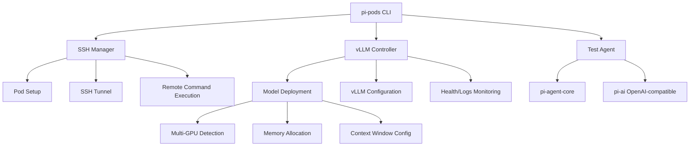
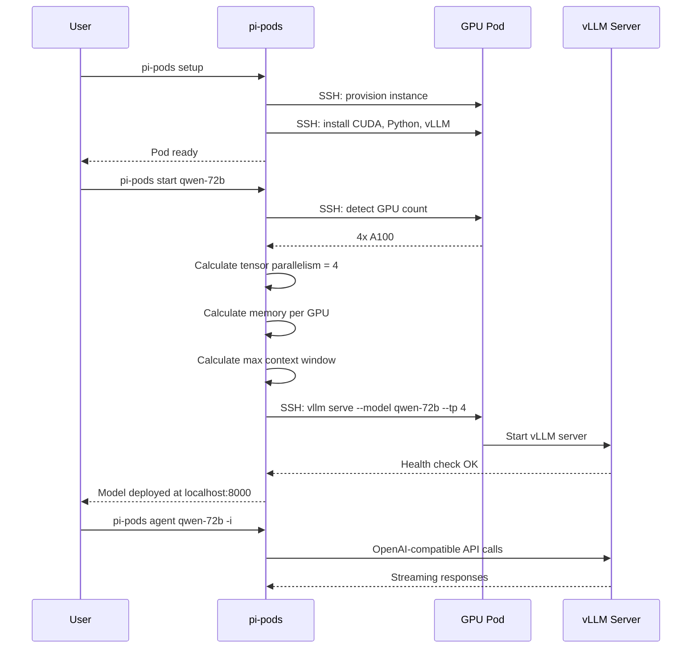

# Pi -- pi-pods Package

## Purpose

`@mariozechner/pi-pods` is a CLI for managing GPU pods running vLLM. It handles pod provisioning, SSH setup, vLLM installation, model deployment, and provides an interactive agent for testing deployed models.

## What It Solves

Running your own LLM inference means dealing with SSH, CUDA drivers, vLLM configuration, multi-GPU tensor parallelism, context window sizing, and memory allocation. pi-pods wraps all of that into a CLI.

## Supported Pod Providers

| Provider | Notes |
|----------|-------|
| DataCrunch | GPU cloud |
| RunPod | GPU cloud |
| Vast.ai | GPU marketplace |
| AWS EC2 | Cloud instances with GPUs |

## Commands

### Pod Management

```bash
# Setup a new pod (provisions, installs vLLM)
pi-pods setup

# List active pods
pi-pods active

# SSH into a pod
pi-pods shell

# Remove a pod
pi-pods remove
```

### Model Management

```bash
# Deploy a model to the active pod
pi-pods start <model-name>

# Stop a running model
pi-pods stop

# List available models
pi-pods list

# View model logs
pi-pods logs
```

### Interactive Agent

```bash
# Start interactive agent session with deployed model
pi-pods agent <model> -i

# Single message
pi-pods agent <model> "Explain transformers"
```

## Architecture



## Deployment Flow



## Supported Models

| Model | Size | Min GPUs |
|-------|------|----------|
| Qwen 2.5 | 7B-72B | 1-4 |
| GPT-OSS | Various | 1-2 |
| GLM | Various | 1-2 |
| Custom (via --vllm args) | Any | Varies |

## Key Files

```
packages/pods/src/
  ├── cli.ts         CLI entry point, command routing
  ├── ssh.ts         SSH connection and command execution
  ├── setup.ts       Pod provisioning and vLLM installation
  ├── models.ts      Model deployment and configuration
  ├── agent.ts       Interactive agent (wraps pi-agent-core)
  └── providers/     Pod provider adapters
      ├── datacrunch.ts
      ├── runpod.ts
      ├── vast.ts
      └── aws.ts
```
