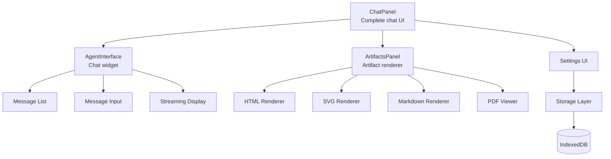

# Pi -- pi-web-ui Package

## Purpose

`@mariozechner/pi-web-ui` provides reusable web components for building browser-based AI chat interfaces. It includes a full chat panel, an artifact renderer (HTML, SVG, Markdown, PDF), and IndexedDB-backed persistence.

## Components



### ChatPanel

The top-level component. Drop it into any HTML page for a complete AI chat experience:

```html
<script type="module">
  import { ChatPanel } from '@mariozechner/pi-web-ui';
  customElements.define('chat-panel', ChatPanel);
</script>

<chat-panel></chat-panel>
```

Includes conversation UI, artifact rendering, model selection, and session management.

### AgentInterface

A lower-level chat widget for embedding in custom layouts:

```html
<agent-interface
  model="claude-sonnet-4-6"
  system-prompt="You are a helpful assistant."
></agent-interface>
```

### ArtifactsPanel

Renders tool-generated artifacts:
- **HTML** -- Sandboxed iframe rendering
- **SVG** -- Inline SVG display
- **Markdown** -- Rendered markdown
- **PDF** -- PDF viewer

## Built-in Tools

The web UI includes tools for browser-side execution:

| Tool | Purpose |
|------|---------|
| JavaScript REPL | Execute JS in the browser |
| Document Extraction | Extract text from uploaded files |
| Artifact Management | Create/update HTML/SVG/MD artifacts |

## Storage System

All data persists in IndexedDB via typed stores:

```typescript
// Storage stores
SettingsStore         // User preferences (theme, model, etc.)
ProviderKeysStore     // API keys per provider
SessionsStore         // Conversation sessions with metadata
CustomProvidersStore  // Custom provider configurations (Ollama, LM Studio, vLLM)

// Unified facade
AppStorage            // Wraps all stores with a single API
```

### Custom Providers

Users can add custom OpenAI-compatible providers:

```typescript
await AppStorage.addCustomProvider({
  name: 'My Local LLM',
  baseUrl: 'http://localhost:8000/v1',
  models: ['my-model'],
  apiKey: 'optional',
});
```

This enables connections to Ollama, LM Studio, vLLM, and any OpenAI-compatible API.

## Technology Stack

| Concern | Choice |
|---------|--------|
| Web Components | mini-lit (lightweight lit-html alternative) |
| CSS | Tailwind CSS v4 |
| Storage | IndexedDB |
| AI Layer | pi-ai + pi-agent-core |
| Bundling | Standard ES modules |

## CORS Proxy

When calling LLM APIs directly from the browser, CORS restrictions apply. pi-web-ui includes a CORS proxy integration for development and self-hosted deployments.

## Key Files

```
packages/web-ui/src/
  ├── chat-panel.ts       ChatPanel web component
  ├── agent-interface.ts  AgentInterface web component
  ├── artifacts-panel.ts  ArtifactsPanel web component
  ├── tools/
  │   ├── js-repl.ts      JavaScript REPL tool
  │   ├── extraction.ts   Document extraction tool
  │   └── artifacts.ts    Artifact management tool
  ├── storage/
  │   ├── settings.ts     SettingsStore
  │   ├── keys.ts         ProviderKeysStore
  │   ├── sessions.ts     SessionsStore
  │   ├── providers.ts    CustomProvidersStore
  │   └── app-storage.ts  AppStorage facade
  └── styles/
      └── global.css      Tailwind CSS v4 styles
```
