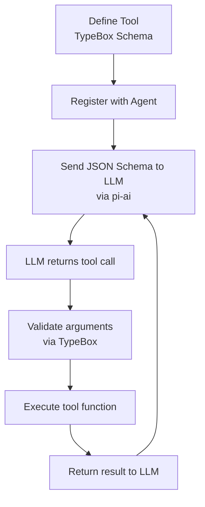
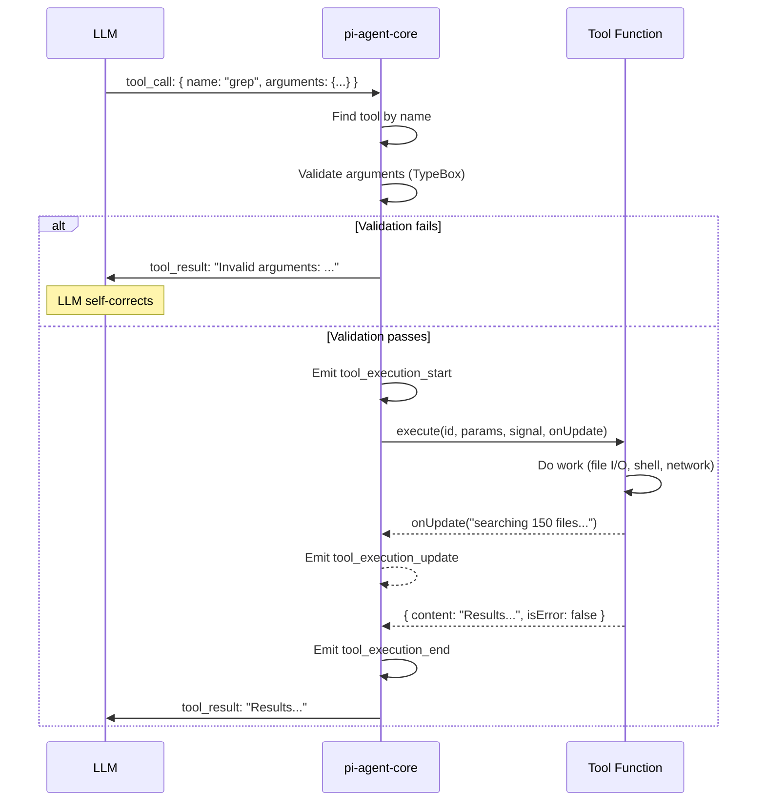
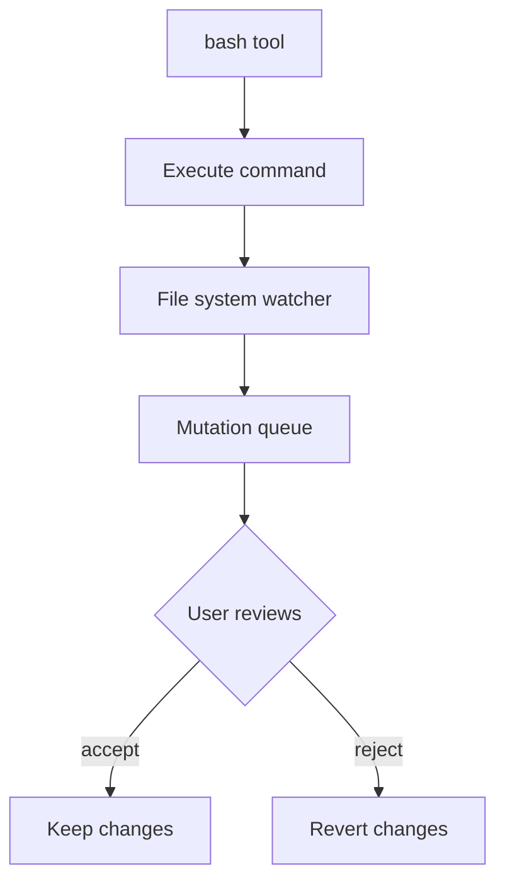

# Pi -- Tool System (Cross-Cutting)

## Overview

Tools are how the LLM interacts with the world. The tool system spans three packages:
- **pi-ai** -- Converts TypeBox schemas to JSON Schema and sends them to the LLM
- **pi-agent-core** -- Validates tool call arguments, executes tools, handles results
- **pi-coding-agent** -- Implements the actual tools (read, write, edit, bash, etc.)



## Tool Definition

Every tool follows the same interface:

```typescript
import { Type, type Static, type TSchema } from '@sinclair/typebox';

interface AgentTool<T extends TSchema = TSchema> {
  name: string;
  description: string;
  parameters: T;
  execute: (
    id: string,
    params: Static<T>,
    signal: AbortSignal,
    onUpdate?: (update: string) => void,
  ) => Promise<ToolResult>;
}

interface ToolResult {
  content: string;
  isError?: boolean;
}
```

### Example: A Complete Tool

```typescript
const grepTool: AgentTool = {
  name: 'grep',
  description: 'Search file contents for a pattern. Returns matching lines with file paths and line numbers.',
  parameters: Type.Object({
    pattern: Type.String({ description: 'Regular expression pattern to search for' }),
    path: Type.Optional(Type.String({
      description: 'Directory to search in. Defaults to current working directory.',
      default: '.',
    })),
    include: Type.Optional(Type.String({
      description: 'File glob pattern to include (e.g., "*.ts")',
    })),
  }),
  execute: async (id, params, signal) => {
    const { pattern, path, include } = params;
    // params is fully typed: { pattern: string; path?: string; include?: string }

    const args = ['grep', '-rn', pattern, path ?? '.'];
    if (include) args.push('--include', include);

    const result = await execCommand(args, { signal });

    return {
      content: result.stdout || 'No matches found.',
      isError: result.exitCode !== 0 && result.exitCode !== 1,
    };
  },
};
```

## TypeBox Schema → JSON Schema → LLM

The same TypeBox definition serves three purposes:

```
TypeBox Schema
  │
  ├──→ TypeScript types (compile time)
  │    Static<typeof grepTool.parameters>
  │    → { pattern: string; path?: string; include?: string }
  │
  ├──→ JSON Schema (sent to LLM)
  │    {
  │      "type": "object",
  │      "properties": {
  │        "pattern": { "type": "string", "description": "..." },
  │        "path": { "type": "string", "description": "...", "default": "." },
  │        "include": { "type": "string", "description": "..." }
  │      },
  │      "required": ["pattern"]
  │    }
  │
  └──→ Runtime validation (before execution)
       Value.Check(grepTool.parameters, llmArguments)
       → true/false
```

This eliminates the mismatch between what the LLM sees (JSON Schema), what TypeScript checks (types), and what runs (validation).

## Tool Execution Lifecycle



### Key Points

1. **Validation before execution** -- Invalid arguments are caught before any side effects happen. The error message is sent back to the LLM so it can retry with correct arguments.

2. **Progress updates** -- Tools can send progress updates via `onUpdate()`. The agent emits these as `tool_execution_update` events. UI layers use this to show progress (e.g., "searching 150 files...").

3. **Abort signal** -- Long-running tools receive an `AbortSignal`. When the user cancels, the signal fires and the tool should clean up and throw.

4. **Error handling** -- Tools return `{ isError: true }` for expected errors. The agent sends the error to the LLM as a tool result. Unexpected exceptions are caught by the agent and reported.

## Parallel vs Sequential Execution

When the LLM returns multiple tool calls in a single response:

### Parallel Mode

```typescript
// All tool calls execute concurrently
const results = await Promise.all(
  toolCalls.map(call => executeTool(call))
);
```

Best for independent operations: reading multiple files, searching different directories.

### Sequential Mode

```typescript
// Tools execute one at a time, in order
for (const call of toolCalls) {
  const result = await executeTool(call);
  // Result is available before next tool starts
}
```

Required when tools have side effects that depend on each other: write a file, then read it.

## Built-in Tools (pi-coding-agent)

| Tool | Purpose | Side Effects |
|------|---------|-------------|
| `read` | Read file contents (with line ranges) | None |
| `write` | Create or overwrite files | Creates/modifies files |
| `edit` | Replace text in existing files | Modifies files |
| `bash` | Execute shell commands | Anything |
| `find` | Search for files by name pattern | None |
| `grep` | Search file contents by regex | None |
| `ls` | List directory contents | None |

### Bash Tool: File Mutation Queue

The `bash` tool tracks file mutations. When a bash command modifies files (detected by monitoring the filesystem), those mutations are queued and can be reviewed or undone by the user.



## Adding Custom Tools

### Via Extensions (pi-coding-agent)

```typescript
const myExtension: Extension = {
  name: 'my-tools',
  tools: [
    {
      name: 'deploy',
      description: 'Deploy the application to production',
      parameters: Type.Object({
        environment: Type.Enum({ staging: 'staging', production: 'production' }),
        version: Type.String(),
      }),
      execute: async (id, params, signal) => {
        // Deployment logic
        return { content: `Deployed ${params.version} to ${params.environment}` };
      },
    },
  ],
};
```

### Via pi-agent-core directly

```typescript
const agent = new Agent({
  model: getModel('claude-sonnet-4-6'),
  tools: [
    readTool,
    writeTool,
    myCustomTool, // Just add to the tools array
  ],
});
```
