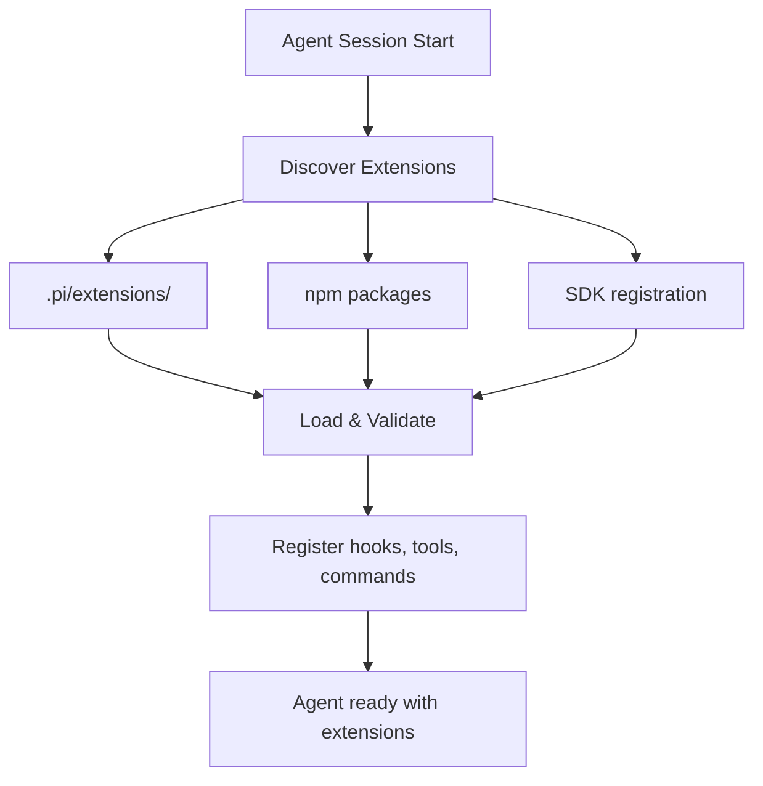
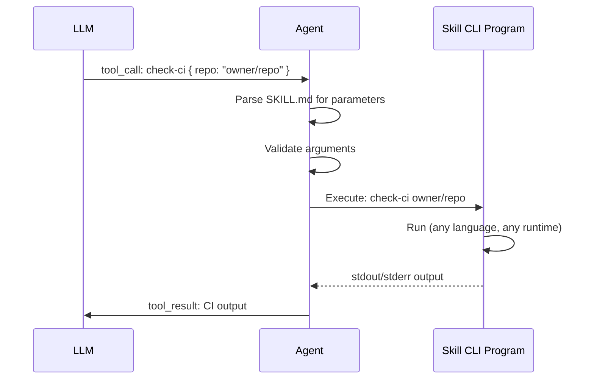
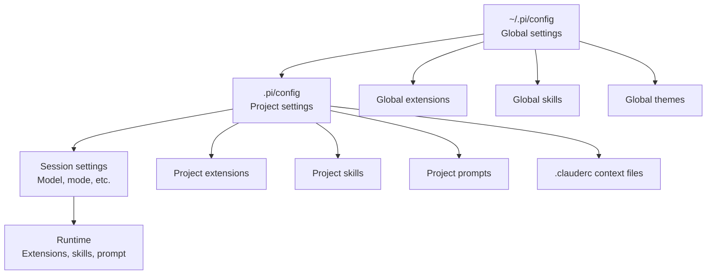

# Pi -- Extension System (Cross-Cutting)

## Overview

Pi's extensibility has four mechanisms, from most powerful to most focused:

1. **Extensions** -- TypeScript plugins that hook into the agent lifecycle
2. **Skills** -- External CLI programs the agent can invoke
3. **Prompt Templates** -- Customize system prompts per model/provider
4. **Themes** -- Customize TUI and web UI styling

## Extensions

Extensions are TypeScript modules that can:
- Hook into agent lifecycle events
- Register custom tools
- Define slash commands
- Customize message rendering
- Add keybindings

### Extension Interface

```typescript
interface Extension {
  name: string;

  // Lifecycle hooks
  onAgentStart?: (session: AgentSession) => void | Promise<void>;
  onAgentEnd?: (session: AgentSession) => void | Promise<void>;
  onTurnStart?: (turn: number) => void | Promise<void>;
  onTurnEnd?: (turn: number) => void | Promise<void>;
  onToolResult?: (tool: string, result: ToolResult) => void | Promise<void>;

  // Custom tools
  tools?: AgentTool[];

  // Slash commands
  commands?: Record<string, CommandHandler>;

  // Message rendering
  renderMessage?: (message: Message) => string | undefined;

  // Keybindings
  keybindings?: Record<string, () => void>;

  // Context injection
  getContext?: () => string | Promise<string>;
}

type CommandHandler = (args: string, session: AgentSession) => void | Promise<void>;
```

### Example Extension

```typescript
// A git-aware extension that adds context and tools

const gitExtension: Extension = {
  name: 'git-context',

  // Inject git context into system prompt
  getContext: async () => {
    const branch = await exec('git branch --show-current');
    const status = await exec('git status --short');
    const log = await exec('git log --oneline -5');

    return `## Git Context
Current branch: ${branch}
Status:
${status}
Recent commits:
${log}`;
  },

  // Add a /commit slash command
  commands: {
    '/commit': async (args, session) => {
      const message = args || 'auto-generated commit message';
      await session.runTool('bash', {
        command: `git add -A && git commit -m "${message}"`,
      });
    },
  },

  // Add a git-diff tool
  tools: [
    {
      name: 'git_diff',
      description: 'Show the git diff for staged or unstaged changes',
      parameters: Type.Object({
        staged: Type.Optional(Type.Boolean({ default: false })),
        file: Type.Optional(Type.String()),
      }),
      execute: async (id, params, signal) => {
        const args = ['git', 'diff'];
        if (params.staged) args.push('--staged');
        if (params.file) args.push(params.file);
        const result = await exec(args.join(' '));
        return { content: result || 'No changes.' };
      },
    },
  ],
};
```

### Extension Loading

Extensions are loaded from:
1. The `.pi/extensions/` directory in the project
2. npm packages that export an Extension
3. Programmatically via the SDK



## Skills

Skills are external CLI programs that the agent can call as tools. They're simpler than extensions -- no TypeScript, no lifecycle hooks, just a program with a description file.

### SKILL.md Format

```markdown
---
name: check-ci
description: Check the CI pipeline status for a GitHub repository
parameters:
  repo:
    type: string
    description: Repository URL or owner/name
    required: true
  branch:
    type: string
    description: Branch to check
    default: main
---

# check-ci

Checks CI status and returns a summary of recent pipeline runs.

## Usage

```bash
check-ci <repo> [branch]
```

## Output

Returns JSON with pipeline status, duration, and failure details.
```

### How Skills Work



Skills are language-agnostic. The program can be written in Python, Bash, Go, or anything that runs from the command line.

### Skill Storage

```
.pi/skills/
  ├── check-ci/
  │   ├── SKILL.md
  │   └── check-ci.sh
  ├── deploy/
  │   ├── SKILL.md
  │   └── deploy.py
  └── analyze-perf/
      ├── SKILL.md
      └── analyze-perf
```

### Self-Created Skills (pi-mom)

The Mom Slack bot can create its own skills during conversation. When it solves a recurring problem, it saves the solution as a skill for future use. This is Pi's "self-improvement" mechanism.

## Prompt Templates

Customize the system prompt per model or scenario. Stored in `.pi/prompts/`:

```
.pi/prompts/
  ├── default.md           Base system prompt
  ├── claude-sonnet.md     Claude-specific prompt overrides
  ├── gpt-4o.md            GPT-specific prompt overrides
  └── code-review.md       Task-specific prompt
```

### Template Format

```markdown
---
name: code-review
description: System prompt for code review tasks
model: "*"
---

You are a senior code reviewer. Focus on:
1. Security vulnerabilities
2. Performance issues
3. Code clarity and maintainability

When reviewing, always check:
- Input validation at system boundaries
- Error handling for edge cases
- Test coverage for new code
```

Templates are selected by matching the model name or by explicit user choice.

## Themes

Customize the TUI appearance. Stored in `.pi/themes/`:

```typescript
// .pi/themes/nord.ts
export const theme = {
  name: 'nord',
  colors: {
    primary: '#88c0d0',
    secondary: '#81a1c1',
    accent: '#a3be8c',
    background: '#2e3440',
    foreground: '#eceff4',
    error: '#bf616a',
    warning: '#ebcb8b',
    muted: '#4c566a',
  },
  codeTheme: 'nord',
};
```

Themes affect:
- Text colors in the terminal
- Code block syntax highlighting theme
- Spinner and loader colors
- Border and separator colors

## Configuration Hierarchy



Project settings override global settings. Session settings override project settings. This lets you have global preferences while customizing per-project.
