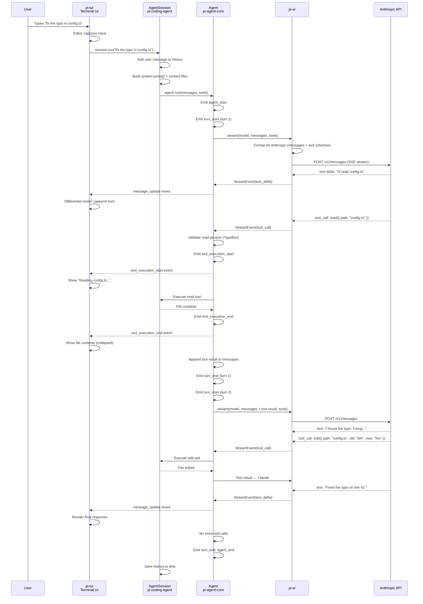
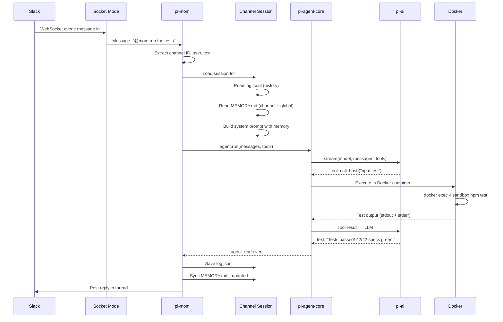
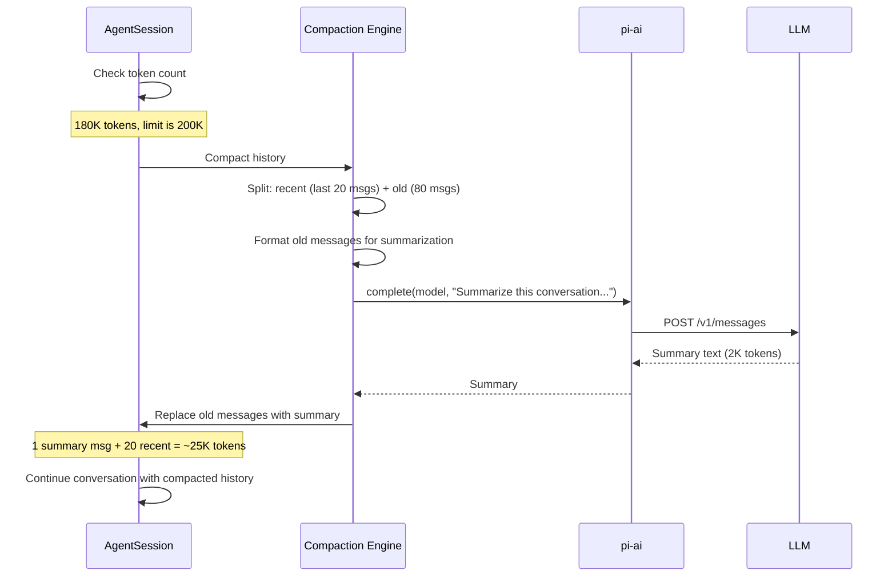

# Pi -- Data Flow (End-to-End)

## Overview

This document traces data through the full Pi stack for three common scenarios:
1. Interactive chat with tool execution
2. Slack bot handling a message
3. Session compaction

## Flow 1: Interactive Chat with Tool Execution

A user types a message in the terminal. The agent reads a file, edits it, and responds.



### What Happens at Each Layer

| Layer | Input | Output | Responsibility |
|-------|-------|--------|---------------|
| TUI | Keystrokes | Rendered terminal output | Capture input, render output, show progress |
| AgentSession | User message string | Completed conversation | Manage history, context files, compaction |
| Agent | Messages + tools | Final response + events | Loop until done, validate tools, emit events |
| pi-ai | Normalized request | Streaming events | Provider-specific formatting, HTTP, SSE parsing |
| Anthropic API | HTTP request | SSE stream | LLM inference |

## Flow 2: Slack Bot Message Handling

A user messages @mom in a Slack channel.



### Key Differences from Interactive Flow

1. **No TUI** -- Mom posts to Slack instead of rendering to a terminal
2. **Docker sandbox** -- Bash commands execute in an isolated container
3. **Per-channel sessions** -- Each Slack channel has its own conversation state
4. **Working memory** -- MEMORY.md is read at session start and can be updated by the agent
5. **Persistent workspace** -- Files created by the agent persist across conversations

## Flow 3: Session Compaction

When the conversation exceeds the model's context window.



### Compaction Strategy

```
Before compaction (180K tokens):
  [system_prompt] [msg_1] [msg_2] ... [msg_80] [msg_81] ... [msg_100]
                  |___ old (to summarize) ___|  |___ recent (keep) ___|

After compaction (~25K tokens):
  [system_prompt] [summary_of_1_to_80] [msg_81] ... [msg_100]
```

The summary includes:
- Key decisions made
- Files that were modified
- Errors encountered and how they were resolved
- The current state of the task

Recent messages are kept verbatim because they contain the most relevant context for the next LLM call.

## Data Formats

### Message Storage (JSONL)

Sessions are stored as newline-delimited JSON:

```jsonl
{"role":"user","content":"fix the bug in auth.ts","timestamp":"2026-04-26T10:00:00Z"}
{"role":"assistant","content":"I'll look at auth.ts...","tool_calls":[{"name":"read","arguments":{"path":"auth.ts"}}],"timestamp":"2026-04-26T10:00:01Z"}
{"role":"tool","tool_call_id":"tc_1","content":"// auth.ts contents...","timestamp":"2026-04-26T10:00:02Z"}
{"role":"assistant","content":"Found the issue. The token...","timestamp":"2026-04-26T10:00:05Z"}
```

### Context Serialization

pi-ai's context serialization format is provider-agnostic:

```json
{
  "format": "pi-context-v1",
  "model": "claude-sonnet-4-6",
  "messages": [...],
  "systemPrompt": "...",
  "tools": [...],
  "usage": { "input": 5000, "output": 2000 },
  "timestamp": "2026-04-26T10:00:00Z"
}
```

This can be loaded with a different model. pi-ai handles format conversion between providers.

### Event Stream

Events from the agent are emitted as typed objects:

```typescript
// During streaming, a consumer might receive:
{ type: 'agent_start' }
{ type: 'turn_start', turn: 1 }
{ type: 'message_update', content: 'I', delta: 'I' }
{ type: 'message_update', content: "I'll", delta: "'ll" }
{ type: 'message_update', content: "I'll read", delta: ' read' }
{ type: 'tool_call_start', tool: 'read', id: 'tc_1' }
{ type: 'tool_call_complete', tool: 'read', id: 'tc_1', params: { path: 'auth.ts' } }
{ type: 'tool_execution_start', tool: 'read', id: 'tc_1', params: { path: 'auth.ts' } }
{ type: 'tool_execution_end', tool: 'read', id: 'tc_1', result: { content: '...' } }
{ type: 'turn_end', turn: 1, usage: { input: 5000, output: 200 } }
{ type: 'turn_start', turn: 2 }
// ... more events ...
{ type: 'agent_end', result: { ... } }
```

Each event carries enough context to render the complete UI state. The TUI, Slack bot, and web UI all consume the same event stream with different rendering logic.
