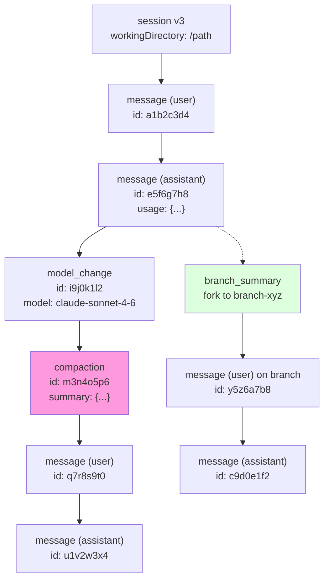
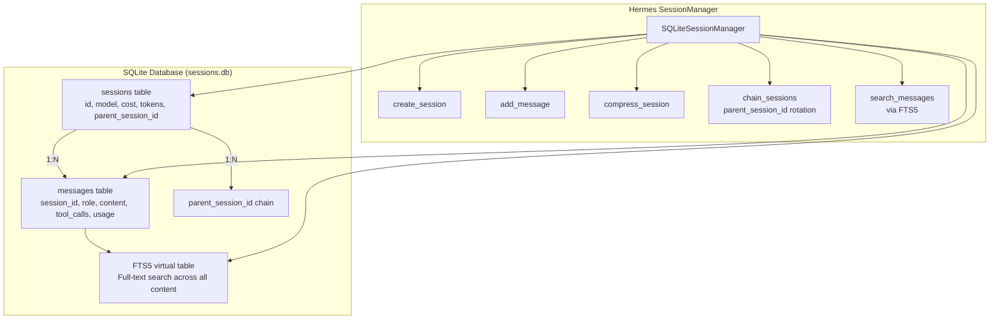

# Pi and Hermes -- Session Management Deep Dive

## Overview

Pi and Hermes take fundamentally different approaches to session management. Pi uses a **tree-structured JSONL file** approach with versioned migrations and compaction entries. Hermes uses a **SQLite-backed database** with FTS5 full-text search, parent session chains, and compression-triggered session rotation. Both systems solve the same problems -- persistence, branching, context management, and search -- but with different tradeoffs.

---

## Pi Session Architecture

### Session File Format: JSONL with Tree Structure



Pi stores sessions as JSONL files in `~/.pi/sessions/`. Each line is a JSON object representing a single entry:

```jsonl
{"type":"session","version":3,"workingDirectory":"/path/to/project"}
{"type":"message","id":"a1b2c3d4","parentId":null,"message":{"role":"user","content":"...","timestamp":1712345678000}}
{"type":"message","id":"e5f6g7h8","parentId":"a1b2c3d4","message":{"role":"assistant","content":"...","usage":{...},"timestamp":1712345679000}}
{"type":"model_change","id":"i9j0k1l2","parentId":"e5f6g7h8","model":"claude-sonnet-4-6","thinkingLevel":"medium"}
{"type":"compaction","id":"m3n4o5p6","parentId":"i9j0k1l2","firstKeptEntryId":"e5f6g7h8","summary":"...","timestamp":1712345680000}
```

The `id`/`parentId` fields form a **tree** (not a linear list). Each entry has a unique 8-character hex ID, and the parent pointer creates a directed acyclic graph that supports branching.

### Session Versioning and Migrations

Pi sessions are versioned (`CURRENT_SESSION_VERSION = 3`). Old sessions are automatically migrated on load:

| Version | Change |
|---------|--------|
| v1 | Flat JSONL, no id/parentId fields -- linear only |
| v2 | Added id/parentId tree structure, migrated `firstKeptEntryIndex` to `firstKeptEntryId` in compaction entries |
| v3 | Renamed `hookMessage` role to `custom` |

Migrations run in `parseSessionEntries()` when loading. The header line (`{"type":"session","version":3}`) tracks the version.

### Session Entry Types

| Type | Purpose | Key Fields |
|------|---------|------------|
| `session` | Header/metadata | version, workingDirectory |
| `message` | User/assistant/toolResult messages | id, parentId, message (full message object) |
| `model_change` | Model or thinking level switch | model, thinkingLevel |
| `compaction` | Context compression boundary | firstKeptEntryId, summary |
| `branch_summary` | Fork point description | branchId, summary |
| `custom` | Extension-defined entries (ignored by context building) | data (arbitrary) |
| `session_info` | User-defined display name | displayName |
| `label` | User-applied tags | labels[] |

### SessionManager: Tree Operations

The `SessionManager` class manages the session file:

```typescript
class SessionManager {
  // Core operations
  createSession(options: NewSessionOptions): void
  appendMessage(message: Message): string  // returns entry ID
  getTree(): SessionTreeNode               // full tree with children
  getEntries(): SessionEntry[]             // flat list
  getBranch(id: string): SessionEntry[]    // entries on a specific branch

  // Compaction
  insertCompactionEntry(entry: CompactionEntry): void

  // Branching
  branchFrom(id: string): void             // create new branch point
  getBranchSummaries(): BranchSummaryEntry[]

  // Metadata
  getSessionName(): string
  getSessionDir(): string
  getSessionId(): string                   // derived from filename
}
```

The tree is built by grouping entries by `parentId`:

```typescript
interface SessionTreeNode {
  entry: SessionEntry;
  children: SessionTreeNode[];
}
```

### Session Context Building

When the agent needs the current conversation context, `buildSessionContext()` walks the tree:

1. Starts from the session header
2. Traverses the tree following `parentId` links
3. At compaction entries, skips everything before `firstKeptEntryId`
4. At branch points, follows only the active branch
5. Collects `message` entries into the `SessionContext.messages` array
6. Applies `model_change` entries to determine current model/thinking level
7. Ignores `custom` entries (they're for extensions, not the LLM context)

### Compaction and Context Overflow

Pi detects context overflow before it happens:

```typescript
// In agent-session.ts
if (isContextOverflow(model, messages)) {
  // Estimate cost of compaction
  const estimate = await prepareCompaction(messages, model);
  // Compact: keep entries after firstKeptEntryId, insert summary
  const result = await compact(messages, model);
}
```

After compaction:
1. A `compaction` entry is inserted with `firstKeptEntryId` pointing to the oldest kept message
2. A summary of removed messages is generated and stored in the compaction entry
3. The session file is rewritten (not appended -- old entries are physically removed)
4. Usage data from pre-compaction messages becomes stale and is not trusted for cost reporting

### Session Stats and Cost Aggregation

`AgentSession.getSessionStats()` walks the current context and aggregates:

```typescript
interface SessionStats {
  sessionId: string;
  userMessages: number;
  assistantMessages: number;
  toolCalls: number;
  toolResults: number;
  tokens: {
    input: number;       // Sum of all assistantMsg.usage.input
    output: number;      // Sum of all assistantMsg.usage.output
    cacheRead: number;
    cacheWrite: number;
    total: number;
  };
  cost: number;          // Sum of all assistantMsg.usage.cost.total
  contextUsage?: ContextUsage;
}
```

### Session Files on Disk

```
~/.pi/sessions/
  a1b2c3d4.session      # Active session (JSONL)
  e5f6g7h8.session      # Another session
  ...
```

Session IDs are UUIDs (v7), truncated to 8 hex characters for the filename. The session file name IS the session ID.

### Session Branching and Forking

Pi supports branching at any point in the conversation:

```
session_header
  ├── msg_1 (user)
  │   └── msg_2 (assistant)
  │       └── msg_3 (user)
  │           ├── msg_4a (assistant)  ← branch A (active)
  │           └── msg_4b (assistant)  ← branch B
```

Branching creates a new entry with a different `parentId` at the branch point. The `branch_summary` entry stores a description of why the branch was created.

### Events: Session Lifecycle

The session emits events throughout its lifecycle:

| Event | When |
|-------|------|
| `SessionStartEvent` | Session created or loaded |
| `SessionTreeEvent` | Tree structure changed (branch, compaction) |
| `SessionBeforeCompactEvent` | About to compact (extensions can intercept) |
| `SessionCompactEvent` | Compaction complete |
| `SessionBeforeForkEvent` | About to branch |
| `SessionBeforeSwitchEvent` | About to switch sessions |
| `SessionBeforeCompactResult` | Compaction result available |
| `SessionShutdownEvent` | Session being closed |

Extensions can listen to these events and inject behavior at each lifecycle point.

---

## Hermes Session Architecture

### SQLite Database with FTS5 Search



Hermes uses a SQLite database (`~/.hermes/sessions.db`) instead of per-session files. The schema has three core tables:

```sql
CREATE TABLE sessions (
    id TEXT PRIMARY KEY,
    source TEXT NOT NULL,              -- 'cli', 'telegram', 'discord', etc.
    user_id TEXT,
    model TEXT,
    model_config TEXT,                  -- JSON
    system_prompt TEXT,
    parent_session_id TEXT,             -- FK to sessions(id)
    started_at REAL NOT NULL,
    ended_at REAL,
    end_reason TEXT,                    -- 'compression', 'user_exit', etc.
    message_count INTEGER DEFAULT 0,
    tool_call_count INTEGER DEFAULT 0,
    input_tokens INTEGER DEFAULT 0,
    output_tokens INTEGER DEFAULT 0,
    cache_read_tokens INTEGER DEFAULT 0,
    cache_write_tokens INTEGER DEFAULT 0,
    reasoning_tokens INTEGER DEFAULT 0,
    billing_provider TEXT,
    billing_base_url TEXT,
    billing_mode TEXT,
    estimated_cost_usd REAL,
    actual_cost_usd REAL,
    cost_status TEXT,
    cost_source TEXT,
    pricing_version TEXT,
    title TEXT,
    api_call_count INTEGER DEFAULT 0,
    FOREIGN KEY (parent_session_id) REFERENCES sessions(id)
);

CREATE TABLE messages (
    id INTEGER PRIMARY KEY AUTOINCREMENT,
    session_id TEXT NOT NULL REFERENCES sessions(id),
    role TEXT NOT NULL,                 -- 'user', 'assistant', 'tool'
    content TEXT,
    tool_call_id TEXT,
    tool_calls TEXT,                    -- JSON
    tool_name TEXT,
    timestamp REAL NOT NULL,
    token_count INTEGER,
    finish_reason TEXT,
    reasoning TEXT,                     -- Extended thinking
    reasoning_content TEXT,
    reasoning_details TEXT,             -- JSON
    codex_reasoning_items TEXT,         -- JSON (OpenAI Codex)
    codex_message_items TEXT            -- JSON (OpenAI Codex)
);

CREATE VIRTUAL TABLE messages_fts USING fts5(
    content,
    content=messages,
    content_rowid=id
);
```

### Schema Evolution (v1 → v8)

Hermes has gone through 8 schema migrations:

| Version | Change |
|---------|--------|
| v1 | Initial schema: sessions + messages tables |
| v2 | Added FTS5 full-text search |
| v3 | Added `title` column to sessions |
| v4 | Added `reasoning` / `reasoning_content` / `reasoning_details` to messages |
| v5 | Added `codex_reasoning_items` / `codex_message_items` |
| v6 | Added `billing_provider`, `billing_base_url`, `billing_mode` for cost tracking |
| v7 | Added `estimated_cost_usd`, `actual_cost_usd`, `cost_status`, `cost_source`, `pricing_version` |
| v8 | Added `api_call_count` to sessions |

### SessionDB Class: Core Operations

The `SessionDB` class manages all database operations with write-ahead logging (WAL) and connection pooling for concurrent access:

```python
class SessionDB:
    # Session lifecycle
    create_session(session_id, source, model, system_prompt, user_id, parent_session_id) -> str
    end_session(session_id, end_reason: str)
    reopen_session(session_id)                              # Clear ended_at for resume
    ensure_session(session_id, source, model)               # INSERT OR IGNORE

    # Message operations
    append_message(session_id, role, content, tool_calls, tool_name, ...) -> int
    update_token_counts(session_id, input_tokens, output_tokens, ...)  # Increment or absolute

    # Metadata
    set_session_title(session_id, title: str) -> bool
    get_session_title(session_id: str) -> str | None
    get_session_by_title(title: str) -> dict | None
    get_next_title_in_lineage(base_title: str) -> str       # Auto-numbering: "Title", "Title (2)", ...

    # Search
    session_search(query: str, source: str = None, limit: int = 20) -> list[dict]
    resolve_session_id(session_id_or_prefix: str) -> str | None

    # Rich session listing
    list_sessions_rich(source: str = None, limit: int = 50) -> list[dict]
    # Returns: id, title, source, model, started_at, message_count,
    #          token counts, cost, end_reason, parent_session_id
```

### Message Persistence: Dual-Write Strategy

Hermes writes messages to **two places** simultaneously:

1. **JSON log file**: `~/.hermes/sessions/session_<id>.json` -- human-readable, portable
2. **SQLite database**: `~/.hermes/sessions.db` -- searchable, indexed

The `_flush_messages_to_session_db()` method uses `_last_flushed_db_idx` to track which messages have been written, preventing duplicate writes on multiple exit paths:

```python
def _flush_messages_to_session_db(self, messages: List[Dict], conversation_history=None):
    start_idx = len(conversation_history) if conversation_history else 0
    flush_from = max(start_idx, self._last_flushed_db_idx)
    for msg in messages[flush_from:]:
        self._session_db.append_message(
            session_id=self.session_id,
            role=msg.get("role"),
            content=msg.get("content"),
            tool_calls=...,
            reasoning=msg.get("reasoning") if role == "assistant" else None,
            ...
        )
    self._last_flushed_db_idx = len(messages)
```

### Compression-Triggered Session Splitting

When Hermes compresses context, it **rotates** the session:

```python
# In run_agent.py, during compression:
old_title = self._session_db.get_session_title(self.session_id)
self.commit_memory_session(messages)            # Extract memories before rotation
self._session_db.end_session(self.session_id, "compression")
old_session_id = self.session_id

# Create new session as child of old
self.session_id = f"{timestamp}_{uuid_hex[:6]}"
self._session_db.create_session(
    session_id=self.session_id,
    source=self.platform or "cli",
    model=self.model,
    parent_session_id=old_session_id,           # <-- lineage chain
)

# Propagate title with auto-numbering
if old_title:
    new_title = self._session_db.get_next_title_in_lineage(old_title)
    self._session_db.set_session_title(self.session_id, new_title)
```

This creates a **parent_session_id chain**:

```
session_A (title: "Project Setup")
  └── session_B (title: "Project Setup (2)", parent_session_id=session_A)
      └── session_C (title: "Project Setup (3)", parent_session_id=session_B)
```

The chain preserves the full conversation history while keeping each individual session bounded in size.

### Gateway Session Management

For the multi-platform gateway, Hermes uses a **stable per-chat key** (`gateway_session_key`) to maintain session continuity across platform-specific identifiers:

```
agent:main:telegram:dm:123456     # Telegram DM
agent:main:discord:channel:789    # Discord channel
agent:main:slack:channel:ABC      # Slack channel
```

The gateway session key is composed of: `agent_name:platform:chat_type:chat_id`. This allows:

1. **Stable session identity** across process restarts
2. **Per-chat isolation** -- each chat gets its own session
3. **Cross-platform consistency** -- the same user on different platforms gets different sessions
4. **Memory provider scoping** -- memory providers use the gateway key to scope per-chat memory

### Session Search (FTS5)

The `session_search()` method uses SQLite's FTS5 for full-text search across all messages:

```python
def session_search(self, query: str, source: str = None, limit: int = 20):
    cursor.execute("""
        SELECT m.*, s.source, s.title, s.model
        FROM messages_fts f
        JOIN messages m ON m.id = f.rowid
        JOIN sessions s ON s.id = m.session_id
        WHERE messages_fts MATCH ?
        ORDER BY rank
        LIMIT ?
    """, (query, limit))
```

This enables searching across **all sessions** regardless of source, with optional filtering by platform. Results include the session title, model, and source for context.

### Token and Cost Tracking at Session Level

Hermes tracks cumulative token counts directly on the `sessions` table:

| Column | Purpose |
|--------|---------|
| `input_tokens` | Total input tokens (incremented per API call) |
| `output_tokens` | Total output tokens |
| `cache_read_tokens` | Tokens served from cache |
| `cache_write_tokens` | Tokens written to cache |
| `reasoning_tokens` | Extended thinking/reasoning tokens |
| `estimated_cost_usd` | Calculated cost from pricing tables |
| `actual_cost_usd` | Actual billed cost (if available from provider API) |
| `cost_status` | 'estimated' or 'actual' |
| `cost_source` | Which pricing table was used |
| `pricing_version` | Pricing table version for audit |
| `api_call_count` | Number of individual LLM API calls |

The `update_token_counts()` method supports both **incremental** (CLI path, per-call deltas) and **absolute** (gateway path, cumulative totals) modes:

```python
# Incremental (default) -- CLI adds per-call deltas
session_db.update_token_counts(session_id, input_tokens=1200, output_tokens=800)

# Absolute -- gateway sets cumulative totals directly
session_db.update_token_counts(session_id, input_tokens=50000, output_tokens=30000, absolute=True)
```

### Reasoning Chain Preservation

Hermes preserves reasoning/thinking data across session reloads (v4+ schema). The `reasoning`, `reasoning_content`, and `reasoning_details` fields store the full chain of thought:

- `reasoning`: Plain text reasoning (Anthropic-style thinking blocks)
- `reasoning_content`: Structured reasoning content
- `reasoning_details`: JSON array of reasoning block metadata

Without this, reasoning chains are lost on session reload, breaking multi-turn reasoning continuity.

### Concurrent Access: WAL and Locking

Multiple Hermes processes can access the session database simultaneously (gateway + CLI sessions + worktree agents):

1. **WAL mode** (`journal_mode=WAL`) -- enables concurrent reads, serialized writes
2. **Busy timeout** (`PRAGMA busy_timeout=5000`) -- retries on lock contention instead of failing
3. **Write serialization** -- the `_execute_write()` method uses a threading lock to serialize writes
4. **Graceful degradation** -- if `create_session()` fails due to lock, the session row may be missing from the FTS index, but subsequent message flushes still work

### Session IDs and JSON Logs

In addition to SQLite, each session has a JSON log file:

```
~/.hermes/sessions/
  session_20260426_143052_a1b2c3.json
  session_20260426_150000_d4e5f6.json
  ...
```

The session ID format is `{YYYYMMDD_HHMMSS}_{uuid_hex_6}`. The JSON file contains the full conversation trajectory for debugging and portability. It's written alongside the SQLite flush via `_save_session_log()`.

---

## Comparison: Pi vs Hermes Sessions

| Aspect | Pi | Hermes |
|--------|----|--------|
| **Storage** | JSONL files (one per session) | SQLite database + JSON log files |
| **Search** | None (file-by-file grep) | FTS5 full-text search across all sessions |
| **Tree structure** | id/parentId in JSONL entries | parent_session_id FK in sessions table |
| **Versioning** | v1 → v2 → v3 migrations | v1 → v8 migrations |
| **Compaction** | Rewrites file, inserts compaction entry | Ends old session, creates child session |
| **Branching** | Multiple children per parent in tree | parent_session_id chain (linear) |
| **Cost tracking** | Per-message usage, aggregated at runtime | Cumulative counters on session row |
| **Concurrent access** | File-level (no locking) | WAL mode + busy timeout + write lock |
| **Gateway support** | No (coding agent only) | Yes (gateway_session_key per chat) |
| **Reasoning preservation** | Stored in message content | Dedicated columns (reasoning, reasoning_details) |
| **Session titles** | session_info entries | Dedicated title column with auto-numbering |
| **Memory integration** | None built-in | commit_memory_session() before rotation |

### When to Use Which Approach

**Pi's JSONL approach** is simpler, more portable, and easier to inspect manually. It works well for single-user coding sessions where file-level operations are sufficient. The tree structure enables true branching (multiple children per node).

**Hermes's SQLite approach** is more powerful for multi-user, multi-platform scenarios. FTS5 enables cross-session search, cumulative counters avoid re-scanning messages for stats, and WAL mode handles concurrent access. The parent_session_id chain is simpler than Pi's full tree but sufficient for compression-based lineage tracking.
