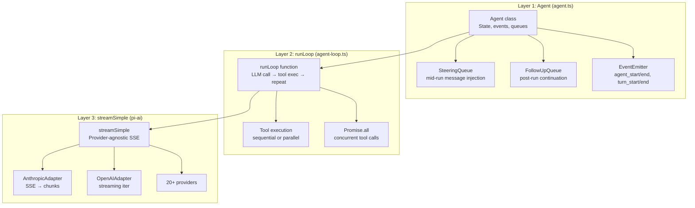

# Pi -- Agent Loop Deep Dive

## Overview

Pi's agent loop lives in two packages: `@mariozechner/pi-agent-core` (the low-level loop) and `@mariozechner/pi-ai` (the LLM streaming layer). The architecture separates **agent orchestration** (state, events, queuing) from **LLM communication** (provider formatting, SSE parsing).

```
Agent (agent.ts)          ── High-level state machine, event dispatch, queues
  └─ runLoop (agent-loop.ts) ── The core while-loop: LLM call → tool exec → repeat
      └─ streamSimple (pi-ai)  ── Provider-agnostic streaming
```

## Three-Layer Architecture



### Layer 1: `Agent` Class (`agent.ts`)

The `Agent` class is the **stateful wrapper** that UI layers (TUI, web, Slack bot) interact with. It owns the conversation transcript, emits lifecycle events, manages queues, and provides the public API.

```typescript
const agent = new Agent({
  model: getModel('claude-sonnet-4-6'),
  tools: [readTool, writeTool, bashTool],
  systemPrompt: 'You are a coding assistant.',
  getApiKey: async (provider) => await fetchExpiringToken(provider),
  beforeToolCall: async (ctx) => { /* approve/reject */ },
  afterToolCall: async (ctx) => { /* modify result */ },
});

await agent.prompt('Fix the bug');
await agent.waitForIdle();
```

**Key responsibilities:**
- Maintains `MutableAgentState` (messages array, tools array, streaming status, pending tool calls, error state)
- Manages two independent message queues: **steering** (mid-run injection) and **follow-up** (post-run continuation)
- Owns the `activeRun` lifecycle (AbortController, promise settlement, listener drainage)
- Subscribes via `agent.subscribe()` for event-driven UI updates
- Handles run failures: on error, pushes a synthetic assistant message with `stopReason: "error"` and emits `agent_end`

### Layer 2: `runLoop` (`agent-loop.ts`)

The **core loop logic** — a pure function that takes context, config, and an event sink. This is shared between `runAgentLoop()` (new prompt) and `runAgentLoopContinue()` (resume from existing context).

### Layer 3: `streamSimple` (`pi-ai`)

The **LLM streaming function** that handles provider-specific formatting, SSE parsing, and token normalization. Returns an async iterator that yields streaming events.

## The Core Loop: `runLoop()`

```typescript
// agent-loop.ts, line ~155
async function runLoop(
  currentContext: AgentContext,
  newMessages: AgentMessage[],
  config: AgentLoopConfig,
  signal: AbortSignal | undefined,
  emit: AgentEventSink,
  streamFn?: StreamFn,
): Promise<void>
```

### Outer Structure: Two-Level While Loop

```
while (true)                          ← Outer: continues for follow-up messages
  hasMoreToolCalls = true
  while (hasMoreToolCalls || pendingMessages.length > 0)  ← Inner: tool turns
    1. Drain steering messages
    2. Call LLM (streamAssistantResponse)
    3. If error/aborted → emit agent_end, return
    4. Extract tool calls from response
    5. If tool calls exist → execute them
    6. Check steering queue again (post-execution)
  7. Check follow-up queue
  8. If follow-up messages → set as pending, continue outer loop
  9. No messages → break, emit agent_end
```

The **inner loop** handles tool-call chains within a single conversational turn. The **outer loop** handles continuation after the agent would naturally stop — used for steering/follow-up that arrives while the agent was working.

### Steering Queue Interaction with the Loop

```mermaid
sequenceDiagram
    participant User
    participant TUI as TUI/UI
    participant Agent as Agent class
    participant Loop as runLoop (inner)
    participant LLM as streamSimple
    participant Tools as Tool executor

    User->>TUI: "Fix the bug"
    TUI->>Agent: agent.prompt("Fix the bug")
    Agent->>Agent: emit agent_start
    Agent->>Loop: runLoop(messages)

    Loop->>LLM: streamAssistantResponse()
    LLM-->>Loop: text chunks
    Loop->>TUI: emit message_update
    LLM-->>Loop: tool call: read_file
    Loop->>Tools: execute(read_file)
    Tools-->>Loop: content
    Loop->>Loop: append tool result

    User->>TUI: "Also check config.py"
    TUI->>Agent: agent.enqueueSteering("Also check config.py")

    Loop->>Loop: check steering queue
    Loop->>Loop: drain steering message
    Loop->>LLM: streamAssistantResponse(+steering)
    LLM-->>Loop: text response
    Loop->>TUI: emit turn_end

    Loop->>Agent: return
    Agent->>TUI: emit agent_end
```

### Turn Definition

A **turn** is one assistant response + any tool calls/results that follow. Each inner loop iteration emits:
- `turn_start` → `message_start` → (streaming events) → `message_end` → `tool_execution_start`/`tool_execution_end` → `turn_end`

The `firstTurn` flag ensures `turn_start` is not emitted redundantly on the first iteration (the caller already emitted it).

## Message Management

### AgentMessage Types

Pi uses an extensible message union:

```typescript
type AgentMessage = Message | CustomAgentMessages[keyof CustomAgentMessages];
```

Where `Message` includes:
- `UserMessage`: `{ role: "user", content: (TextContent | ImageContent)[] }`
- `AssistantMessage`: `{ role: "assistant", content: [...], usage, stopReason }`
- `ToolResultMessage`: `{ role: "toolResult", toolCallId, toolName, content, isError }`

Custom messages are added via TypeScript **declaration merging**:

```typescript
declare module "@mariozechner/agent" {
  interface CustomAgentMessages {
    artifact: ArtifactMessage;
    notification: NotificationMessage;
  }
}
```

### Message Lifecycle in the Loop

1. **Input**: `runAgentLoop(prompts, context, ...)` — prompts are added to `currentContext.messages`
2. **LLM call boundary**: `convertToLlm(messages)` transforms `AgentMessage[] → Message[]` (filters out custom/UI-only messages)
3. **Context transform** (optional): `transformContext(messages)` — used for pruning, compaction, external injection
4. **Streaming**: Partial `AssistantMessage` is pushed to context on `start`, updated in-place on each delta
5. **Completion**: Final message replaces the partial or is appended if no partial was streamed
6. **Tool results**: Each tool result becomes a `ToolResultMessage` appended to both `currentContext` and `newMessages`

### Message Tracking: `newMessages` vs `currentContext.messages`

- `currentContext.messages`: the **working transcript** that grows with every event
- `newMessages`: tracks only **newly added messages** during this run, returned to the caller

This separation allows `runAgentLoopContinue()` to know which messages were produced in the current invocation.

## Multi-Turn Handling

### Prompt → Continue Pattern

```typescript
// Start: agent.prompt()
await agent.prompt("Fix the bug in auth.ts");
// Internally calls runAgentLoop with the new user message

// Continue: agent.continue()
await agent.continue();
// Internally calls runAgentLoopContinue — no new message added
```

`runAgentLoopContinue` validates that the last message is NOT an assistant message (the LLM must have something to respond to — either a user message or a tool result).

### The `steer()` Method: Mid-Run Injection

The **steering queue** allows injecting messages while the agent is running. This is how Pi implements **user interruption** during long tool chains.

```typescript
agent.steer({ role: "user", content: "Actually, skip the tests and just fix the bug" });
```

**How it works:**
1. `steer()` enqueues into `PendingMessageQueue` (mode: `"all"` or `"one-at-a-time"`)
2. After each turn's tool execution completes, `getSteeringMessages()` drains the queue
3. If steering messages exist, they're injected as user messages before the next LLM call
4. Current turn's tool calls are NOT skipped — steering takes effect on the NEXT LLM call

**Steering mode controls draining:**
- `"one-at-a-time"` (default): only the first queued message is drained per check
- `"all"`: all queued messages are drained at once

**Pre-API-call steering drain**: In `runLoop`, steering is checked twice:
1. **At loop start**: `(await config.getSteeringMessages?.()) || []`
2. **After each turn**: `pendingMessages = (await config.getSteeringMessages?.()) || []`

### The `followUp()` Method: Post-Run Continuation

Follow-up is distinct from steering — it only activates **after the agent would naturally stop** (no more tool calls).

```typescript
agent.followUp({ role: "user", content: "Now also update the tests" });
```

**How it works:**
1. Inner loop exits (no tool calls, no steering)
2. `getFollowUpMessages()` drains the follow-up queue
3. If messages exist, they become `pendingMessages` and the **outer loop continues**
4. The agent runs another turn with the follow-up messages

This enables patterns like: agent finishes → background process completes → follow-up injects the result → agent continues.

### The `PendingMessageQueue` Class

```typescript
class PendingMessageQueue {
  private messages: AgentMessage[] = [];
  constructor(public mode: QueueMode) {}

  enqueue(message: AgentMessage): void { this.messages.push(message); }
  drain(): AgentMessage[] {
    if (this.mode === "all") { /* return all */ }
    else { /* return first, shift rest */ }
  }
}
```

Two independent instances: `steeringQueue` and `followUpQueue`. Each can have its own mode.

## Tool Handling

### Tool Call Detection

After streaming completes, tool calls are extracted from the assistant message:

```typescript
const toolCalls = message.content.filter((c) => c.type === "toolCall");
```

### Execution Mode: Sequential vs Parallel

Configured at the agent level:

```typescript
const agent = new Agent({ toolExecutionMode: "parallel" });
```

**Parallel** (default):
1. All tool calls are **prepared** sequentially (argument validation, `beforeToolCall` hooks)
2. "Prepared" calls (validated, not blocked) are sent to `Promise.all()` for concurrent execution
3. `tool_execution_end` events fire in **tool completion order** (not source order)
4. Tool result messages are emitted in **assistant source order** (preserves model's intended sequence)

**Sequential**:
Every tool call goes through the full prepare → execute → finalize → emit cycle before the next starts.

**Per-tool override**:
Individual tools can force sequential execution via `executionMode: "sequential"`:

```typescript
const writeTool = {
  name: "write_file",
  executionMode: "sequential",  // Force sequential even in parallel mode
  // ...
};
```

The loop checks `hasSequentialToolCall` — if ANY tool in the batch requires sequential, ALL are executed sequentially.

### Tool Execution Pipeline

Each tool call goes through three phases:

#### Phase 1: `prepareToolCall()`

1. **Lookup**: Find tool by name in `currentContext.tools`
2. **Argument preparation**: `tool.prepareArguments(args)` — optional shim for malformed LLM output
3. **Schema validation**: `validateToolArguments(tool, preparedToolCall)` — TypeBox-based validation
4. **`beforeToolCall` hook**: External gate (approve/block). If blocked, returns immediate error result

If any step fails, the tool call is short-circuited with an error `AgentToolResult`.

#### Phase 2: `executePreparedToolCall()`

Calls `tool.execute(toolCallId, validatedArgs, signal, onUpdate)`.

- **Abort signal**: Passed to every tool for cancellation
- **Streaming updates**: Tools call `onUpdate(partialResult)` to emit `tool_execution_update` events
- **Error handling**: Caught exceptions become error results, not loop crashes

#### Phase 3: `finalizeExecutedToolCall()`

1. **`afterToolCall` hook**: Post-execution gate that can modify content, details, or isError flag
2. **Merge semantics**: Field-by-field replacement, no deep merge
3. Returns the finalized `{ toolCall, result, isError }`

### Tool Result Message Creation

```typescript
function createToolResultMessage(finalized): ToolResultMessage {
  return {
    role: "toolResult",
    toolCallId: finalized.toolCall.id,
    toolName: finalized.toolCall.name,
    content: finalized.result.content,
    details: finalized.result.details,
    isError: finalized.isError,
    timestamp: Date.now(),
  };
}
```

## Infrastructure

### Event System: `AgentEvent` Union

Pi emits 9 event types covering the full lifecycle:

```typescript
type AgentEvent =
  // Agent lifecycle
  | { type: "agent_start" }
  | { type: "agent_end"; messages: AgentMessage[] }
  // Turn lifecycle
  | { type: "turn_start" }
  | { type: "turn_end"; message: AgentMessage; toolResults: ToolResultMessage[] }
  // Message lifecycle
  | { type: "message_start"; message: AgentMessage }
  | { type: "message_update"; message: AgentMessage; assistantMessageEvent: AssistantMessageEvent }
  | { type: "message_end"; message: AgentMessage }
  // Tool execution lifecycle
  | { type: "tool_execution_start"; toolCallId; toolName; args }
  | { type: "tool_execution_update"; toolCallId; toolName; args; partialResult }
  | { type: "tool_execution_end"; toolCallId; toolName; result; isError };
```

**Listener drainage**: In the `Agent` class, `processEvents()` first updates internal state, then awaits each listener sequentially. The `agent_end` event is the final emitted event, but the run is not considered "idle" until all awaited listeners for `agent_end` settle.

### Run Lifecycle: `runWithLifecycle()`

```typescript
private async runWithLifecycle(executor: (signal: AbortSignal) => Promise<void>): Promise<void> {
  const abortController = new AbortController();
  this.activeRun = { promise, resolve, abortController };

  this._state.isStreaming = true;
  try {
    await executor(abortController.signal);
  } catch (error) {
    await this.handleRunFailure(error, abortController.signal.aborted);
  } finally {
    this.finishRun();  // clears isStreaming, pendingToolCalls, activeRun
  }
}
```

**Key properties:**
- Only one `activeRun` at a time — concurrent `prompt()` calls throw
- `waitForIdle()` returns the active run's promise, allowing callers to await completion
- `abort()` signals the AbortController, which propagates to the LLM stream and all tool executions
- Failed runs push a synthetic assistant message with `stopReason: "aborted"` or `"error"`

### Streaming: `streamAssistantResponse()`

The bridge between the loop and the LLM provider:

```
1. transformContext(messages)     ← optional compaction/pruning
2. convertToLlm(messages)         ← AgentMessage[] → Message[]
3. Build Context { systemPrompt, messages, tools }
4. Resolve API key (dynamic, for expiring tokens)
5. Call streamFn(model, context, options)
6. Iterate async events:
   - "start" → push partial to context, emit message_start
   - "text_delta"/"thinking_delta"/"toolcall_delta" → update in-place, emit message_update
   - "done"/"error" → finalize, emit message_end, return
```

**Critical design**: The partial message is pushed to `context.messages` on `start` and mutated in-place for each delta. On completion, the final message replaces the partial. If streaming fails before any delta, the final message is appended fresh.

### API Key Resolution

Dynamic key resolution runs on **every LLM call**, not just at agent creation:

```typescript
const resolvedApiKey = (config.getApiKey ? await config.getApiKey(config.model.provider) : undefined) || config.apiKey;
```

This is critical for **OAuth tokens** (e.g., GitHub Copilot) that expire during long-running tool execution phases.

### Error Handling Philosophy

Pi follows a **must-not-throw** contract for all extensibility points:

- `convertToLlm`: must return a safe fallback, not throw
- `transformContext`: must return original messages or another safe value
- `getApiKey`: must return undefined when unavailable
- `getSteeringMessages`/`getFollowUpMessages`: must return `[]` when empty
- `beforeToolCall`/`afterToolCall`: must not throw (errors are caught and converted to tool errors)

This ensures the loop never crashes due to user-provided callbacks — it degrades gracefully.

## Streaming Events from `pi-ai`

The `streamSimple` function in `pi-ai` handles provider-specific streaming:

```typescript
interface AssistantMessageEvent {
  type: "start" | "text_start" | "text_delta" | "text_end"
      | "thinking_start" | "thinking_delta" | "thinking_end"
      | "toolcall_start" | "toolcall_delta" | "toolcall_end"
      | "done" | "error";
  partial: AssistantMessage;  // The accumulating message
}
```

The stream function:
1. Formats the request for the target provider (Anthropic, OpenAI, Google, Bedrock, etc.)
2. Parses the SSE response into typed events
3. Accumulates into a partial `AssistantMessage`
4. On `"done"`, calls `stream.result()` to get the final message
5. On `"error"`, still calls `stream.result()` which returns a message with `stopReason: "error"`

## Context Management

### The `transformContext` Hook

Used for operations at the `AgentMessage[]` level before conversion:

```typescript
transformContext: async (messages, signal) => {
  if (estimateTokens(messages) > MAX_TOKENS) {
    return pruneOldMessages(messages);
  }
  return messages;
}
```

The hook runs **inside** `streamAssistantResponse`, on every LLM call. It receives the full transcript and can prune, summarize, or inject external context.

### The `convertToLlm` Hook

Filters and transforms messages for the LLM:

```typescript
convertToLlm: (messages) => messages.filter(m =>
  m.role === "user" || m.role === "assistant" || m.role === "toolResult"
)
```

This is where custom message types (artifacts, notifications) are either converted to LLM-readable format or filtered out. The default implementation just passes through standard roles.

## Summary: The Full Loop in One View

```
agent.prompt("Fix the bug")
  └─ runWithLifecycle()
       └─ runAgentLoop(prompts, context, config, emit, streamFn)
            └─ runLoop()
                 │
                 ├─ emit(agent_start)
                 ├─ emit(turn_start)
                 ├─ emit(message_start/end) for each prompt
                 │
                 ├─ OUTER LOOP (follow-up continuation)
                 │    │
                 │    ├─ INNER LOOP (tool calls + steering)
                 │    │    ├─ Drain steering messages → inject into context
                 │    │    ├─ streamAssistantResponse()
                 │    │    │    ├─ transformContext(messages)
                 │    │    │    ├─ convertToLlm(messages)
                 │    │    │    ├─ streamSimple(model, context)
                 │    │    │    └─ Emit: message_start → message_update* → message_end
                 │    │    ├─ If error/aborted → emit(turn_end, agent_end), return
                 │    │    ├─ Extract tool calls
                 │    │    ├─ If tool calls:
                 │    │    │    ├─ executeToolCalls() → sequential or parallel
                 │    │    │    │    ├─ prepareToolCall() → validate, beforeToolCall
                 │    │    │    │    ├─ execute() → run tool with abort signal
                 │    │    │    │    └─ finalizeExecutedToolCall() → afterToolCall
                 │    │    │    └─ Emit: tool_execution_start → tool_execution_update* → tool_execution_end
                 │    │    │         → message_start/end for each tool result
                 │    │    └─ Check steering queue → repeat inner loop if messages
                 │    │
                 │    └─ Drain follow-up queue → set as pending, continue outer loop
                 │
                 └─ emit(agent_end, newMessages)
```

## Key Files

```
packages/agent/src/
  ├── agent.ts          Agent class — high-level state machine, queues, lifecycle
  ├── agent-loop.ts     runAgentLoop/runAgentLoopContinue — the core while-loop
  └── types.ts          AgentEvent, AgentMessage, AgentTool, AgentLoopConfig

packages/ai/src/
  ├── stream.ts         streamSimple — provider-agnostic streaming
  ├── types.ts          Message, AssistantMessage, Tool, Content types
  └── models.ts         Model definitions with pricing and capabilities
```
