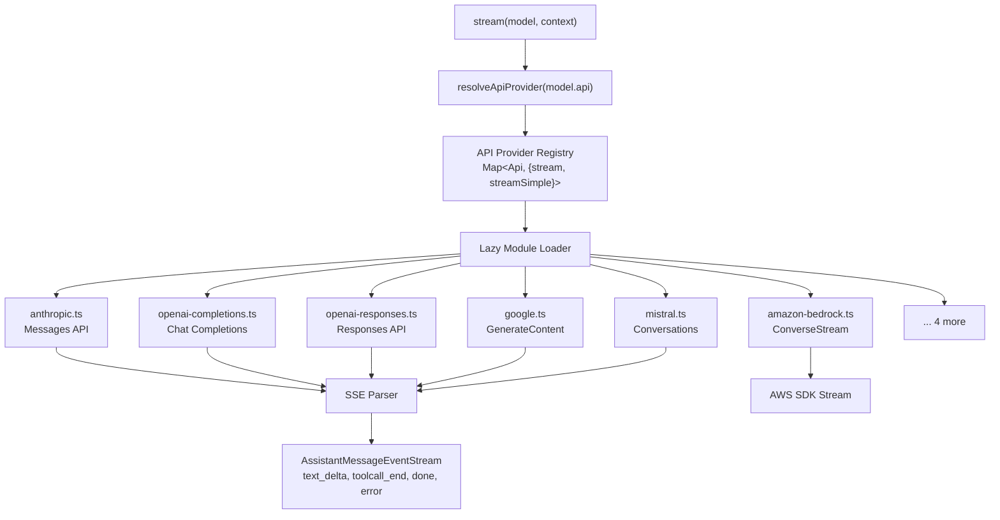
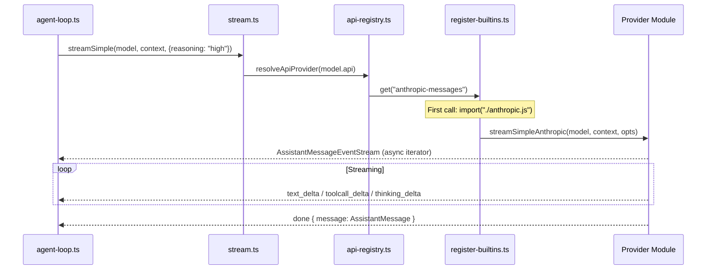

# Pi -- Model Providers Deep Dive

## Overview

Pi's model provider system lives in the `@mariozechner/pi-ai` package. It uses a **two-registry architecture**: a model registry (static metadata for 200+ models across 20+ providers) and an API provider registry (runtime streaming implementations). This separation means model metadata loads instantly at import time while heavy provider code is lazy-loaded on first use.

```
Model Registry (models.ts)          API Provider Registry (api-registry.ts)
┌─────────────────────────┐         ┌──────────────────────────────────┐
│ Map<provider, models>   │         │ Map<api, {stream, streamSimple}> │
│ - id, contextWindow     │         │ - anthropic-messages             │
│ - maxOutput, cost       │         │ - openai-completions             │
│ - supportsTools         │         │ - openai-responses               │
│ - supportsThinking      │         │ - google-generative-ai           │
│ - api (links to ──────────────────│→ bedrock-converse-stream          │
│    provider registry)   │         │ - mistral-conversations          │
└─────────────────────────┘         │ - google-gemini-cli              │
                                    │ - google-vertex                  │
                                    │ - azure-openai-responses         │
                                    │ - openai-codex-responses         │
                                    └──────────────────────────────────┘
```

## Architecture





## Model Registry

### Generated Model Database

Model metadata is generated from upstream provider specs into `models.generated.ts`. This file contains a `MODELS` constant — a nested object keyed by provider, then model ID.

```typescript
// models.generated.ts (auto-generated, 20+ providers)
export const MODELS = {
  anthropic: {
    "claude-opus-4-6": {
      id: "claude-opus-4-6",
      provider: "anthropic",
      api: "anthropic-messages",
      contextWindow: 1000000,
      maxOutput: 32768,
      supportsTools: true,
      supportsThinking: true,
      cost: { input: 15, output: 75, cacheRead: 1.5, cacheWrite: 18.75 },
    },
    // ... more models
  },
  openai: { /* ... */ },
  google: { /* ... */ },
  // 20+ providers total
};
```

### Registry API

`models.ts` wraps the generated data in a `Map<string, Map<string, Model>>` for fast lookup:

```typescript
// Get a specific model by provider + id
const model = getModel('anthropic', 'claude-opus-4-6');

// List all providers
const providers = getProviders();
// → ['anthropic', 'openai', 'google', 'amazon-bedrock', ...]

// List all models for a provider
const models = getModels('anthropic');

// Calculate cost from usage
const cost = calculateCost(model, usage);
// cost.total = (input * model.cost.input/1M) + (output * model.cost.output/1M)
//            + (cacheRead * model.cost.cacheRead/1M) + (cacheWrite * model.cost.cacheWrite/1M)
```

### Model Type

Each model carries typed metadata that the streaming layer uses:

```typescript
interface Model<TApi extends Api> {
  id: string;              // e.g., "claude-opus-4-6"
  provider: Provider;      // e.g., "anthropic"
  api: TApi;               // Links to the API provider registry
  contextWindow: number;   // Maximum input tokens
  maxOutput: number;       // Maximum output tokens
  supportsTools: boolean;
  supportsThinking: boolean;
  cost: {
    input: number;         // Per million tokens (USD)
    output: number;
    cacheRead: number;
    cacheWrite: number;
  };
}
```

The `api` field is the critical link — it determines which streaming implementation handles the model. Multiple providers can share the same API (e.g., OpenRouter, Groq, Cerebras, xAI all use `openai-completions`).

## Supported Providers

### Provider → API Mapping

| Provider | API Protocol | Auth | Notes |
|----------|-------------|------|-------|
| Anthropic | `anthropic-messages` | API key | Native Messages API, prompt caching, thinking |
| OpenAI (Chat) | `openai-completions` | API key | Chat Completions, reasoning_effort, streaming |
| OpenAI (Responses) | `openai-responses` | API key | Responses API with session persistence |
| OpenAI Codex | `openai-codex-responses` | OAuth | Codex Responses API, code-focused |
| Azure OpenAI | `azure-openai-responses` | API key / Entra ID | Azure-hosted Responses API |
| Google Gemini | `google-generative-ai` | API key / OAuth | GenerateContent API, native function calling |
| Google Gemini CLI | `google-gemini-cli` | OAuth | Browser-based auth via Gemini CLI flow |
| Google Vertex | `google-vertex` | Service account / ADC | Vertex AI endpoint, same content API |
| AWS Bedrock | `bedrock-converse-stream` | AWS credentials | ConverseStream API via AWS SDK |
| Mistral | `mistral-conversations` | API key | Conversations API (distinct from chat completions) |
| GitHub Copilot | `openai-completions` | OAuth (browser) | Copilot token exchange, OpenAI-compatible |
| xAI (Grok) | `openai-completions` | API key | OpenAI-compatible endpoint |
| Groq | `openai-completions` | API key | OpenAI-compatible, fast inference |
| Cerebras | `openai-completions` | API key | OpenAI-compatible, wafer-scale inference |
| OpenRouter | `openai-completions` | API key | Aggregator with provider routing controls |
| DeepSeek | `openai-completions` | API key | OpenAI-compatible |
| Together | `openai-completions` | API key | OpenAI-compatible |
| Fireworks | `openai-completions` | API key | OpenAI-compatible |
| NVIDIA NIM | `openai-completions` | API key | OpenAI-compatible |
| Sambanova | `openai-completions` | API key | OpenAI-compatible |
| Custom/Local | `openai-completions` | Varies | Any OpenAI-compatible endpoint |

### OpenAI-Compatible Provider Differences

The `openai-completions` API handles 15+ providers that speak the OpenAI Chat Completions protocol, but with provider-specific quirks managed by the `OpenAICompletionsCompat` configuration:

```typescript
interface OpenAICompletionsCompat {
  supportsStore?: boolean;                    // Store field support
  supportsDeveloperRole?: boolean;            // developer vs system role
  supportsReasoningEffort?: boolean;          // reasoning_effort parameter
  reasoningEffortMap?: Partial<Record<ThinkingLevel, string>>;  // Level mapping
  supportsUsageInStreaming?: boolean;         // stream_options.include_usage
  maxTokensField?: "max_completion_tokens" | "max_tokens";
  requiresToolResultName?: boolean;
  requiresAssistantAfterToolResult?: boolean;
  requiresThinkingAsText?: boolean;           // Convert thinking blocks to text
  thinkingFormat?: "openai" | "openrouter" | "zai" | "qwen" | "qwen-chat-template";
  cacheControlFormat?: "anthropic";           // Prompt caching convention
  sendSessionAffinityHeaders?: boolean;
}
```

These compat flags are auto-detected from the base URL. For example, OpenRouter endpoints get `thinkingFormat: "openrouter"` and routing controls. Z.AI endpoints get `zaiToolStream: true`. Custom endpoints can override detection.

## API Provider Registry

### Registration

The registry is a `Map<Api, { stream, streamSimple }>`. Built-in providers self-register at module load time via `register-builtins.ts`:

```typescript
// 10 built-in API protocols registered
registerApiProvider({
  api: "anthropic-messages",
  stream: streamAnthropic,
  streamSimple: streamSimpleAnthropic,
});

registerApiProvider({
  api: "openai-completions",
  stream: streamOpenAICompletions,
  streamSimple: streamSimpleOpenAICompletions,
});

// ... 8 more
```

### Lazy Loading

Provider modules are **lazy-loaded** on first use. Each provider has a cached Promise that resolves to the module:

```typescript
function loadAnthropicProviderModule() {
  anthropicProviderModulePromise ||= import("./anthropic.js").then((module) => ({
    stream: module.streamAnthropic,
    streamSimple: module.streamSimpleAnthropic,
  }));
  return anthropicProviderModulePromise;
}
```

The `createLazyStream()` wrapper returns a `StreamFunction` that loads the module on first call, forwards the stream events, and handles load failures:

```typescript
function createLazyStream(loadModule) {
  return (model, context, options) => {
    const outer = new AssistantMessageEventStream();
    loadModule()
      .then((module) => forwardStream(outer, module.stream(model, context, options)))
      .catch((error) => {
        outer.push({ type: "error", reason: "error", error: createLazyLoadErrorMessage(model, error) });
        outer.end();
      });
    return outer;
  };
}
```

This means importing `pi-ai` doesn't load any HTTP clients, SDKs, or provider-specific code until you actually call `stream()` with a specific model.

### Custom Provider Registration

Third-party providers can register themselves:

```typescript
registerApiProvider({
  api: "my-custom-api",
  stream: myStreamFn,
  streamSimple: mySimpleStreamFn,
});
```

Providers can also be unregistered by source ID (`unregisterApiProviders(sourceId)`) — used when extensions provide alternative implementations.

## Streaming Architecture

### Two Stream Functions

Each provider implements two streaming interfaces:

1. **`stream(model, context, options)`** — Full control with provider-specific options. Used internally when the caller needs fine-grained control over provider parameters.

2. **`streamSimple(model, context, options)`** — Simplified with reasoning level mapping. Used by the agent loop (`runLoop` in `agent-loop.ts`). Accepts a `reasoning` level (`minimal` | `low` | `medium` | `high` | `xhigh`) and maps it to provider-specific parameters.

### Event Protocol

Both functions return an `AssistantMessageEventStream` that emits a typed event sequence:

```
start → (text_start → text_delta* → text_end)*
       (thinking_start → thinking_delta* → thinking_end)*
       (toolcall_start → toolcall_delta* → toolcall_end)*
     → done | error
```

The `done` event carries the final `AssistantMessage` with aggregated `Usage` stats. The `error` event carries the same message with `stopReason: "error"` and `errorMessage`.

### Provider-Specific Streaming

Each provider handles SSE parsing differently:

- **Anthropic**: SSE with `message_start`, `content_block_start`, `content_block_delta`, `content_block_stop`, `message_delta`, `message_stop` events. Thinking blocks arrive as `thinking` type content blocks.

- **OpenAI Completions**: SSE with `data: {...}` lines. `choices[0].delta` for text/tool deltas. `usage` in final chunk when `stream_options.include_usage` is set.

- **OpenAI Responses**: Server-sent events with response items. Different event structure from Completions.

- **Google**: SSE with `GenerateContentResponse` chunks. Function calls arrive as `functionCall` parts.

- **Bedrock**: AWS SDK streaming with `ConverseStream` events. Node.js-only (loaded conditionally).

- **Mistral**: Conversations API with streaming. Different tool call format from OpenAI.

## API Key Management

### Environment-Based Keys

`env-api-keys.ts` resolves API keys from environment variables:

```typescript
function getEnvApiKey(provider: Provider): string | undefined {
  // Provider-specific env vars: ANTHROPIC_API_KEY, OPENAI_API_KEY, etc.
  // Falls back to generic patterns
}
```

### Runtime Key Injection

The `StreamOptions.apiKey` field allows callers to inject keys at call time, overriding env vars:

```typescript
stream(model, context, { apiKey: await getExpiringToken('anthropic') });
```

The agent constructor accepts a `getApiKey` callback for dynamic key resolution:

```typescript
new Agent({
  getApiKey: async (provider) => await vault.getKey(provider),
});
```

### OAuth Flows

Several providers use OAuth instead of static keys:

- **GitHub Copilot**: Device code flow → browser auth → token exchange
- **Google Gemini CLI**: OAuth PKCE flow via local browser redirect
- **Google Antigravity**: Google-specific auth flow
- **OpenAI Codex**: OAuth PKCE flow for Codex access

OAuth utilities live in `utils/oauth/` with PKCE helpers, token storage, and refresh logic.

## Token Counting and Cost

### Usage Tracking

Every streaming response includes a `Usage` object:

```typescript
interface Usage {
  input: number;         // Input tokens consumed
  output: number;        // Output tokens generated
  cacheRead: number;     // Tokens read from cache
  cacheWrite: number;    // Tokens written to cache
  totalTokens: number;   // input + output
  cost: {
    input: number;       // USD
    output: number;
    cacheRead: number;
    cacheWrite: number;
    total: number;
  };
}
```

### Cost Calculation

`calculateCost()` uses per-model pricing from the model registry:

```typescript
function calculateCost(model, usage) {
  usage.cost.input = (model.cost.input / 1_000_000) * usage.input;
  usage.cost.output = (model.cost.output / 1_000_000) * usage.output;
  usage.cost.cacheRead = (model.cost.cacheRead / 1_000_000) * usage.cacheRead;
  usage.cost.cacheWrite = (model.cost.cacheWrite / 1_000_000) * usage.cacheWrite;
  usage.cost.total = usage.cost.input + usage.cost.output
                   + usage.cost.cacheRead + usage.cost.cacheWrite;
  return usage.cost;
}
```

### Context Window Management

The `Model.contextWindow` field drives context management in the agent loop. When the conversation exceeds the window, the agent triggers compaction (see [15-memory-deep.md](./15-memory-deep.md)).

The `supportsXhigh()` function checks model capability for maximum thinking effort:

```typescript
function supportsXhigh(model) {
  return model.id.includes("gpt-5.2") || model.id.includes("gpt-5.3")
      || model.id.includes("gpt-5.4")
      || model.id.includes("opus-4-6") || model.id.includes("opus-4-7");
}
```

## Prompt Caching

### Anthropic Cache Control

Pi supports Anthropic's prompt caching via `cache_control` markers injected into messages. The `cacheRetention` option controls TTL:

```typescript
stream(model, context, {
  cacheRetention: "short",  // "none" | "short" | "long"
  sessionId: "abc123",      // Session affinity for cache routing
});
```

### Session Affinity

For providers that support session-aware caching, `sessionId` sends affinity headers (`x-session-affinity`, `x-client-request-id`) to improve cache hit rates across turns.

## Retry and Error Handling

### Stream-Level Errors

Provider errors are encoded in the stream, not thrown:

```typescript
// Error → stream event (not exception)
outer.push({
  type: "error",
  reason: "error",
  error: { ...message, stopReason: "error", errorMessage: "429 Too Many Requests" }
});
```

### Retry Configuration

`maxRetryDelayMs` (default 60s) caps the maximum wait time when a provider requests a long retry delay. If the provider's requested delay exceeds the cap, the request fails immediately with the delay info — allowing higher-level retry logic (in the agent loop) to handle it with user visibility.

## Extension Points

### Custom Providers via Extensions

Pi extensions can register new providers at runtime:

```typescript
registerApiProvider({
  api: "my-custom-api" as Api,
  stream: myProvider.stream,
  streamSimple: myProvider.streamSimple,
}, "my-extension-id");

// Clean up on extension unload
unregisterApiProviders("my-extension-id");
```

### OpenAI-Compatible Endpoints

Any endpoint speaking the OpenAI Chat Completions protocol works out of the box via the `openai-completions` API. Custom endpoints just need:

1. A model entry in `MODELS` (or dynamic registration)
2. The `api: "openai-completions"` field
3. Optional `OpenAICompletionsCompat` overrides for quirks

This covers local servers (Ollama, vLLM, llama.cpp), cloud inference APIs, and enterprise gateways.

## Related Documents

- [02-ai-package.md](./02-ai-package.md) — Full pi-ai package documentation
- [03-agent-core.md](./03-agent-core.md) — Agent class that consumes the provider layer
- [13-agent-loop.md](./13-agent-loop.md) — How the loop calls streamSimple()
- [15-memory-deep.md](./15-memory-deep.md) — Context window management that relies on model metadata
- [16-multi-model.md](./16-multi-model.md) — Model switching and routing built on this layer

## Source Paths

```
packages/ai/src/
├── stream.ts                    ← Entry point: stream(), streamSimple()
├── api-registry.ts              ← Provider registration and lookup
├── models.ts                    ← Model registry: getModel(), getProviders()
├── models.generated.ts          ← Auto-generated model metadata (200+ models)
├── types.ts                     ← Model, Api, StreamOptions, Usage types
├── env-api-keys.ts              ← Environment-based API key resolution
├── providers/
│   ├── register-builtins.ts     ← Lazy registration of all 10 providers
│   ├── anthropic.ts             ← Anthropic Messages API streaming
│   ├── openai-completions.ts    ← OpenAI Chat Completions + 15 compatible providers
│   ├── openai-responses.ts      ← OpenAI Responses API
│   ├── google.ts                ← Google Gemini GenerateContent
│   ├── amazon-bedrock.ts        ← AWS Bedrock ConverseStream
│   ├── mistral.ts               ← Mistral Conversations API
│   ├── simple-options.ts        ← Reasoning level → provider param mapping
│   └── transform-messages.ts    ← Cross-provider message normalization
└── utils/
    ├── event-stream.ts          ← AssistantMessageEventStream class
    ├── overflow.ts              ← Context overflow detection patterns
    └── oauth/                   ← OAuth flows (Copilot, Google, Codex)
```
