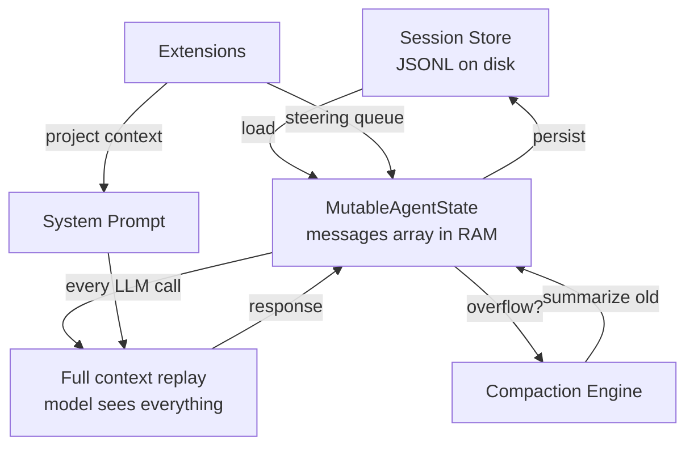

# Pi -- Memory and Context Management Deep Dive

## Overview

Pi's memory system is deliberately minimal compared to frameworks with dedicated memory databases. Instead of external vector stores, Pi manages context through **conversation-scoped state** — the message array is the memory. The strategy: keep the conversation history within the model's context window using compaction, overflow detection, and session persistence.

```
Session Store (JSONL)              Runtime Memory (agent state)
┌─────────────────────┐            ┌─────────────────────────────┐
│ session-001.jsonl   │ ──load──→  │ MutableAgentState.messages   │
│ - user messages     │            │ - UserMessage[]              │
│ - assistant msgs    │            │ - AssistantMessage[]         │
│ - tool results      │            │ - ToolResultMessage[]        │
│ - thinking blocks   │            │                              │
│ - usage stats       │            │ Agent.contextWindow          │
└─────────────────────┘            │ Agent.maxTokens              │
                                   │ Agent.compactionConfig       │
                                   └─────────────────────────────┘
```

## Architecture



```mermaid
sequenceDiagram
    participant User
    participant Agent as Agent (agent.ts)
    participant Loop as runLoop
    participant Overflow as overflow.ts
    participant LLM

    User->>Agent: prompt("Fix the bug")
    Agent->>Loop: runLoop(context, newMessages)
    Loop->>Overflow: willOverflow(model, messages)?
    alt Context too large
        Overflow-->>Loop: true
        Loop->>Loop: compact(messages, model)
        Note over Loop: Keep recent N messages<br/>Summarize older ones
    end
    Loop->>LLM: streamSimple(model, context)
    LLM-->>Loop: AssistantMessage
    Loop->>Loop: Execute tool calls
    Loop->>Loop: Append results to messages
    Note over Loop: Inner loop continues if more tool calls
```

## Message-Based Memory

### The Messages Array

Pi's primary memory is the `messages: Message[]` array in `MutableAgentState`. This holds the complete conversation history for the current session:

```typescript
type Message = UserMessage | AssistantMessage | ToolResultMessage;

interface MutableAgentState {
  messages: AgentMessage[];   // Complete conversation history
  tools: Tool[];              // Currently available tools
  isStreaming: boolean;       // Whether a stream is active
  pendingToolCalls: ToolCall[];
  error?: string;
}
```

Every LLM call receives the full message array as context. The model "remembers" everything by literally seeing the entire conversation on every turn.

### Message Types and Structure

**UserMessage**: Text and/or images with a timestamp.
```typescript
interface UserMessage {
  role: "user";
  content: string | (TextContent | ImageContent)[];
  timestamp: number;
}
```

**AssistantMessage**: LLM output with thinking, text, tool calls, and usage tracking.
```typescript
interface AssistantMessage {
  role: "assistant";
  content: (TextContent | ThinkingContent | ToolCall)[];
  api: Api;
  provider: Provider;
  model: string;
  usage: Usage;
  stopReason: StopReason;
  timestamp: number;
}
```

**ToolResultMessage**: Results from tool execution, including error status.
```typescript
interface ToolResultMessage {
  role: "toolResult";
  toolCallId: string;
  toolName: string;
  content: (TextContent | ImageContent)[];
  isError: boolean;
  timestamp: number;
}
```

## Context Window Management

### Overflow Detection

The `overflow.ts` utility estimates whether the current context will fit in the model's window:

```typescript
// utils/overflow.ts
function estimateTokens(messages: Message[]): number {
  // Rough estimation based on character count
  // ~4 characters per token for English text
  // Accounts for message structure overhead
}

function willOverflow(model: Model, messages: Message[], maxTokens: number): boolean {
  const estimated = estimateTokens(messages);
  const available = model.contextWindow - maxTokens;
  return estimated > available;
}
```

### Compaction

When the conversation approaches the context window limit, Pi compacts it. The compaction strategy:

1. **Preserve recent messages** — the last N messages remain verbatim
2. **Summarize older messages** — older conversation is compressed into a summary
3. **Keep system prompt** — always retained in full
4. **Keep tool results** — recent tool results preserved for chain continuity

The agent loop checks for overflow before each LLM call:

```typescript
// In runLoop (agent-loop.ts)
// Before calling the LLM:
if (willOverflow(config.model, currentContext.messages, config.maxTokens)) {
  currentContext.messages = await compact(
    currentContext.messages,
    config.model,
    config.compactionConfig,
  );
}
```

### Custom Compaction

Pi supports custom compaction strategies via the `compactionConfig`:

```typescript
interface CompactionConfig {
  preserveRecentMessages: number;  // How many recent messages to keep verbatim
  summaryModel?: Model;            // Which model to use for summarization
  maxSummaryTokens?: number;       // Budget for the summary
}
```

The pi-coding-agent extension `pi-custom-compaction` provides an enhanced compaction strategy that preserves code context and file references across compaction boundaries.

## Session Persistence

### JSONL Format

Pi persists sessions as JSONL (JSON Lines) files — one JSON object per line. Each line is a message in the conversation:

```
{"role":"user","content":"Fix the bug in auth.ts","timestamp":1714300000000}
{"role":"assistant","content":[{"type":"thinking","thinking":"Let me..."},{"type":"text","text":"I'll fix..."}],"usage":{"input":150,"output":300},...}
{"role":"toolResult","toolCallId":"tc_1","toolName":"read_file","content":[{"type":"text","text":"...file content..."}],...}
```

### Session Tree

Sessions form a **tree structure** — a session can fork into multiple branches when the user reverts and takes a different path. The tree is stored as a directory:

```
sessions/
├── session-001/
│   ├── messages.jsonl      ← Linear message log
│   ├── branches/
│   │   ├── branch-a.jsonl  ← Alternate path from turn 5
│   │   └── branch-b.jsonl  ← Another alternate path
│   └── metadata.json       ← Session metadata, model, timestamps
```

### Load and Resume

When resuming a session, the entire JSONL file is loaded back into the `messages` array. The agent picks up exactly where it left off — no special "resume" logic, just restoring the message history.

## Extensions and Skills as Memory

### Extension-Provided Context

Pi extensions can inject context into the agent via the system prompt or steering messages:

- **Skills**: Loaded as system prompt additions. A skill like `pi-skills` adds instructions that persist across all turns.
- **Context files**: Some extensions add file content to the system prompt (`.pi` directory files).
- **Steering messages**: Extensions inject messages between turns via the steering queue, effectively adding "memory" mid-conversation.

### Project Context

The coding agent reads project files (`.pi/` directory) at startup and includes them in the system prompt. This provides project-specific memory without a database:

- `.pi/extensions/` — Extension configurations
- `.pi/prompts/` — Custom prompt templates
- `.pi/themes/` — UI themes

## Thinking Blocks as Working Memory

### Extended Thinking

When a model supports thinking (`supportsThinking: true`), Pi preserves thinking blocks in the message history:

```typescript
interface ThinkingContent {
  type: "thinking";
  thinking: string;
  thinkingSignature?: string;  // Opaque signature for multi-turn continuity
  redacted?: boolean;          // Safety-filtered thinking
}
```

Thinking blocks serve as the model's "working memory" — they let the model reason across turns by seeing its prior reasoning. The `thinkingSignature` enables providers (like Anthropic) to maintain thinking continuity without re-sending the full thinking text.

### Reasoning Levels

The `SimpleStreamOptions.reasoning` field controls how much "working memory" the model uses per turn:

```typescript
type ThinkingLevel = "minimal" | "low" | "medium" | "high" | "xhigh";
```

Higher levels produce more thinking tokens, giving the model more room to reason. The `xhigh` level is only supported by GPT-5.2+/5.3+/5.4+ and Opus 4.6+ models.

## Comparison with External Memory Systems

Pi's approach trades off capability for simplicity:

| Aspect | Pi | External Memory Systems |
|--------|-----|------------------------|
| Storage | Message array (RAM) + JSONL (disk) | Vector DB, SQL, Redis |
| Retrieval | Full context replay | Semantic search, embeddings |
| Cross-session | Load from JSONL | Persistent memory store |
| Scalability | Limited by context window | Scales independently |
| Latency | Zero (in-memory) | Network round-trip |
| Complexity | None | Embedding pipeline, indexing |

Pi's design philosophy: the context window **is** the memory. As context windows grow (1M+ tokens for Claude, 400K+ for GPT-5.x), the need for external memory diminishes for most coding tasks. When it doesn't suffice, extensions can add external memory providers.

## Related Documents

- [03-agent-core.md](./03-agent-core.md) — Agent class that owns the messages array
- [12-sessions.md](./12-sessions.md) — Session persistence format (JSONL tree)
- [13-agent-loop.md](./13-agent-loop.md) — The loop that drives memory through each turn
- [14-model-providers.md](./14-model-providers.md) — Model.contextWindow drives overflow detection
- [16-multi-model.md](./16-multi-model.md) — Auto-compaction queue and background execution

## Source Paths

```
packages/agent/src/
├── agent.ts              ← MutableAgentState with messages array
├── agent-loop.ts         ← runLoop() overflow check + compaction trigger
└── types.ts              ← AgentMessage, Message type definitions

packages/ai/src/
├── types.ts              ← UserMessage, AssistantMessage, ToolResultMessage
└── utils/overflow.ts     ← isContextOverflow() detection patterns

packages/coding-agent/src/core/
├── compaction/
│   ├── compaction.ts     ← prepareCompaction(), compact(), CompactionResult
│   └── utils.ts          ← serializeConversation(), file tracking
├── session-manager.ts    ← readSession(), appendEntry(), buildSessionContext()
└── agent-session.ts      ← Auto-compaction queue, branch summarization
```
