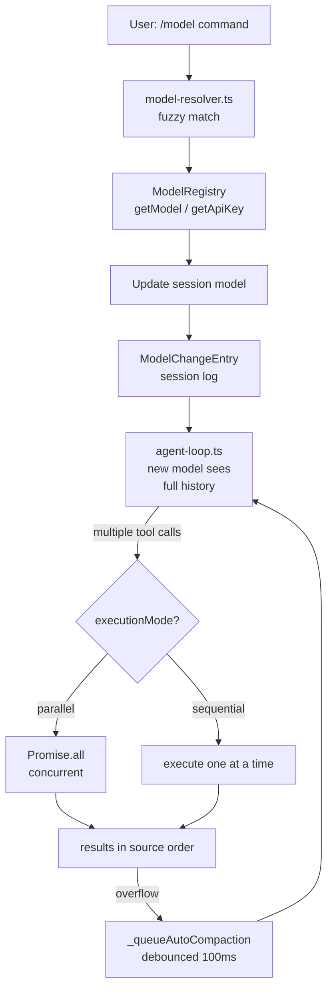

# Pi -- Multi-Model Execution

## Overview

Pi supports multiple models within a single session through runtime model switching, scoped model configurations, parallel tool execution, and extension-driven model routing. The framework's design separates model resolution from agent loop execution, allowing mid-session model changes without interrupting conversation continuity.

## Model Resolution

### Model Registry

The coding agent's `ModelRegistry` (`model-registry.ts`) manages model availability at the session level:

```typescript
class ModelRegistry {
  // Built-in models from models.generated.ts (200+ models, 20+ providers)
  // Custom models from models.json in session directory
  // Dynamic models registered by extensions at runtime

  async getApiKeyAndHeaders(model: Model): Promise<{ apiKey: string; headers: Record<string, string> }> {
    // 1. Check model-specific config (command substitution for dynamic keys)
    // 2. Check OAuth provider (GitHub Copilot, Google, Codex)
    // 3. Fall back to environment variables
  }
}
```

### Model Matching

`model-resolver.ts` provides fuzzy matching when users request models by partial name:

```typescript
function parseModelReference(reference: string, availableModels: Model[]): ParsedModelResult {
  // 1. Exact match: "anthropic/claude-opus-4-6" → direct lookup
  // 2. Partial match: "opus" → filter all models containing "opus"
  // 3. Prefer aliases: "claude-opus-4-6" over "claude-opus-4-6-20250428"
  // 4. Prefer latest dated: "claude-opus-4-6-20250428" over "claude-opus-4-6-20250401"
}
```

### Custom Model Configuration

Users define custom models in `models.json`:

```json
[
  {
    "id": "my-local-llama",
    "api": "openai-completions",
    "baseUrl": "http://localhost:8080/v1",
    "reasoning": false,
    "contextWindow": 131072,
    "maxTokens": 8192,
    "cost": { "input": 0, "output": 0, "cacheRead": 0, "cacheWrite": 0 },
    "compat": {
      "thinkingFormat": "qwen",
      "requiresThinkingAsText": true
    }
  }
]
```

## Runtime Model Switching

### User-Initiated Switching

The `/model` command in the coding agent switches models mid-session:

```
/model claude-sonnet-4-6
/model openai/gpt-5.4
/model my-local-llama
```

The switch:
1. Resolves the model reference against available models
2. Validates API key availability for the new provider
3. Updates the session's active model
4. Records a `ModelChangeEntry` in the session log
5. Continues the conversation with the new model seeing the full history

### Scoped Models

Sessions can configure different models for different thinking levels:

```typescript
interface ScopedModel {
  model: Model<Api>;
  thinkingLevel?: ThinkingLevel;
}
```

This allows routing complex tasks to more capable (expensive) models while using cheaper models for simple operations.

### Thinking Level Coupling

When switching models, thinking levels are validated against the new model's capabilities:

```typescript
// On model switch:
if (newModel.reasoning && currentThinkingLevel !== "off") {
  if (supportsXhigh(newModel)) {
    // Keep xhigh if supported (GPT-5.2+, Opus 4.6+)
  } else if (newModel.supportsThinking) {
    // Downgrade to "high" if xhigh not supported
  } else {
    // Disable thinking for non-reasoning models
  }
}
```

## Parallel Tool Execution

### Execution Modes

Each tool can specify its execution mode:

```typescript
interface AgentTool {
  executionMode?: "sequential" | "parallel";
}
```

When the agent loop receives multiple tool calls from a single LLM response:

**Parallel mode** (default):
1. **Preparation phase** (sequential) — validate parameters, check permissions
2. **Execution phase** (concurrent) — `Promise.all()` on all allowed tools
3. **Finalization** (source order) — emit results in the order the LLM called them

```
Assistant response with 3 tool calls:
  ├─ read_file("src/auth.ts")     ──┐
  ├─ read_file("src/config.ts")   ──┼── Execute in parallel
  └─ read_file("tests/auth.test") ──┘
                                      ↓
  Results appended in original order (auth.ts, config.ts, auth.test)
```

**Sequential mode** (per-tool override):
- Tools marked sequential execute one at a time
- Used for tools with side effects or shared state dependencies

### Event Emission Order

- `tool_execution_end` events emit in **completion order** (as each tool finishes)
- `ToolResultMessage` entries accumulate in **source order** (assistant message order)
- UI layers get real-time updates while the final context stays ordered

## Background Execution

### Active Run Management

The `Agent` class manages one active run at a time with a pending queue:

```typescript
class Agent {
  private _activeRun: ActiveRun | undefined;
  private _pendingRun: ActiveRun | undefined;

  async run(initialPrompts, options): Promise<AgentMessage[]> {
    if (this._activeRun) {
      // Queue the new run — processed after current completes
      return this.queueRun(initialPrompts, options);
    }

    this._activeRun = { promise, resolve, abortController };

    try {
      const result = await agentLoop(/*...*/);
      // Drain pending queue
      while (this._pendingRun) {
        const next = this._pendingRun;
        this._pendingRun = undefined;
        await next.promise;
      }
      return result;
    } finally {
      this._activeRun = undefined;
    }
  }
}
```

### Abort and Cancellation

Each active run owns an `AbortController`. Aborting:
1. Signals the LLM streaming to stop
2. Cancels in-flight tool executions
3. Emits `agent_end` with `stopReason: "aborted"`
4. Allows pending runs to proceed

### Auto-Compaction Queue

Background compaction runs after turns complete, debounced to avoid thrashing:

```typescript
async _queueAutoCompaction(): Promise<void> {
  if (this._compactionAbortController) return;  // Already running

  this._compactionAbortController = new AbortController();

  // Debounce: let the current turn finish
  await new Promise(r => setTimeout(r, 100));

  if (isContextOverflow(model, messages)) {
    await this._compact(model, messages, compactionConfig);
  }

  this._compactionAbortController = undefined;
}
```

## Extension-Driven Model Routing

### Hook-Based Model Selection

Pi extensions can intercept and redirect model selection at various lifecycle points:

```typescript
extensionRunner.on("turn_start", ({ context, model }) => {
  // Route simple queries to cheaper models
  if (estimateComplexity(context) < threshold) {
    return { model: cheapModel };
  }
  return { model };
});
```

### Multi-Model Extension Patterns

**Model switching**: The `pi-model-switch` extension provides runtime model swapping via commands.

**Sub-agent delegation**: The `pi-subagents` extension spawns child agents with different models:

```typescript
// Parent agent (Opus) delegates sub-task to cheaper model
const subResult = await subAgent.run(subTask, {
  model: getModel('anthropic', 'claude-sonnet-4-6'),
  tools: [...parentTools],
});
// Inject sub-agent result back into parent context
```

**Review loops**: The `pi-review-loop` extension uses a second model to review the primary model's output before committing.

## Cost Tracking

### Per-Turn Cost

Every `AssistantMessage` includes a `Usage` object with cost breakdown:

```typescript
interface Usage {
  input: number;
  output: number;
  cacheRead: number;
  cacheWrite: number;
  cost: {
    input: number;    // USD
    output: number;
    cacheRead: number;
    cacheWrite: number;
    total: number;
  };
}
```

### Cumulative Session Cost

The session aggregates costs across all turns, enabling:
- Real-time cost display in the TUI
- Cost-based model switching (move to cheaper model when budget exceeded)
- Per-model cost comparison across the session

### Cache Optimization

Anthropic prompt caching reduces costs by ~75% on multi-turn conversations. Pi supports:
- `cacheRetention: "short"` (5-minute TTL)
- `cacheRetention: "long"` (1-hour TTL, Anthropic only)
- Session affinity headers for cache routing consistency

## Message Queue Management

### Steering vs Follow-Up

Two priority levels control message injection between turns:

| Queue | Priority | Mode | Use Case |
|-------|----------|------|----------|
| Steering | High | Drain all | User interrupts, course corrections |
| Follow-up | Low | One at a time | System-generated continuations |

```typescript
class PendingMessageQueue {
  constructor(public mode: "all" | "one-at-a-time") {}

  drain(): AgentMessage[] {
    if (this.mode === "all") {
      return this.drainAll();
    }
    return this.drainOne();
  }
}
```

### Queue Integration in Loop

The two-level while loop in `agent-loop.ts` checks queues at specific points:

```
while (true)                          ← Outer: follow-up messages
  while (hasMoreToolCalls || pendingMessages.length > 0)  ← Inner: tool turns
    1. Drain steering queue
    2. Call LLM
    3. Execute tool calls
    4. Check steering queue again (post-execution)
  5. Check follow-up queue
  6. If follow-up → continue outer loop
  7. No messages → break
```

This ensures user steering always takes priority over system-generated follow-ups, and follow-ups are processed one at a time to prevent runaway chains.

## Architecture



```mermaid
sequenceDiagram
    participant User
    participant Agent as Agent.run()
    participant Loop as agent-loop.ts
    participant Model as Model Resolution
    participant LLM as LLM Provider
    
    User->>Agent: /model claude-sonnet-4-6
    Agent->>Model: parseModelReference("sonnet")
    Model-->>Agent: Model object + API key
    Agent->>Loop: switch model, continue
    Loop->>LLM: streamSimple(sonnet, context)
    LLM-->>Loop: AssistantMessage
    Loop->>Loop: 3 tool calls returned
    Loop->>Loop: Promise.all(tools)
    Loop-->>Agent: ToolResultMessage[]
    Agent-->>User: Results displayed
```

## Related Documents

- [03-agent-core.md](./03-agent-core.md) — Agent class managing active/pending runs
- [11-data-flow.md](./11-data-flow.md) — Streaming and compaction lifecycle
- [13-agent-loop.md](./13-agent-loop.md) — The loop that executes tool calls
- [14-model-providers.md](./14-model-providers.md) — How providers resolve after model switch
- [15-memory-deep.md](./15-memory-deep.md) — Context window drives overflow detection

## Source Paths

```
packages/coding-agent/src/core/
├── model-registry.ts       ← ModelRegistry, custom models, API key resolution
├── model-resolver.ts       ← parseModelReference() fuzzy matching
└── model-change-entry.ts   ← ModelChangeEntry for session log

packages/agent/src/
├── agent.ts                ← Agent.run() with active/pending run queue
├── agent-loop.ts           ← Tool execution modes, steering queue, compaction
└── types.ts                ← ScopedModel, ThinkingLevel, AgentTool interfaces

packages/ai/src/
├── models.ts               ← Model class, supportsXhigh(), calculateCost()
├── types.ts                ← Usage with cost breakdown
└── stream.ts               ← streamSimple() with reasoning level mapping
```
