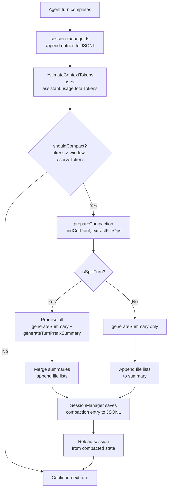
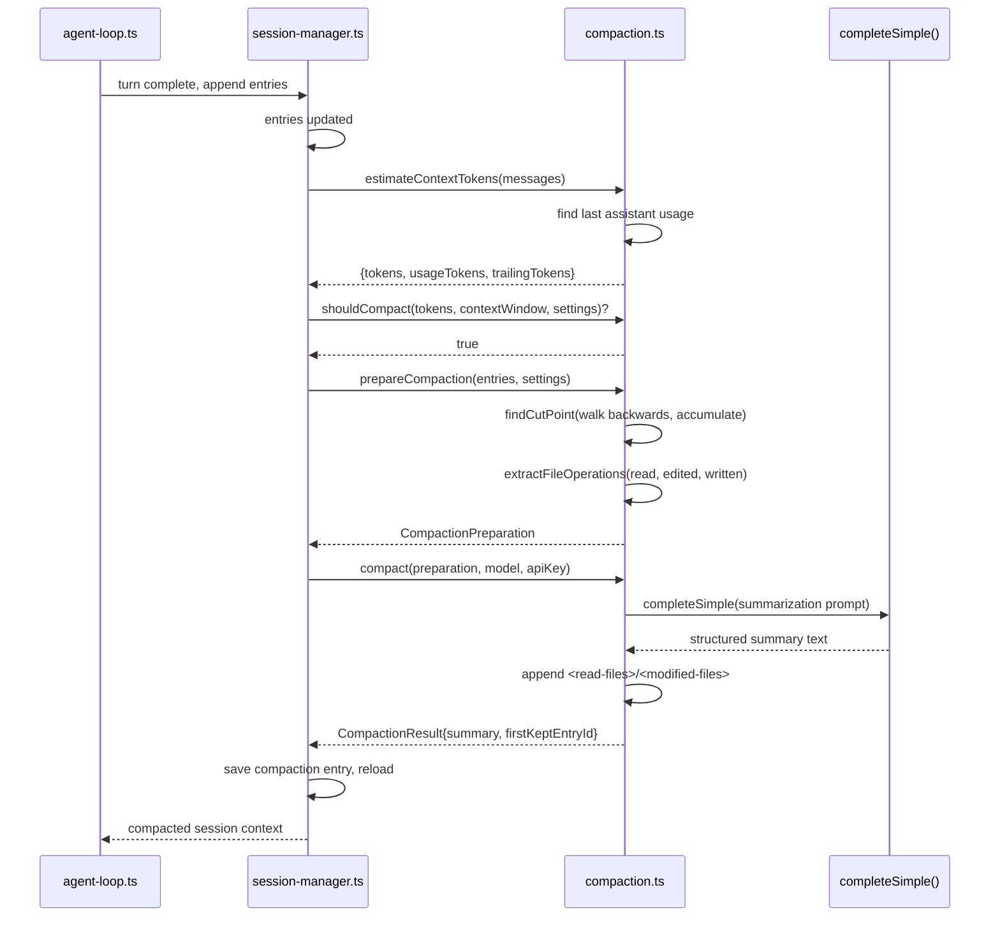

# Pi -- Context Management and Compression Deep Dive

## Overview

Pi's context management operates on a **token-budget model** — not message counts. When the estimated token usage approaches the model's context window minus reserved space, Pi compacts the conversation by summarizing older turns while preserving the most recent context. The system tracks file operations across compaction boundaries, handles split turns, and iteratively updates summaries on subsequent compactions.

**Key insight:** Pi's compaction is **pure function** — no side effects, no database. The compaction logic receives session entries and returns a summary + cut point. The session manager handles I/O separately, making compaction testable and deterministic.

## Architecture





## Token Estimation

### Usage-Based Estimation (Accurate)

Pi uses the LLM's actual `usage` object when available — this is the gold standard:

```typescript
// compaction.ts
export function calculateContextTokens(usage: Usage): number {
    return usage.totalTokens || usage.input + usage.output + usage.cacheRead + usage.cacheWrite;
}

export function estimateContextTokens(messages: AgentMessage[]): ContextUsageEstimate {
    // Find the last assistant message with usage data
    const usageInfo = getLastAssistantUsageInfo(messages);
    if (!usageInfo) {
        // Fall back to chars/4 estimation for every message
        return { tokens: estimated, usageTokens: 0, trailingTokens: estimated, lastUsageIndex: null };
    }
    // Use the real token count from the API response
    const usageTokens = calculateContextTokens(usageInfo.usage);
    // Estimate any messages that came AFTER the last usage (new user prompt)
    let trailingTokens = 0;
    for (let i = usageInfo.index + 1; i < messages.length; i++) {
        trailingTokens += estimateTokens(messages[i]);
    }
    return { tokens: usageTokens + trailingTokens, usageTokens, trailingTokens, lastUsageIndex: usageInfo.index };
}
```

**Aha moment:** Pi doesn't estimate tokens for the entire conversation from scratch. It uses the API's actual token count from the last assistant response, then only estimates the delta (messages added after that response). This means if the session has 50 turns, tokens 1-49 are measured, not guessed.

### Char/4 Fallback (Conservative)

When no usage data exists (new session, aborted responses):

```typescript
export function estimateTokens(message: AgentMessage): number {
    // ~4 characters per token for English text
    // Conservative: overestimates tokens to avoid context overflow
    switch (message.role) {
        case "assistant":
            // text + thinking + toolCall (name + JSON args)
            chars += block.text.length + block.thinking.length + 
                     block.name.length + JSON.stringify(block.arguments).length;
            return Math.ceil(chars / 4);
        case "toolResult":
            // Images estimated as 4000 chars = 1200 tokens
            if (block.type === "image") chars += 4800;
        // ...
    }
}
```

## Compaction Trigger

### Token Budget Model

Pi compacts when: `contextTokens > contextWindow - reserveTokens`

```typescript
// Default: reserve 16K tokens for the response, keep 20K recent messages
export const DEFAULT_COMPACTION_SETTINGS: CompactionSettings = {
    enabled: true,
    reserveTokens: 16384,    // Space for the next LLM response
    keepRecentTokens: 20000, // How much recent context to preserve
};

export function shouldCompact(contextTokens: number, contextWindow: number, settings: CompactionSettings): boolean {
    if (!settings.enabled) return false;
    return contextTokens > contextWindow - settings.reserveTokens;
}
```

**Key design:** The trigger is based on *remaining space*, not a percentage. This means on a 200K context model, compaction fires at ~184K. On a 32K model, it fires at ~16K. The reserve is fixed because response sizes don't scale with context windows.

## Cut Point Detection

### Backward Walk Algorithm

Pi walks **backwards** from the newest message, accumulating estimated token sizes until it exceeds the `keepRecentTokens` budget. Then it finds the nearest valid cut point:

```typescript
export function findCutPoint(entries, startIndex, endIndex, keepRecentTokens): CutPointResult {
    // Walk backwards from newest, accumulating estimated message sizes
    let accumulatedTokens = 0;
    for (let i = endIndex - 1; i >= startIndex; i--) {
        const entry = entries[i];
        if (entry.type !== "message") continue;
        
        accumulatedTokens += estimateTokens(entry.message);
        
        if (accumulatedTokens >= keepRecentTokens) {
            // Find the closest valid cut point at or after this entry
            for (let c = 0; c < cutPoints.length; c++) {
                if (cutPoints[c] >= i) {
                    cutIndex = cutPoints[c];
                    break;
                }
            }
            break;
        }
    }
    
    // Include non-message entries (bash, settings) adjacent to the cut
    while (cutIndex > startIndex) {
        const prevEntry = entries[cutIndex - 1];
        if (prevEntry.type === "compaction") break;  // Stop at compaction boundary
        if (prevEntry.type === "message") break;      // Stop at any message
        cutIndex--;  // Include this bashExecution, settings change, etc.
    }
}
```

### Valid Cut Points

**Never cut at tool results** — they must follow their tool call. Valid cut points are user messages, assistant messages, bash executions, custom messages, branch summaries, and compaction summaries:

```typescript
function findValidCutPoints(entries, startIndex, endIndex): number[] {
    for (let i = startIndex; i < endIndex; i++) {
        const entry = entries[i];
        switch (entry.type) {
            case "message":
                // Never cut toolResult — they depend on their tool call
                if (entry.message.role !== "toolResult") cutPoints.push(i);
                break;
            // Non-message entries that can serve as boundaries
            case "thinking_level_change", "model_change", "compaction", 
            case "branch_summary", "custom_message", "custom", "label", "session_info":
                break;  // These are metadata, safe to cross
        }
    }
}
```

### Split Turn Detection

When the cut point lands in the **middle** of a turn (after a user message but before the assistant responded), Pi generates two summaries in parallel — one for the history and one for the turn prefix:

```typescript
export function findTurnStartIndex(entries, entryIndex, startIndex): number {
    // Walk backwards from the cut point to find the user message that started this turn
    for (let i = entryIndex; i >= startIndex; i--) {
        if (entry.message.role === "user" || entry.message.role === "bashExecution") {
            return i;  // Found the turn start
        }
    }
    return -1;
}
```

## Summarization

### Structured Summary Format

Pi uses a **highly structured summary template** that preserves actionable context:

```
## Goal
[What is the user trying to accomplish?]

## Constraints & Preferences
- [Any constraints, preferences, or requirements]

## Progress
### Done
- [x] [Completed tasks/changes]

### In Progress
- [ ] [Current work]

### Blocked
- [Issues preventing progress]

## Key Decisions
- **[Decision]**: [Brief rationale]

## Next Steps
1. [Ordered list of what should happen next]

## Critical Context
- [Any data, examples, or references needed to continue]
```

### Iterative Summary Updates

On subsequent compactions, Pi **updates** the existing summary rather than starting from scratch:

```typescript
const UPDATE_SUMMARIZATION_PROMPT = `Update the existing structured summary with new information. RULES:
- PRESERVE all existing information from the previous summary
- ADD new progress, decisions, and context from the new messages
- UPDATE the Progress section: move items from "In Progress" to "Done" when completed
- UPDATE "Next Steps" based on what was accomplished
- PRESERVE exact file paths, function names, and error messages`;
```

**Aha moment:** The iterative update approach means the summary **accumulates** knowledge across multiple compactions. After 5 compactions, the summary contains a distilled record of the entire session's progress — not just the last chunk.

### Parallel Summary Generation

When splitting a turn, Pi generates both summaries **in parallel**:

```typescript
const [historyResult, turnPrefixResult] = await Promise.all([
    messagesToSummarize.length > 0
        ? generateSummary(messagesToSummarize, model, reserveTokens, apiKey, headers, ...)
        : Promise.resolve("No prior history."),
    generateTurnPrefixSummary(turnPrefixMessages, model, reserveTokens, apiKey, headers, ...),
]);
summary = `${historyResult}\n\n---\n\n**Turn Context (split turn):**\n\n${turnPrefixResult}`;
```

The turn prefix gets a smaller budget (50% of reserve) since it only needs to capture the partial turn's context:

```typescript
async function generateTurnPrefixSummary(messages, model, reserveTokens, ...): Promise<string> {
    const maxTokens = Math.floor(0.5 * reserveTokens); // Smaller budget for turn prefix
    // Uses TURN_PREFIX_SUMMARIZATION_PROMPT:
    // "## Original Request\n## Early Progress\n## Context for Suffix"
}
```

## File Operation Tracking

### Cross-Compaction File Persistence

Pi **tracks file operations** across compaction boundaries so the next model knows what files were touched:

```typescript
interface FileOperations {
    read: Set<string>;     // Files that were read
    written: Set<string>;  // Files that were created
    edited: Set<string>;   // Files that were modified
}

function extractFileOpsFromMessage(message: AgentMessage, fileOps: FileOperations): void {
    if (message.role !== "assistant") return;
    for (const block of message.content) {
        if (block.type === "toolCall") {
            const path = block.arguments?.path;
            switch (block.name) {
                case "read":     fileOps.read.add(path); break;
                case "write":    fileOps.written.add(path); break;
                case "edit":     fileOps.edited.add(path); break;
            }
        }
    }
}
```

### File Lists in Summary

After generating the summary, Pi appends file lists as XML tags:

```typescript
const { readFiles, modifiedFiles } = computeFileLists(fileOps);
summary += formatFileOperations(readFiles, modifiedFiles);

// Output:
// <read-files>
// src/auth.ts
// src/config.ts
// </read-files>
// 
// <modified-files>
// src/auth.ts
// </modified-files>
```

**Aha moment:** Pi deduplicates — files that were both read AND modified appear only in `<modified-files>`. This prevents the model from seeing a file as "read context" when it was actually changed.

## Tool Result Truncation

During summarization, tool results are capped to **2000 characters**:

```typescript
const TOOL_RESULT_MAX_CHARS = 2000;

function truncateForSummary(text: string, maxChars: number): string {
    if (text.length <= maxChars) return text;
    const truncatedChars = text.length - maxChars;
    return `${text.slice(0, maxChars)}\n\n[... ${truncatedChars} more characters truncated]`;
}
```

The serialization also **truncates the input**, not just the output, to keep the summarization request within budget:

```typescript
export function serializeConversation(messages: Message[]): string {
    // User: [User]: text
    // Assistant: [Assistant]: text, [Assistant thinking]: thinking,
    //            [Assistant tool calls]: name(args); name(args)
    // Tool: [Tool result]: truncated_content
    // Format prevents the summarizer model from treating this as a conversation to continue.
}
```

## Compaction Preparation (Extension Hook)

Pi exposes `prepareCompaction()` as a pure function that extensions can call to inspect compaction state before it fires:

```typescript
export interface CompactionPreparation {
    firstKeptEntryId: string;        // UUID of first entry to keep
    messagesToSummarize: AgentMessage[];  // Messages that will be summarized and discarded
    turnPrefixMessages: AgentMessage[];   // Messages in the split turn prefix
    isSplitTurn: boolean;                   // Whether cutting mid-turn
    tokensBefore: number;                   // Total context tokens before compaction
    previousSummary?: string;               // Summary from previous compaction (for iterative update)
    fileOps: FileOperations;                // Extracted file operations
    settings: CompactionSettings;
}

export function prepareCompaction(pathEntries: SessionEntry[], settings: CompactionSettings): CompactionPreparation | undefined {
    // Never compact if the last entry is already a compaction
    if (pathEntries.length > 0 && pathEntries[pathEntries.length - 1].type === "compaction") {
        return undefined;
    }
    // Find previous compaction boundary, extract messages, find cut point
}
```

This lets extensions:
- Display a preview of what will be compacted
- Inject custom instructions for the summarization
- Abort compaction based on custom heuristics

## Compaction Details Preservation

### What Survives Compaction

| Component | Fate | Why |
|-----------|------|-----|
| System prompt | Always preserved | Core agent identity and rules |
| Last N messages (~20K tokens) | Preserved verbatim | Recent context for continuity |
| Summary of older messages | Replaced by structured summary | Distilled context |
| File operations | Extracted into XML tags | Critical for coding context |
| Tool results (old) | Truncated to 2000 chars | Summary needs only the gist |
| Thinking blocks | Included in serialization | Model's reasoning context |
| Compaction entry | Saved to JSONL | Track boundary for next compaction |
| Model change entries | Preserved as cut points | Safe boundaries for cuts |
| Bash execution entries | Included in token budget | User-initiated context |

### Summary Token Budget

The summary gets `80%` of `reserveTokens`:

```typescript
const maxTokens = Math.floor(0.8 * reserveTokens);  // ~13K tokens with default 16K reserve
```

This leaves room for the summary itself to be part of the context without consuming the entire response budget.

## Anti-Thrashing

Pi prevents compaction loops with a simple guard:

```typescript
// In session-manager reload:
// Don't compact twice in a row — if the last entry is already a compaction, skip
if (pathEntries[pathEntries.length - 1]?.type === "compaction") {
    return undefined;
}
```

This prevents the scenario where compaction doesn't free enough tokens and triggers again on the next turn.

## Comparison with Hermes Compression

| Aspect | Pi | Hermes |
|--------|-----|--------|
| Trigger | `tokens > window - reserveTokens` (absolute) | `tokens > window * 75%` (percentage) |
| Tail protection | Token budget (~20K tokens) | Token budget + message count floor |
| Summary format | Structured template (Goal, Progress, etc.) | Richer template (Active Task, Resolved/Pending, etc.) |
| Iterative updates | Yes (UPDATE_SUMMARIZATION_PROMPT) | Yes (preserves existing info) |
| File tracking | Extracted from tool calls, appended as XML | Tracked via context references |
| Tool result pruning | Truncated to 2000 chars for summarization | Informative 1-line summaries per tool type |
| Split turn handling | Parallel summary generation | N/A (handles differently) |
| Tool call/result sanitization | Cut-point based (never cut tool results) | Explicit `_sanitize_tool_pairs()` for orphan cleanup |
| Summary model | Same model as conversation | Separate auxiliary model (cheap/fast) |

## Related Documents

- [03-agent-core.md](./03-agent-core.md) — Agent class managing session state
- [11-data-flow.md](./11-data-flow.md) — Streaming and compaction lifecycle
- [13-agent-loop.md](./13-agent-loop.md) — The loop that triggers compaction
- [14-model-providers.md](./14-model-providers.md) — Model.contextWindow drives overflow detection
- [15-memory-deep.md](./15-memory-deep.md) — Message array is the memory being compacted

## Source Paths

```
packages/coding-agent/src/core/compaction/
├── compaction.ts           ← prepareCompaction(), compact(), findCutPoint(), estimateTokens(), generateSummary()
├── utils.ts                ← FileOperations, serializeConversation(), truncateForSummary(), formatFileOperations()
├── branch-summarization.ts ← Branch-level summarization (separate from session compaction)
└── index.ts                ← Public exports

packages/coding-agent/src/core/
├── session-manager.ts      ← readSession(), appendEntry(), buildSessionContext(), compaction reload
├── messages.ts             ← createCompactionSummaryMessage(), createBranchSummaryMessage()
└── agent-session.ts        ← Auto-compaction queue, debounced compaction

packages/agent/src/
├── agent.ts                ← _queueAutoCompaction() debounce logic
└── agent-loop.ts           ← shouldCompact check after each turn
```
