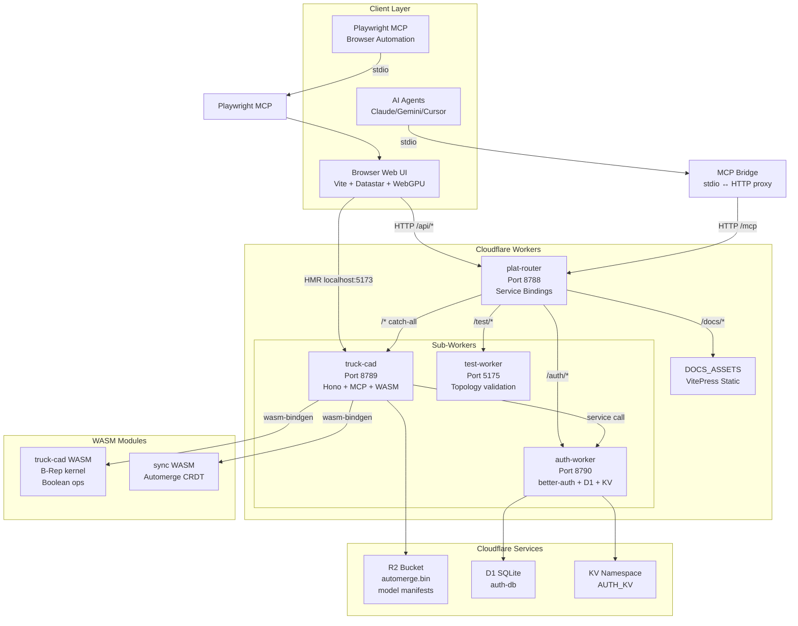
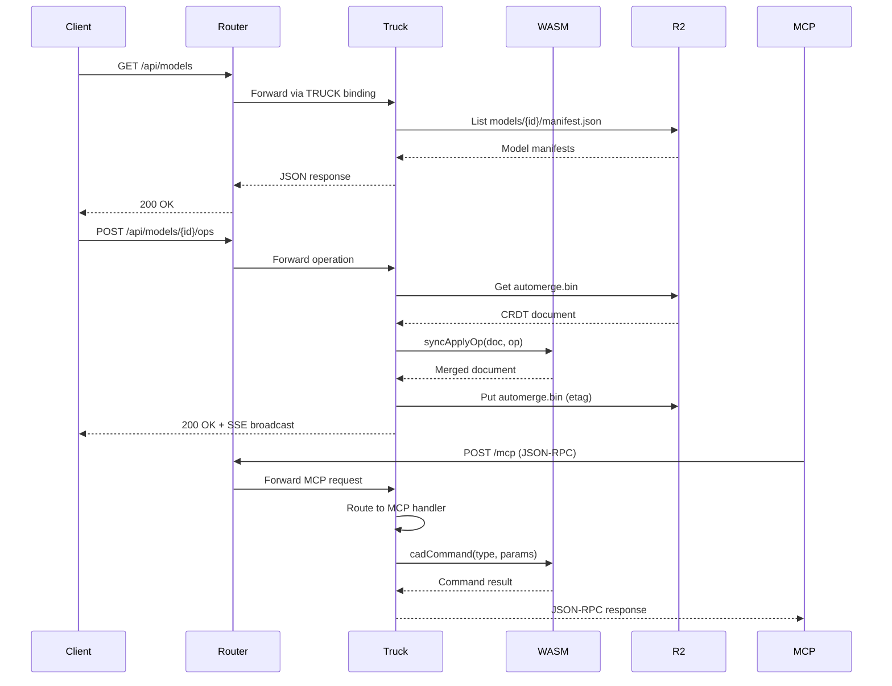
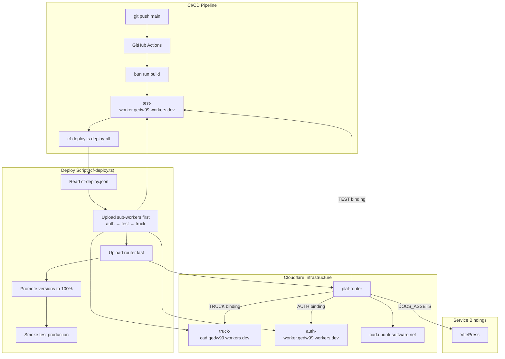
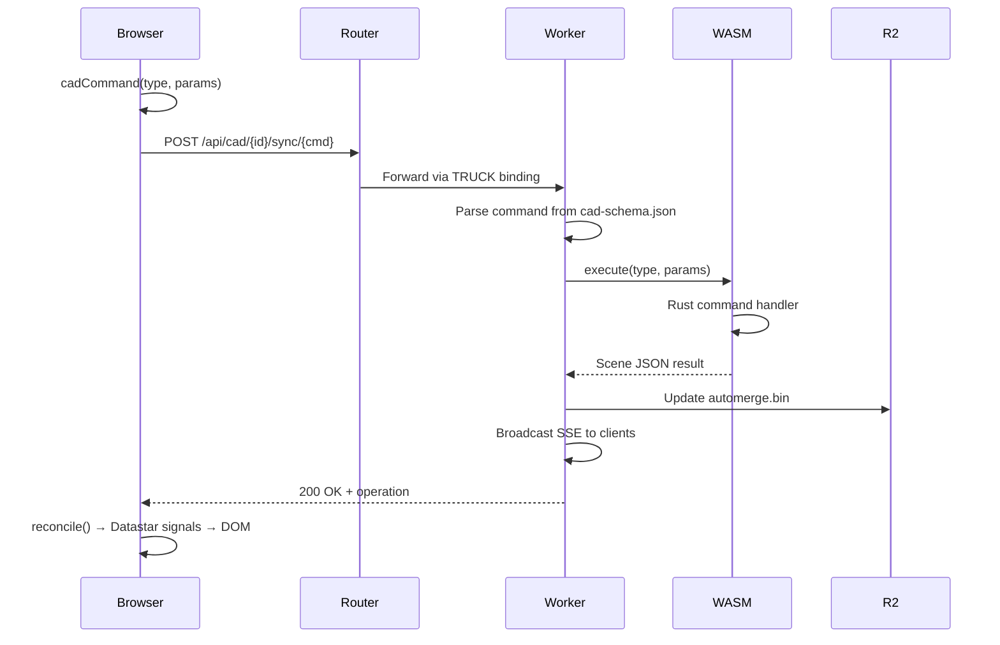
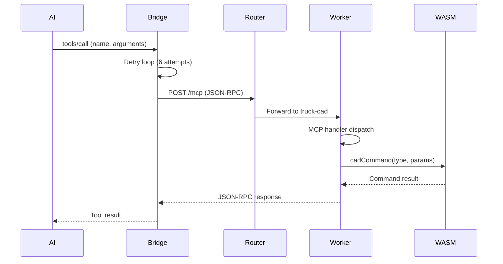
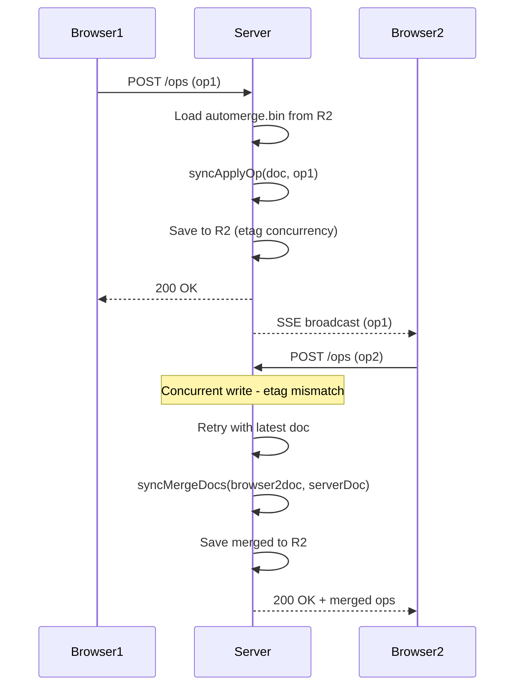

# Project Exploration: plat-trunk

## Overview

plat-trunk is a browser-based CAD platform built on Cloudflare Workers, featuring a Rust B-Rep kernel (truck) compiled to WebAssembly for 3D modeling, WebGPU rendering, and Automerge CRDT for real-time collaboration. The project implements a multi-agent architecture where multiple AI agents (Claude, Gemini, Cursor) can coordinate through MCP (Model Context Protocol) endpoints to interact with CAD operations.

The platform follows a **schema-driven architecture** where Rust structs define the command interface, which auto-generates TypeScript types, OpenAPI specs, and MCP tools. This ensures type safety across the Rust/WebAssembly/TypeScript boundaries without manual duplication.

Key architectural decisions:
- **Root router pattern**: Thin router at repo root routes traffic to sub-workers via Cloudflare service bindings
- **Separate workers per system**: 3MB worker size limit means WASM-heavy systems (truck-cad, auth, test) must be separate workers
- **Multi-agent MCP support**: 29 CAD tools exposed via MCP for AI agent access, plus Playwright MCP for browser automation
- **Local-first sync**: Automerge CRDT stored in Cloudflare R2, with browser-server synchronization for offline-capable collaboration

## Repository

- **Location:** `/home/darkvoid/Boxxed/@formulas/src.rust/src.llamacpp/src.GedWeb/plat-trunk`
- **Remote:** git@github.com:joeblew999/plat-trunk.git
- **Primary Language:** Rust (WASM kernel), TypeScript (Workers + Web UI)
- **License:** Not explicitly declared (public repository)

## Directory Structure

```
plat-trunk/
├── .claude/                         # Claude Code agent skills (automerge, interop, kkrpc)
├── .github/                         # GitHub Actions CI workflows
├── .src/                            # Vendored source repos (gitignored - truck, ifc-lite, ezpz)
├── docs/adr/                        # Architecture Decision Records (18 ADRs)
│   ├── 0001-multi-actor-sync.md     # R2 automerge, browser-server sync
│   ├── 0002-headless-as-core-engine.md
│   ├── 0003-format-workers.md
│   ├── 0004-wasm-boundary-contracts.md
│   ├── 0005-scene-graph-with-assembly-hierarchy.md
│   ├── 0006-worker-performance.md
│   ├── 0007-ifc-feature-gate.md
│   ├── 0008-sync-architecture-redesign.md
│   ├── 0009-observability.md
│   ├── 0010-auth-architecture.md
│   ├── 0011-plugin-directory-contract.md
│   ├── 0012-deployment-topologies.md
│   ├── 0013-factory-hardware-integration.md
│   ├── 0014-cad-machine-interface.md
│   └── README.md
├── lib/observe/                     # Observability library (Hono middleware, LogBuffer)
│   ├── crate/                       # Rust tracing crate (planned)
│   ├── demo1/, demo2/, demo-line/   # Demo applications
│   ├── browser.ts                   # Browser offline queue
│   ├── middleware.ts                # Hono middleware (W3C traceparent)
│   └── tail.ts                      # SSE tail aggregator
├── scripts/                         # Build/deploy/MCP orchestration
│   ├── build.mjs                    # System-aware release build pipeline
│   ├── test.mjs                     # Phased test pipeline (alignment → schema → rust → vitest)
│   ├── cf-deploy.ts                 # Cloudflare deploy (upload, promote, smoke)
│   ├── mcp-bridge.ts                # MCP stdio ↔ HTTP proxy with retry + hot-reload
│   ├── gen-openapi.ts               # Generate OpenAPI spec from cad-schema.json
│   ├── gen-adapters.ts              # Generate TypeScript WASM adapters
│   └── src-sync.sh                  # Clone/update vendored .src repos
├── src/
│   └── router.ts                    # Root router (Hono, ~110 lines)
├── systems/                         # Multi-system platform (each system = complete stack)
│   ├── auth/                        # Authentication system (better-auth + Hono)
│   │   ├── web/                     # Sign-in/sign-up UI (Vite + Lit)
│   │   ├── worker/                  # Auth worker (D1 SQLite + KV)
│   │   ├── wrangler.toml            # Auth worker config
│   │   └── system.mjs               # Build/test config
│   ├── docs/                        # Documentation system (VitePress)
│   │   ├── website/                 # VitePress source
│   │   └── system.mjs
│   ├── sync/                        # CRDT sync system (Automerge WASM)
│   │   ├── crate/src/               # Rust CRDT library
│   │   ├── ts/                      # Shared TypeScript types
│   │   ├── test/                    # Vitest-pool-workers tests
│   │   ├── e2e/                     # Playwright cross-tab sync tests
│   │   ├── sync-schema.json         # GENERATED from Rust
│   │   └── system.mjs
│   ├── truck/                       # CAD system (truck B-Rep kernel)
│   │   ├── crate/                   # Rust WASM crate
│   │   │   ├── src/
│   │   │   │   ├── lib.rs           # WASM entry + boolean ops
│   │   │   │   ├── commands/        # CAD commands (booleans, geometry, scene, sketch)
│   │   │   │   ├── headless.rs      # Headless WASM for CF Worker
│   │   │   │   ├── wasm_app.rs      # WASM app bindings
│   │   │   │   └── bin/generate_schema.rs
│   │   │   └── tests/               # Rust integration tests
│   │   │       ├── contract.rs      # Schema deep-equal tests
│   │   │       ├── boundary.rs      # WASM boundary tests
│   │   │       ├── booleans.rs      # Boolean operation tests
│   │   │       ├── geometry.rs      # Geometry transformation tests
│   │   │       └── sync.rs          # CRDT integration tests
│   │   ├── web/                     # Browser TypeScript (Vite)
│   │   │   ├── main.ts              # Entry point (Datastar + boot)
│   │   │   ├── scene-controller.ts  # Rust WASM controller
│   │   │   ├── reconcile.ts         # Automerge CRDT sync
│   │   │   ├── cad-dispatch.generated.ts  # GENERATED command dispatch
│   │   │   ├── api-types.generated.ts     # GENERATED OpenAPI types
│   │   │   └── vite.config.ts
│   │   ├── worker/                  # Cloudflare Worker (Hono + MCP)
│   │   │   ├── index.ts             # Worker entry (OpenAPIHono + MCP)
│   │   │   ├── model-store.ts       # R2 model persistence
│   │   │   ├── doc-store.ts         # R2 automerge.bin storage
│   │   │   ├── replay.ts            # Headless WASM replay
│   │   │   ├── mcp.test.ts          # MCP protocol tests
│   │   │   └── sync.test.ts         # Sync endpoint tests
│   │   ├── e2e/                     # Playwright E2E tests
│   │   ├── cad-schema.json          # GENERATED command schema (SINGLE SOURCE OF TRUTH)
│   │   └── system.mjs               # Build/test configuration
│   ├── test/worker/                 # Test worker (validates N-worker topology)
│   ├── plugins/                     # First-party plugin system
│   │   ├── howick/                  # Howick FRAMA integration
│   │   └── example/                 # Example plugin template
│   └── plugin/                      # Plugin host + types
├── AGENT.md                         # Full project context for AI agents
├── CLAUDE.md                        # Claude-specific bootstrap (session setup)
├── GEMINI.md                        # Gemini pointer to AGENT.md
├── Cargo.toml                       # Rust workspace (truck + plugins)
├── rust-toolchain.toml              # Rust 1.93.1 + wasm32 targets
├── mise.toml                        # Tool versions (bun, node, wasm-pack) + tasks
├── package.json                     # bun scripts
├── workers.mjs                      # Worker aggregator (imports from each system.mjs)
├── run.mjs                          # Dev/deploy orchestrator
├── wrangler.toml                    # Root router config (service bindings)
├── cf-deploy.json                   # Deploy config (workers map, endpoints)
├── .mcp.json                        # MCP server config (bridge + Playwright)
├── doppler.yaml                     # Doppler secrets config
├── vitest.config.ts                 # Root vitest exclusions
└── check-alignment.mjs              # Verify system.mjs alignment
```

## Architecture

### High-Level System Diagram



### Request Flow Diagram



### Multi-Agent Architecture

```mermaid
graph LR
    subgraph "AI Agent Layer"
        Claude[Claude Code]
        Gemini[Gemini CLI]
        Cursor[Cursor IDE]
    end

    subgraph "MCP Servers"
        CAD_MCP[CAD MCP Server<br/>29 tools]
        PW_MCP[Playwright MCP<br/>Browser automation]
    end

    subgraph "Bridge Layer"
        MCP_Bridge[mcp-bridge.ts<br/>stdio ↔ HTTP<br/>Retry + Cache]
    end

    subgraph "Worker Endpoints"
        Truck_MCP[/mcp endpoint<br/>OpenAPIHono]
        PW_Browser[Chromium<br/>WebGPU enabled]
    end

    Claude -->|stdio| CAD_MCP
    Gemini -->|stdio| CAD_MCP
    Cursor -->|stdio| CAD_MCP

    CAD_MCP -->|stdio| MCP_Bridge
    PW_MCP -->|stdio| PW_Browser

    MCP_Bridge -->|HTTP POST /mcp| Truck_MCP
    MCP_Bridge -->|Poll /api/cad/schema| Truck_MCP

    Truck_MCP -->|wasm-bindgen| HeadlessWASM[Headless WASM<br/>Geometry ops]
```

### Cloudflare Workers Deployment Flow



## Component Breakdown

### Root Router (`src/router.ts`)

- **Location:** `src/router.ts`
- **Purpose:** Thin routing layer that directs all incoming traffic to appropriate sub-workers
- **Dependencies:** Hono framework, Cloudflare service bindings (AUTH, TRUCK, TEST, DOCS_ASSETS)
- **Dependents:** All client requests flow through here

**Routing table:**
| Path | Destination | Notes |
|------|-------------|-------|
| `/auth/*` | auth-worker | better-auth REST API + web UI |
| `/docs/*` | DOCS_ASSETS | VitePress static files |
| `/test/*` | test-worker | Topology validation |
| `/api/*` | truck-cad | REST API |
| `/mcp` | truck-cad | MCP endpoint |
| `/*` catch-all | truck-cad | Web app static assets |

### Truck CAD System (`systems/truck/`)

- **Location:** `systems/truck/`
- **Purpose:** Core CAD functionality - 3D modeling with B-Rep kernel
- **Dependencies:** sync WASM, truck Rust crate, Cloudflare R2
- **Dependents:** Browser UI, MCP clients, API consumers

**Sub-components:**

| Component | Location | Purpose |
|-----------|----------|---------|
| Rust crate | `crate/src/` | B-Rep kernel, boolean ops, sketch, commands |
| Worker | `worker/src/` | Hono server, MCP handler, R2 persistence |
| Web UI | `web/` | Vite app, Datastar signals, WebGPU rendering |
| E2E tests | `e2e/` | Playwright browser tests |

**Command schema flow:**
```
Rust structs (#[derive(Deserialize, JsonSchema)])
  → wasm-pack build + generate-schema binary
  → cad-schema.json (COMMITTED)
  → gen-openapi.ts
  → openapi.json (intermediate)
  → openapi-typescript
  → api-types.generated.ts (COMMITTED)
  → Vite build
  → web/dist/ (served by wrangler)
```

### Sync System (`systems/sync/`)

- **Location:** `systems/sync/`
- **Purpose:** Automerge CRDT for local-first collaboration
- **Key innovation:** No geometry knowledge - pure op-log sync
- **WASM targets:** 3 builds (web for browser, 2x bundler for workers)

**Op schema:**
```typescript
{
  id: string,        // UUID
  type: string,      // Command type
  params: object,    // Command parameters
  enabled: boolean,  // Operation enabled flag
  timestamp: number, // Unix timestamp
  actorId: string,   // User/session ID
  groupId?: string   // Optional grouping for undo/redo
}
```

**Sync flow:**
```
Browser ( Automerge doc ) <--SSE--> Server ( R2: automerge.bin )
       |                                  |
       |--POST /api/models/{id}/ops------>|
       |<--GET /api/models/{id}/replay----|
       |--POST /api/models/{id}/sync----->|
```

### Auth System (`systems/auth/`)

- **Location:** `systems/auth/`
- **Purpose:** Authentication and session management
- **Stack:** better-auth v1.5 + Hono
- **Storage:** D1 SQLite (primary), KV (secondary cache)

**Key routes:**
| Route | Purpose |
|-------|---------|
| `/auth/api/*` | better-auth REST API |
| `/auth/sign-in` | Web UI sign-in page |
| `/auth/sign-up` | Web UI sign-up page |
| `POST /auth/migrate` | Run D1 migrations |

### MCP Bridge (`scripts/mcp-bridge.ts`)

- **Location:** `scripts/mcp-bridge.ts`
- **Purpose:** stdio ↔ HTTP proxy for AI agent access
- **Features:** Retry with exponential backoff, schema hot-reload, tool caching

**Key capabilities:**
1. **Instant stdio init:** Connects stdio FIRST, URL resolves lazily
2. **Retry logic:** 6 attempts with exponential backoff (survives dev restarts)
3. **Schema polling:** Checks `/api/cad/schema` every 30s, notifies clients of changes via `tools/list_changed`
4. **Tool caching:** Saves tools to disk (`~/.cache/truck-cad/tools-cache.json`) for instant availability
5. **Auto-detection:** Local dev → PR preview → fallback URL resolution

**Bridge status tool:**
```json
{
  "name": "cad_bridge_status",
  "description": "Check bridge connectivity",
  "inputSchema": { "type": "object", "properties": {} }
}
```

### Observability Library (`lib/observe/`)

- **Location:** `lib/observe/`
- **Purpose:** Structured logging and tracing across Rust/TypeScript boundaries
- **Architecture:** Two-layer design (Rust emission + TS transport)

**Components:**
| File | Purpose |
|------|---------|
| `middleware.ts` | Hono middleware (W3C traceparent) |
| `browser.ts` | Browser offline queue + flush |
| `tail.ts` | SSE tail aggregator |
| `crate/` | Rust `pt-log` crate (tracing → structured JSON) |

## Entry Points

### Development Entry Point (`bun run dev`)

**File:** `run.mjs`

**Execution flow:**
1. `killStalePorts()` - Kill processes on reserved ports
2. Install dependencies for all workers and devServers
3. Build workers that declare `build` commands (WASM compilation)
4. Apply D1 migrations for workers that declare them
5. Start wrangler dev for each worker (auto-reload on TS changes)
6. Start file watchers for Rust changes (watchexec → rebuild WASM)
7. Start dev servers (Vite for truck-web, VitePress for docs)
8. Health check polling until all workers respond 200

**Ports used:**
| Service | Port | Inspector |
|---------|------|-----------|
| plat-router | 8788 | 9229 |
| truck-cad | 8789 | 9230 |
| auth-worker | 8790 | 9231 |
| test-worker | 5175 | 9232 |
| truck-web (Vite) | 5173 | - |
| docs (VitePress) | 5176 | - |

### Build Entry Point (`bun run build`)

**File:** `scripts/build.mjs`

**Pipeline:**
```
1. sync (order: 0)
   └─ wasm+schema → types

2. auth (order: 1)
   └─ web UI build

3. truck (order: 2)
   ├─ wasm+schema
   ├─ adapters (gen-adapters.ts)
   ├─ sizes (check-sizes.ts)
   ├─ web (gen:api-types + Vite build)
   └─ plugins (build:plugins)

4. docs (order: 3)
   └─ llm-docs + VitePress build
```

**System registry pattern:**
Each system declares its build config in `systems/{name}/system.mjs`:
```javascript
export const building = {
  name: 'truck',
  order: 1,  // Determines build order
  steps: [
    { name: 'wasm+schema', command: '...' },
    { name: 'adapters', command: 'bun run gen:adapters' },
  ],
};
```

### Deploy Entry Point (`bun run deploy`)

**File:** `scripts/cf-deploy.ts`

**Deploy order:**
1. Upload sub-workers (auth → test → truck) - immaterial order among these
2. Upload router LAST (depends on sub-worker service bindings)
3. Promote versions to 100%
4. Run smoke test against production

**Versioning strategy:**
- Every upload creates immutable UUID URL
- Preview aliases only for PR previews (`pr-{N}`)
- Production promotion is explicit (`wrangler versions deploy <id>@100%`)

## Data Flow

### CAD Command Execution Flow



### MCP Tool Call Flow



### Sync Merge Flow



## External Dependencies

### Rust Dependencies (Workspace)

| Dependency | Version | Purpose |
|------------|---------|---------|
| serde | 1.x | Serialization/deserialization |
| serde_json | 1.0.x | JSON handling |
| wasm-bindgen | 0.2.106 | Rust ↔ JavaScript interop |
| uuid | 1.x (v4, js, serde) | UUID generation + JS interop |
| log | 0.4.x | Logging facade |
| truck-platform | vendored (.src/truck) | Scene graph, WebGPU |
| truck-rendimpl | vendored (.src/truck) | Rendering implementation |
| monstertruck-meshing | vendored | Mesh generation |
| monstertruck-modeling | vendored | B-Rep modeling |
| automerge | vendored (.src/automerge) | CRDT implementation |

### TypeScript Dependencies

| Dependency | Version | Purpose |
|------------|---------|---------|
| hono | 4.11.9 | Web framework for Workers |
| @hono/zod-openapi | - | OpenAPI schema generation |
| @modelcontextprotocol/sdk | 1.27.1+ | MCP server implementation |
| wrangler | 4.72.0+ | Cloudflare Workers CLI |
| bun-types | 1.3.10 | Bun runtime types |
| @cloudflare/workers-types | 4.20260212.0 | Workers environment types |
| automerge | vendored | CRDT (browser) |
| three | - | 3D rendering (camera/orbit) |
| datastar | 1.0.0-RC.7 | Reactive signals (DOM) |
| lit | - | Web components |
| daisyui, tailwind | v4 | UI styling |

### Tool Versions (mise.toml)

| Tool | Version | Purpose |
|------|---------|---------|
| bun | 1.3.10 | JS runtime + package manager |
| node | 22 | Node.js (vitest environment:node) |
| gh | 2.87.3 | GitHub CLI |
| wasm-pack | 0.14.0 | Rust → WASM builds |
| doppler | latest | Secrets management |
| Rust | 1.93.1 | Pinned in rust-toolchain.toml |

## Configuration

### wrangler.toml (Root Router)

```toml
name = "plat-router"
main = "src/router.ts"
compatibility_date = "2025-10-08"
compatibility_flags = ["nodejs_compat"]
workers_dev = true
preview_urls = true

routes = [
  { pattern = "cad.ubuntusoftware.net", custom_domain = true },
]

[assets]
directory = "systems/docs/website/.vitepress/dist"
binding = "DOCS_ASSETS"
not_found_handling = "none"
run_worker_first = true  # Router handles ALL requests first

[[services]]
binding = "AUTH"
service = "auth-worker"

[[services]]
binding = "TRUCK"
service = "truck-cad"

[[services]]
binding = "TEST"
service = "test-worker"

[observability]
enabled = true
head_sampling_rate = 1

[observability.logs]
invocation_logs = true

[observability.traces]
enabled = true
```

### mise.toml (Tool Management + Tasks)

Key features:
- **Port registry:** All system ports defined in `[env]` section
- **Doppler integration:** `_.file = ".env"` loads secrets automatically
- **Task dependencies:** `depends = ["install", "kill"]` for proper ordering

Key tasks:
```bash
mise run setup         # One-time: tools + secrets + WASM build
mise run dev           # Start all workers + dev servers
mise run build         # Build all systems
mise run test          # Full test pipeline
mise run deploy        # Build + deploy + smoke test
mise run secrets:pull  # Pull from Doppler → .env
mise run src:sync      # Clone vendored .src repos
```

### Agent Configurations

**AGENT.md:** Single source of truth for all AI agents
- Defines commands, architecture, folder layout
- Schema-driven development workflow
- AI agent rules (12 rules for clean code)

**CLAUDE.md:** Claude-specific bootstrap
- Session setup instructions
- MacBook-specific steps (Cloudflare provisioning)
- What Claude can do vs what needs MacBook

**GEMINI.md:** Pointer to AGENT.md

### MCP Configuration (.mcp.json)

```json
{
  "mcpServers": {
    "truck-cad": {
      "type": "stdio",
      "command": "bun",
      "args": ["./scripts/mcp-bridge.ts"]
    },
    "playwright": {
      "type": "stdio",
      "command": "bunx",
      "args": [
        "@playwright/mcp@latest",
        "--config",
        "./scripts/playwright-mcp-claude.config.json"
      ]
    }
  }
}
```

## Testing

### Test Pipeline (`scripts/test.mjs`)

**Phased approach:**
1. **Alignment check:** Verify system.mjs files match wrangler.toml, crate coverage
2. **Schema contract:** Rust `build_schema()` deep-equals committed cad-schema.json
3. **CRDT tests:** sync crate Automerge merge/dedup/replay
4. **Rust domain tests:** Geometry, booleans, sketch, scene, style, sync
5. **TypeScript typecheck:** Worker + web TypeScript compilation
6. **Vitest tests:** Schema endpoint, MCP protocol, models CRUD, sync HTTP, URL params, sketch replay

### Test Files Registry

**Rust tests (truck-cad):**
| File | Covers |
|------|--------|
| `bool_robustness.rs` | Boolean ops: try_new, fallback, tessellation, chaining |
| `sketch.rs` | Sketch: extrude, constraints, serialization, plane projection |
| `contract.rs` | Schema: Rust build_schema() deep-equals committed JSON |
| `boundary.rs` | WASM boundary: schema→headless dispatch, exports match |
| `golden.rs` | Golden: mesh output for all primitives + booleans |
| `booleans.rs` | Booleans: union/subtract/intersect/clash via schema params |
| `geometry.rs` | Geometry: add/translate/rotate/scale/duplicate/errors |
| `scene.rs` | Scene: import/export/delete/clear |
| `sync.rs` | CRDT integration: offline merge, multi-model isolation, replay |

**Vitest tests (truck worker):**
| File | Covers |
|------|--------|
| `schema.test.ts` | Schema endpoint: deep-equal, ephemeral/readonly flags, OpenAPI spec |
| `mcp.test.ts` | MCP: init, tools/list, data-plane, control-plane, SSE, errors |
| `models.test.ts` | Models: PUT/GET/DELETE CRUD, thumbnail PNG, 404/400 errors |
| `sync.test.ts` | Sync HTTP: POST /ops, POST /sync, merge, dedup, multi-actor, etag, replay |
| `url-params.test.ts` | URL params: parseUrlParams pure function, all path patterns |
| `sketch.test.ts` | Sketch MCP: quick_rect_extrude, sketch_extrude, op replay |

### E2E Tests (Playwright)

**Truck E2E:** `systems/truck/e2e/`
- Browser-based testing with WebGPU support
- Tests full user workflows (sign-in, create model, CAD operations, save)

**Sync E2E:** `systems/sync/e2e/`
- Cross-tab synchronization testing
- Multi-actor conflict resolution
- Offline/online merge scenarios

### Running Tests

```bash
# Full pipeline
bun run test

# Individual phases
bun run test:crate      # Rust tests only
bun run test:api        # Truck worker vitest
bun run test:sync       # Sync worker vitest
bun run test:auth       # Auth worker vitest
bun run test:e2e        # Playwright E2E (requires dev server)

# E2E against preview deployment
mise run test:e2e:preview
```

## Key Insights

### 1. Schema-Driven Single Source of Truth

The `cad-schema.json` file is the **single source of truth** for the entire CAD system:
- Generated from Rust structs via `generate-schema` binary
- Drives OpenAPI spec generation
- Drives TypeScript type generation
- Drives MCP tool generation
- Drives runtime validation in Worker

Adding a new command:
```
1. Add Rust struct in commands/mod.rs with #[derive(Deserialize, JsonSchema)]
2. bun run build:truck
3. Everything downstream auto-regenerates - no hand-writing
```

### 2. Multi-Agent MCP Architecture

The MCP bridge enables multiple AI agents to coordinate CAD operations:
- **stdio-first design:** Instant connection, lazy URL resolution
- **Retry with backoff:** Survives dev server restarts
- **Schema hot-reload:** Polls schema version, notifies via `tools/list_changed`
- **Tool caching:** Disk cache ensures tools available even when Worker is down
- **PR preview auto-detection:** Falls back to PR preview URL if local dev not running

### 3. System Registry Pattern

Each system declares its configuration in `systems/{name}/system.mjs`:
```javascript
export const building = { name, order, steps: [] };
export const testing = { name, rust?, typecheck?, vitest? };
export const testFiles = { rust: [], vitest: [], helpers: [] };
```

Adding a new system requires only:
1. Create `systems/{name}/system.mjs`
2. Add one import line in `workers.mjs`
3. Add one import in `scripts/build.mjs`
4. Add one import in `scripts/test.mjs`

The platform handles routing, build ordering, and test orchestration automatically.

### 4. Local-First Sync with Automerge

The sync architecture is designed for offline-first collaboration:
- **R2 automerge.bin:** Server source of truth (D1 op-log removed)
- **Etag concurrency:** Optimistic concurrency control
- **SSE broadcasts:** Full ops with id/actorId - no duplicates on merge
- **Headless WASM replay:** Server can replay ops through headless WASM for validation

### 5. Worker Size Optimization

The 3MB Cloudflare Worker size limit drives key architectural decisions:
- Separate workers for WASM-heavy systems (truck-cad, sync)
- Router at repo root with service bindings
- `run_worker_first = true` for assets binding to ensure router handles all requests
- WASM built 3x: web (browser), bundler (truck worker), bundler (sync test)

### 6. Doppler Secrets Management

Secrets flow through Doppler:
```
Doppler (plat-trunk/dev)
    ↓ mise run secrets:pull
.env (gitignored, loaded by mise _.file = ".env")
    ↓ auto-loaded by mise
Cloudflare Workers (via wrangler)
GitHub Actions (via mise run secrets:set)
```

## Open Questions

1. **Plugin system maturity:** The plugin host/types structure exists but how are third-party plugins discovered and loaded at runtime?

2. **MVT system status:** References to MVT (Mapbox Vector Tiles) exist in router.ts comments and ADRs - what is the current implementation status?

3. **IFC integration:** `ifc-lite` is vendored in `.src/ifc-lite` but ADR-0007 marks it as a feature gate - what features are gated?

4. **Geometry Worker (ADR-0016):** Browser Web Workers for geometry are blocked until ADR-0002 (GeometryStore) - what is the timeline for this separation?

5. **Tauri deployment (ADR-0012):** LAN deployment via Tauri is proposed - what storage adapter abstraction would enable cloud/LAN parity?

6. **Howick FRAMA integration:** The howick plugin exists with OPC UA edge agent mentioned - what is the current state of the factory hardware integration?

7. **Observability completion:** `lib/observe/` has demos and tests but is described as "not yet wired into system workers" - what is the integration plan?

8. **WASM size tracking:** The `check-sizes.ts` script exists but what are the current WASM sizes and the budget thresholds?

9. **Multi-actor conflict resolution:** How does the system handle conflicting operations from multiple actors editing the same geometry simultaneously?

10. **Production monitoring:** With observability enabled in wrangler.toml, what dashboards/alerts exist for production monitoring?
