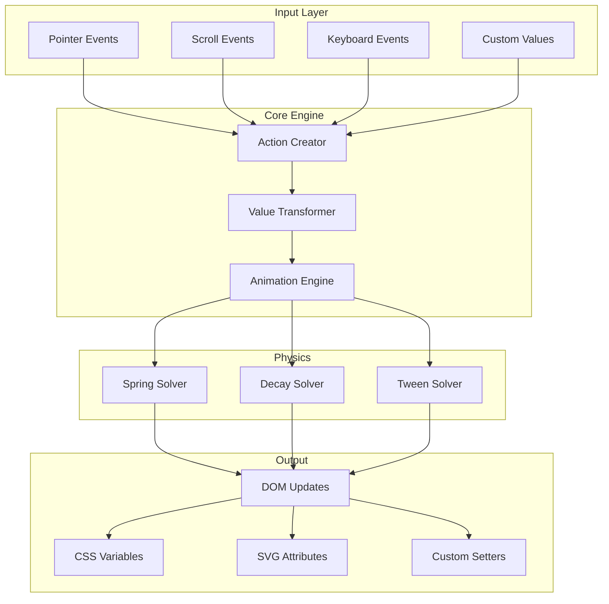
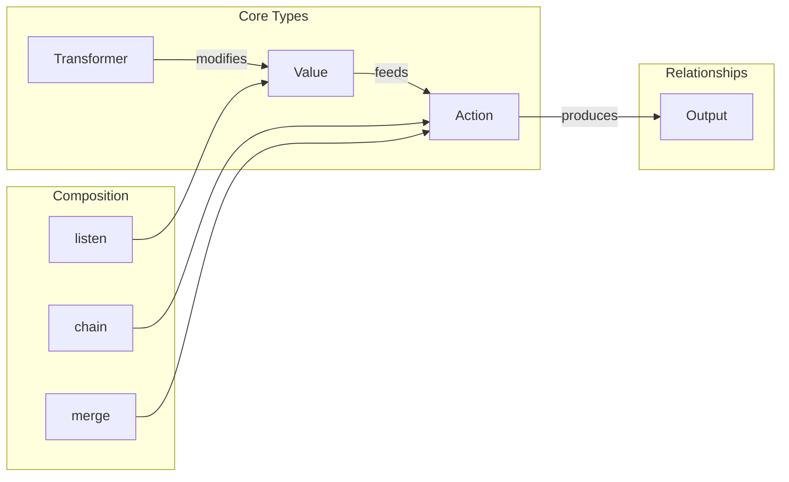
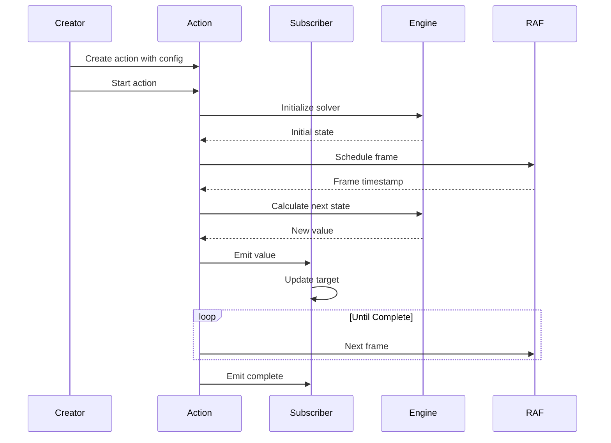
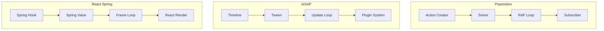

# Popmotion - Technical Exploration

**Location:** `npm:popmotion` / `https://github.com/motiondivision/popmotion`
**Explored_at:** 2026-03-20
**Category:** Functional Animation Library
**Package Size:** ~9KB (minified + gzip)

---

## Table of Contents

1. [Project Overview](#project-overview)
2. [Architecture](#architecture)
3. [Core Animation System](#core-animation-system)
4. [API Design](#api-design)
5. [Performance](#performance)
6. [Unique Features](#unique-features)
7. [Code Examples](#code-examples)
8. [Comparison with Other Libraries](#comparison-with-other-libraries)

---

## Project Overview

### What is Popmotion?

Popmotion is a functional, reactive animation library for JavaScript. It provides a declarative, composition-first approach to animations using pure functions and observables. Created by Matt Perry (also the creator of Framer Motion), Popmotion serves as the underlying animation engine for Framer Motion.

### Philosophy

Popmotion is built on several key principles:

- **Functional Programming** - Pure functions, immutable data, function composition
- **Reactive** - Built on observable patterns for real-time value updates
- **Composable** - Small, focused functions that combine powerfully
- **Framework Agnostic** - Works with any JavaScript framework or vanilla JS
- **Physics-Based** - First-class support for spring physics and decay animations

### Installation

```bash
npm install popmotion
# or
yarn add popmotion
```

### History and Evolution

Popmotion has evolved significantly since its initial release:

```
v1.0 (2016)    - Initial release with basic tweening
v2.0 (2017)    - Added physics animations (spring, decay)
v5.0 (2018)    - Complete rewrite with functional API
v8.0 (2018)    - Added pointer tracking and input handling
v9.0 (2020)    - Modernized for Framer Motion v2
v10+ (2023)    - Continued maintenance and improvements
```

---

## Architecture

### High-Level Architecture



### Module Structure

```
popmotion/
├── src/
│   ├── index.ts
│   ├── actions/
│   │   ├── tween.ts          # Time-based animations
│   │   ├── spring.ts         # Spring physics
│   │   ├── decay.ts          # Momentum/decay
│   │   ├── pointer.ts        # Pointer tracking
│   │   └── chain.ts          # Action composition
│   ├── composers/
│   │   ├── compose.ts        # Function composition
│   │   ├── combine.ts        # Value combination
│   │   └── schedule.ts       # Scheduling utilities
│   ├── engines/
│   │   ├── max-width.ts      # Max width calc
│   │   └── ...
│   ├── reactions/
│   │   ├── observer.ts       # Observer pattern
│   │   ├── action.ts         # Action creator
│   │   └── value.ts          # Reactive values
│   ├── utils/
│   │   ├── clamp.ts          # Value clamping
│   │   ├── mix.ts            # Value interpolation
│   │   ├── pipe.ts           # Function piping
│   │   ├── progress.ts       # Progress calculation
│   │   └── time-conversion.ts
│   └── types/
│       └── index.ts
└── package.json
```

### Core Abstractions



### The Action Pattern

```typescript
// Actions are functions that take a subscriber and return a cleanup function
type Action<A, B> = (subscribe: (value: B) => void) => () => void;

// Example: A simple tween action
function tween(config: TweenConfig): Action<TweenConfig, number> {
  return (subscribe) => {
    let animationFrame: number;
    let startTime: number;
    let finished = false;

    function loop(timestamp: number) {
      if (!startTime) startTime = timestamp;
      const duration = config.duration || 300;
      const elapsed = timestamp - startTime;
      const progress = Math.min(elapsed / duration, 1);

      subscribe(progress);

      if (progress < 1 && !finished) {
        animationFrame = requestAnimationFrame(loop);
      }
    }

    animationFrame = requestAnimationFrame(loop);

    // Cleanup function
    return () => cancelAnimationFrame(animationFrame);
  };
}
```

---

## Core Animation System

### Animation Engine Architecture

Popmotion's animation engine is built around the concept of **Actions** - composable, cancellable animation units.

#### Action Lifecycle



### The Solver System

Popmotion uses a solver-based architecture where different animation types have dedicated solvers:

```typescript
interface Solver<T extends Number | Number[]> {
  next: (dt: number) => T;
  done: () => boolean;
  flip: () => Solver<T>;
}

// Spring Solver
function createSpringSolver(config: SpringConfig): Solver<number> {
  const { stiffness, damping, mass, velocity, to, from } = config;

  let currentVelocity = velocity || 0;
  let currentValue = from || 0;
  let timestamp = 0;

  return {
    next(dt: number): number {
      // Simple harmonic motion equation
      // F = -kx - cv (Hooke's Law + Damping)
      const acceleration = (-stiffness * (currentValue - to) - damping * currentVelocity) / mass;

      currentVelocity += acceleration * dt;
      currentValue += currentVelocity * dt;
      timestamp += dt;

      return currentValue;
    },

    done(): boolean {
      // Consider done when velocity and displacement are negligible
      return Math.abs(currentVelocity) < 0.001 && Math.abs(currentValue - to) < 0.001;
    },

    flip(): Solver<number> {
      return createSpringSolver({
        ...config,
        from: to,
        to: from,
        velocity: -currentVelocity,
      });
    },
  };
}
```

### Timing and Easing

#### Easing Functions

Popmotion provides a comprehensive set of easing functions:

```typescript
type EasingFunction = (t: number) => number;

const easings: Record<string, EasingFunction> = {
  // Basic
  linear: t => t,

  // Quadratic
  easeInQuad: t => t * t,
  easeOutQuad: t => t * (2 - t),
  easeInOutQuad: t => t < 0.5 ? 2 * t * t : -1 + (4 - 2 * t) * t,

  // Cubic
  easeInCubic: t => t * t * t,
  easeOutCubic: t => (--t) * t * t + 1,
  easeInOutCubic: t => t < 0.5 ? 4 * t * t * t : (t - 1) * (2 * t - 2) * (2 * t - 2) + 1,

  // Quartic
  easeInQuart: t => t * t * t * t,
  easeOutQuart: t => 1 - (--t) * t * t * t,
  easeInOutQuart: t => t < 0.5 ? 8 * t * t * t * t : 1 - 8 * (--t) * t * t * t,

  // Quintic
  easeInQuint: t => t * t * t * t * t,
  easeOutQuint: t => 1 + (--t) * t * t * t * t,
  easeInOutQuint: t => t < 0.5 ? 16 * t * t * t * t * t : 1 + 16 * (--t) * t * t * t * t,

  // Circular
  easeInSine: t => 1 - Math.cos((t * Math.PI) / 2),
  easeOutSine: t => Math.sin((t * Math.PI) / 2),
  easeInOutSine: t => -(Math.cos(Math.PI * t) - 1) / 2,

  // Exponential
  easeInExpo: t => (t === 0 ? 0 : Math.pow(2, 10 * t - 10)),
  easeOutExpo: t => (t === 1 ? 1 : 1 - Math.pow(2, -10 * t)),
  easeInOutExpo: t => t === 0 ? 0 : t === 1 ? 1 : t < 0.5 ? Math.pow(2, 20 * t - 10) / 2 : (2 - Math.pow(2, -20 * t + 10)) / 2,

  // Back (overshoot)
  easeInBack: t => {
    const c1 = 1.70158;
    const c3 = c1 + 1;
    return c3 * t * t * t - c1 * t * t;
  },
  easeOutBack: t => {
    const c1 = 1.70158;
    const c3 = c1 + 1;
    return 1 + c3 * Math.pow(t - 1, 3) + c1 * Math.pow(t - 1, 2);
  },

  // Elastic (bounce back)
  easeInElastic: t => {
    const c4 = (2 * Math.PI) / 3;
    return t === 0 ? 0 : t === 1 ? 1 : -Math.pow(2, 10 * t - 10) * Math.sin((t * 10 - 10.75) * c4);
  },
  easeOutElastic: t => {
    const c4 = (2 * Math.PI) / 3;
    return t === 0 ? 0 : t === 1 ? 1 : Math.pow(2, -10 * t) * Math.sin((t * 10 - 0.75) * c4) + 1;
  },

  // Bounce
  easeOutBounce: t => {
    const n1 = 7.5625;
    const d1 = 2.75;
    if (t < 1 / d1) return n1 * t * t;
    if (t < 2 / d1) return n1 * (t -= 1.5 / d1) * t + 0.75;
    if (t < 2.5 / d1) return n1 * (t -= 2.25 / d1) * t + 0.9375;
    return n1 * (t -= 2.625 / d1) * t + 0.984375;
  },
};
```

#### Easing Visualization

```
Easing Function Graphs:

easeInQuad      easeOutQuad     easeInOutQuad
    │               │               │
    │           ┌───┘           ┌───┘
    │       ┌───┘           ────┘
    │   ┌───┘           ┌───┘
    └───┘               └───┘

easeInCubic     easeOutCubic    easeInOutCubic
    │               │               │
    │               │           ┌───┘
    │           ┌───┘       ────┘
    │       ┌───┘       ┌───┘
    └───┘       └───┘       └───┘

easeOutBounce   easeInElastic   easeOutElastic
    ┌─┐             │               │
   │ │ │        ┌───┘           ┌───┐
  │  │  │    ───┘           ────┘   │
 │   │   │  ┌─┘               └─────┘
─┘   └───┘──┘
```

### Value Interpolation (Mixing)

Popmotion's `mix` function is a core utility for interpolating between values:

```typescript
// Basic number interpolation
function mixNumber(from: number, to: number, progress: number): number {
  return from + (to - from) * progress;
}

// Color interpolation (RGB)
function mixColor(from: Color, to: Color, progress: number): string {
  const r = mixNumber(from.r, to.r, progress);
  const g = mixNumber(from.g, to.g, progress);
  const b = mixNumber(from.b, to.b, progress);
  const a = mixNumber(from.a, to.a, progress);
  return `rgba(${r}, ${g}, ${b}, ${a})`;
}

// Complex object interpolation
function mixObject<T extends Record<string, any>>(
  from: T,
  to: T,
  progress: number
): T {
  const result = {} as T;

  for (const key in from) {
    if (typeof from[key] === 'number') {
      result[key] = mixNumber(from[key], to[key], progress);
    } else if (typeof from[key] === 'string' && isColor(from[key])) {
      result[key] = mixColor(parseColor(from[key]), parseColor(to[key]), progress);
    } else {
      // Fallback to "to" value for non-interpolatable types
      result[key] = progress >= 1 ? to[key] : from[key];
    }
  }

  return result;
}

// Array interpolation
function mixArray<T>(from: T[], to: T[], progress: number): T[] {
  return from.map((value, index) =>
    mix(value, to[index] || value, progress)
  );
}

// Generic mix function with type detection
function mix<T>(from: T, to: T, progress: number): T {
  if (typeof from === 'number') {
    return mixNumber(from, to as number, progress) as T;
  }
  if (typeof from === 'string') {
    if (isColor(from)) {
      return mixColor(parseColor(from), parseColor(to as string), progress) as T;
    }
    return progress >= 1 ? to : from;
  }
  if (Array.isArray(from)) {
    return mixArray(from, to as T[], progress) as T;
  }
  if (typeof from === 'object') {
    return mixObject(from, to as T, progress) as T;
  }
  return progress >= 1 ? to : from;
}
```

### RAF/WAAPI Usage

Popmotion primarily uses requestAnimationFrame for precise control:

```typescript
// RAF-based animation loop
function createRafLoop(
  onUpdate: (timestamp: number) => void,
  onCancel?: () => void
): () => void {
  let rafId: number | null = null;
  let hasStarted = false;

  function loop(timestamp: number) {
    hasStarted = true;
    onUpdate(timestamp);
    rafId = requestAnimationFrame(loop);
  }

  rafId = requestAnimationFrame(loop);

  // Return cancel function
  return () => {
    if (rafId !== null) {
      cancelAnimationFrame(rafId);
      if (!hasStarted && onCancel) onCancel();
    }
  };
}

// Frame loop with delta time
function createDeltaLoop(
  onUpdate: (deltaTime: number) => void
): () => void {
  let lastTime: number | null = null;
  let rafId: number | null = null;

  function loop(timestamp: number) {
    if (lastTime !== null) {
      const deltaTime = timestamp - lastTime;
      onUpdate(deltaTime);
    }
    lastTime = timestamp;
    rafId = requestAnimationFrame(loop);
  }

  rafId = requestAnimationFrame(loop);

  return () => {
    if (rafId !== null) {
      cancelAnimationFrame(rafId);
    }
  };
}
```

---

## API Design

### How Animations Are Created

Popmotion uses a functional API where animations are created by calling action creators:

#### Basic Tween

```typescript
import { tween, styler } from 'popmotion';

const box = document.querySelector('.box');
const boxStyler = styler(box);

tween({
  from: { x: 0 },
  to: { x: 300 },
  duration: 800,
  ease: 'easeInOut',
}).start((latest) => {
  boxStyler.set('x', latest.x);
});
```

#### Spring Animation

```typescript
import { spring } from 'popmotion';

spring({
  from: 0,
  to: 100,
  velocity: 10,
  stiffness: 100,
  damping: 15,
  mass: 1,
}).start((value) => {
  element.style.transform = `translateX(${value}px)`;
});
```

#### Decay Animation

```typescript
import { decay } from 'popmotion';

// Momentum scrolling / flick gesture
decay({
  from: scrollPosition,
  velocity: scrollVelocity,
  power: 0.99,
  timeConstant: 350,
  restDelta: 0.5,
}).start((value) => {
  container.scrollTop = Math.round(value);
});
```

### Chaining and Composition

Popmotion excels at composition with powerful combinators:

#### Chain (Sequential)

```typescript
import { chain, tween, spring } from 'popmotion';

chain(
  tween({ from: 0, to: 100, duration: 500 }),
  spring({ from: 100, to: 200, stiffness: 200, damping: 20 }),
  tween({ from: 200, to: 150, duration: 300 })
).start((value) => {
  element.style.transform = `translateX(${value}px)`;
});
```

#### Merge (Parallel)

```typescript
import { merge } from 'popmotion';

merge(
  tween({ from: 0, to: 100, duration: 500 }),
  tween({ from: 1, to: 0.5, duration: 500 })
).start(([position, scale]) => {
  element.style.transform = `translateX(${position}px) scale(${scale})`;
});
```

#### Listen and Transform

```typescript
import { listen, pointer, transform } from 'popmotion';

// Track pointer and transform the value
pointer()
  .pipe(
    transform.map((pos) => pos.x),  // Extract x only
    transform.clamp(0, 100),         // Clamp to range
    transform.pipe(console.log)      // Log value
  )
  .start((x) => {
    element.style.transform = `translateX(${x}px)`;
  });
```

#### Pipe and Compose

```typescript
import { pipe, compose } from 'popmotion';

// Pipe: left-to-right function application
const processValue = pipe(
  (v) => v * 2,
  (v) => v + 10,
  (v) => Math.round(v)
);

const result = processValue(5); // 20

// Compose: right-to-left function application
const processValueComposed = compose(
  Math.round,
  (v) => v + 10,
  (v) => v * 2
);

const resultComposed = processValueComposed(5); // 20
```

### State Management

#### Reactive Values

```typescript
import { value, tween } from 'popmotion';

// Create a reactive value
const myValue = value(0, (latest) => {
  // Subscriber function - called on every update
  element.style.transform = `translateX(${latest}px)`;
});

// Start animation on the value
tween({
  from: 0,
  to: 100,
  duration: 500,
}).start(myValue);

// Get current value
const current = myValue.get();

// Update value manually
myValue.update(50);

// Add additional subscriber
const unsubscribe = myValue.subscribe((v) => {
  console.log('Value updated:', v);
});

// Cleanup
unsubscribe();
```

#### Value with Type

```typescript
import { value } from 'popmotion';

// Value with custom type
const colorValue = value('#ff0000', (latest) => {
  element.style.backgroundColor = latest;
});

// Value with object type
const transformValue = value(
  { x: 0, y: 0, rotate: 0 },
  (latest) => {
    element.style.transform = `
      translate(${latest.x}px, ${latest.y}px)
      rotate(${latest.rotate}deg)
    `;
  }
);
```

#### Action State

```typescript
interface ActionState {
  isStopped: boolean;
  isFinished: boolean;
}

const action = tween({ from: 0, to: 100 });

const controls = action.start({
  update: (value) => console.log('Update:', value),
  complete: () => console.log('Complete'),
});

// Control the action
controls.stop();      // Stop immediately
controls.complete();  // Jump to end
```

---

## Performance

### Optimizations

#### 1. Minimal Object Creation

Popmotion minimizes garbage collection by reusing objects:

```typescript
// Bad: Creates new object every frame
function badUpdate(value: number): Vector {
  return { x: value, y: value * 2 };
}

// Good: Reuse object
function goodUpdate(value: number, output: Vector): Vector {
  output.x = value;
  output.y = value * 2;
  return output;
}

// Initialize once
const sharedOutput = { x: 0, y: 0 };
```

#### 2. Early Exit Optimization

```typescript
function springSolver(config: SpringConfig) {
  const { restDelta, restSpeed } = config;
  let isResting = false;

  return {
    next(dt: number): number {
      if (isResting) return currentValue;

      // ... calculate new value ...

      // Check if we can consider the animation at rest
      if (Math.abs(velocity) < restSpeed && Math.abs(currentValue - to) < restDelta) {
        isResting = true;
        currentValue = to;
      }

      return currentValue;
    }
  };
}
```

#### 3. Delta Time Normalization

```typescript
// Handle frame rate variations
function normalizeDelta(deltaTime: number, targetFPS = 60): number {
  const targetDelta = 1000 / targetFPS;
  // Clamp delta to prevent spiral of death
  return Math.min(deltaTime, targetDelta * 2);
}

function updateWithNormalizedDelta(dt: number): void {
  const normalized = normalizeDelta(dt);
  // Use normalized delta for consistent animation speed
  currentValue += velocity * (normalized / 16.67);
}
```

### Batched Updates

Popmotion supports batching multiple value updates:

```typescript
// Frame batching
const batchedUpdates = new Map<Value, any>();
let isBatchScheduled = false;

function scheduleBatchFlush(): void {
  if (isBatchScheduled) return;
  isBatchScheduled = true;

  requestAnimationFrame(() => {
    batchedUpdates.forEach((value, setter) => {
      setter(value);
    });
    batchedUpdates.clear();
    isBatchScheduled = false;
  });
}

function batchUpdate(value: any, setter: (v: any) => void): void {
  batchedUpdates.set(value, setter);
  scheduleBatchFlush();
}
```

### Memory Management

#### Cleanup Patterns

```typescript
// Automatic cleanup on unmount
function createManagedAnimation(element: HTMLElement) {
  const action = tween({ from: 0, to: 100 });
  const controls = action.start((v) => {
    element.style.transform = `translateX(${v}px)`;
  });

  // Return cleanup function
  return () => {
    controls.stop();
  };
}

// Usage with React
useEffect(() => {
  const cleanup = createManagedAnimation(ref.current);
  return cleanup;
}, []);
```

#### Subscription Management

```typescript
class SubscriptionManager {
  private subscriptions: Array<() => void> = [];

  add(unsubscribe: () => void): void {
    this.subscriptions.push(unsubscribe);
  }

  removeAll(): void {
    while (this.subscriptions.length) {
      const unsubscribe = this.subscriptions.pop();
      if (unsubscribe) unsubscribe();
    }
  }
}

// Usage
const manager = new SubscriptionManager();

const action = tween({ from: 0, to: 100 });
const controls = action.start((v) => {
  element.style.x = v;
});

manager.add(() => controls.stop());

// Later, cleanup all
manager.removeAll();
```

---

## Unique Features

### 1. Physics-First Design

Popmotion was one of the first libraries to put physics-based animations at the core:

```typescript
// Spring with full physical properties
spring({
  from: 0,
  to: 100,
  velocity: 5,        // Initial velocity
  stiffness: 100,     // Spring constant (k)
  damping: 15,        // Damping coefficient (c)
  mass: 1,           // Mass (m)
  restDelta: 0.001,   // When to consider "at rest"
  restSpeed: 0.01,    // Minimum velocity threshold
});

// Decay for momentum effects
decay({
  from: 100,
  velocity: 500,      // Starting velocity
  power: 0.99,        // Velocity multiplier per frame
  timeConstant: 350,  // Time to reach rest
  modifyTarget: (target) => clamp(0, 1000, target),
});
```

### 2. Styler Abstraction

The styler provides a unified interface for updating different targets:

```typescript
import { styler } from 'popmotion';

// DOM Element styler
const element = document.querySelector('.box');
const elementStyler = styler(element);

elementStyler.set('x', 100);        // translateX
elementStyler.set('opacity', 0.5);
elementStyler.set('backgroundColor', '#ff0000');

// SVG styler
const svgElement = document.querySelector('circle');
const svgStyler = styler(svgElement);

svgStyler.set('cx', 50);
svgStyler.set('r', 20);

// CSS custom properties
elementStyler.set('--my-variable', 42);
```

### 3. Transform Pipe

```typescript
import { transform } from 'popmotion';

// Chain transformations
const transformPipe = pipe(
  transform.map((pos) => pos.x),           // Extract x
  transform.clamp(0, 100),                  // Clamp range
  transform.scale([0, 100], [0, 1]),        // Scale to new range
  transform.pipe(Math.round, console.log)   // Process and log
);

const result = transformPipe(50);

// Color transformation
const colorTransform = transform.mapColor((color) => ({
  ...color,
  r: color.r + 20
}));

// Value type conversion
const stringToNumber = transform.parse([
  { test: (v) => typeof v === 'string', parse: parseFloat }
]);
```

### 4. Pointer Tracking

```typescript
import { pointer, listen } from 'popmotion';

// Track pointer position
pointer()
  .start((pos) => {
    element.style.left = pos.x + 'px';
    element.style.top = pos.y + 'px';
  });

// Track with specific element
pointer({ element: container })
  .start((pos) => {
    // Relative to container
    console.log(pos.x, pos.y);
  });

// Mouse tracking
listen(document, 'mousemove')
  .start((event: MouseEvent) => {
    console.log(event.clientX, event.clientY);
  });
```

### 5. Cross-Fade Utilities

```typescript
import { crossfade } from 'popmotion';

// Smoothly transition between two values
const fade = crossfade(0.2); // 200ms crossfade

const currentValue = fade(100, 200); // Smoothly interpolate
```

---

## Code Examples

### Interactive Card Drag

```typescript
import { pointer, spring, decay, value, styler } from 'popmotion';

function createDraggableCard(element: HTMLElement) {
  const cardStyler = styler(element);
  const x = value(0, (latest) => cardStyler.set('x', latest));
  const y = value(0, (latest) => cardStyler.set('y', latest));
  const rotation = value(0, (latest) => cardStyler.set('rotate', latest));

  let isDragging = false;
  let currentVelocity = { x: 0, y: 0 };

  function onPointerDown() {
    isDragging = true;

    pointer()
      .pipe(
        transform.map((pos) => ({
          x: pos.x - startX,
          y: pos.y - startY,
        }))
      )
      .start({
        update: ({ x: newX, y: newY }) => {
          x.update(newX);
          y.update(newY);
          rotation.update(newX * 0.05);

          currentVelocity = {
            x: newX - x.get(),
            y: newY - y.get(),
          };
        },
        complete: () => {
          isDragging = false;

          // Check if we should spring back or decay out
          if (Math.abs(x.get()) < 100) {
            // Spring back to center
            spring({
              from: x.get(),
              to: 0,
              velocity: currentVelocity.x,
              stiffness: 200,
              damping: 30,
            }).start(x);

            spring({
              from: y.get(),
              to: 0,
              velocity: currentVelocity.y,
              stiffness: 200,
              damping: 30,
            }).start(y);

            spring({
              from: rotation.get(),
              to: 0,
              velocity: currentVelocity.x * 0.05,
              stiffness: 200,
              damping: 30,
            }).start(rotation);
          } else {
            // Decay out of screen
            decay({
              from: x.get(),
              velocity: currentVelocity.x,
              power: 0.995,
              timeConstant: 300,
            }).start(x);

            decay({
              from: y.get(),
              velocity: currentVelocity.y,
              power: 0.995,
              timeConstant: 300,
            }).start(y);
          }
        },
      });
  }

  const startX = 0, startY = 0;
  element.addEventListener('mousedown', onPointerDown);
  element.addEventListener('touchstart', onPointerDown);
}
```

### Parallax Scroll Effect

```typescript
import { listen, transform, pipe } from 'popmotion';

function createParallax(elements: HTMLElement[]) {
  const styler = elements.map(el => styler(el));

  listen(window, 'scroll')
    .pipe(
      transform.map((e: Event) => (e.target as Window).scrollY),
      transform.clamp(0, document.body.scrollHeight - window.innerHeight)
    )
    .start((scrollY) => {
      elements.forEach((el, index) => {
        const depth = (index + 1) * 0.5; // Each layer moves at different speed
        const y = scrollY * depth;
        styler[index].set('y', y);
      });
    });
}
```

### Animated Counter

```typescript
import { tween, transform } from 'popmotion';

function animateCounter(
  element: HTMLElement,
  from: number,
  to: number,
  duration: number = 1000
) {
  tween({
    from: 0,
    to: 1,
    duration,
    ease: 'easeOut',
  }).start({
    update: (progress) => {
      const currentValue = Math.round(
        transform.map(progress, from, to)
      );
      element.textContent = currentValue.toLocaleString();
    },
  });
}

// Usage
animateCounter(document.querySelector('#count'), 0, 1000);
```

### Timeline Animation

```typescript
import { chain, tween, spring, styler } from 'popmotion';

function createTimeline(element: HTMLElement) {
  const elStyler = styler(element);

  const timeline = chain(
    // 1. Fade in
    tween({
      from: { opacity: 0 },
      to: { opacity: 1 },
      duration: 300,
    }),

    // 2. Slide in from left
    tween({
      from: { x: -100 },
      to: { x: 0 },
      duration: 400,
      ease: 'easeOut',
    }),

    // 3. Scale pulse
    tween({
      from: { scale: 1 },
      to: { scale: 1.1 },
      duration: 150,
    }),

    // 4. Spring back
    spring({
      from: 1.1,
      to: 1,
      stiffness: 300,
      damping: 20,
    }),

    // 5. Rotate
    tween({
      from: { rotate: 0 },
      to: { rotate: 360 },
      duration: 600,
      ease: 'easeInOut',
    })
  );

  return {
    play: () => timeline.start({
      update: (values) => {
        if (values.opacity !== undefined) elStyler.set('opacity', values.opacity);
        if (values.x !== undefined) elStyler.set('x', values.x);
        if (values.scale !== undefined) elStyler.set('scale', values.scale);
        if (values.rotate !== undefined) elStyler.set('rotate', values.rotate);
      },
    }),
  };
}
```

---

## Comparison with Other Libraries

### Feature Comparison Matrix

| Feature | Popmotion | Vekta | React Spring | GSAP |
|---------|-----------|-------|--------------|------|
| **Bundle Size** | ~9KB | ~2KB | ~13KB | ~17KB |
| **Paradigm** | Functional | Hooks | Hooks | Imperative |
| **Physics** | Advanced | Basic | Advanced | Yes |
| **Framework** | Agnostic | React | React | Agnostic |
| **Composition** | Excellent | Good | Good | Advanced |
| **Timeline** | Chain | Basic | Basic | Advanced |
| **SVG** | Full | Limited | Full | Full |
| **Pointer** | Built-in | No | Plugin | Plugin |
| **Browser Support** | Modern | Modern | Universal | Universal |
| **Learning Curve** | Medium | Low | Medium | High |

### Architectural Differences



### When to Use Popmotion

**Choose Popmotion when:**
- You want functional, composable animations
- You need physics-based animations (springs, decay)
- You're building interactive, gesture-driven UIs
- You want framework-agnostic code
- You like reactive programming patterns

**Choose alternatives when:**
- You need timeline-heavy animations (GSAP)
- You want React-specific hooks (Vekta, React Spring)
- You need maximum browser compatibility (GSAP)
- You prefer object-oriented API (GSAP)

---

## Appendix: API Reference

### Actions

```typescript
// Tween
function tween<T>(config: TweenConfig<T>): Action<TweenConfig, T>;

// Spring
function spring(config: SpringConfig): Action<SpringConfig, number>;

// Decay
function decay(config: DecayConfig): Action<DecayConfig, number>;

// Pointer
function pointer(config?: PointerConfig): Action<PointerConfig, PointerPos>;

// Listen
function listen<Event>(element: EventTarget, eventName: string): Action<any, Event>;
```

### Utilities

```typescript
// Value transformation
transform.map(fn)
transform.clamp(min, max)
transform.scale(inputRange, outputRange)
transform.parse(parsers)
transform.pipe(...fns)

// Math utilities
clamp(min, max, value)
mix(from, to, progress)
progress(from, to, value)
distance(a, b)
```

### Composers

```typescript
// Chain actions sequentially
function chain(...actions: Action[]): Action;

// Merge actions in parallel
function merge(...actions: Action[]): Action;

// Combine values
function combine(...values: Value[]): Value;
```

---

## References

- [Popmotion Official Documentation](https://motion.dev/docs/popmotion)
- [Popmotion GitHub Repository](https://github.com/motiondivision/popmotion)
- [Framer Motion (built on Popmotion)](https://www.framer.com/motion/)
- [Functional Reactive Programming](https://en.wikipedia.org/wiki/Functional_reactive_programming)

---

*Document generated as part of animation library exploration series - 2026-03-20*
