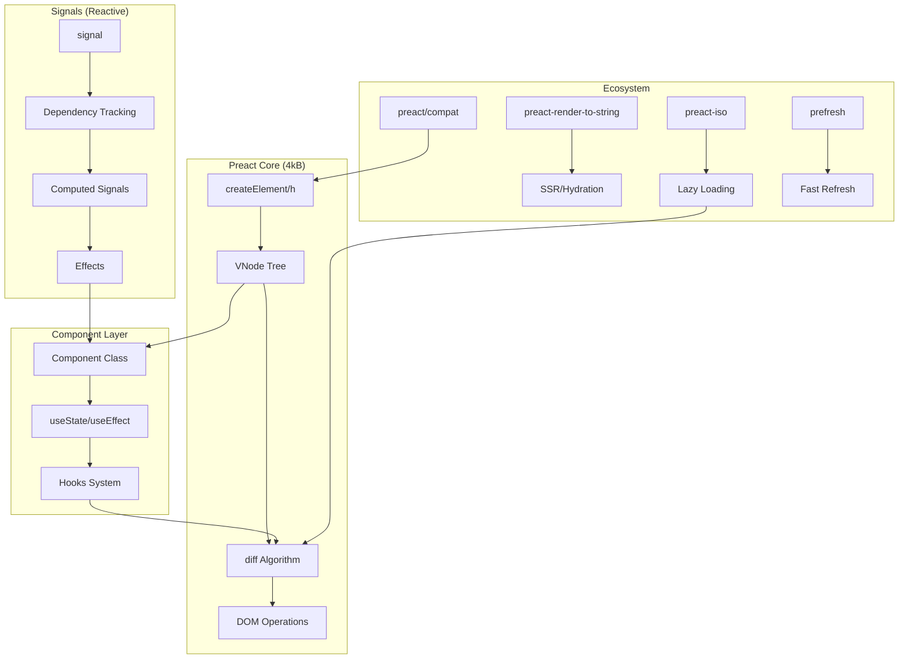

# Project Exploration: Preact - Fast 3kB React Alternative

## Overview

Preact is a lightweight, fast (4kB gzipped) alternative to React that provides the same modern API with a significantly smaller footprint. It's designed for performance-critical applications where bundle size matters without sacrificing the familiar React development experience.

**Key Characteristics:**
- **4kB size** (gzipped) - approximately 10x smaller than React
- **Familiar API** - ES6 Class components, Hooks, and Functional Components
- **React Compatibility** - via `preact/compat` alias
- **Modern Features** - JSX, Virtual DOM, DevTools, HMR, SSR support
- **High Performance** - optimized diff algorithm with seamless hydration

## Directory Structure

The Preact monorepo contains multiple packages organized by functionality:

```
/home/darkvoid/Boxxed/@formulas/src.UIFrameworks/src.preactjs/
├── preact/                     # Core Preact library (the 3kB VDOM)
│   ├── src/
│   │   ├── index.js           # Main exports
│   │   ├── render.js          # render() and hydrate() functions
│   │   ├── component.js       # BaseComponent class, setState, forceUpdate
│   │   ├── create-element.js  # createElement/h, createVNode, Fragment
│   │   ├── create-context.js  # createContext implementation
│   │   ├── diff/
│   │   │   ├── index.js       # Core diff() algorithm
│   │   │   ├── children.js    # Children reconciliation
│   │   │   └── props.js       # Property diffing
│   │   ├── hooks/             # Hooks implementation (separate package)
│   │   ├── compat/            # React compatibility layer
│   │   └── constants.js       # Bit flags and constants
│   ├── hooks/                 # Hooks package
│   ├── compat/                # preact/compat (React shim)
│   ├── debug/                 # Debug utilities
│   └── devtools/              # DevTools bridge
│
├── signals/                    # Preact Signals (reactive primitives)
│   └── packages/
│       ├── core/              # Core signals implementation
│       ├── preact/            # Preact integration
│       ├── react/             # React integration
│       └── devtools-ui/       # DevTools for signals
│
├── preact-render-to-string/   # Server-side rendering
├── preact-router/             # Routing solution
├── preact-devtools/           # Browser DevTools extension
├── preact-iso/                # Isomorphic/hydration utilities
├── prefresh/                   # Fast refresh (HMR)
├── wmr/                        # Modern build tool
└── rfcs/                       # Request for Comments process
```

## Architecture

### High-Level Diagram



## Core Preact Library

### Virtual Node Structure

Preact uses a minimal VNode structure defined in `create-element.js`:

```javascript
const vnode = {
    type,           // Component function or DOM tag name
    props,          // Properties including children
    key,            // For reconciliation
    ref,            // DOM or component reference
    _children: null,    // Child vnodes
    _parent: null,      // Parent vnode
    _depth: 0,          // Tree depth
    _dom: null,         // Actual DOM element
    _component: null,   // Component instance
    _original: ++vnodeId, // Unique ID for comparison
    _index: -1,         // Index in parent's children
    _flags: 0           // Bit flags for state
};
```

### Entry Points

From `src/index.js`:

```javascript
export { render, hydrate } from './render';
export { createElement, createElement as h, Fragment, createRef, isValidElement } from './create-element';
export { BaseComponent as Component } from './component';
export { cloneElement } from './clone-element';
export { createContext } from './create-context';
export { toChildArray } from './diff/children';
```

## Virtual DOM Implementation

### Render Process

The `render()` function in `src/render.js` is the entry point for DOM updates:

```javascript
export function render(vnode, parentDom) {
    // Get previous tree from DOM node's _children property
    let oldVNode = parentDom._children;

    // Wrap new vnode in Fragment and store on parent
    parentDom._children = createElement(Fragment, null, [vnode]);

    // Diff and commit
    let commitQueue = [], refQueue = [];
    diff(parentDom, parentDom._children, oldVNode || EMPTY_OBJ, ...);
    commitRoot(commitQueue, parentDom._children, refQueue);
}
```

### Diff Algorithm (diff/index.js)

The diff algorithm is Preact's core optimization. Key strategies:

1. **Single Pass Diff**: Preact diffs in a single pass, updating DOM as it goes
2. **Component Types**: Distinguishes between function and class components
3. **Keyed Reconciliation**: Uses keys to efficiently reorder elements
4. **Sibling Pointer**: Maintains `oldDom` pointer to track insertion points

```javascript
export function diff(
    parentDom,      // Parent DOM element
    newVNode,       // New virtual node
    oldVNode,       // Old virtual node
    globalContext,  // Context object
    namespace,      // HTML/SVG/MathML namespace
    excessDomChildren,  // Existing DOM nodes (hydration)
    commitQueue,    // Post-render callbacks
    oldDom,         // Next sibling for insertion
    isHydrating,    // Hydration mode flag
    refQueue,       // Refs to apply
    doc             // Document for element creation
)
```

### Key Diff Steps:

1. **Type Check**: Determine if newVNode is a function (component) or string (DOM element)
2. **Component Handling**:
   - Instantiate or reuse component instance
   - Call lifecycle methods (getDerivedStateFromProps, shouldComponentUpdate)
   - Render component and diff result
3. **DOM Element Handling**:
   - Reuse existing DOM from excessDomChildren or create new
   - Diff properties (attributes, event listeners)
   - Diff children recursively
4. **Commit Phase**: Apply refs and lifecycle callbacks

### Children Reconciliation (diff/children.js)

The `diffChildren` function handles array reconciliation:

```javascript
export function diffChildren(
    parentDom,
    renderResult,     // New children array
    newParentVNode,
    oldParentVNode,
    ...
)
```

Key algorithm:
1. **Construct new children array** - match old children by key or type
2. **Place and diff** - insert/move DOM nodes and recursively diff
3. **Remove excess** - unmount old children not in new array

### Optimized DOM Operations

Preact minimizes DOM operations through:

1. **In-place updates**: Text content and attributes updated directly
2. **Batched commits**: Effects and refs applied after diff completes
3. **Lazy DOM creation**: Only create DOM when no existing node matches
4. **Fragment support**: Avoid unnecessary wrapper elements

## Component Lifecycle and Hooks

### Component Class (component.js)

The `BaseComponent` class provides:

```javascript
export function BaseComponent(props, context) {
    this.props = props;
    this.context = context;
    this._bits = 0;  // Bit flags for state
}

BaseComponent.prototype.setState = function(update, callback) {
    // Clone state, apply update, enqueue render
    this._nextState = assign({}, this.state);
    assign(this._nextState, update);
    enqueueRender(this);
};

BaseComponent.prototype.forceUpdate = function(callback) {
    this._bits |= COMPONENT_FORCE;
    enqueueRender(this);
};
```

### Render Queue

Preact batches renders using a queue:

```javascript
let rerenderQueue = [];

export function enqueueRender(c) {
    if (!(c._bits & COMPONENT_DIRTY) &&
        (c._bits |= COMPONENT_DIRTY) &&
        rerenderQueue.push(c) &&
        !rerenderCount++) {
        (prevDebounce || queueMicrotask)(process);
    }
}

function process() {
    // Sort by depth (parent first)
    rerenderQueue.sort(depthSort);

    // Render each component
    while (rerenderQueue.length) {
        c = rerenderQueue.shift();
        renderComponent(c);
    }
}
```

### Hooks Implementation (hooks/src/index.js)

Hooks are implemented using a linked list stored on the component:

```javascript
function getHookState(index, type) {
    const hooks = currentComponent.__hooks ||
        (currentComponent.__hooks = { _list: [], _pendingEffects: [] });

    if (index >= hooks._list.length) {
        hooks._list.push({});
    }
    return hooks._list[index];
}
```

Key hooks:

| Hook | Description |
|------|-------------|
| `useState` | State management via useReducer |
| `useReducer` | Complex state with reducer function |
| `useEffect` | Post-render side effects |
| `useLayoutEffect` | Synchronous effects after DOM mutation |
| `useMemo` | Memoized computation |
| `useCallback` | Memoized function reference |
| `useRef` | Mutable reference object |
| `useContext` | Context value subscription |

## How Preact Achieves 4kB Size

### Size Optimization Techniques

1. **No Synthetic Events**: Uses native DOM events directly
2. **Minimal Abstractions**: Direct property setting instead of complex systems
3. **Bit Flags**: Uses bitwise operations for state (`_bits`, `_flags`)
4. **Short Variable Names**: Minification-friendly naming internally
5. **Tree Shaking**: ES modules enable dead code elimination
6. **No PropTypes**: Validation left to development mode or external tools
7. **Unified Code Paths**: Components and DOM elements share diff logic

### Comparison with React

| Feature | React | Preact |
|---------|-------|--------|
| Size (gzipped) | ~42kB | ~4kB |
| Event System | Synthetic | Native |
| Fiber Architecture | Yes | No (single pass) |
| Concurrent Rendering | Yes | Limited |
| Development Warnings | Extensive | Minimal |
| PropTypes | Built-in | External |

## Preact Signals

### Core Concepts (signals/packages/core/src/index.ts)

Signals are reactive primitives that provide fine-grained reactivity:

```typescript
// Signal types
signal<T>(value)      // Writable signal
computed<T>(() => v)  // Derived value
effect(() => {})      // Side effect
batch(() => {})       // Batch updates
```

### Signal Implementation

```typescript
class Signal<T> {
    _value: T;
    _version: number;     // Change counter
    _targets?: Node;      // Subscribers
    _node?: Node;         // Dependency link

    get value(): T {
        const node = addDependency(this);  // Track read
        return this._value;
    }

    set value(v: T) {
        if (v !== this._value) {
            this._value = v;
            this._version++;
            // Notify subscribers
            for (let node = this._targets; node; node = node._nextTarget) {
                node._target._notify();
            }
        }
    }
}
```

### Dependency Tracking

Signals use a doubly-linked list for dependency tracking:

```typescript
type Node = {
    _source: Signal;      // The signal being tracked
    _target: Computed | Effect;  // The computation depending on it
    _prevSource?: Node;
    _nextSource?: Node;
    _prevTarget?: Node;
    _nextTarget?: Node;
    _version: number;     // Last seen version
};
```

### Computed Signals

Computed signals lazily evaluate and cache results:

```typescript
Computed.prototype._refresh = function() {
    // Skip if tracking and not outdated
    if ((this._flags & (OUTDATED | TRACKING)) === TRACKING) {
        return true;
    }

    // Check dependencies for changes
    if (!needsToRecompute(this)) {
        return true;
    }

    this._flags |= RUNNING;
    const value = this._fn();
    if (this._value !== value) {
        this._value = value;
        this._version++;
    }
    this._flags &= ~RUNNING;
};
```

### Preact Integration (signals/packages/preact)

Signals integrate with Preact components via hooks:

```javascript
// useSignal hook
function useSignal(value) {
    return useMemo(() => signal(value), []);
}

// useSignalState - reactive state
function useSignalState(initial) {
    const sig = useSignal(initial);
    return [sig, (v) => (sig.value = v)];
}
```

### Signal vs Virtual DOM

| Aspect | Virtual DOM | Signals |
|--------|-------------|---------|
| Granularity | Component | Fine-grained |
| Updates | Batched re-render | Direct DOM |
| Memory | VNode tree | Dependency graph |
| Best for | Complex UIs | Simple reactive state |

## SSR with preact-render-to-string

### Basic Rendering

```javascript
import { render } from 'preact-render-to-string';

const html = render(<App />);
```

### Async Rendering (Suspense)

```javascript
import { renderToStringAsync } from 'preact-render-to-string';

const html = await renderToStringAsync(
    <Suspense fallback={<Loading />}>
        <LazyComponent />
    </Suspense>
);
```

### Streaming Support

```javascript
import { renderToPipeableStream } from 'preact-render-to-string/stream-node';

const { pipe, abort } = renderToPipeableStream(<App />, {
    onShellReady() {
        pipe(res);  // Send initial HTML
    },
    onAllReady() {
        // All suspense boundaries resolved
    },
    onError(error) {
        console.error(error);
    }
});
```

### Hydration (preact-iso)

```javascript
import { hydrate, LocationProvider, Router, lazy } from 'preact-iso';

const App = () => (
    <LocationProvider>
        <Router>
            <Home path="/" />
            <Profile path="/profile/:id" />
        </Router>
    </LocationProvider>
);

hydrate(<App />);  // Hydrates if SSR'd, renders if client-only
```

## React Ecosystem Compatibility

### preact/compat

The compat layer provides React API compatibility:

```javascript
// package.json
{
  "aliases": {
    "react": "preact/compat",
    "react-dom": "preact/compat"
  }
}
```

### Compatible Libraries

- **React Router**: Works via preact/compat
- **Emotion/Styled-components**: Compatible
- **Redux/React-Redux**: Compatible
- **React Query**: Compatible
- **Most hooks libraries**: Compatible

### Limitations

- StrictMode is a no-op (Fragment)
- Some concurrent features not available
- PropTypes not built-in
- findDOMNode has limited support

## Key Insights

### 1. Single-Pass Diff Algorithm

Unlike React's Fiber architecture with two phases, Preact uses a single-pass diff that updates DOM immediately. This reduces memory overhead but limits concurrent rendering capabilities.

### 2. Bitwise State Management

Preact uses bit flags extensively for state tracking:

```javascript
// Component bits
COMPONENT_FORCE = 1 << 2;      // Force update
COMPONENT_DIRTY = 1 << 3;      // Needs render

// VNode flags
MODE_HYDRATE = 1 << 5;         // Hydration mode
MODE_SUSPENDED = 1 << 7;       // Suspended rendering
```

### 3. DOM Node as VNode Storage

Preact stores the previous VNode tree on the DOM node itself:

```javascript
parentDom._children = vnodeTree;  // Store for next render
```

This eliminates the need for a separate container state.

### 4. Signals Use Lazy Evaluation

Computed signals only recalculate when:
1. They have subscribers (TRACKING flag)
2. A dependency has changed (OUTDATED flag)
3. The value is actually read

### 5. Batch Processing

Both Preact and Signals use batching:
- Preact batches renders via microtask queue
- Signals batch effect notifications until batch completes

## File References

### Core Library
- `/home/darkvoid/Boxxed/@formulas/src.UIFrameworks/src.preactjs/preact/src/index.js` - Main exports
- `/home/darkvoid/Boxxed/@formulas/src.UIFrameworks/src.preactjs/preact/src/render.js` - Render/hydrate
- `/home/darkvoid/Boxxed/@formulas/src.UIFrameworks/src.preactjs/preact/src/component.js` - Components
- `/home/darkvoid/Boxxed/@formulas/src.UIFrameworks/src.preactjs/preact/src/diff/index.js` - Diff algorithm
- `/home/darkvoid/Boxxed/@formulas/src.UIFrameworks/src.preactjs/preact/hooks/src/index.js` - Hooks

### Signals
- `/home/darkvoid/Boxxed/@formulas/src.UIFrameworks/src.preactjs/signals/packages/core/src/index.ts` - Core signals

### Compatibility
- `/home/darkvoid/Boxxed/@formulas/src.UIFrameworks/src.preactjs/preact/compat/src/index.js` - React compat

### Utilities
- `/home/darkvoid/Boxxed/@formulas/src.UIFrameworks/src.preactjs/preact-iso/README.md` - Isomorphic utilities
- `/home/darkvoid/Boxxed/@formulas/src.UIFrameworks/src.preactjs/preact-render-to-string/README.md` - SSR

## Conclusion

Preact achieves its remarkable size efficiency through careful engineering decisions: native events, bitwise operations, single-pass rendering, and minimal abstractions. While it sacrifices some advanced features like concurrent rendering, it provides an excellent balance for applications prioritizing bundle size and performance.

The addition of Signals provides an alternative reactive model that complements the Virtual DOM approach, offering fine-grained reactivity for state-intensive applications.
