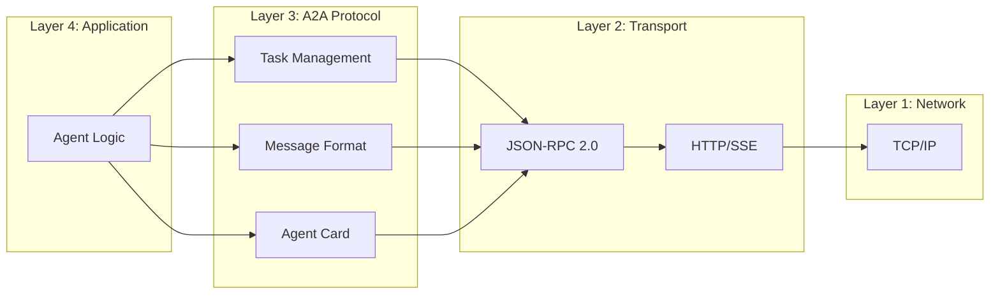
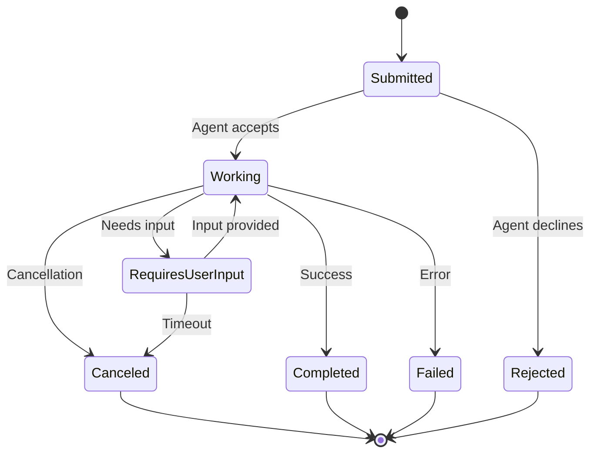
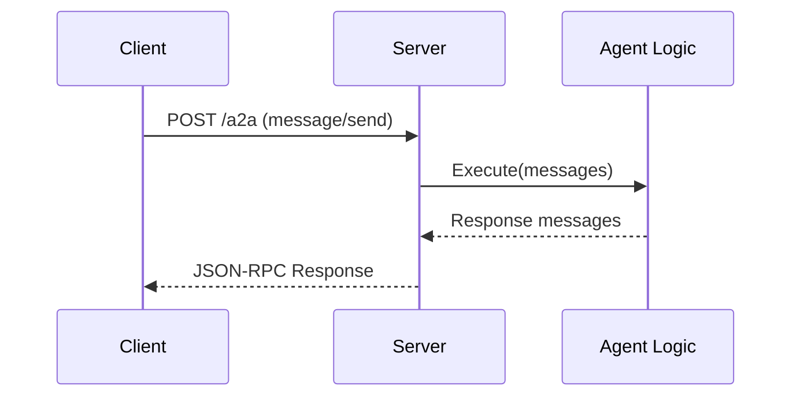
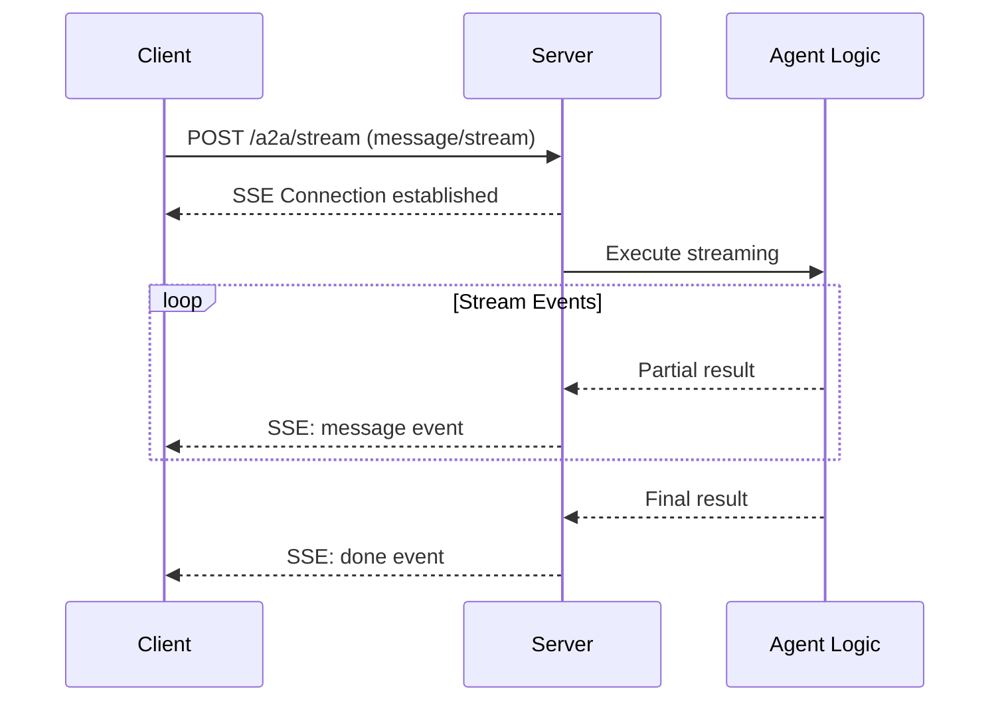
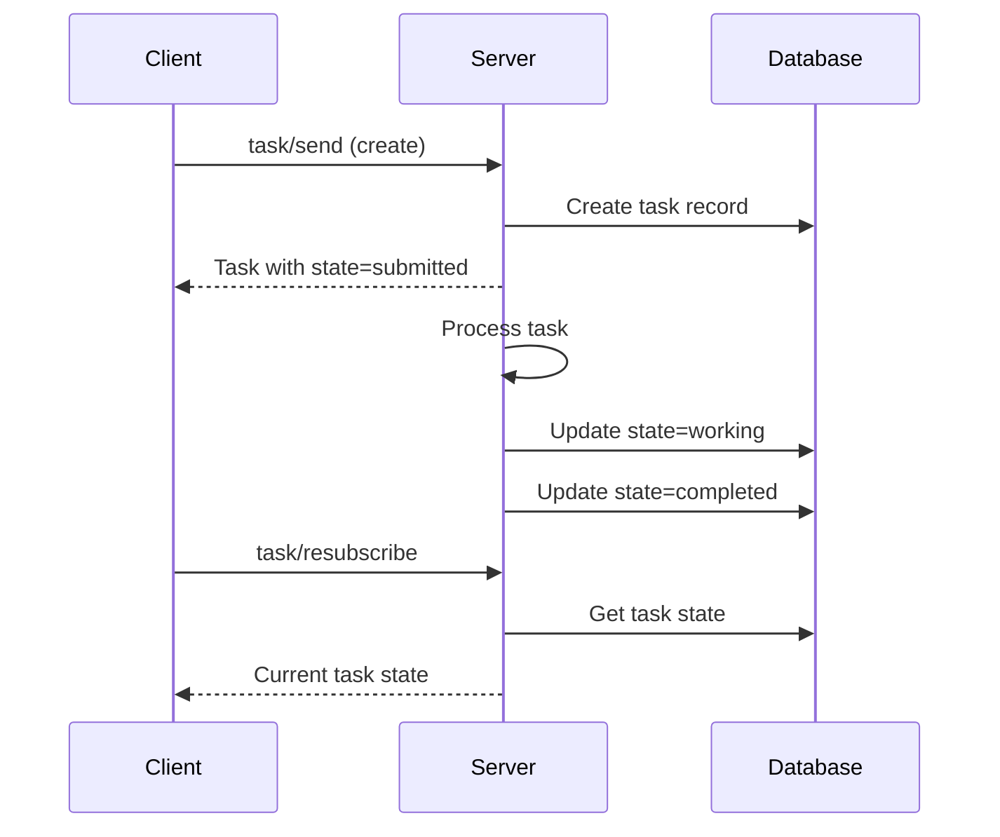

# Project Exploration: A2A Protocol (Agent2Agent)

## Overview

A2A (Agent-to-Agent) Protocol is an open protocol enabling communication and interoperability between opaque agentic applications built on diverse frameworks by different companies running on separate servers. The protocol provides a common language for AI agents to collaborate without exposing their internal state, memory, or tools.

The protocol addresses a critical gap in the AI ecosystem: as AI agents become more prevalent, their ability to interoperate is crucial for building complex, multi-functional applications. A2A enables agents to discover each other's capabilities, negotiate interaction modalities, securely collaborate on long-running tasks, and operate without exposing proprietary internals.

## Repository

- **Location:** `/home/darkvoid/Boxxed/@formulas/src.rust/src.llamacpp/src.protocols/A2A`
- **Remote:** `git@github.com:a2aproject/A2A.git`
- **Primary Languages:** Python (reference SDK), TypeScript, Go, Java, .NET
- **License:** Apache License 2.0
- **Latest Version:** 1.0.0 (as of March 2026)

## Directory Structure

```
A2A/
├── adrs/                          # Architecture Decision Records
│   ├── adr-template.md            # ADR template
│   └── adr-001-protojson-serialization.md
│
├── docs/                          # Documentation (mkdocs)
│   ├── README.md                  # Docs development guide
│   ├── announcing-1.0.md          # 1.0 release announcement
│   ├── community.md               # Community guidelines
│   ├── definitions.md             # Terminology definitions
│   ├── index.md                   # Documentation index
│   ├── partners.md                # Partner ecosystem
│   ├── roadmap.md                 # Project roadmap
│   ├── sdk/                       # SDK documentation
│   │   ├── python/                # Sphinx-generated Python SDK docs
│   │   ├── go/                    # Go SDK documentation
│   │   ├── js/                    # JavaScript SDK documentation
│   │   └── java/                  # Java SDK documentation
│   └── specification/             # Protocol specification
│       ├── overview.md            # Protocol overview
│       ├── message-format.md      # Message structure
│       ├── task-lifecycle.md      # Task state machine
│       └── agent-card.md          # Agent discovery
│
├── specification/                 # Raw specification files
│   ├── openapi.yaml               # OpenAPI specification
│   └── json-schema/               # JSON Schema definitions
│       ├── agent-card.json        # AgentCard schema
│       ├── message.json           # Message schema
│       ├── task.json              # Task schema
│       └── events.json            # Streaming events
│
├── sdk/                           # Reference SDK implementations
│   ├── python/                    # Python SDK (reference)
│   │   ├── a2a/                   # Main package
│   │   │   ├── __init__.py
│   │   │   ├── client/            # Client implementation
│   │   │   │   ├── __init__.py
│   │   │   │   ├── base.py        # Base client class
│   │   │   │   ├── http_client.py # HTTP transport
│   │   │   │   └── stream.py      # SSE streaming
│   │   │   ├── server/            # Server implementation
│   │   │   │   ├── __init__.py
│   │   │   │   ├── handler.py     # Request handler
│   │   │   │   └── card.py        # AgentCard serving
│   │   │   ├── types/             # Generated types
│   │   │   │   ├── __init__.py
│   │   │   │   ├── agent_card.py
│   │   │   │   ├── message.py
│   │   │   │   └── task.py
│   │   │   ├── protocol/          # Protocol utilities
│   │   │   │   ├── __init__.py
│   │   │   │   ├── jsonrpc.py     # JSON-RPC 2.0
│   │   │   │   └── state.py       # Task state machine
│   │   │   └── utils/             # Shared utilities
│   │   ├── tests/                 # Test suite
│   │   │   ├── unit/              # Unit tests
│   │   │   └── integration/       # Integration tests
│   │   ├── examples/              # Usage examples
│   │   ├── pyproject.toml
│   │   └── README.md
│   │
│   ├── go/                        # Go SDK (see a2a-go repo)
│   ├── js/                        # JavaScript SDK (see a2a-js repo)
│   ├── java/                      # Java SDK
│   └── dotnet/                    # .NET SDK
│
├── scripts/                       # Build and utility scripts
│   ├── generate_docs.sh           # Documentation generation
│   ├── validate_schemas.py        # Schema validation
│   └── release.sh                 # Release automation
│
├── .github/                       # GitHub configuration
│   ├── workflows/                 # CI/CD pipelines
│   │   ├── ci.yaml                # Continuous integration
│   │   ├── docs.yaml              # Documentation deployment
│   │   ├── release.yaml           # Release automation
│   │   └── spelling.yaml          # Spell checking
│   ├── actions/                   # Reusable actions
│   └── PULL_REQUEST_TEMPLATE/
│
├── .devcontainer/                 # Development container
│   └── README.md
│
├── .vscode/                       # VS Code settings
│   ├── settings.json
│   └── extensions.json
│
├── .gemini/                       # Gemini configuration
│
├── CHANGELOG.md                   # Version history
├── CODE_OF_CONDUCT.md             # Community guidelines
├── CONTRIBUTING.md                # Contribution guidelines
├── GOVERNANCE.md                  # Project governance
├── MAINTAINERS.md                 # Maintainer information
├── SECURITY.md                    # Security policy
├── LICENSE                        # Apache 2.0 license
├── mkdocs.yml                     # MkDocs configuration
├── requirements-docs.txt          # Documentation dependencies
├── .ruff.toml                     # Python linting configuration
├── .prettierrc                    # Code formatting
└── README.md                      # Project overview
```

## Architecture

### High-Level Architecture

```mermaid
graph TB
    subgraph Agent1["Agent A"]
        A1_SDK[A2A SDK]
        A1_LOGIC[Agent Logic]
    end

    subgraph Agent2["Agent B"]
        A2_SDK[A2A SDK]
        A2_LOGIC[Agent Logic]
    end

    subgraph Transport["Transport Layer"]
        HTTP[HTTP/HTTPS]
        SSE[Server-Sent Events]
        JSONRPC[JSON-RPC 2.0]
    end

    subgraph Discovery["Discovery"]
        CARD[Agent Card]
        WELL_KNOWN[/.well-known/a2a]
    end

    A1_SDK --> Transport
    A2_SDK --> Transport
    Transport --> Discovery
    A1_LOGIC --> A1_SDK
    A2_LOGIC --> A2_SDK
```

### Protocol Stack



### Task Lifecycle State Machine



## Component Breakdown

### AgentCard (Discovery)

**Location:** `specification/json-schema/agent-card.json`

The AgentCard is the primary discovery mechanism, inspired by OCI distribution spec. It exposes agent capabilities at a well-known endpoint.

```typescript
interface AgentCard {
  name: string;                    // Agent display name
  description?: string;            // Human-readable description
  url: string;                     // Base URL for the agent
  version: string;                 // Semver version
  capabilities: string[];          // Supported capabilities
  authentication?: {
    schemes: ("bearer" | "apiKey")[];
    credentials?: string;
  };
  documentationUrl?: string;
  provider?: {
    organization: string;
    url?: string;
  };
  endpoints: {
    uri: string;
    transport: "jsonrpc" | "rest" | "grpc";
  }[];
}
```

**Well-Known Endpoint:** `GET /.well-known/a2a` or `GET /agent.json`

### Message Format

**Location:** `specification/json-schema/message.json`

```typescript
interface Message {
  role: "user" | "agent" | "system";
  parts: MessagePart[];
  metadata?: Record<string, unknown>;
}

type MessagePart =
  | TextPart
  | FilePart
  | DataPart
  | FunctionCallPart
  | FunctionResultPart;

interface TextPart {
  type: "text";
  text: string;
}

interface FilePart {
  type: "file";
  name?: string;
  mimeType?: string;
  bytes?: string;      // Base64 encoded
  uri?: string;        // External reference
}

interface DataPart {
  type: "data";
  data: Record<string, unknown>;
}
```

### Task Structure

**Location:** `specification/json-schema/task.json`

```typescript
interface Task {
  id: string;
  sessionId?: string;
  status: TaskStatus;
  artifacts?: Artifact[];
  history?: Message[];
  metadata?: Record<string, unknown>;
  version?: number;
}

interface TaskStatus {
  state:
    | "submitted"
    | "working"
    | "requires_user_input"
    | "completed"
    | "canceled"
    | "failed"
    | "rejected";
  message?: string;
  timestamp: string;
}

interface Artifact {
  name: string;
  description?: string;
  parts: MessagePart[];
}
```

### JSON-RPC 2.0 Methods

| Method | Direction | Description |
|--------|-----------|-------------|
| `agent/card` | Client → Server | Get AgentCard |
| `message/send` | Client → Server | Send single message |
| `message/stream` | Client → Server | Send message with SSE stream |
| `task/send` | Client → Server | Send message to task |
| `task/stream` | Client → Server | Send message to task with SSE |
| `task/resubscribe` | Client → Server | Reconnect to task stream |
| `task/pushNotification` | Server → Client | Push task updates |

### Python SDK Components

#### Client (`a2a/client/`)

| File | Purpose |
|------|---------|
| `base.py` | `A2AClient` main class with connection management |
| `http_client.py` | HTTP transport using `httpx` |
| `stream.py` | SSE stream handler with reconnection logic |

**Key Methods:**
```python
class A2AClient:
    async def get_agent_card(self) -> AgentCard
    async def send_message(self, message: Message) -> Message
    async def send_message_stream(
        self, message: Message
    ) -> AsyncIterator[Message]
    async def create_task(self, message: Message) -> Task
    async def send_task_message(
        self, task_id: str, message: Message
    ) -> Task
    async def stream_task(self, task_id: str) -> AsyncIterator[TaskEvent]
```

#### Server (`a2a/server/`)

| File | Purpose |
|------|---------|
| `handler.py` | Request routing and method dispatch |
| `card.py` | AgentCard serving and configuration |

**Key Patterns:**
```python
from a2a.server import A2AServer, RequestHandler

handler = RequestHandler(agent_executor=MyAgent())
server = A2AServer(handler, host="0.0.0.0", port=8080)
await server.serve()
```

## Entry Points

### Python Client Usage

```python
import asyncio
from a2a.client import A2AClient
from a2a.types import Message, TextPart

async def main():
    client = A2AClient("http://agent.example.com")

    # Get agent capabilities
    card = await client.get_agent_card()
    print(f"Connecting to: {card.name}")

    # Send a message
    message = Message(
        role="user",
        parts=[TextPart(text="What is the weather in Tokyo?")]
    )

    response = await client.send_message(message)
    print(response.parts[0].text)

    # Stream a response
    async for event in client.send_message_stream(message):
        if event.type == "message":
            print(event.message.parts[0].text)

asyncio.run(main())
```

### Python Server Usage

```python
from a2a.server import A2AServer, RequestHandler
from a2a.types import Message, TextPart

class MyAgent:
    async def execute(self, messages: list[Message]) -> list[Message]:
        user_text = messages[-1].parts[0].text
        response = f"Received: {user_text}"
        return [Message(role="agent", parts=[TextPart(text=response)])]

handler = RequestHandler(
    agent_executor=MyAgent(),
    agent_card={
        "name": "Echo Agent",
        "description": "Echoes back received messages",
        "url": "http://localhost:8080",
        "version": "1.0.0",
        "capabilities": ["echo"]
    }
)

server = A2AServer(handler, host="0.0.0.0", port=8080)
```

### Go Server Usage

```go
package main

import (
    "github.com/a2aproject/a2a-go/v2/a2a"
    "github.com/a2aproject/a2a-go/v2/a2asrv"
    "github.com/a2aproject/a2a-go/v2/a2agrpc"
    "google.golang.org/grpc"
)

type EchoAgent struct{}

func (e *EchoAgent) Execute(ctx context.Context, req *a2asrv.Request) (*a2asrv.Response, error) {
    // Process incoming message
    return &a2asrv.Response{Message: response}, nil
}

func main() {
    agent := &EchoAgent{}
    handler := a2asrv.NewHandler(agent)

    // gRPC server
    grpcHandler := a2agrpc.NewHandler(handler)
    server := grpc.NewServer()
    grpcHandler.RegisterWith(server)
    server.Serve(listener)
}
```

## Data Flow

### Synchronous Request/Response



### Streaming with SSE



### Task Lifecycle



## External Dependencies

### Python SDK Dependencies

| Dependency | Version | Purpose |
|------------|---------|---------|
| `httpx` | ^0.28 | HTTP client with async support |
| `pydantic` | ^2.0 | Data validation and serialization |
| `anyio` | ^4.0 | Async network abstractions |
| `sse-starlette` | ^2.0 | Server-Sent Events |
| `starlette` | ^0.41 | ASGI framework |

### Go SDK Dependencies

| Dependency | Version | Purpose |
|------------|---------|---------|
| `google.golang.org/grpc` | ^1.73 | gRPC transport |
| `github.com/gorilla/rpc/v2` | | JSON-RPC implementation |
| `google.golang.org/protobuf` | ^1.36 | Protocol buffers |

## Configuration

### Server Configuration (Python)

```python
server = A2AServer(
    handler,
    host="0.0.0.0",
    port=8080,
    ssl_certfile="cert.pem",  # Optional TLS
    ssl_keyfile="key.pem",
    cors_origins=["https://trusted-client.com"],
    max_message_size=1024 * 1024,  # 1MB
    stream_timeout=300,  # 5 minutes
)
```

### Client Configuration

```python
client = A2AClient(
    base_url="https://agent.example.com",
    api_key="secret-key",  # Optional authentication
    timeout=30.0,
    max_retries=3,
    retry_delay=1.0,
)
```

### AgentCard Configuration

```python
AGENT_CARD = {
    "name": "Research Agent",
    "description": "Performs deep research and analysis",
    "url": "https://research.example.com",
    "version": "1.0.0",
    "capabilities": [
        "research",
        "summarization",
        "citation"
    ],
    "authentication": {
        "schemes": ["bearer"],
    },
    "provider": {
        "organization": "Example AI Inc.",
        "url": "https://example.com"
    },
    "endpoints": [
        {
            "uri": "https://research.example.com/a2a",
            "transport": "jsonrpc"
        }
    ]
}
```

## Testing

### Test Structure

- **Unit Tests:** Pytest under `sdk/python/tests/unit/`
- **Integration Tests:** Pytest with test server under `sdk/python/tests/integration/`
- **Protocol Conformance:** Tests against specification requirements

### Running Tests

```bash
cd sdk/python

# All tests
pytest tests/

# Unit tests only
pytest tests/unit/

# Integration tests (requires test server)
pytest tests/integration/

# Coverage
pytest --cov=a2a tests/
```

### Test Utilities

```python
from a2a.testing import TestAgent, create_test_server

@pytest.fixture
async def test_server():
    agent = TestAgent(echo=True)
    server = create_test_server(agent)
    async with server.run():
        yield server

async def test_send_message(test_server):
    client = A2AClient(test_server.url)
    response = await client.send_message(test_message)
    assert response.role == "agent"
```

## Key Insights

1. **Protocol-First Design:** The specification is transport-agnostic, enabling implementation in any language with HTTP support

2. **Agent Opacity:** Agents collaborate without exposing internal state, memory, or tools - protecting IP while enabling interoperability

3. **Task-Centric Model:** All interactions are organized around Tasks, which provide persistence and state management for long-running operations

4. **Streaming Native:** SSE streaming is built into the protocol, not an afterthought, enabling real-time collaboration

5. **Agent Card Discovery:** Simple, well-known endpoint pattern enables automatic agent discovery and capability negotiation

6. **JSON-RPC 2.0 Foundation:** Leverages established RPC standard rather than inventing custom wire format

7. **Multi-Language SDKs:** First-class SDKs in Python, Go, JavaScript, Java, and .NET ensure broad adoption

8. **Extensibility:** Metadata fields throughout allow future extensions without breaking existing implementations

## Open Questions

1. **Authentication Standardization:** How will different authentication schemes (bearer, API keys, OAuth) be standardized across implementations?

2. **Rate Limiting:** Protocol doesn't specify rate limiting - how will implementations handle this consistently?

3. **Error Standardization:** Beyond JSON-RPC error codes, what application-level errors should be standardized?

4. **Push Notifications:** The `task/pushNotification` method is defined but transport mechanism for server-initiated pushes needs clarification

5. **Version Negotiation:** How should clients and servers negotiate protocol versions when multiple versions are supported?
