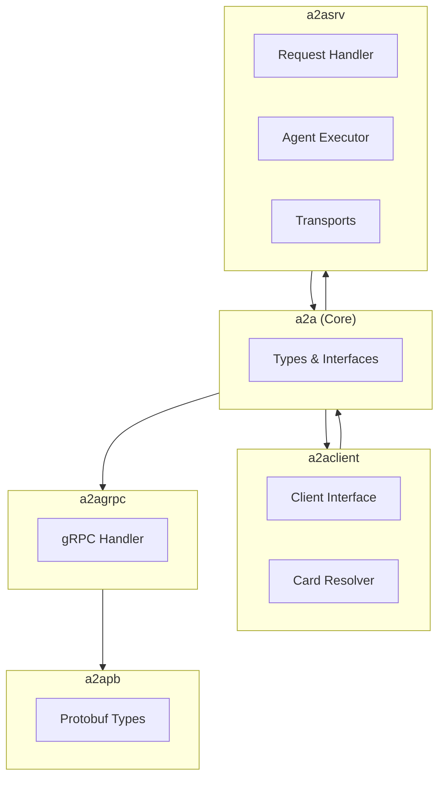
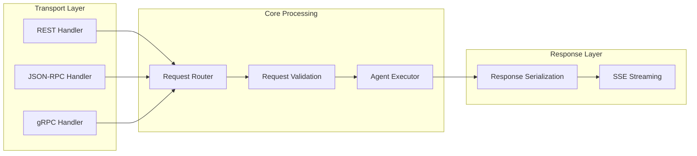

# Project Exploration: A2A Go SDK

## Overview

The A2A Go SDK (`a2a-go`) provides idiomatic Go bindings for the Agent2Agent (A2A) Protocol v1.0. It enables Go developers to build A2A-compliant agents (servers) and connect to remote agents (clients) with full support for gRPC, REST, and JSON-RPC transports.

## Repository

- **Location:** `/home/darkvoid/Boxxed/@formulas/src.rust/src.llamacpp/src.protocols/a2a-go`
- **Remote:** `git@github.com:a2aproject/a2a-go.git`
- **Primary Language:** Go 1.24+
- **License:** Apache License 2.0
- **Module:** `github.com/a2aproject/a2a-go/v2`

## Directory Structure

```
a2a-go/
├── a2a/                         # Core protocol types
│   ├── message.go               # Message types and parts
│   ├── task.go                  # Task and state definitions
│   ├── agent_card.go            # AgentCard types
│   ├── events.go                # Streaming events
│   ├── json.go                  # JSON (de)serialization
│   └── version.go               # Protocol version constant
│
├── a2aclient/                   # Client SDK
│   ├── client.go                # Main client interface
│   ├── factory.go               # Client factory (from AgentCard)
│   ├── resolver.go              # AgentCard resolution
│   └── options.go               # Client configuration
│
├── a2asrv/                      # Server SDK
│   ├── handler.go               # Request handler
│   ├── agent_executor.go        # Agent execution interface
│   ├── jsonrpc_handler.go       # JSON-RPC transport
│   ├── rest_handler.go          # REST transport
│   ├── sse.go                   # Server-Sent Events
│   └── options.go               # Server configuration
│
├── a2agrpc/                     # gRPC transport
│   ├── handler.go               # gRPC request handler
│   └── a2a.pb.go                # Generated protobuf types
│
├── a2apb/                       # Protocol buffers
│   └── a2a.proto                # Protobuf definitions
│
├── a2aext/                      # Extensions
│   └── ...                      # Extension points
│
├── a2acompat/                   # Compatibility layer
│   └── ...                      # Backward compatibility
│
├── examples/
│   └── helloworld/              # Basic echo agent example
│       ├── main.go
│       └── README.md
│
├── .agent/                      # Agent configuration
├── AGENTS.md                    # Agent usage guide
├── buf.gen.yaml                 # Protocol buffer generation
├── CHANGELOG.md                 # Version history
├── CONTRIBUTING.md              # Contribution guidelines
├── LICENSE                      # Apache 2.0
├── go.mod                       # Go module definition
├── go.sum                       # Dependency checksums
└── README.md                    # Project overview
```

## Architecture

### Package Dependencies



### Server Request Flow



## Component Breakdown

### Core Types (`a2a/`)

#### Message Types

```go
package a2a

type Message struct {
    Role     MessageRole `json:"role"`
    Parts    []Part      `json:"parts"`
    Metadata Metadata    `json:"metadata,omitempty"`
}

type MessageRole string

const (
    MessageRoleUser   MessageRole = "user"
    MessageRoleAgent  MessageRole = "agent"
    MessageRoleSystem MessageRole = "system"
)

type Part interface {
    isPart()
}

type TextPart struct {
    Type string `json:"type"`
    Text string `json:"text"`
}

type FilePart struct {
    Type     string `json:"type"`
    Name     string `json:"name,omitempty"`
    MIMEType string `json:"mimeType,omitempty"`
    Bytes    string `json:"bytes,omitempty"`
    URI      string `json:"uri,omitempty"`
}

type DataPart struct {
    Type string                 `json:"type"`
    Data map[string]interface{} `json:"data"`
}
```

#### Task Types

```go
type Task struct {
    ID        string       `json:"id"`
    SessionID string       `json:"sessionId,omitempty"`
    Status    TaskStatus   `json:"status"`
    Artifacts []Artifact   `json:"artifacts,omitempty"`
    History   []Message    `json:"history,omitempty"`
    Metadata  Metadata     `json:"metadata,omitempty"`
    Version   int          `json:"version,omitempty"`
}

type TaskState string

const (
    TaskStateSubmitted          TaskState = "submitted"
    TaskStateWorking            TaskState = "working"
    TaskStateRequiresUserInput TaskState = "requires_user_input"
    TaskStateCompleted          TaskState = "completed"
    TaskStateCanceled           TaskState = "canceled"
    TaskStateFailed             TaskState = "failed"
    TaskStateRejected           TaskState = "rejected"
)

type TaskStatus struct {
    State     TaskState `json:"state"`
    Message   string    `json:"message,omitempty"`
    Timestamp time.Time `json:"timestamp"`
}
```

#### AgentCard

```go
type AgentCard struct {
    Name           string             `json:"name"`
    Description    string             `json:"description,omitempty"`
    URL            string             `json:"url"`
    Version        string             `json:"version"`
    Capabilities   []string           `json:"capabilities"`
    Authentication *Authentication    `json:"authentication,omitempty"`
    Provider       *Provider          `json:"provider,omitempty"`
    Endpoints      []Endpoint         `json:"endpoints"`
    DocumentationURL string           `json:"documentationUrl,omitempty"`
}

type Authentication struct {
    Schemes     []string `json:"schemes"`
    Credentials string   `json:"credentials,omitempty"`
}

type Endpoint struct {
    URI       string `json:"uri"`
    Transport string `json:"transport"` // "jsonrpc", "rest", "grpc"
}
```

### Client Package (`a2aclient/`)

#### Client Interface

```go
type Client interface {
    // GetAgentCard retrieves the agent's capability card
    GetAgentCard(ctx context.Context) (*AgentCard, error)

    // SendMessage sends a single message and returns response
    SendMessage(ctx context.Context, req *SendMessageRequest) (*SendMessageResponse, error)

    // SendMessageStream sends a message and streams responses
    SendMessageStream(ctx context.Context, req *SendMessageRequest) (<-chan StreamEvent, error)

    // SendTaskMessage sends a message to an existing task
    SendTaskMessage(ctx context.Context, req *SendTaskMessageRequest) (*SendTaskMessageResponse, error)

    // StreamTask streams updates for a task
    StreamTask(ctx context.Context, req *StreamTaskRequest) (<-chan StreamEvent, error)

    // ResubscribeTask reconnects to a task stream
    ResubscribeTask(ctx context.Context, req *ResubscribeTaskRequest) (*ResubscribeTaskResponse, error)

    Close() error
}
```

#### AgentCard Resolver

```go
type Resolver interface {
    Resolve(ctx context.Context) (*AgentCard, error)
}

type DefaultResolver struct {
    BaseURL    string
    HTTPClient *http.Client
}

func (r *DefaultResolver) Resolve(ctx context.Context) (*AgentCard, error) {
    // Try well-known endpoints in order:
    // 1. /.well-known/a2a
    // 2. /agent.json
    // 3. /a2a/card
}
```

#### Client Factory

```go
func NewFromCard(ctx context.Context, card *AgentCard, opts ...FactoryOption) (Client, error) {
    // Auto-detect transport from AgentCard
    // Create appropriate client implementation
}

func NewClient(baseURL string, opts ...FactoryOption) (Client, error) {
    // Direct client creation with known URL
}
```

### Server Package (`a2asrv/`)

#### Request Handler

```go
type RequestHandler struct {
    agentExecutor AgentExecutor
    card          *AgentCard
    options       *HandlerOptions
}

type AgentExecutor interface {
    Execute(ctx context.Context, req *Request) (*Response, error)
}

func NewHandler(executor AgentExecutor, opts ...RequestHandlerOption) *RequestHandler {
    return &RequestHandler{
        agentExecutor: executor,
        options:       defaultOptions(opts),
    }
}

func (h *RequestHandler) HandleMessage(ctx context.Context, msg *jsonrpc.Message) (*jsonrpc.Response, error) {
    // Route to appropriate method handler
    // Validate request
    // Execute agent
    // Return response
}
```

#### JSON-RPC Handler

```go
type JSONRPCHandler struct {
    requestHandler *RequestHandler
}

func (h *JSONRPCHandler) ServeHTTP(w http.ResponseWriter, r *http.Request) {
    // Parse JSON-RPC request
    // Handle method dispatch
    // Write response
}

func (h *JSONRPCHandler) HandleStream(w http.ResponseWriter, r *http.Request) {
    // Set up SSE headers
    // Stream events as they arrive
}
```

#### REST Handler

```go
type RESTHandler struct {
    requestHandler *RequestHandler
    router         *http.ServeMux
}

func NewRESTHandler(handler *RequestHandler) *RESTHandler {
    h := &RESTHandler{requestHandler: handler}
    h.setupRoutes()
    return h
}

func (h *RESTHandler) setupRoutes() {
    h.router.HandleFunc("/a2a/v1/card", h.handleGetCard)
    h.router.HandleFunc("/a2a/v1/message/send", h.handleSendMessage)
    h.router.HandleFunc("/a2a/v1/message/stream", h.handleStreamMessage)
    h.router.HandleFunc("/a2a/v1/task/send", h.handleSendTask)
    h.router.HandleFunc("/a2a/v1/task/stream", h.handleStreamTask)
}
```

#### SSE Streaming

```go
type SSEStream struct {
    writer    http.ResponseWriter
    flusher   http.Flusher
    ctx       context.Context
    done      chan struct{}
}

func (s *SSEStream) Send(event StreamEvent) error {
    data, _ := json.Marshal(event)
    fmt.Fprintf(s.writer, "event: message\ndata: %s\n\n", data)
    s.flusher.Flush()
    return nil
}

func (s *SSEStream) Close() {
    close(s.done)
}
```

### gRPC Package (`a2agrpc/`)

#### Protocol Buffer Definitions

```protobuf
syntax = "proto3";
package a2a;

service A2AService {
  rpc GetAgentCard(GetAgentCardRequest) returns (AgentCard);
  rpc SendMessage(SendMessageRequest) returns (SendMessageResponse);
  rpc SendMessageStream(SendMessageRequest) returns (stream StreamEvent);
  rpc SendTaskMessage(SendTaskMessageRequest) returns (SendTaskMessageResponse);
  rpc StreamTask(StreamTaskRequest) returns (stream StreamEvent);
}

message Message {
  MessageRole role = 1;
  repeated Part parts = 2;
  map<string, string> metadata = 3;
}

enum MessageRole {
  MESSAGE_ROLE_UNSPECIFIED = 0;
  MESSAGE_ROLE_USER = 1;
  MESSAGE_ROLE_AGENT = 2;
  MESSAGE_ROLE_SYSTEM = 3;
}
```

#### gRPC Handler

```go
type Handler struct {
    requestHandler *a2asrv.RequestHandler
}

func (h *Handler) SendMessage(ctx context.Context, req *pb.SendMessageRequest) (*pb.SendMessageResponse, error) {
    // Convert protobuf to internal types
    // Delegate to request handler
    // Convert response to protobuf
}

func (h *Handler) SendMessageStream(req *pb.SendMessageRequest, stream pb.A2AService_SendMessageStreamServer) error {
    // Set up streaming
    // Send events as they arrive
}

func (h *Handler) RegisterWith(server *grpc.Server) {
    pb.RegisterA2AServiceServer(server, h)
}
```

## Entry Points

### Server Example (helloworld)

```go
package main

import (
    "context"
    "log"
    "net/http"

    "github.com/a2aproject/a2a-go/v2/a2a"
    "github.com/a2aproject/a2a-go/v2/a2asrv"
)

// EchoAgent implements AgentExecutor
type EchoAgent struct{}

func (e *EchoAgent) Execute(ctx context.Context, req *a2asrv.Request) (*a2asrv.Response, error) {
    // Extract last message
    lastMsg := req.Messages[len(req.Messages)-1]

    // Process and create response
    responseText := "Echo: " + lastMsg.Parts[0].Text
    return &a2asrv.Response{
        Messages: []a2a.Message{{
            Role:  a2a.MessageRoleAgent,
            Parts: []a2a.Part{a2a.NewTextPart(responseText)},
        }},
    }, nil
}

func main() {
    agent := &EchoAgent{}

    handler := a2asrv.NewHandler(agent,
        a2asrv.WithAgentCard(&a2a.AgentCard{
            Name:        "Echo Agent",
            Description: "Echoes back received messages",
            URL:         "http://localhost:8080",
            Version:     "1.0.0",
            Capabilities: []string{"echo"},
        }),
    )

    // JSON-RPC over HTTP
    jsonrpcHandler := a2asrv.NewJSONRPCHandler(handler)
    http.Handle("/a2a", jsonrpcHandler)

    // REST API
    restHandler := a2asrv.NewRESTHandler(handler)
    http.Handle("/a2a/v1/", restHandler)

    log.Println("Starting A2A server on :8080")
    log.Fatal(http.ListenAndServe(":8080", nil))
}
```

### Client Example

```go
package main

import (
    "context"
    "fmt"
    "log"

    "github.com/a2aproject/a2a-go/v2/a2a"
    "github.com/a2aproject/a2a-go/v2/a2aclient"
)

func main() {
    ctx := context.Background()

    // Resolve agent card
    resolver := a2aclient.DefaultResolver{BaseURL: "http://localhost:8080"}
    card, err := resolver.Resolve(ctx)
    if err != nil {
        log.Fatal(err)
    }
    fmt.Printf("Found agent: %s\n", card.Name)

    // Create client from card
    client, err := a2aclient.NewFromCard(ctx, card)
    if err != nil {
        log.Fatal(err)
    }
    defer client.Close()

    // Send message
    msg := a2a.NewMessage(a2a.MessageRoleUser, a2a.NewTextPart("Hello!"))
    resp, err := client.SendMessage(ctx, &a2a.SendMessageRequest{
        Message: msg,
    })
    if err != nil {
        log.Fatal(err)
    }

    fmt.Printf("Response: %v\n", resp.Result.Message)
}
```

## External Dependencies

| Dependency | Version | Purpose |
|------------|---------|---------|
| `google.golang.org/grpc` | ^1.73 | gRPC transport |
| `google.golang.org/protobuf` | ^1.36 | Protocol buffers |
| `github.com/gorilla/rpc/v2` | | JSON-RPC implementation |
| `go.uber.org/zap` | ^1.27 | Structured logging |
| `github.com/stretchr/testify` | ^1.10 | Testing utilities |

## Configuration

### Handler Options

```go
handler := a2asrv.NewHandler(agent,
    a2asrv.WithAgentCard(card),
    a2asrv.WithRateLimiter(limiter),
    a2asrv.WithAuthMiddleware(authMiddleware),
    a2asrv.WithMaxMessageSize(1024 * 1024), // 1MB
    a2asrv.WithStreamTimeout(5 * time.Minute),
)
```

### Client Options

```go
client, err := a2aclient.NewClient("http://localhost:8080",
    a2aclient.WithAPIKey("secret-key"),
    a2aclient.WithTimeout(30 * time.Second),
    a2aclient.WithMaxRetries(3),
    a2aclient.WithHTTPClient(customHTTPClient),
)
```

## Testing

### Test Structure

- **Unit Tests:** `_test.go` files alongside source
- **Integration Tests:** `tests/integration/` with test server
- **Conformance Tests:** Against A2A specification

### Running Tests

```bash
# All tests
go test ./...

# With coverage
go test -cover ./...

# Specific package
go test ./a2aclient/

# Integration tests
go test ./tests/integration/
```

### Test Example

```go
func TestSendMessage(t *testing.T) {
    agent := &EchoAgent{}
    handler := a2asrv.NewHandler(agent)

    req := &a2a.SendMessageRequest{
        Message: a2a.Message{
            Role:  a2a.MessageRoleUser,
            Parts: []a2a.Part{a2a.NewTextPart("test")},
        },
    }

    resp, err := handler.HandleMessage(context.Background(), req)
    assert.NoError(t, err)
    assert.Equal(t, "Echo: test", resp.Result.Message.Parts[0].Text)
}
```

## Key Insights

1. **Transport Agnosticism:** The SDK cleanly separates protocol logic from transport implementation, enabling gRPC, REST, and JSON-RPC from the same core

2. **Idiomatic Go:** Uses Go conventions (context, interfaces, functional options) rather than forcing patterns from other language SDKs

3. **Agent Executor Pattern:** Clean interface for plugging in any agent implementation

4. **Well-Known Discovery:** Multiple fallback endpoints for AgentCard discovery ensures compatibility

5. **Streaming First:** SSE streaming is first-class, not an afterthought

6. **Protobuf Source of Truth:** Protocol buffers define the wire format, with Go types generated

## Open Questions

1. **Extension Mechanism:** How are custom extensions registered and negotiated?

2. **Error Standardization:** What application-level error codes beyond JSON-RPC standards?

3. **Authentication Middleware:** What standard auth middleware implementations exist?

4. **Rate Limiting:** Is there a standard rate limiting implementation?
