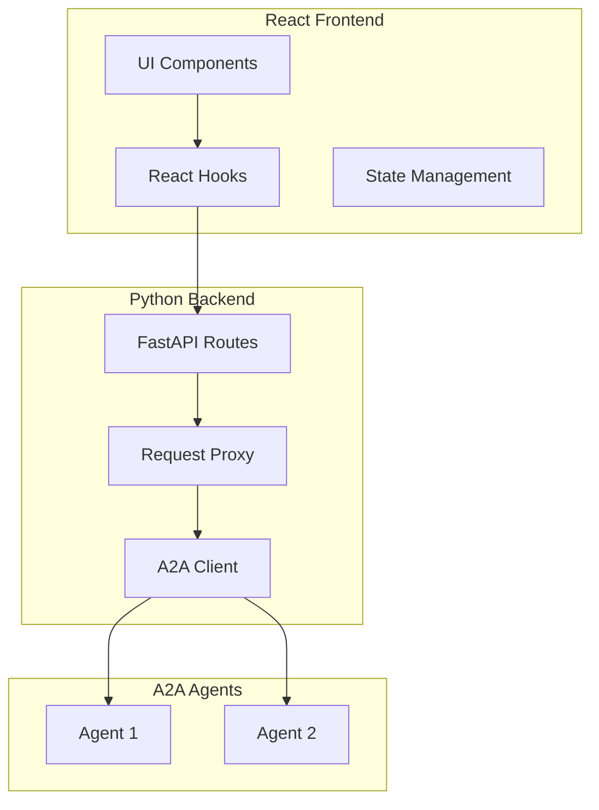

# Project Exploration: A2A Inspector

## Overview

A2A Inspector is a UI tool for inspecting, debugging, and testing A2A-compliant agents. It provides a visual interface for discovering agent capabilities, sending messages, viewing task state, and streaming responses in real-time.

## Repository

- **Location:** `/home/darkvoid/Boxxed/@formulas/src.rust/src.llamacpp/src.protocols/a2a-inspector`
- **Remote:** `git@github.com:a2aproject/a2a-inspector.git`
- **Languages:** TypeScript (frontend), Python (backend)
- **License:** Apache License 2.0

## Directory Structure

```
a2a-inspector/
├── backend/                     # Python FastAPI backend
│   ├── main.py                  # FastAPI application
│   ├── routes/                  # API routes
│   │   ├── agent.py             # Agent card routes
│   │   ├── message.py           # Message proxy routes
│   │   └── task.py              # Task management
│   ├── services/                # Business logic
│   │   ├── a2a_client.py        # A2A client wrapper
│   │   └── proxy.py             # Request proxy
│   ├── models/                  # Pydantic models
│   └── Dockerfile               # Container image
│
├── frontend/                    # React/TypeScript frontend
│   ├── src/
│   │   ├── App.tsx              # Root component
│   │   ├── components/          # UI components
│   │   │   ├── AgentCard.tsx    # Agent card display
│   │   │   ├── MessageList.tsx  # Message history
│   │   │   ├── TaskView.tsx     # Task state viewer
│   │   │   └── StreamView.tsx   # SSE stream display
│   │   ├── hooks/               # React hooks
│   │   │   ├── useA2AClient.ts  # A2A client hook
│   │   │   └── useStream.ts     # SSE stream hook
│   │   └── types/               # TypeScript types
│   ├── package.json
│   └── vite.config.ts
│
├── Dockerfile                   # Multi-stage build
├── .dockerignore
├── .gitignore
├── .mypy.ini                    # Python type checking
├── .jscpd.json                  # Copy-paste detection
├── LICENSE
├── README.md
└── CODE_OF_CONDUCT.md
```

## Architecture

### High-Level Architecture



## Key Components

### Backend (FastAPI)

```python
# backend/main.py
from fastapi import FastAPI
from fastapi.middleware.cors import CORSMiddleware

app = FastAPI(title="A2A Inspector Backend")

app.add_middleware(
    CORSMiddleware,
    allow_origins=["*"],  # Dev only
    allow_credentials=True,
    allow_methods=["*"],
    allow_headers=["*"],
)

@app.get("/api/agent/card")
async def get_agent_card(url: str):
    """Fetch agent card from well-known endpoint"""
    return await fetch_agent_card(url)

@app.post("/api/message/send")
async def send_message(request: SendMessageRequest):
    """Send message to agent and return response"""
    return await a2a_client.send_message(request)

@app.get("/api/message/stream")
async def stream_message(request: SendMessageRequest):
    """Stream messages via SSE"""
    return StreamingResponse(
        a2a_client.stream(request),
        media_type="text/event-stream"
    )
```

### Frontend Components

#### Agent Card Display

```tsx
// frontend/src/components/AgentCard.tsx
interface AgentCardProps {
  card: AgentCard;
}

export function AgentCard({ card }: AgentCardProps) {
  return (
    <div className="agent-card">
      <h2>{card.name}</h2>
      <p>{card.description}</p>
      <div className="capabilities">
        {card.capabilities.map(cap => (
          <span key={cap} className="badge">{cap}</span>
        ))}
      </div>
      <div className="endpoints">
        {card.endpoints.map(ep => (
          <div key={ep.uri}>
            {ep.transport}: {ep.uri}
          </div>
        ))}
      </div>
    </div>
  );
}
```

#### Stream View

```tsx
// frontend/src/components/StreamView.tsx
export function StreamView({ stream }: { stream: AsyncIterator<Message> }) {
  const [messages, setMessages] = useState<Message[]>([]);

  useEffect(() => {
    const consume = async () => {
      for await (const message of stream) {
        setMessages(prev => [...prev, message]);
      }
    };
    consume();
  }, [stream]);

  return (
    <div className="stream-view">
      {messages.map((msg, i) => (
        <Message key={i} message={msg} />
      ))}
    </div>
  );
}
```

## Usage

### Running Locally

```bash
# Backend
cd backend
pip install -r requirements.txt
uvicorn main:app --reload

# Frontend
cd frontend
npm install
npm run dev
```

### Docker Deployment

```bash
docker build -t a2a-inspector .
docker run -p 3000:3000 a2a-inspector
```

## Key Features

1. **Agent Discovery:** Enter agent URL to fetch and display AgentCard
2. **Message Testing:** Send messages and view responses
3. **Stream Debugging:** Real-time SSE stream visualization
4. **Task State:** View task lifecycle and state transitions
5. **History:** Review conversation history
6. **Multi-Agent:** Connect to multiple agents simultaneously

## Dependencies

### Backend
| Dependency | Purpose |
|------------|---------|
| fastapi | Web framework |
| uvicorn | ASGI server |
| httpx | Async HTTP client |
| pydantic | Data validation |
| sse-starlette | Server-Sent Events |

### Frontend
| Dependency | Purpose |
|------------|---------|
| react | UI framework |
| vite | Build tool |
| typescript | Type system |
| @tanstack/react-query | Data fetching |

## Open Questions

1. **Authentication:** How to handle agents requiring auth?
2. **Persistence:** Should sessions be persisted?
3. **Export:** Should conversations be exportable?
