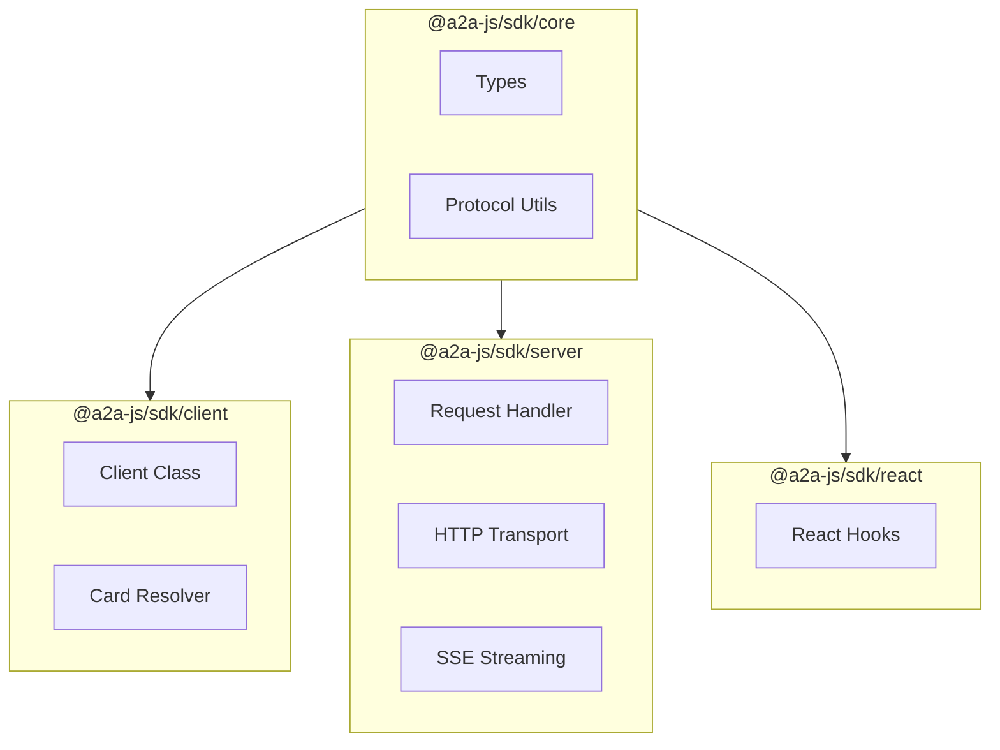

# Project Exploration: A2A JavaScript SDK

## Overview

The A2A JavaScript/TypeScript SDK provides idiomatic bindings for the Agent2Agent (A2A) Protocol, enabling JavaScript developers to build A2A-compliant agents (servers) and connect to remote agents (clients) in Node.js, browsers, and edge runtimes.

## Repository

- **Location:** `/home/darkvoid/Boxxed/@formulas/src.rust/src.llamacpp/src.protocols/a2a-js`
- **Remote:** `git@github.com:a2aproject/a2a-js.git`
- **Primary Language:** TypeScript
- **License:** Apache License 2.0
- **Package:** `@a2a-js/sdk` on npm

## Directory Structure

```
a2a-js/
├── src/
│   ├── index.ts                 # Root exports
│   │
│   ├── client/                  # Client SDK
│   │   ├── index.ts
│   │   ├── client.ts            # A2AClient class
│   │   ├── resolver.ts          # AgentCard resolver
│   │   └── stream.ts            # SSE stream handler
│   │
│   ├── server/                  # Server SDK
│   │   ├── index.ts
│   │   ├── handler.ts           # Request handler
│   │   ├── agent-executor.ts    # AgentExecutor interface
│   │   └── transports/
│   │       ├── http.ts          # HTTP transport
│   │       ├── sse.ts           # SSE streaming
│   │       └── jsonrpc.ts       # JSON-RPC handler
│   │
│   ├── types/                   # TypeScript types
│   │   ├── index.ts
│   │   ├── agent-card.ts
│   │   ├── message.ts
│   │   ├── task.ts
│   │   └── events.ts
│   │
│   ├── protocol/                # Protocol utilities
│   │   ├── jsonrpc.ts           # JSON-RPC 2.0
│   │   └── state-machine.ts     # Task state
│   │
│   ├── utils/                   # Utilities
│   │   ├── fetch.ts             # Fetch wrapper
│   │   └── events.ts            # Event helpers
│   │
│   └── samples/                 # Usage examples
│       ├── echo-agent.ts
│       └── chat-agent.ts
│
├── .betterer.ts                 # Progressive linting
├── .betterer.results
├── eslint.config.mjs            # ESLint config
├── package.json
├── tsconfig.json
├── CHANGELOG.md
├── LICENSE
└── README.md
```

## Architecture

### Package Structure



## Key Components

### Client

```typescript
// src/client/client.ts
export class A2AClient {
  constructor(
    baseURL: string,
    options?: ClientOptions
  );

  async getAgentCard(): Promise<AgentCard>;

  async sendMessage(message: Message): Promise<Message>;

  async sendMessageStream(
    message: Message
  ): AsyncIterableIterator<Message>;

  async createTask(message: Message): Promise<Task>;

  async sendTaskMessage(
    taskId: string,
    message: Message
  ): Promise<Task>;

  async streamTask(
    taskId: string
  ): AsyncIterableIterator<TaskEvent>;

  async resubscribeTask(
    taskId: string,
    lastEventId?: string
  ): Promise<Task>;

  close(): void;
}
```

### Server

```typescript
// src/server/handler.ts
export class RequestHandler {
  constructor(
    executor: AgentExecutor,
    options?: HandlerOptions
  );

  handleRequest(request: A2ARequest): Promise<A2AResponse>;

  serveHTTP(): (req: Request, res: Response) => void;
}

export interface AgentExecutor {
  execute(
    messages: Message[],
    context: ExecutionContext
  ): Promise<Message[]>;
}
```

### Types

```typescript
// src/types/message.ts
export interface Message {
  role: "user" | "agent" | "system";
  parts: MessagePart[];
  metadata?: Record<string, unknown>;
}

export type MessagePart =
  | TextPart
  | FilePart
  | DataPart
  | FunctionCallPart
  | FunctionResultPart;

export interface TextPart {
  type: "text";
  text: string;
}

export interface FilePart {
  type: "file";
  name?: string;
  mimeType?: string;
  bytes?: string;
  uri?: string;
}
```

## Entry Points

### Client Usage

```typescript
import { A2AClient } from "@a2a-js/sdk/client";

const client = new A2AClient("http://localhost:8080");

// Get agent capabilities
const card = await client.getAgentCard();
console.log(`Connected to: ${card.name}`);

// Send message
const response = await client.sendMessage({
  role: "user",
  parts: [{ type: "text", text: "Hello!" }],
});

console.log(response.parts[0].text);

// Stream response
for await (const event of client.sendMessageStream({
  role: "user",
  parts: [{ type: "text", text: "Tell me a story" }],
})) {
  console.log(event.parts[0]?.text);
}
```

### Server Usage

```typescript
import { RequestHandler } from "@a2a-js/sdk/server";
import { createServer } from "http";

class EchoAgent {
  async execute(messages: Message[]) {
    const lastMessage = messages[messages.length - 1];
    const text = lastMessage.parts.find(p => p.type === "text")?.text;

    return [{
      role: "agent",
      parts: [{ type: "text", text: `Echo: ${text}` }],
    }];
  }
}

const handler = new RequestHandler(new EchoAgent(), {
  agentCard: {
    name: "Echo Agent",
    url: "http://localhost:8080",
    version: "1.0.0",
    capabilities: ["echo"],
  },
});

const server = createServer(handler.serveHTTP());
server.listen(8080);
```

## Dependencies

| Dependency | Purpose |
|------------|---------|
| zod | Runtime validation |
| eventsource-parser | SSE parsing |
| express | HTTP server (optional) |

## Features

1. **Full A2A v1.0 Compliance:** All protocol methods implemented
2. **Streaming Support:** SSE with automatic reconnection
3. **TypeScript First:** Full type inference from protocol
4. **Framework Agnostic:** Works with any HTTP framework
5. **Edge Compatible:** Runs on Cloudflare Workers, Vercel Edge
6. **React Hooks:** Optional `@a2a-js/sdk/react` package

## Open Questions

1. **React Package:** Is there a separate React hooks package?
2. **Browser Polyfills:** What browser APIs are required?
3. **Authentication:** How are API keys handled?
