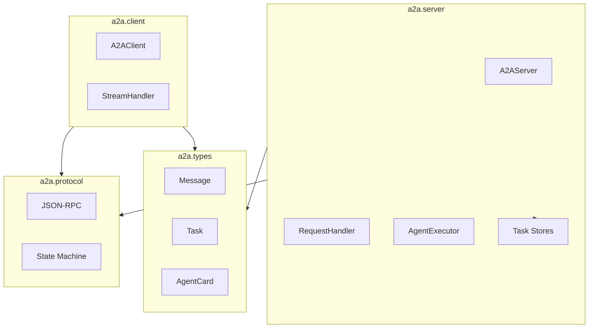

# Project Exploration: A2A Python SDK

## Overview

The A2A Python SDK is the reference implementation for the Agent2Agent (A2A) Protocol. It provides comprehensive bindings for building A2A-compliant agents (servers) and clients, with full support for streaming, task management, and all protocol features.

## Repository

- **Location:** `/home/darkvoid/Boxxed/@formulas/src.rust/src.llamacpp/src.protocols/a2a-python`
- **Remote:** `git@github.com:a2aproject/a2a-python.git`
- **Primary Language:** Python 3.11+
- **License:** Apache License 2.0
- **Package:** `a2a-sdk` on PyPI

## Directory Structure

```
a2a-python/
├── a2a/                         # Main package
│   ├── __init__.py              # Root exports
│   ├── version.py               # SDK version
│   │
│   ├── client/                  # Client SDK
│   │   ├── __init__.py
│   │   ├── client.py            # A2AClient class
│   │   ├── http_client.py       # HTTP transport
│   │   ├── stream.py            # SSE stream handler
│   │   └── resolver.py          # AgentCard resolver
│   │
│   ├── server/                  # Server SDK
│   │   ├── __init__.py
│   │   ├── server.py            # A2AServer class
│   │   ├── handler.py           # Request handler
│   │   ├── agent_executor.py    # AgentExecutor interface
│   │   ├── card.py              # AgentCard serving
│   │   └── transports/
│   │       ├── http.py          # HTTP transport
│   │       ├── sse.py           # SSE streaming
│   │       └── jsonrpc.py       # JSON-RPC handler
│   │
│   ├── types/                   # Generated types
│   │   ├── __init__.py
│   │   ├── agent_card.py
│   │   ├── message.py
│   │   ├── task.py
│   │   ├── events.py
│   │   └── errors.py
│   │
│   ├── protocol/                # Protocol utilities
│   │   ├── __init__.py
│   │   ├── jsonrpc.py           # JSON-RPC 2.0
│   │   ├── state_machine.py     # Task state machine
│   │   └── validation.py        # Request validation
│   │
│   ├── utils/                   # Utilities
│   │   ├── __init__.py
│   │   ├── logging.py
│   │   └── helpers.py
│   │
│   └── stores/                  # Task storage backends
│       ├── __init__.py
│       ├── base.py              # Base store interface
│       ├── memory.py            # In-memory store
│       └── redis.py             # Redis store (optional)
│
├── tests/                       # Test suite
│   ├── unit/                    # Unit tests
│   ├── integration/             # Integration tests
│   └── conftest.py              # Pytest fixtures
│
├── examples/                    # Usage examples
│   ├── echo_agent.py
│   ├── chat_agent.py
│   ├── streaming_agent.py
│   └── task_agent.py
│
├── docs/                        # Sphinx documentation
│   ├── sdk/
│   └── api/
│
├── .gemini/                     # Gemini config
├── .ruff.toml                   # Python linting
├── GEMINI.md                    # Gemini instructions
├── AGENTS.md                    # Agent usage
├── pyproject.toml               # Package configuration
├── CHANGELOG.md                 # Version history
├── LICENSE                      # Apache 2.0
└── README.md                    # Project overview
```

## Architecture

### Package Architecture



### Task State Machine

```python
# a2a/protocol/state_machine.py
class TaskState(Enum):
    SUBMITTED = "submitted"
    WORKING = "working"
    REQUIRES_USER_INPUT = "requires_user_input"
    COMPLETED = "completed"
    CANCELED = "canceled"
    FAILED = "failed"
    REJECTED = "rejected"

class TaskStateMachine:
    VALID_TRANSITIONS = {
        TaskState.SUBMITTED: [TaskState.WORKING, TaskState.REJECTED],
        TaskState.WORKING: [
            TaskState.REQUIRES_USER_INPUT,
            TaskState.COMPLETED,
            TaskState.CANCELED,
            TaskState.FAILED,
        ],
        TaskState.REQUIRES_USER_INPUT: [TaskState.WORKING, TaskState.CANCELED],
        TaskState.COMPLETED: [],
        TaskState.CANCELED: [],
        TaskState.FAILED: [],
        TaskState.REJECTED: [],
    }
```

## Key Components

### Client

```python
# a2a/client/client.py
class A2AClient:
    def __init__(
        self,
        base_url: str,
        api_key: str | None = None,
        timeout: float = 30.0,
        max_retries: int = 3,
    ): ...

    async def get_agent_card(self) -> AgentCard: ...

    async def send_message(self, message: Message) -> Message: ...

    async def send_message_stream(
        self, message: Message
    ) -> AsyncIterator[Message]: ...

    async def create_task(self, message: Message) -> Task: ...

    async def send_task_message(
        self, task_id: str, message: Message
    ) -> Task: ...

    async def stream_task(
        self, task_id: str
    ) -> AsyncIterator[TaskEvent]: ...

    async def resubscribe_task(
        self, task_id: str, last_event_id: str | None = None
    ) -> Task: ...

    async def close(self): ...
```

### Server

```python
# a2a/server/server.py
class A2AServer:
    def __init__(
        self,
        handler: RequestHandler,
        host: str = "0.0.0.0",
        port: int = 8080,
        ssl_certfile: str | None = None,
        ssl_keyfile: str | None = None,
    ): ...

    async def serve(self): ...

    async def stop(self): ...

# a2a/server/handler.py
class RequestHandler:
    def __init__(
        self,
        agent_executor: AgentExecutor,
        agent_card: dict | None = None,
        task_store: TaskStore | None = None,
        options: HandlerOptions | None = None,
    ): ...

    async def handle_request(self, request: dict) -> dict: ...
```

### Agent Executor

```python
# a2a/server/agent_executor.py
class AgentExecutor(Protocol):
    async def execute(
        self,
        messages: list[Message],
        context: ExecutionContext,
    ) -> list[Message]:
        """Execute agent logic and return response messages."""
        ...

class SimpleAgentExecutor:
    def __init__(self, agent: Callable):
        self.agent = agent

    async def execute(
        self,
        messages: list[Message],
        context: ExecutionContext,
    ) -> list[Message]:
        result = await self.agent(messages, context)
        return result.to_messages()
```

## Entry Points

### Client Example

```python
import asyncio
from a2a.client import A2AClient
from a2a.types import Message, TextPart

async def main():
    client = A2AClient("http://localhost:8080")

    # Get agent card
    card = await client.get_agent_card()
    print(f"Connected to: {card.name}")

    # Send message
    message = Message(
        role="user",
        parts=[TextPart(text="What is the weather in Tokyo?")]
    )

    response = await client.send_message(message)
    print(response.parts[0].text)

    # Stream response
    async for event in client.send_message_stream(Message(
        role="user",
        parts=[TextPart(text="Tell me a story")]
    )):
        if event.parts:
            print(event.parts[0].text)

    await client.close()

asyncio.run(main())
```

### Server Example

```python
import asyncio
from a2a.server import A2AServer, RequestHandler
from a2a.types import Message, TextPart
from a2a.server.agent_executor import AgentExecutor

class EchoAgent:
    async def execute(self, messages: list[Message], context):
        last_msg = messages[-1]
        text = next(p.text for p in last_msg.parts if p.type == "text")
        return [Message(
            role="agent",
            parts=[TextPart(text=f"Echo: {text}")]
        )]

async def main():
    handler = RequestHandler(
        agent_executor=EchoAgent(),
        agent_card={
            "name": "Echo Agent",
            "description": "Echoes messages",
            "url": "http://localhost:8080",
            "version": "1.0.0",
            "capabilities": ["echo"],
        },
    )

    server = A2AServer(handler, host="0.0.0.0", port=8080)
    await server.serve()

asyncio.run(main())
```

## Dependencies

| Dependency | Version | Purpose |
|------------|---------|---------|
| httpx | ^0.28 | Async HTTP client |
| pydantic | ^2.0 | Data validation |
| anyio | ^4.0 | Async abstractions |
| starlette | ^0.41 | ASGI framework |
| sse-starlette | ^2.0 | SSE streaming |
| pytest | ^8.0 | Testing |
| pytest-asyncio | ^0.24 | Async testing |

## Testing

### Running Tests

```bash
# Install dev dependencies
pip install -e ".[dev]"

# Run all tests
pytest tests/

# Run unit tests
pytest tests/unit/

# Run integration tests
pytest tests/integration/

# With coverage
pytest --cov=a2a tests/
```

### Test Example

```python
# tests/test_client.py
@pytest.mark.asyncio
async def test_send_message(test_server):
    client = A2AClient(test_server.url)

    response = await client.send_message(Message(
        role="user",
        parts=[TextPart(text="test")]
    ))

    assert response.role == "agent"
    assert "test" in response.parts[0].text

    await client.close()
```

## Features

1. **Full Protocol Implementation:** All A2A methods supported
2. **Async First:** Built on asyncio and anyio
3. **Multiple Storage Backends:** Memory, Redis for task persistence
4. **SSE Streaming:** Full-duplex streaming with reconnection
5. **Type Hints:** Complete type hints for IDE support
6. **Pydantic Models:** Runtime validation of all types

## Open Questions

1. **WebSocket Support:** Is WebSocket transport planned?
2. **Authentication:** What auth mechanisms are supported?
3. **Rate Limiting:** Is there built-in rate limiting?
