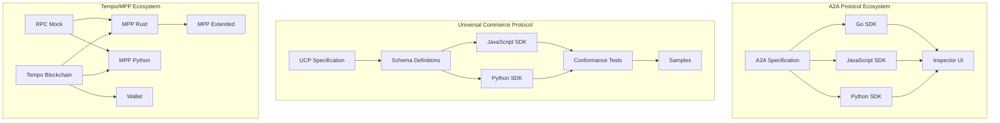

# Protocols Ecosystem Exploration

## Overview

The `src.protocols` directory contains a curated collection of protocol implementations and SDKs spanning three major protocol ecosystems:

1. **A2A (Agent-to-Agent) Protocol** - An open protocol enabling communication and interoperability between AI agents built on different frameworks
2. **Universal Commerce Protocol (UCP)** - A standardized language for commerce entities (platforms, businesses, PSPs) to communicate
3. **Tempo/MPP (Multi-Party Payment)** - A blockchain protocol designed for stablecoin payments at scale

This collection serves as a comprehensive reference for understanding modern protocol design patterns, SDK implementations across multiple languages, and the architectural decisions behind interoperable systems.

## Repository Summary

| Project | Language | Repository | Purpose |
|---------|----------|------------|---------|
| A2A | Multiple | github.com/a2aproject/A2A | Main protocol specification |
| a2a-go | Go | github.com/a2aproject/a2a-go | Go SDK for A2A |
| a2a-inspector | TypeScript/Python | github.com/a2aproject/a2a-inspector | UI tool for inspecting A2A agents |
| a2a-js | TypeScript | github.com/a2aproject/a2a-js | JavaScript SDK for A2A |
| a2a-python | Python | github.com/a2aproject/a2a-python | Python SDK for A2A |
| conformance | Python | github.com/Universal-Commerce-Protocol/conformance | UCP conformance tests |
| js-sdk | TypeScript | github.com/Universal-Commerce-Protocol/js-sdk | UCP JavaScript SDK |
| mpp-rs | Rust | github.com/tempoxyz/mpp-rs | Rust MPP library |
| mppx | TypeScript | github.com/wevm/mppx | Extended MPP implementation |
| prool | TypeScript | github.com/wevm/prool | RPC mock library for testing |
| pympp | Python | github.com/tempoxyz/pympp | Python MPP library |
| python-sdk | Python | github.com/Universal-Commerce-Protocol/python-sdk | UCP Python SDK |
| samples | Multiple | github.com/Universal-Commerce-Protocol/samples | UCP implementation samples |
| tempo | Rust | github.com/tempoxyz/tempo | Tempo blockchain implementation |
| ucp | TypeScript | github.com/Universal-Commerce-Protocol/ucp | UCP specification and tooling |
| ucp-schema | Rust | github.com/Universal-Commerce-Protocol/ucp-schema | UCP schema definitions |
| wallet | Rust | github.com/tempoxyz/wallet | Tempo wallet implementation |

## Architecture Overview



## Directory Structure

```
src.protocols/
├── A2A/                      # Main A2A protocol specification
│   ├── adrs/                 # Architecture Decision Records
│   ├── docs/                 # Documentation
│   ├── spec/                 # Protocol specification
│   ├── sdk/                  # Reference SDK implementations
│   └── CHANGELOG.md
│
├── a2a-go/                   # Go implementation
│   ├── a2a/                  # Core SDK
│   ├── a2aclient/            # Client implementation
│   ├── a2asrv/               # Server implementation
│   └── a2agrpc/              # gRPC bindings
│
├── a2a-inspector/            # UI inspection tool
│   ├── backend/              # Python/FastAPI backend
│   ├── frontend/             # React/TypeScript frontend
│   └── Dockerfile
│
├── a2a-js/                   # JavaScript SDK
│   ├── src/
│   │   ├── client/           # Client implementation
│   │   ├── server/           # Server implementation
│   │   ├── types/            # TypeScript types
│   │   └── samples/          # Usage examples
│   └── package.json
│
├── a2a-python/               # Python SDK
│   ├── a2a/                  # Core SDK package
│   ├── tests/                # Test suite
│   └── examples/             # Usage examples
│
├── conformance/              # UCP conformance tests
│   ├── *_test.py             # Test modules for each capability
│   └── fixtures/             # Test fixtures
│
├── js-sdk/                   # UCP JavaScript SDK
│   ├── src/                  # Source code
│   └── package.json
│
├── mpp-rs/                   # Rust MPP library
│   ├── src/
│   ├── examples/             # Usage examples
│   ├── fuzz/                 # Fuzzing tests
│   └── Cargo.toml
│
├── mppx/                     # Extended MPP
│   ├── src/
│   ├── examples/
│   └── package.json
│
├── prool/                    # RPC mock library
│   ├── src/
│   └── package.json
│
├── pympp/                    # Python MPP
│   ├── pympp/                # Package source
│   ├── examples/
│   └── pyproject.toml
│
├── python-sdk/               # UCP Python SDK
│   ├── src/
│   └── pyproject.toml
│
├── samples/                  # UCP samples
│   ├── a2a/                  # A2A integration samples
│   └── rest/                 # REST API samples
│
├── tempo/                    # Tempo blockchain
│   ├── crates/               # Rust crates
│   ├── bin/                  # Binary targets
│   ├── .changelog/
│   └── Cargo.toml
│
├── ucp/                      # UCP specification
│   ├── docs/                 # Documentation
│   ├── generated/            # Generated code
│   └── hooks.py              # Specification hooks
│
├── ucp-schema/               # UCP schema definitions
│   ├── src/
│   ├── fixtures/
│   └── Cargo.toml
│
└── wallet/                   # Tempo wallet
    ├── crates/
    └── Cargo.toml
```

## Individual Project Explorations

Each project has its own detailed exploration document:

| Project | Exploration Document |
|---------|---------------------|
| A2A | [A2A/exploration.md](./A2A/exploration.md) |
| a2a-go | [a2a-go/exploration.md](./a2a-go/exploration.md) |
| a2a-inspector | [a2a-inspector/exploration.md](./a2a-inspector/exploration.md) |
| a2a-js | [a2a-js/exploration.md](./a2a-js/exploration.md) |
| a2a-python | [a2a-python/exploration.md](./a2a-python/exploration.md) |
| conformance | [conformance/exploration.md](./conformance/exploration.md) |
| js-sdk | [js-sdk/exploration.md](./js-sdk/exploration.md) |
| mpp-rs | [mpp-rs/exploration.md](./mpp-rs/exploration.md) |
| mppx | [mppx/exploration.md](./mppx/exploration.md) |
| prool | [prool/exploration.md](./prool/exploration.md) |
| pympp | [pympp/exploration.md](./pympp/exploration.md) |
| python-sdk | [python-sdk/exploration.md](./python-sdk/exploration.md) |
| samples | [samples/exploration.md](./samples/exploration.md) |
| tempo | [tempo/exploration.md](./tempo/exploration.md) |
| ucp | [ucp/exploration.md](./ucp/exploration.md) |
| ucp-schema | [ucp-schema/exploration.md](./ucp-schema/exploration.md) |
| wallet | [wallet/exploration.md](./wallet/exploration.md) |

## Cross-Protocol Patterns

### JSON-RPC 2.0

Both A2A and UCP use JSON-RPC 2.0 as their transport protocol:

```json
{
  "jsonrpc": "2.0",
  "id": "request-id",
  "method": "task/send",
  "params": { /* method parameters */ }
}
```

### Agent Card Pattern (A2A)

Inspired by OCI distribution spec, agents expose capabilities via a well-known endpoint:

```json
{
  "name": "Research Agent",
  "description": "Performs deep research",
  "url": "https://agent.example.com",
  "version": "1.0.0",
  "capabilities": ["research", "summarization"],
  "authentication": {
    "schemes": ["bearer"]
  }
}
```

### Capability Discovery (UCP)

UCP uses a similar pattern for commerce capabilities:

```json
{
  "profile": {
    "capabilities": [
      {
        "id": "checkout",
        "transports": ["rest", "mcp"],
        "endpoint": "https://merchant.example.com/checkout"
      }
    ]
  }
}
```

## Key Insights

1. **Multi-language SDK Strategy**: All three protocols provide SDKs in Python, JavaScript/TypeScript, and Go, with Rust emerging for performance-critical components

2. **Transport Agnosticism**: Both A2A and UCP are designed to work over multiple transports (HTTP/REST, WebSocket, MCP)

3. **Schema-First Design**: UCP and Tempo use schema-first approaches with generated code in multiple languages

4. **Conformance Testing**: UCP includes comprehensive conformance tests to ensure implementations interoperate

5. **Developer Experience**: All projects include extensive examples, documentation, and developer tooling

## Testing Strategies

| Project | Testing Approach |
|---------|-----------------|
| a2a-* | Unit tests + integration tests per SDK |
| UCP | Centralized conformance test suite |
| mpp-rs | Property-based testing + fuzzing |
| tempo | Full node integration tests |

## Build Systems

| Language | Build System |
|----------|-------------|
| Rust | Cargo workspaces |
| TypeScript | pnpm + changesets |
| Python | uv/pip + pyproject.toml |
| Go | Go modules |

## Related Documentation

- [A2A Protocol Specification](https://a2a-protocol.org)
- [UCP Specification](https://ucp.dev)
- [Tempo Documentation](https://docs.tempo.xyz)
